# 🔬 Metodología de Investigación

**Duración:** 4 horas  
**Nivel:** Intermedio  
**Track:** Investigación y Academia

## ¿Qué Vas a Lograr?

Al completar este módulo, vas a poder:

- [ ] Diseñar estudios experimentales rigurosos con validez interna y externa
- [ ] Formular hipótesis comprobables y operacionalizar variables complejas
- [ ] Seleccionar métodos de muestreo apropiados y calcular tamaños muestrales
- [ ] Elegir y justificar diseños de investigación (experimental, cuasi-experimental, no experimental)
- [ ] Aplicar estrategias para maximizar validez y confiabilidad
- [ ] Documentar metodología de forma replicable usando OpenCode

---

## La Analogía del Arquitecto de Investigación

Imagina que sos un arquitecto diseñando un edificio. No podés empezar a construir sin primero tener planos detallados, cálculos estructurales, y especificaciones de materiales. De la misma manera, la metodología de investigación es el "blueprint" de tu estudio - define exactamente QUÉ vas a hacer, CÓMO lo vas a hacer, y POR QUÉ elegiste ese enfoque.

Una metodología mal diseñada es como un edificio con cimientos débiles: puede colapsar ante la primera crítica de revisores. La IA (OpenCode, Claude) es tu asistente de arquitectura que te ayuda a verificar cálculos, sugerir alternativas, y documentar decisiones, pero VOS sos el arquitecto responsable del diseño.

---

## 📋 Prerrequisitos

### Conocimientos Requeridos

✅ **Estadística Básica** (Fundamental):
- Conceptos de media, mediana, desviación estándar
- Distribución normal
- Pruebas de hipótesis (concepto general)
- Correlación vs causación
- **Verificación**: ¿Entiendes qué significa "p-value < 0.05"?

✅ **Metodología Científica Básica** (Recomendado):
- Método científico (observación, hipótesis, experimentación)
- Variables independientes vs dependientes
- Concepto de grupo control
- **Verificación**: ¿Sabes qué es una variable confundente?

✅ **Lectura Académica** (Fundamental):
- Has leído al menos 3-5 papers académicos
- Entiendes estructura IMRaD (Introducción, Metodología, Resultados, Discusión)
- Familiaridad con terminología de investigación
- **Verificación**: ¿Puedes explicar qué es "validez interna"?

✅ **Redacción Académica** (Recomendado):
- Escritura formal en español
- Capacidad de argumentar con evidencia
- Citar fuentes apropiadamente
- **Verificación**: ¿Has escrito algún reporte de laboratorio o ensayo académico?

❌ **NO Se Requiere**:
- Programación (Python/R son opcionales)
- Conocimiento avanzado de estadística inferencial
- Experiencia previa en investigación
- Publicaciones

### Módulos Previos Necesarios

**Obligatorio**:
- ✅ **Módulo 01: Literature Review** - Debes saber buscar y leer literatura científica antes de diseñar metodología

**Muy Recomendado**:
- Conceptos de Core Foundation (Semana 1) sobre uso de OpenCode

### Software y Herramientas (Opcionales)

Este módulo es principalmente **conceptual** y no requiere software específico. Sin embargo, para los ejercicios opcionales:

**Para Análisis de Confiabilidad (Ejercicio 3)**:
```bash
# Python (opcional)
python --version  # 3.8+
pip install pandas scipy numpy

# Alternativa: JASP (gratuito, interfaz gráfica)
# Descargar de: jasp-stats.org
```

**Para Cálculo de Tamaño Muestral (Ejercicio 1)**:
- **G*Power** (gratis): https://www.psychologie.hhu.de/arbeitsgruppen/allgemeine-psychologie-und-arbeitspsychologie/gpower
- **Alternativa web**: https://www.stat.ubc.ca/~rollin/stats/ssize/

**Nota**: Puedes completar el módulo sin instalar nada. Los conceptos son independientes del software.

### Auto-Evaluación

Responde **SÍ/NO** (necesitas al menos 3 SÍes para continuar):

1. **¿Entiendes conceptos estadísticos básicos** (media, desviación estándar, correlación)?  
   SÍ / NO  
   *Si NO*: Repasa estadística descriptiva básica (1-2 horas)

2. **¿Has leído al menos 3 papers académicos completos** en tu campo?  
   SÍ / NO  
   *Si NO*: Lee papers de Módulo 01 primero

3. **¿Comprendes la diferencia entre experimental y observacional**?  
   SÍ / NO  
   *Si NO*: Revisa introducción a método científico (Wikipedia es suficiente)

4. **¿Estás trabajando en un proyecto de investigación o tesis**?  
   SÍ / NO  
   *Si NO*: Está bien, puedes aplicar a proyectos futuros

5. **¿Tienes 4 horas disponibles para contenido conceptual denso**?  
   SÍ / NO  
   *Si NO*: Divide el módulo en 2 sesiones de 2 horas

### Si Respondiste NO a 2+ de las Primeras 3 Preguntas

**Acción Recomendada**:

1. **Estadística básica** (si NO a pregunta 1):
   - Khan Academy: "Statistics & Probability" (gratis, español)
   - Tiempo: 3-5 horas para lo esencial
   - URL: https://es.khanacademy.org/math/statistics-probability

2. **Lectura académica** (si NO a pregunta 2):
   - Completa Módulo 01: Literature Review primero
   - Lee 3-5 papers en tu área de interés
   - Familiarízate con estructura de papers

3. **Método científico** (si NO a pregunta 3):
   - Lectura rápida: "Scientific Method" en Wikipedia (30 min)
   - Video: CrashCourse "The Scientific Method" (YouTube, 10 min)

### Nivel del Módulo

Este módulo es de nivel **intermedio-avanzado** diseñado para:
- Estudiantes de maestría iniciando tesis
- Estudiantes de pregrado en proyectos de investigación
- Investigadores junior sin formación formal en metodología
- Profesionales considerando estudios de posgrado

**NO es para**:
- Principiantes absolutos en investigación
- Personas sin interés en rigor metodológico
- Quienes buscan "tips rápidos" sin fundamentos

### Tiempo Estimado

- **Contenido teórico**: 3 horas (lectura + diagramas)
- **Ejercicios prácticos**: 1-4 horas (4 ejercicios opcionales)
- **Proyecto aplicado** (diseño metodológico propio): 6-10 horas extra-clase

**Total recomendado**: Dedica **2-3 días** a este módulo para internalizar conceptos profundos.

### Checklist Final

- [ ] Entiendo estadística básica (media, SD, p-value)
- [ ] He leído papers académicos (estructura IMRaD familiar)
- [ ] Comprendo diferencia experimental vs observacional
- [ ] Tengo proyecto de investigación en mente (o en curso)
- [ ] 4 horas disponibles para contenido denso
- [ ] Laptop para tomar notas (no requiere software especial)
- [ ] Actitud crítica y de pensamiento riguroso

**Si marcaste 5+ ✅**: ¡Estás listo para diseño metodológico riguroso! 🔬

**Si marcaste < 5**: Invierte 2-4 horas en reforzar prerrequisitos. Metodología de investigación requiere bases sólidas.

---

## Parte 1: Fundamentos de Diseño de Investigación

### 1.1 Tipos de Investigación

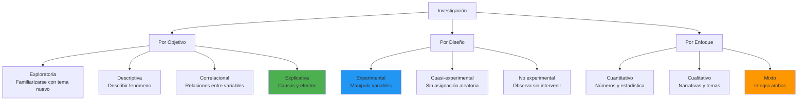

**En Paraguay**: La investigación en universidades locales es predominantemente descriptiva y correlacional. Estudios experimentales rigurosos son menos comunes pero cada vez más valorados.

### 1.2 Proceso de Diseño Metodológico

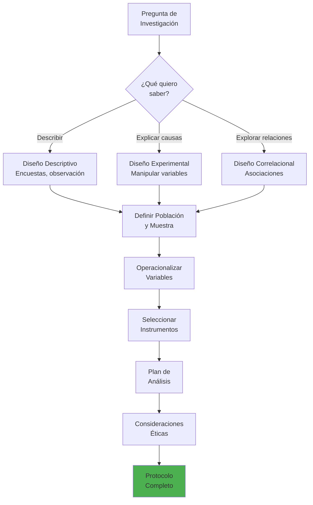

### 1.3 Pregunta de Investigación FINER

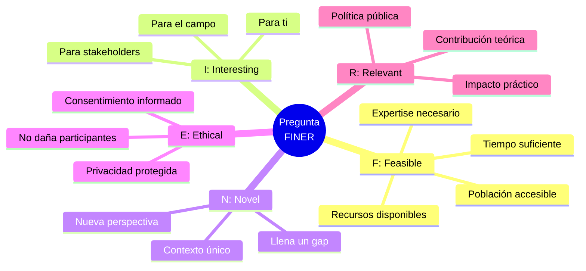

**Ejemplo de Pregunta FINER (Paraguay)**:

❌ **Mala pregunta**: "¿Cómo afecta la tecnología a estudiantes?"
- Demasiado vaga, no especifica qué tecnología, qué estudiantes, qué efectos

✅ **Pregunta FINER**: "¿Cómo afecta el uso de plataformas de IA generativa (ChatGPT) en la comprensión conceptual de programación en estudiantes de primer año de Ingeniería Informática de la FPUNA durante el semestre 2026-1?"

- **F**: Acceso a estudiantes FPUNA, 1 semestre es suficiente
- **I**: Tema actual, relevante para docentes
- **N**: Poco estudiado en contexto paraguayo
- **E**: No invasivo, consentimiento de estudiantes
- **R**: Informará políticas de uso de IA en FPUNA

### 1.4 Operacionalización de Variables

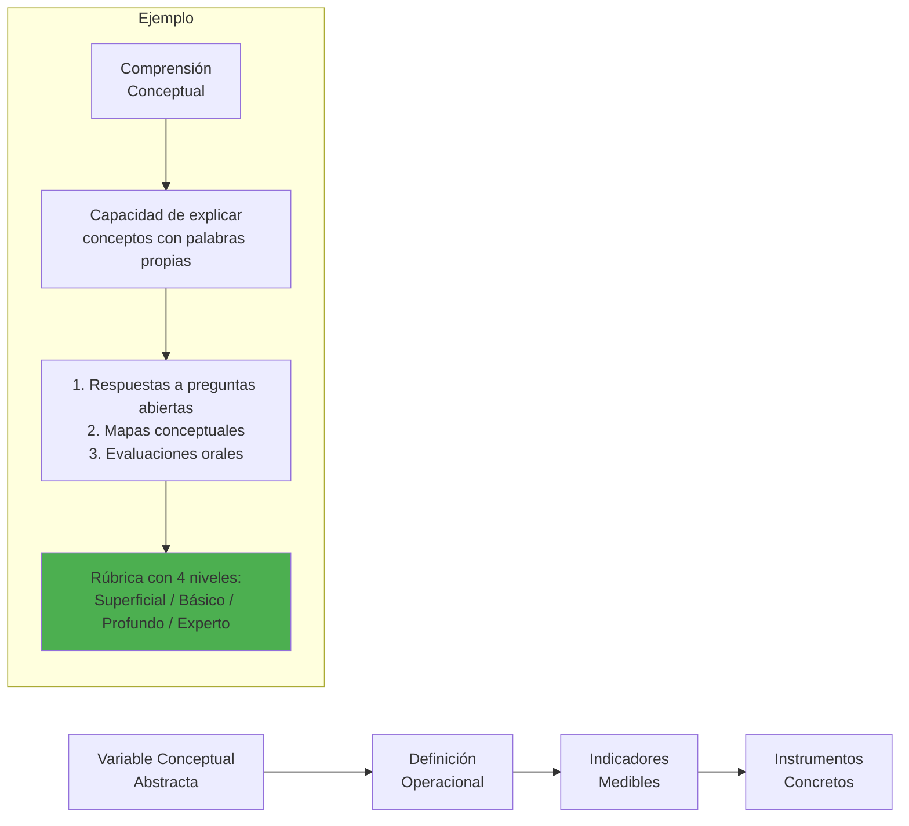

**Tabla de Operacionalización**:

| Variable Conceptual | Definición Operacional | Indicadores | Instrumento | Escala |
|---------------------|------------------------|-------------|-------------|--------|
| **Uso de IA** | Frecuencia y tipo de uso de ChatGPT para tareas de programación | 1. Horas/semana<br/>2. Tipos de prompts<br/>3. Dependencia percibida | Encuesta autorreportada + logs de uso (con consentimiento) | 1. Ordinal (Nunca/Rara vez/Frecuente/Muy frecuente)<br/>2. Nominal (categorías)<br/>3. Likert 1-5 |
| **Comprensión Conceptual** | Capacidad de explicar y aplicar conceptos de programación sin asistencia | 1. Puntuación en evaluación conceptual<br/>2. Calidad de explicaciones<br/>3. Transferencia a nuevos problemas | Examen escrito + entrevista semiestructurada | 1. Razón (0-100)<br/>2. Ordinal (rúbrica 1-4)<br/>3. Ordinal (rúbrica 1-4) |
| **Rendimiento Académico** | Notas finales en curso de programación | Promedio de notas en exámenes y proyectos | Registros académicos oficiales | Razón (1-5 escala FPUNA) |

### 1.5 Hipótesis: Tipos y Formulación

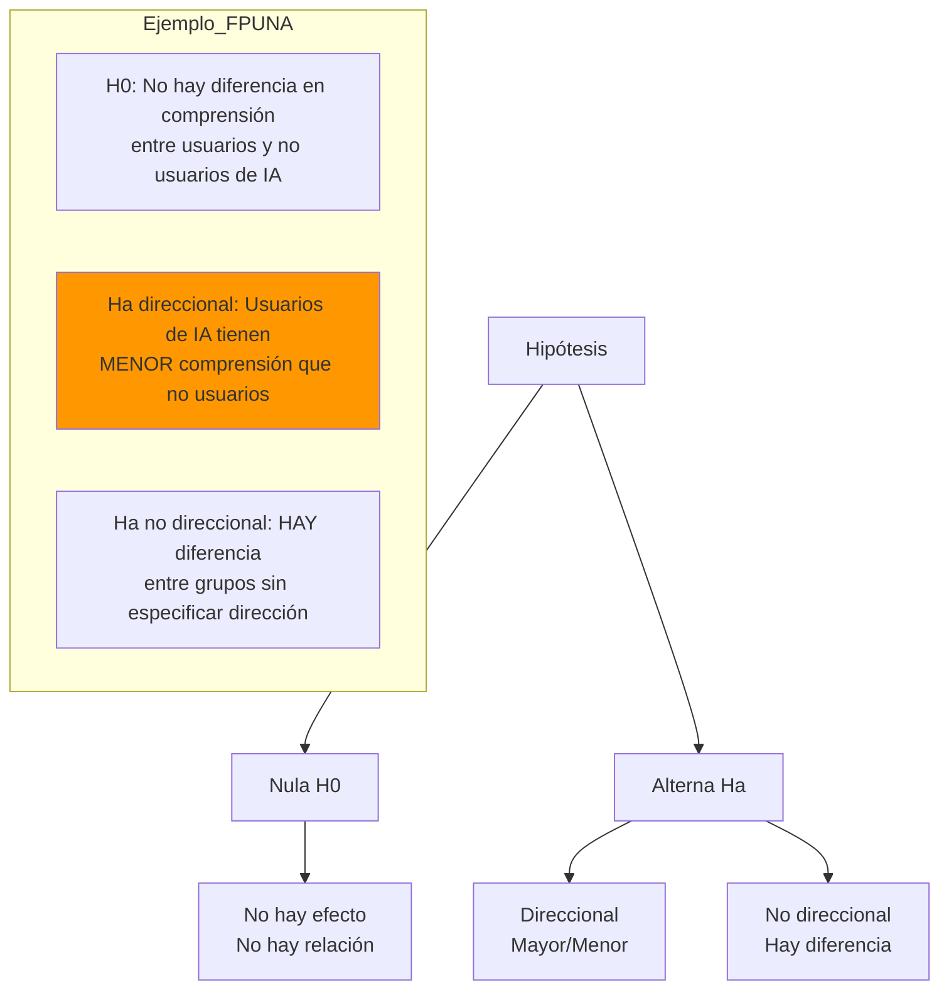

**Características de Buenas Hipótesis**:

✅ **Comprobables** - Pueden ser falsadas con datos  
✅ **Específicas** - Variables claras y definidas  
✅ **Basadas en teoría** - Justificadas por literatura  
✅ **Medibles** - Operacionalización posible

---

## Parte 2: Diseños Experimentales

### 2.1 Diseño Experimental Verdadero

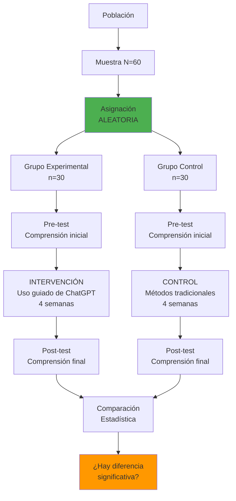

**Ventajas**:
- ✅ Control máximo de variables extrañas
- ✅ Permite inferencias causales
- ✅ Validez interna alta

**Desafíos en Paraguay**:
- ❌ Difícil lograr asignación aleatoria en aulas reales
- ❌ Consideraciones éticas (negar "tratamiento" a control)
- ❌ Deserción diferencial entre grupos

### 2.2 Diseño Cuasi-Experimental

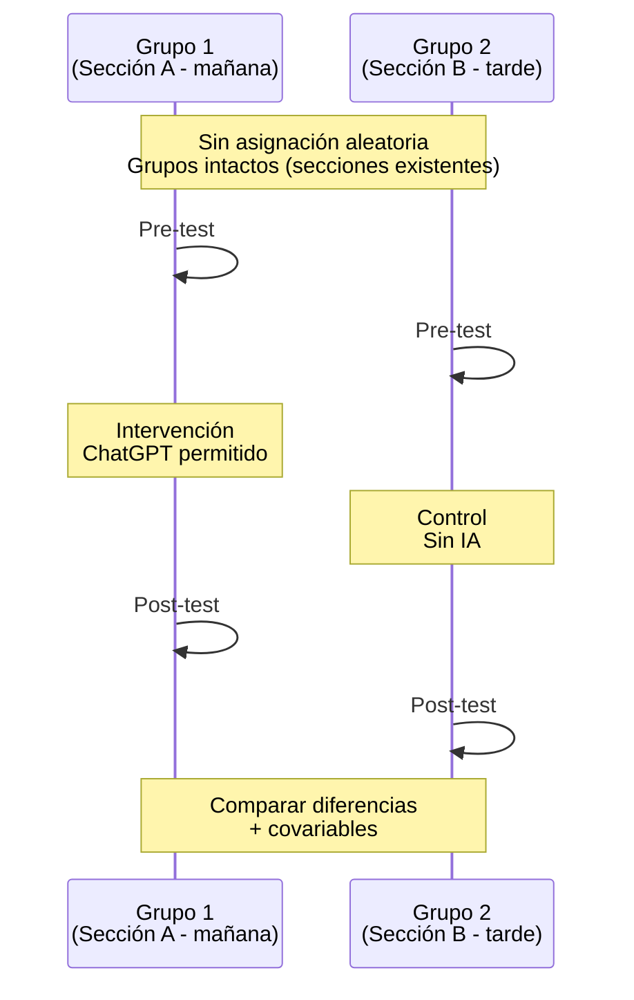

**Cuándo usar**:
- No es posible asignación aleatoria (secciones ya formadas)
- Estudios en contextos reales (escuelas, empresas)
- Consideraciones prácticas o éticas

**Amenazas a validez**:
- **Selección**: Grupos pueden diferir sistemáticamente
- **Maduración**: Cambios naturales con el tiempo
- **Historia**: Eventos externos afectan grupos diferencialmente

**Mitigación con covariables**:
```
ANCOVA (Análisis de Covarianza)
- Covariable: Conocimiento previo de programación
- Ajustar diferencias pre-existentes estadísticamente
```

### 2.3 Diseño No Experimental

**Estudios Correlacionales**:

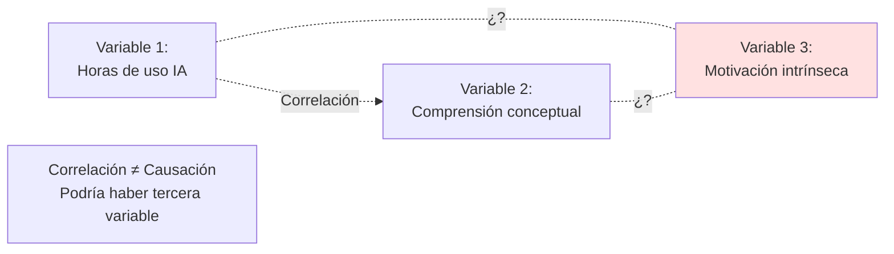

**Advertencia Crítica**:

❌ **Error común**: "Encontramos correlación r=0.65 entre uso de IA y comprensión, ENTONCES el uso de IA CAUSA mejor comprensión"

✅ **Interpretación correcta**: "Hay asociación positiva moderada-fuerte. Posibles explicaciones:
1. Uso de IA mejora comprensión (A → B)
2. Mejor comprensión lleva a uso más efectivo de IA (B → A)
3. Variable oculta (ej: motivación) afecta ambas (C → A y C → B)"

### 2.4 Comparación de Diseños

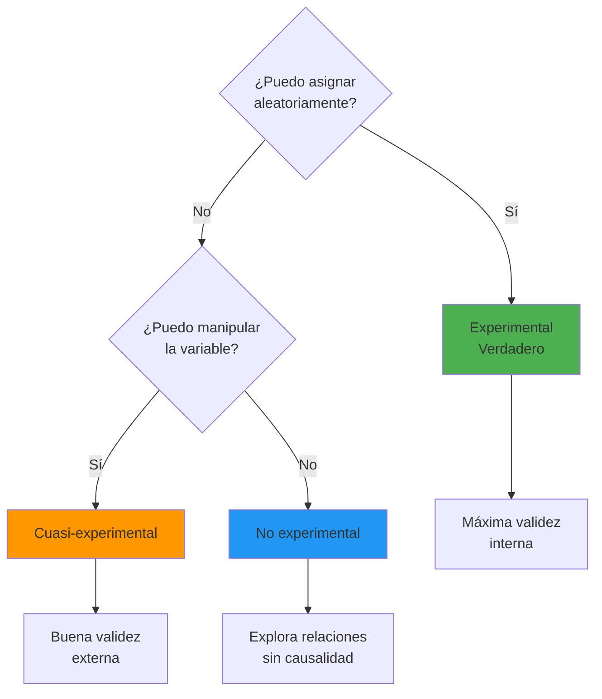

---

## Parte 3: Muestreo y Tamaño Muestral

### 3.1 Tipos de Muestreo

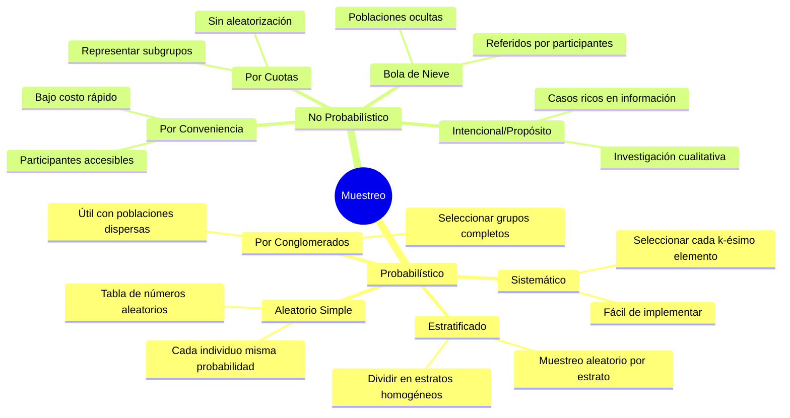

### 3.2 Cálculo de Tamaño Muestral

**Para Comparación de Medias (t-test)**:

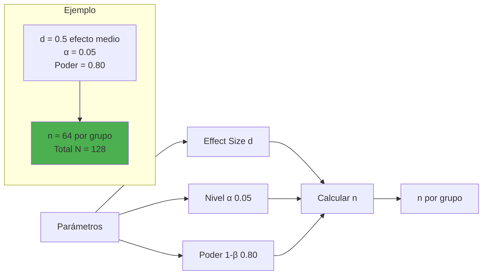

**Fórmula simplificada**:

```
n = (Zα + Zβ)² × 2σ² / d²

Donde:
- Zα = 1.96 (para α=0.05, two-tailed)
- Zβ = 0.84 (para poder=0.80)
- σ = desviación estándar
- d = diferencia mínima detectable
```

**Usando G*Power (software gratuito)**:

```bash
# OpenCode prompt para documentar cálculo

opencode "Documenta cálculo de tamaño muestral para estudio:

DISEÑO:
- Comparación de 2 grupos independientes
- Variable dependiente: Comprensión conceptual (escala 0-100)
- Hipótesis: Grupo experimental tendrá 10 puntos MÁS que control

PARÁMETROS:
- Effect size: d = 0.5 (efecto medio, basado en literatura)
- Alpha: 0.05 (two-tailed)
- Poder: 0.80 (80% probabilidad detectar efecto real)
- Desviación estándar esperada: σ = 20 (de estudio piloto)

RESULTADO DE G*POWER:
- n requerido = 64 por grupo
- Total N = 128 participantes

JUSTIFICACIÓN:
Basado en meta-análisis de Smith et al. (2024), efectos de intervenciones
educativas con IA tienen d promedio de 0.45. Usamos d=0.5 conservador.

Con N=128 y attrition esperado de 15%, reclutar N=150 inicialmente.

Crear sección de Metodología en formato APA con esto."
```

### 3.3 Muestreo en Paraguay: Consideraciones Prácticas

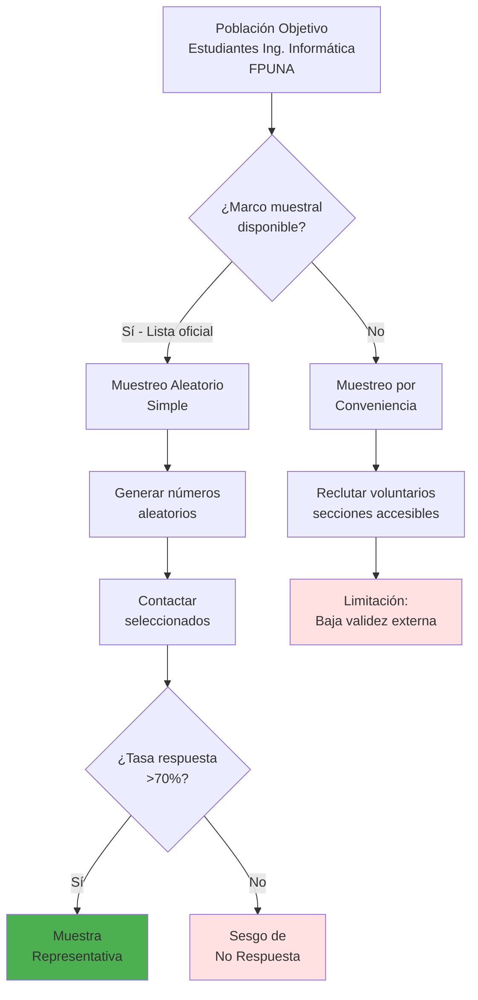

**Realidad en FPUNA**:
- Acceso limitado a listas completas de estudiantes
- Muestreo por conveniencia (secciones del investigador) común
- **Importante**: Reconocer limitación en sección de Limitaciones del paper

---

## Parte 4: Validez y Confiabilidad

### 4.1 Tipos de Validez

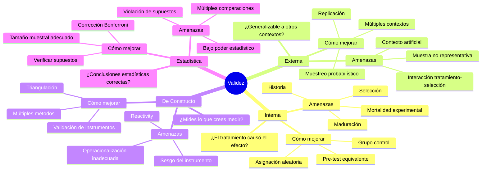

### 4.2 Confiabilidad de Instrumentos

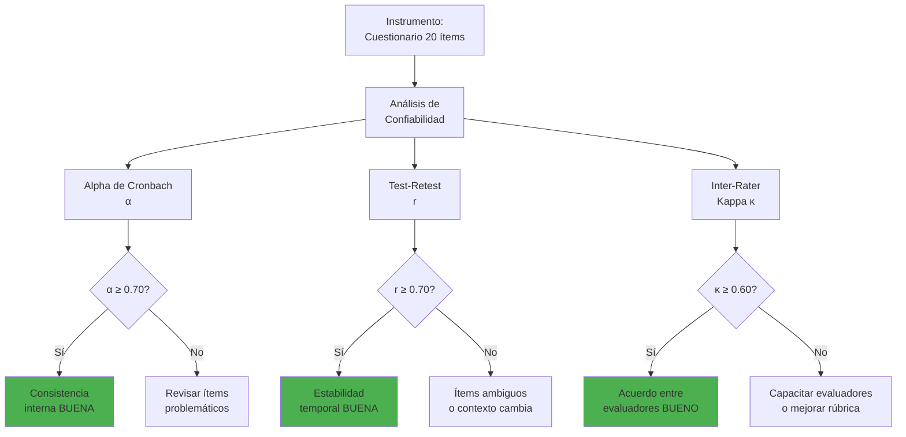

**Interpretación de Alpha de Cronbach**:

| α | Interpretación | Acción |
|---|----------------|--------|
| α < 0.50 | Inaceptable | Rediseñar instrumento |
| 0.50 ≤ α < 0.60 | Pobre | Revisar ítems, eliminar problemáticos |
| 0.60 ≤ α < 0.70 | Cuestionable | Mejorar ítems, aceptable para investigación exploratoria |
| 0.70 ≤ α < 0.80 | Aceptable | Usar con confianza |
| 0.80 ≤ α < 0.90 | Buena | Excelente confiabilidad |
| α ≥ 0.90 | Excelente | Puede indicar redundancia de ítems |

**Cálculo con OpenCode + Python**:

```python
# analizar_confiabilidad.py
import pandas as pd
from scipy.stats import cronbach_alpha

# Datos de encuesta piloto (10 participantes, 20 ítems)
df = pd.read_csv('datos_piloto.csv')

# Calcular Alpha
alpha = cronbach_alpha(df.values)
print(f"Alpha de Cronbach: {alpha:.3f}")

# Eliminar ítems problemáticos
for col in df.columns:
    df_temp = df.drop(columns=[col])
    alpha_temp = cronbach_alpha(df_temp.values)
    print(f"Sin {col}: α = {alpha_temp:.3f}")
```

```bash
# Prompt para OpenCode

opencode "Analiza confiabilidad de mi cuestionario:

DATOS:
@attach datos_piloto.csv

CONTEXTO:
- 20 ítems Likert 1-5
- Mide 'Percepción de Utilidad de IA en Aprendizaje'
- Piloto con N=10 estudiantes FPUNA

TAREAS:
1. Calcular Alpha de Cronbach total
2. Calcular Alpha si se elimina cada ítem
3. Identificar ítems problemáticos (correlación ítem-total < 0.30)
4. Recomendar ítems a eliminar o revisar
5. Generar tabla de resultados para incluir en paper

OUTPUT:
- Script Python comentado
- Tabla de resultados en formato APA
- Recomendaciones específicas para mejorar α"
```

### 4.3 Estrategias para Maximizar Validez

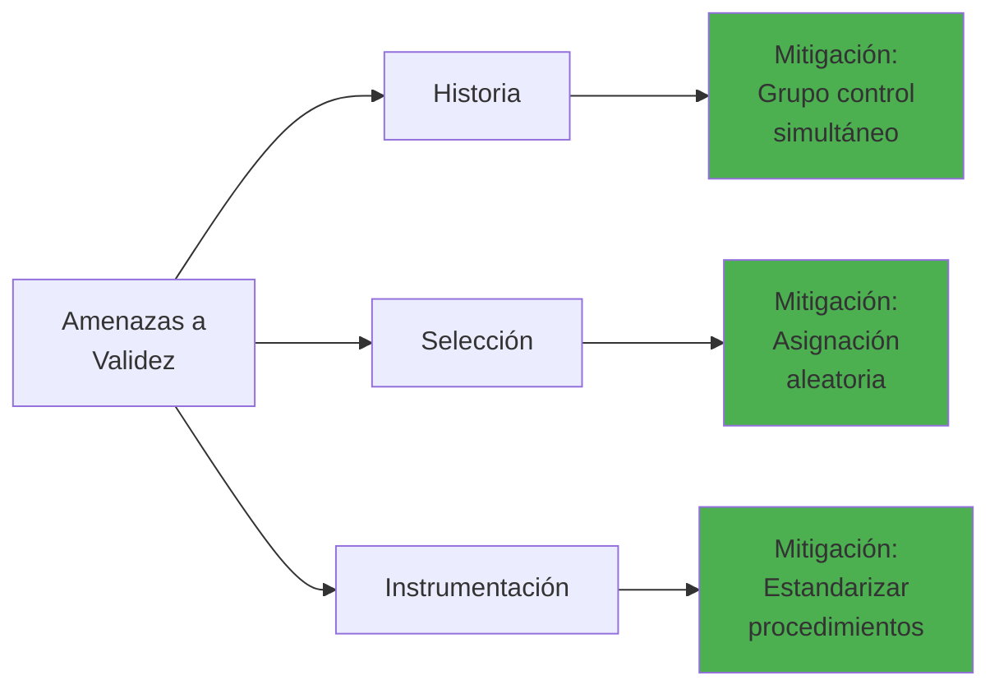

**Checklist de Validez**:

✅ **Validez Interna**:
- [ ] Asignación aleatoria o covariables medidas
- [ ] Grupo control apropiado
- [ ] Pre-test para verificar equivalencia
- [ ] Mismo procedimiento para ambos grupos
- [ ] Control de variables extrañas (horario, instructor, aula)

✅ **Validez Externa**:
- [ ] Muestra representativa de población objetivo
- [ ] Contexto ecológicamente válido (no laboratorio artificial)
- [ ] Reportar características demográficas completas
- [ ] Discutir limitaciones de generalización

✅ **Validez de Constructo**:
- [ ] Operacionalización basada en teoría
- [ ] Instrumentos validados previamente (si existen)
- [ ] Evidencia de validez convergente/discriminante
- [ ] Triangulación de métodos (cuanti + cuali)

---

## Parte 5: Consideraciones Éticas

### 5.1 Principios Éticos Fundamentales

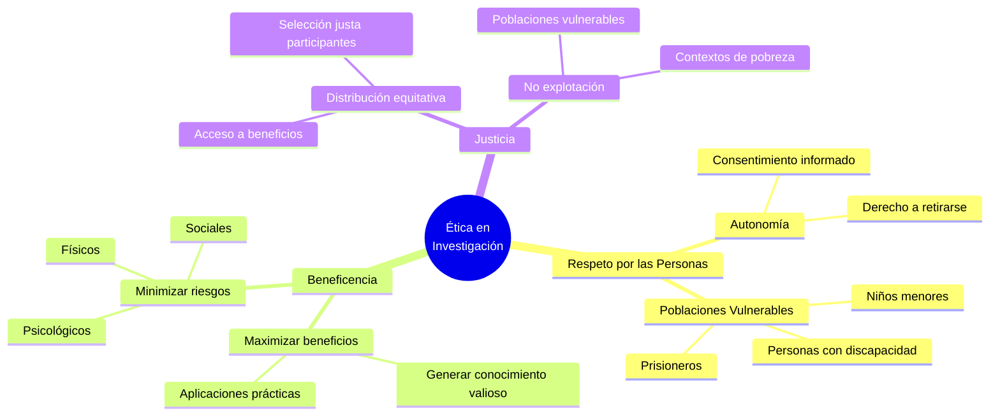

### 5.2 Consentimiento Informado

**Elementos Obligatorios**:

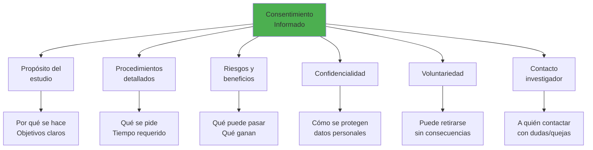

**Ejemplo: Formulario de Consentimiento FPUNA**

```markdown
FORMULARIO DE CONSENTIMIENTO INFORMADO

Estudio: "Efecto del uso de IA generativa en comprensión conceptual 
de programación en estudiantes de Ingeniería Informática"

Investigador Principal: [Nombre], FPUNA, email: [email]

PROPÓSITO:
Está siendo invitado a participar en un estudio que investiga cómo el 
uso de herramientas de IA (como ChatGPT) afecta el aprendizaje de 
programación. Este estudio es parte de [proyecto/tesis] en FPUNA.

PROCEDIMIENTOS:
Si acepta participar:
1. Completará una encuesta inicial (15 minutos)
2. Será asignado aleatoriamente a uno de dos grupos:
   - Grupo A: Podrá usar ChatGPT para tareas de programación
   - Grupo B: Usará métodos tradicionales sin IA
3. Durante 4 semanas, completará tareas semanales
4. Al finalizar, completará evaluación de comprensión conceptual (60 min)
5. Tiempo total: Aproximadamente 10 horas durante 1 mes

RIESGOS:
- Riesgo mínimo. Puede sentir frustración con algunas tareas difíciles.
- No habrá impacto en su calificación oficial del curso.

BENEFICIOS:
- Contribuirá a entender mejor cómo usar IA en educación.
- Recibirá feedback personalizado sobre su aprendizaje.
- Certificado de participación en investigación.

CONFIDENCIALIDAD:
- Sus datos serán codificados (ID anónimo).
- Solo el equipo de investigación tendrá acceso a datos identificables.
- Resultados se reportarán en agregado, nunca individualmente.
- Datos almacenados en servidor seguro FPUNA por 5 años.

VOLUNTARIEDAD:
- Su participación es completamente voluntaria.
- Puede retirarse en cualquier momento sin dar razones.
- Retirarse no afectará su relación con FPUNA ni sus calificaciones.

CONTACTO:
- Investigador: [Nombre], [email], [teléfono]
- Comité de Ética FPUNA: etica@fpuna.edu.py

CONSENTIMIENTO:
He leído este formulario, he tenido oportunidad de hacer preguntas, 
y acepto participar voluntariamente.

_______________________  ___________  _____________________
Firma del Participante     Fecha         Firma del Investigador
```

### 5.3 Aprobación del Comité de Ética

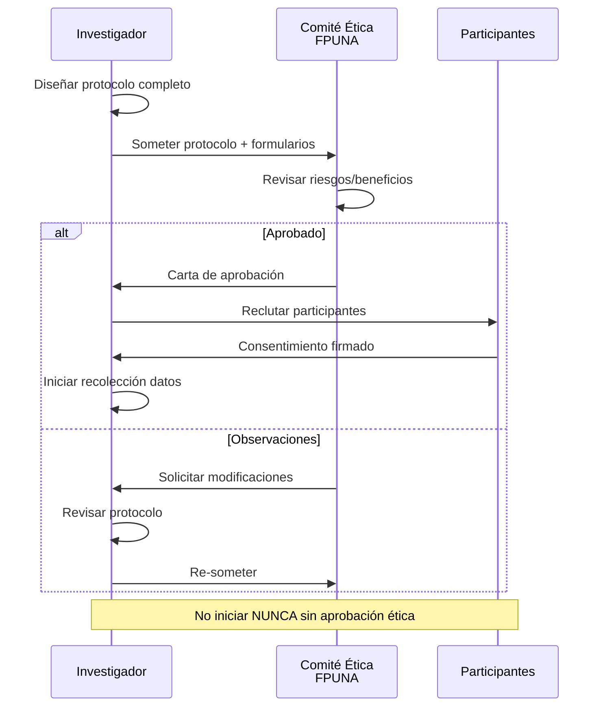

**Documentos requeridos en FPUNA**:
1. Protocolo de investigación completo
2. Formulario de consentimiento informado
3. Instrumentos de medición (encuestas, tests)
4. CV del investigador principal
5. Carta de respaldo del director de tesis/proyecto

---

## Parte 6: Documentación de Metodología con OpenCode

### 6.1 Generar Sección de Metodología

```bash
opencode "Escribe sección de Metodología para mi paper de investigación:

INFORMACIÓN DEL ESTUDIO:

DISEÑO:
- Cuasi-experimental con grupo control no equivalente
- Pre-test y post-test
- Variable independiente: Uso de ChatGPT (sí/no)
- Variable dependiente: Comprensión conceptual de programación

PARTICIPANTES:
- N = 84 estudiantes (42 por grupo)
- Ing. Informática, FPUNA, 1er año
- Edad M=19.2 años (SD=1.5), 65% hombres
- Muestreo por conveniencia (2 secciones existentes)

INSTRUMENTOS:
1. Test de Comprensión Conceptual (TCC)
   - 15 preguntas abiertas
   - Evalúa: Comprensión profunda vs superficial
   - Rúbrica 1-4 por pregunta (max 60 puntos)
   - Validado en estudio piloto (N=10, α=0.82)
2. Encuesta de Uso de IA
   - 12 ítems Likert 1-5
   - Frecuencia, tipo de uso, dependencia percibida

PROCEDIMIENTO:
1. Semana 1: Pre-test TCC + Encuesta inicial
2. Semanas 2-5: 
   - Grupo Experimental: Acceso a ChatGPT con guía de uso responsable
   - Grupo Control: Métodos tradicionales (profesor, pares, documentación)
3. Semana 6: Post-test TCC + Encuesta final

ANÁLISIS:
- ANCOVA con pre-test como covariable
- Alpha = 0.05
- Software: SPSS 28

ÉTICA:
- Aprobado por Comité Ética FPUNA (Ref: CE-2026-045)
- Consentimiento informado de todos los participantes

REQUISITOS:
- Formato APA 7
- Sección de Metodología completa: Participantes, Materiales, Procedimiento, Análisis
- 800-1000 palabras
- Incluir justificaciones de decisiones metodológicas
- Lenguaje formal, tiempo pasado
- En español

OUTPUT en markdown con subsecciones claras"
```

### 6.2 Validar Rigor Metodológico con IA

```bash
opencode "Revisa mi sección de Metodología con ojo crítico de revisor experto:

@attach metodologia_draft.md

EVALÚA:

1. COMPLETITUD:
   - ¿Está toda la información para replicar el estudio?
   - ¿Faltan detalles críticos?

2. RIGOR:
   - ¿El diseño es apropiado para la pregunta de investigación?
   - ¿Las amenazas a validez están reconocidas/mitigadas?
   - ¿El tamaño muestral está justificado?

3. ÉTICA:
   - ¿Se menciona aprobación ética?
   - ¿Consentimiento informado?
   - ¿Protección de datos?

4. ANÁLISIS:
   - ¿Métodos estadísticos apropiados?
   - ¿Se justifica el nivel α?
   - ¿Se menciona manejo de datos faltantes?

5. CLARIDAD:
   - ¿Escritura clara y concisa?
   - ¿Flujo lógico?
   - ¿Jerga técnica explicada?

OUTPUT:
- Tabla con 5 criterios, puntuación 1-5, y comentarios específicos
- Lista de 5-10 mejoras CONCRETAS con ejemplos de cómo reescribir
- Evaluación general: ¿Listo para someter o necesita revisión mayor?"
```

---

## Ejercicios Prácticos

### Ejercicio 1: Diseño de Estudio Experimental (60 min)

**Escenario**: Investigar si gamificación mejora engagement en curso online de Python.

**Tareas**:
1. Formular pregunta de investigación FINER
2. Plantear H0 y Ha
3. Diseñar estudio experimental:
   - Tipo de diseño (experimental/cuasi/no experimental)
   - Grupos y asignación
   - Variables (IV, DV, covariables)
   - Operacionalización de "engagement"
4. Calcular tamaño muestral (asumir d=0.5, α=0.05, poder=0.80)
5. Describir procedimiento paso a paso

**Entregable**:
- Documento de 2-3 páginas
- Diagrama de flujo del diseño (Mermaid)
- Justificación de decisiones

---

### Ejercicio 2: Operacionalización de Variables (45 min)

**Variables a operacionalizar**:
1. "Pensamiento crítico"
2. "Satisfacción con curso online"
3. "Competencia digital"

**Para cada variable**:
- Definición conceptual (basada en literatura)
- Definición operacional
- Al menos 3 indicadores medibles
- Instrumento propuesto
- Tipo de escala de medición

**Entregable**:
- Tabla de operacionalización completa
- Justificación teórica (citar al menos 2 fuentes)

---

### Ejercicio 3: Validación de Instrumento (90 min)

**Objetivo**: Validar cuestionario de "Actitud hacia la IA en Educación"

**Tareas**:
1. Diseñar cuestionario de 15 ítems Likert 1-5
2. Aplicar a 15 compañeros (piloto)
3. Calcular Alpha de Cronbach
4. Analizar:
   - ítems problemáticos (correlación ítem-total baja)
   - Alpha si se elimina cada ítem
5. Revisar instrumento basado en resultados

**Usar OpenCode para**:
- Generar código Python para análisis
- Interpretar resultados
- Sugerir mejoras a ítems problemáticos

**Entregable**:
- Cuestionario original (15 ítems)
- Datos piloto (CSV)
- Script de análisis Python
- Reporte de validación (2 páginas)
- Cuestionario revisado (versión final)

---

### Ejercicio 4: Protocolo Ético (60 min)

**Escenario**: Estudio sobre experiencias de estudiantes FPUNA con ansiedad académica.

**Tareas**:
1. Identificar riesgos éticos específicos
2. Redactar formulario de consentimiento informado completo
3. Diseñar procedimientos de confidencialidad:
   - Codificación de datos
   - Almacenamiento seguro
   - Quién tendrá acceso
4. Plan de manejo de crisis (si participante reporta ansiedad severa)

**Entregable**:
- Formulario de consentimiento (2 páginas)
- Protocolo de confidencialidad (1 página)
- Plan de crisis (1 página)

---

## Checklist de Metodología Rigurosa

### ✅ Diseño de Investigación

- [ ] Pregunta de investigación es FINER (Feasible, Interesting, Novel, Ethical, Relevant)
- [ ] Hipótesis son comprobables y específicas
- [ ] Diseño (experimental/cuasi/no experimental) es apropiado para la pregunta
- [ ] Variables claramente identificadas (IV, DV, covariables, extrañas)
- [ ] Operacionalización basada en teoría y literatura

### ✅ Muestra y Muestreo

- [ ] Población objetivo definida claramente
- [ ] Criterios de inclusión/exclusión especificados
- [ ] Método de muestreo justificado (probabilístico preferido)
- [ ] Tamaño muestral calculado a priori con justificación (effect size, poder)
- [ ] Plan para manejar deserción/datos faltantes

### ✅ Instrumentos y Medición

- [ ] Instrumentos validados previamente (si existen) o validación propia
- [ ] Evidencia de confiabilidad reportada (Alpha, test-retest, inter-rater)
- [ ] Escalas de medición apropiadas para análisis planificado
- [ ] Instrumentos piloteados antes de estudio completo

### ✅ Procedimiento

- [ ] Paso a paso descrito con suficiente detalle para replicar
- [ ] Estandarización de procedimientos entre grupos
- [ ] Control de variables extrañas considerado y documentado
- [ ] Timeline realista

### ✅ Análisis de Datos

- [ ] Métodos estadísticos apropiados para diseño y tipo de datos
- [ ] Nivel de significancia (α) establecido a priori
- [ ] Plan para verificar supuestos de tests estadísticos
- [ ] Manejo de outliers y datos faltantes especificado

### ✅ Consideraciones Éticas

- [ ] Aprobación de Comité de Ética obtenida ANTES de recolectar datos
- [ ] Consentimiento informado de todos los participantes
- [ ] Confidencialidad y anonimato garantizados
- [ ] Riesgos mínimos y beneficios claros
- [ ] Derecho a retirarse sin consecuencias

### ✅ Validez

- [ ] Amenazas a validez interna identificadas y mitigadas
- [ ] Limitaciones de validez externa reconocidas
- [ ] Validez de constructo considerada (operacionalización apropiada)
- [ ] Triangulación de métodos (si posible)

---

## 📝 Quiz de Evaluación

### Instrucciones
- **10 preguntas** sobre metodología de investigación
- **Tiempo**: 30 minutos
- **Aprobación**: 6+ correctas (60%)

---

### Preguntas

**1. Pregunta FINER (Opción Múltiple)**

¿Cuál de estas es una pregunta de investigación que cumple criterio FINER?

a) ¿Cómo afecta la tecnología a los estudiantes?  
b) ¿El uso de IA generativa mejora comprensión de programación en estudiantes FPUNA 2026?  
c) ¿Es buena la educación con IA?  
d) ¿Qué piensan los estudiantes sobre ChatGPT?

**2. Diseño Experimental (Verdadero/Falso)**

**Afirmación**: La principal ventaja del diseño experimental verdadero sobre el cuasi-experimental es la asignación aleatoria de participantes.

VERDADERO / FALSO

**3. Hipótesis (Opción Múltiple)**

Tu hipótesis nula (H0) es: "No hay diferencia en comprensión entre usuarios y no usuarios de IA."

¿Cuál es una H alternativa DIRECCIONAL apropiada?

a) Hay diferencia entre los grupos  
b) Usuarios de IA tienen menor comprensión que no usuarios  
c) Los grupos son diferentes estadísticamente  
d) El uso de IA afecta la comprensión

**4. Tamaño Muestral (Respuesta Corta)**

Necesitas comparar 2 grupos. Usaste G*Power con effect size d=0.5, α=0.05, poder=0.80 y obtuviste n=64 por grupo. Tu attrition esperado es 20%.

**Pregunta**: ¿Cuántos participantes debes reclutar INICIALMENTE? Justifica.

**5. Validez Interna (Opción Múltiple)**

¿Cuál de estos amenaza la validez INTERNA de un estudio?

a) Muestra no representativa de la población  
b) Grupos difieren en conocimiento previo antes de la intervención  
c) Contexto de laboratorio muy artificial  
d) Resultados no generalizables a otras universidades

**6. Confiabilidad (Opción Múltiple)**

Calculaste Alpha de Cronbach para tu cuestionario y obtuviste α=0.55.

¿Qué debes hacer?

a) Publicar - es suficiente  
b) Revisar ítems problemáticos y mejorar instrumento  
c) Ignorar y continuar con el estudio  
d) Cambiar a otro método de medición completamente

**7. Ética (Verdadero/Falso)**

**Afirmación**: Puedes iniciar recolección de datos para tu tesis mientras esperas aprobación del Comité de Ética, siempre que el riesgo sea mínimo.

VERDADERO / FALSO

**8. Operacionalización (Respuesta Corta)**

Variable conceptual: "Engagement estudiantil"

**Pregunta**: Propone 2 indicadores medibles y específica cómo los medirías.

**9. Muestreo (Opción Múltiple)**

Tu estudio es con estudiantes FPUNA pero solo reclutaste voluntarios de tu sección porque es la única accesible.

¿Qué tipo de muestreo es y cuál es la principal limitación?

a) Aleatorio simple - baja validez interna  
b) Estratificado - sesgo de selección  
c) Por conveniencia - baja validez externa/generalización  
d) Sistemático - error de muestreo alto

**10. Causación (Opción Múltiple)**

Encontraste correlación r=0.70 entre horas de uso de IA y calificaciones finales en tu estudio correlacional.

¿Cuál es la conclusión MÁS apropiada?

a) El uso de IA causa mejores calificaciones  
b) Hay asociación fuerte pero no podemos inferir causalidad  
c) Mejores estudiantes usan más IA  
d) La correlación prueba que IA es efectiva

---

### Respuestas

**1. Correcta: b**  
FINER = Feasible (sí, FPUNA accesible), Interesting (tema actual), Novel (poco estudiado en Paraguay), Ethical (no invasivo), Relevant (política educativa). Las otras son vagas.

**2. Correcta: VERDADERO**  
Asignación aleatoria controla variables extrañas y permite inferencias causales. Es la diferencia clave vs cuasi-experimental.

**3. Correcta: b**  
Hipótesis direccional especifica dirección del efecto (mayor/menor). "a" es no-direccional, "c" y "d" son vagas.

**4. Respuesta: 160 participantes**  
n=64 por grupo = 128 total. Con 20% attrition: 128 / 0.80 = 160. Debes reclutar 80 por grupo inicialmente.

**5. Correcta: b**  
Validez interna = ¿el tratamiento causó el efecto? Si grupos difieren ANTES, no puedes saber si el tratamiento funcionó. "a" y "c" afectan validez externa.

**6. Correcta: b**  
α=0.55 es "pobre" (ver tabla módulo). Debes identificar ítems con baja correlación ítem-total y revisarlos/eliminarlos.

**7. Correcta: FALSO**  
NUNCA iniciar sin aprobación ética. Es violación grave. Esperar aprobación es OBLIGATORIO sin excepciones.

**8. Ejemplo de respuesta**:
- Indicador 1: Tiempo en plataforma (minutos/semana) - medido por logs del sistema
- Indicador 2: Participación en foros (# posts/semana) - conteo automatizado

**9. Correcta: c**  
Muestreo por conveniencia (participantes accesibles). Limitación: no representativo de todos los estudiantes FPUNA → baja validez externa.

**10. Correcta: b**  
En estudios correlacionales NO puedes inferir causalidad. Puede haber tercera variable (ej: motivación) que afecte ambas. "a" es error común.

---

### Criterios

| Puntaje | Nivel | Acción |
|---------|-------|--------|
| 9-10 | ✅ Excelente | Continuar Módulo 03 |
| 7-8 | ✅ Bueno | Continuar, revisar áreas débiles |
| 6 | ⚠️ Aprobado | Repasar secciones falladas |
| < 6 | ❌ Repasar | Revisar módulo completo |

---

## Recursos Esenciales

### Software para Cálculo de Tamaño Muestral

| Herramienta | Propósito | URL | Costo |
|-------------|-----------|-----|-------|
| **G*Power** | Análisis de poder estadístico | gpower.hhu.de | Gratis |
| **PASS** | Power analysis completo | ncss.com/software/pass | Pago |
| **R pwr package** | Cálculos en R | CRAN | Gratis |

### Herramientas de Análisis

| Tool | Purpose | Best For |
|------|---------|----------|
| **SPSS** | Análisis estadístico general | Principiantes, interfaz gráfica |
| **R + RStudio** | Análisis avanzado, reproducible | Investigadores con programación |
| **Python (pandas, scipy, statsmodels)** | Análisis + machine learning | Data science |
| **JASP** | SPSS gratuito con Bayesian | Alternativa gratis a SPSS |

### Lecturas Recomendadas

**Diseño de Investigación**:
- Creswell, J. W., & Creswell, J. D. (2018). *Research Design: Qualitative, Quantitative, and Mixed Methods Approaches* (5th ed.). SAGE.
- Shadish, W. R., Cook, T. D., & Campbell, D. T. (2002). *Experimental and Quasi-Experimental Designs for Generalized Causal Inference*. Houghton Mifflin.

**Muestreo**:
- Cochran, W. G. (1977). *Sampling Techniques* (3rd ed.). Wiley.
- Thompson, S. K. (2012). *Sampling* (3rd ed.). Wiley.

**Validez y Confiabilidad**:
- Messick, S. (1995). Validity of psychological assessment. *American Psychologist*, 50(9), 741-749.
- Cronbach, L. J., & Meehl, P. E. (1955). Construct validity in psychological tests. *Psychological Bulletin*, 52(4), 281-302.

**Ética**:
- Emanuel, E. J., et al. (2000). What makes clinical research ethical? *JAMA*, 283(20), 2701-2711.

---

## Contexto Paraguay: Investigación en FPUNA

### Comité de Ética de Investigación

**Contacto**: etica@fpuna.edu.py

**Proceso de aprobación**:
1. Someter protocolo completo + formularios
2. Revisión en 2-4 semanas
3. Posibles rondas de revisión
4. Aprobación final por escrito

**Requisito**: Obligatorio para estudios con participantes humanos

### Recursos Institucionales

**Biblioteca FPUNA**:
- Acceso a bases de datos (Scopus, Web of Science vía CONACYT)
- Software estadístico (SPSS en laboratorios)
- Capacitaciones en metodología de investigación

**Instituto de Investigaciones FPUNA**:
- Asesoría metodológica gratuita para estudiantes
- Talleres de diseño de investigación
- Seminarios de análisis de datos

---

## Próximos Pasos

Una vez que domines metodología de investigación:

1. **Módulo 3: Análisis de Datos** → Procesar y analizar tus datos
2. **Módulo 4: Redacción Académica** → Escribir tu paper
3. **Módulo 5: Presentación y Publicación** → Compartir tus hallazgos

---

## Reflexión Final

**Metodología NO es burocracia - es la COLUMNA VERTEBRAL de tu investigación.**

Una metodología rigurosa:

✅ Garantiza que tus conclusiones sean VÁLIDAS  
✅ Permite que otros REPLIQUEN tu estudio  
✅ Aumenta dramáticamente tus chances de PUBLICACIÓN  
✅ Demuestra que sos un investigador SERIO y COMPETENTE

**La IA no diseña tu metodología - VOS la diseñas.**

Usa OpenCode para:
- Calcular tamaños muestrales rápidamente
- Generar código de análisis de confiabilidad
- Documentar procedimientos de forma clara
- Verificar que no olvidaste ningún detalle

Pero SIEMPRE vos sos el responsable de:
- Elegir el diseño apropiado
- Justificar decisiones metodológicas
- Garantizar rigor ético
- Interpretar limitaciones

**Tu trabajo: Pensar, decidir, justificar, diseñar.**  
**Trabajo de la IA: Asistir, calcular, documentar, verificar.**

---

**¿Preguntas?** Consulta con tu instructor o en Slack #research-academia-2026

**Próximo módulo:** [03 - Análisis de Datos y Visualización](./03-analisis-datos.md)
