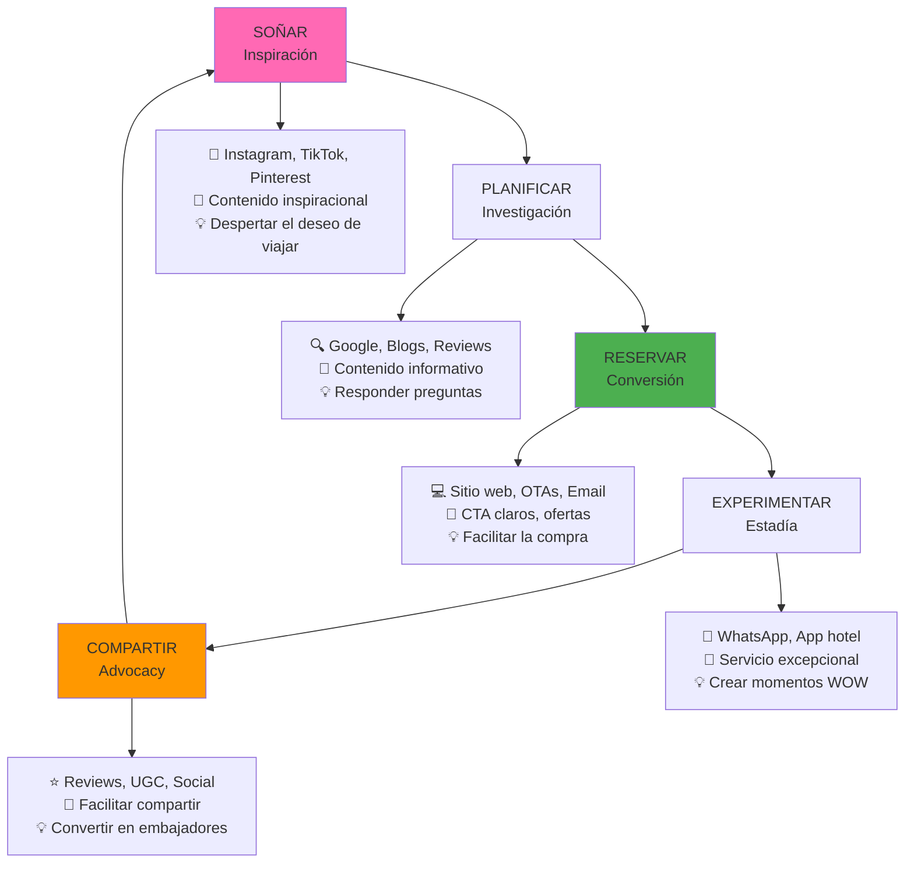
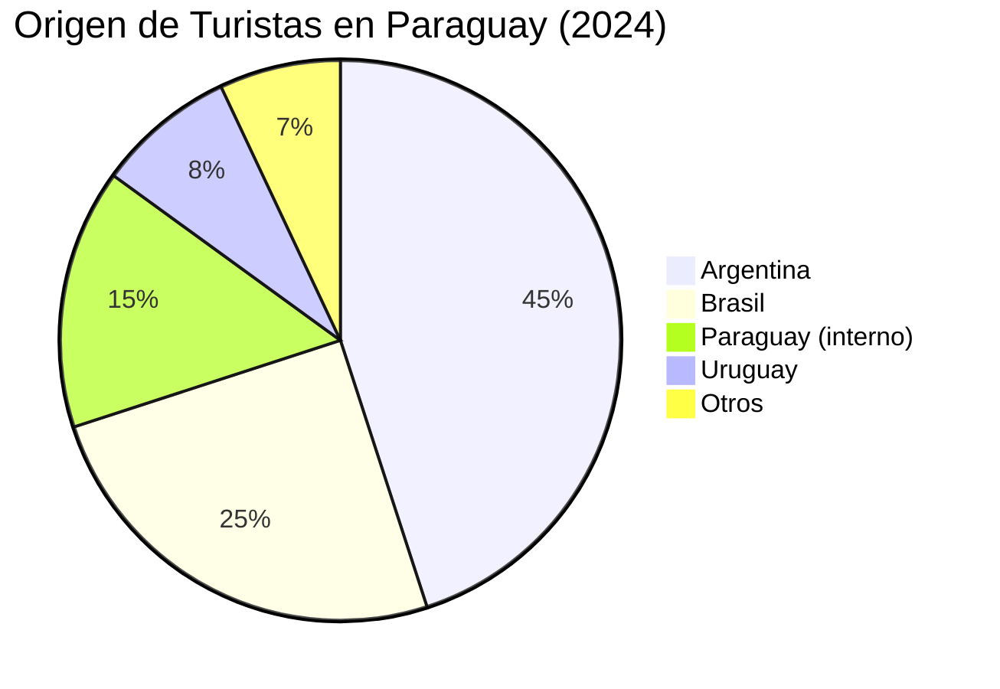
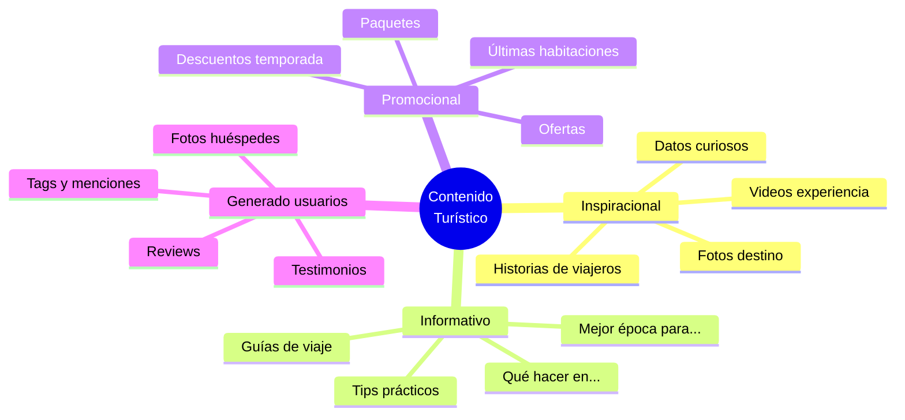
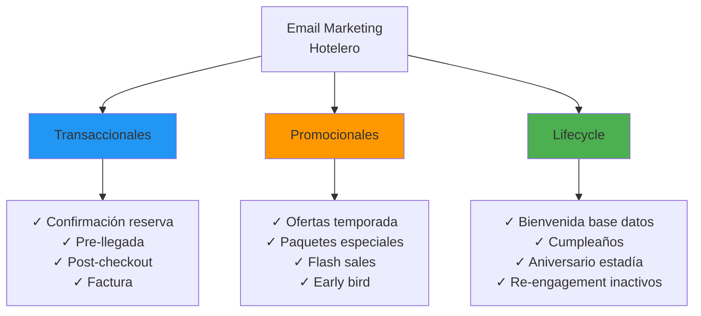
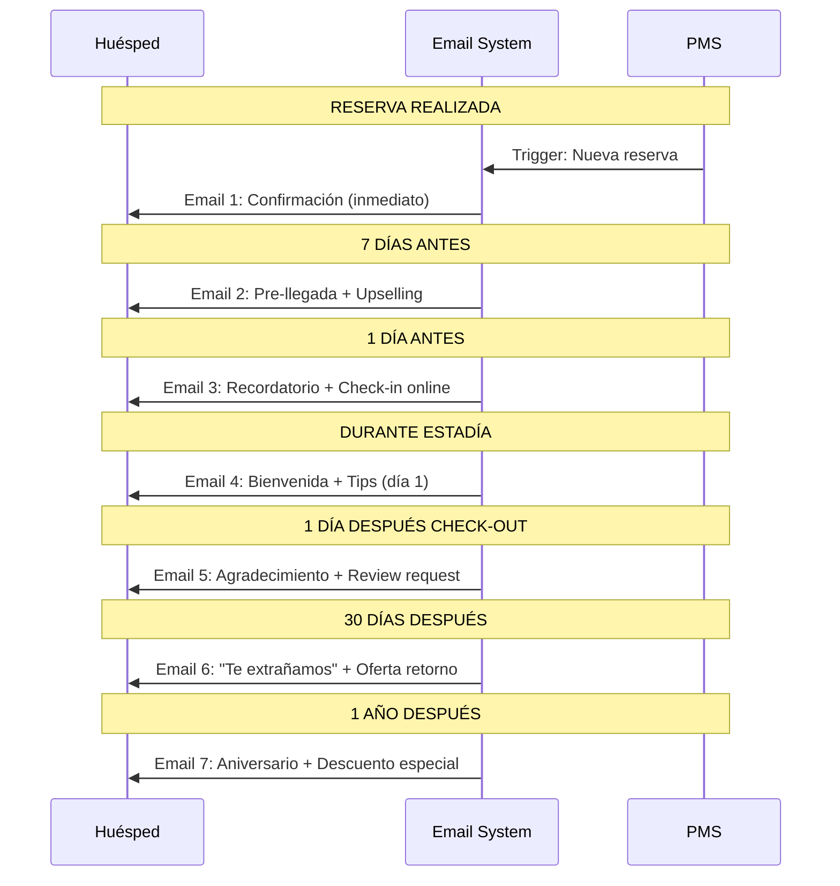
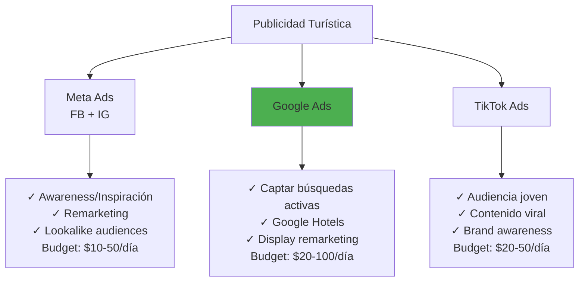

# 📱 Marketing Digital para Turismo con IA

**Duración:** 4 horas
**Nivel:** Intermedio
**Track:** Hospitalidad y Turismo

---

## ¿Qué Vas a Lograr?

Al completar este módulo, vas a poder:

- [ ] Crear contenido turístico atractivo usando IA (textos, ideas visuales, videos)
- [ ] Gestionar redes sociales de manera eficiente con automatización
- [ ] Implementar estrategias de SEO para hoteles y destinos turísticos
- [ ] Diseñar campañas de email marketing personalizadas
- [ ] Medir y optimizar el rendimiento de campañas digitales

---

## La Analogía del Contador de Historias

Imagina a un anciano paraguayo contando historias del Chaco bajo un árbol de lapacho. Cada persona que escucha se lleva una imagen vívida, una emoción, un deseo de vivir esa experiencia.

El marketing turístico es exactamente eso: contar historias que hacen que la gente quiera viajar. La diferencia es que ahora tenés que contar esas historias en Instagram, Google, TikTok, y email—y a millones de personas a la vez.

La IA es tu amplificador de historias: puede ayudarte a crear más contenido, personalizarlo para cada audiencia, y medir qué historias resuenan más.

---

## Parte 1: Fundamentos del Marketing Turístico Digital

### 1.1 El Embudo del Viajero Digital



### 1.2 Canales Clave por Objetivo

| Canal | Mejor para | Formato | Frecuencia ideal |
|-------|-----------|---------|------------------|
| **Instagram** | Inspiración visual | Fotos, Reels, Stories | 1-2 posts/día |
| **TikTok** | Alcance joven | Videos cortos | 1-3 videos/día |
| **Facebook** | Audiencia 35+, grupos | Mix contenido | 1 post/día |
| **Google/SEO** | Captar búsquedas | Blog, landing pages | 2-4 artículos/mes |
| **Email** | Conversión, fidelización | Newsletters, ofertas | 1-2/semana |
| **WhatsApp** | Servicio, reservas | Mensajes directos | Según demanda |
| **YouTube** | Contenido largo | Videos de destino | 2-4/mes |

### 1.3 El Viajero Paraguayo y Regional



**Insights por mercado:**

| Mercado | Motivación principal | Canales preferidos | Temporada alta |
|---------|---------------------|-------------------|----------------|
| **Argentina** | Compras (CDE), playas | Instagram, Facebook | Fines de semana largos |
| **Brasil** | Compras, negocios | WhatsApp, Instagram | Vacaciones escolares |
| **Paraguay interno** | Escapadas, familia | Facebook, WhatsApp | Fines de semana |
| **Uruguay** | Iguazú, cultura | Instagram, Google | Verano |

---

## Parte 2: Creación de Contenido con IA

### 2.1 Framework para Contenido Turístico



### 2.2 Prompts para Contenido de Redes Sociales

**Instagram - Caption inspiracional:**

```markdown
**Prompt:**
Escribí un caption de Instagram para un hotel boutique en Asunción,
Paraguay, para una foto del atardecer desde la terraza con vista al río.

**Requisitos:**
- Máximo 150 palabras
- Tono: cálido, invitador, aspiracional
- Incluir un dato interesante sobre el río Paraguay
- 3-5 hashtags relevantes (mix de populares y nichados)
- Call to action sutil
- NO usar clichés como "paraíso" o "escape perfecto"
```

**Caption generado:**

> El río Paraguay cambia de color 47 veces durante el atardecer—sí, lo contamos 🌅
>
> Desde nuestra terraza en el piso 12, cada tarde es un espectáculo diferente. Hoy: naranjas intensos mezclándose con el azul del Chaco en el horizonte.
>
> Los guaraníes llamaban a este río "Paragua-y": agua que va al mar. Nosotros lo llamamos: la mejor vista de la ciudad con un terere en la mano.
>
> ¿Cuál es tu hora favorita del día? 👇
>
> #AsuncionParaguay #RioParaguay #HotelBoutique #SunsetLovers #VisitParaguay

**TikTok - Script de video:**

```markdown
**Prompt:**
Creá un script para un TikTok de 30 segundos mostrando "Un día en
[Hotel Guaraní, Asunción]" para audiencia joven (18-30 años).

**Estructura:**
- Hook (primeros 3 segundos): algo inesperado o pregunta
- Desarrollo: mostrar 4-5 momentos del día
- Cierre: call to action

**Estilo:** Dinámico, auténtico, no corporativo
```

**Script generado:**

```
[0-3s] HOOK
"¿Sabías que en Asunción hay un hotel con piscina que parece
flotar sobre la ciudad?" (mostrar vista aérea piscina rooftop)

[3-8s] MAÑANA
"7AM: Desayuno con chipá recién hecho" (close-up chipá +
café con latte art)

[8-13s] MEDIODÍA
"12PM: Trabajando con esta vista" (laptop + ventana con
vista río)

[13-18s] TARDE
"4PM: Necesitaba este break" (piscina rooftop, POV
entrando al agua)

[18-23s] NOCHE
"9PM: La terraza de noche hits different" (luces ciudad,
trago en mano)

[23-30s] CIERRE
"Hotel Guaraní, Asunción. Link en bio para el secreto
mejor guardado de Paraguay 🇵🇾"

[Audio sugerido: trending sound relajado/aesthetic]
```

**Facebook - Post informativo:**

```markdown
**Prompt:**
Escribí un post de Facebook sobre "5 cosas que hacer en Asunción
en un fin de semana" para promocionar el Hotel Guaraní.

**Requisitos:**
- Formato lista numerada
- Mezclar actividades conocidas y hidden gems
- Incluir 1 mención natural del hotel
- Engagement: terminar con pregunta
- Longitud: 200-300 palabras
```

### 2.3 Calendario de Contenido con IA

**Prompt para planificación mensual:**

```markdown
**Contexto:**
Hotel 4 estrellas en Asunción, Paraguay
Mes: Octubre 2026
Eventos relevantes: Día de la Raza (12), Halloween (31)

**Genera un calendario de contenido para Instagram con:**
- 30 ideas de posts (1 por día)
- Mezcla de formatos (feed, reels, stories, carrusel)
- Temas variados (destino, hotel, comida, tips, promociones)
- Fechas especiales marcadas
- Horarios de publicación sugeridos

**Formato:** Tabla con columnas: Fecha, Formato, Tema, Caption (resumen), Hashtags
```

**Ejemplo de semana generada:**

| Fecha | Formato | Tema | Caption | Hashtags |
|-------|---------|------|---------|----------|
| Lun 5 | Feed | Piscina | Vista amanecer desde rooftop | #MondayMotivation #AsuncionPY |
| Mar 6 | Reel | Behind scenes | Cómo preparamos las habitaciones | #HotelLife #Housekeeping |
| Mié 7 | Stories | Poll | ¿Terere o café? + fotos de ambos | #Paraguay #Interactive |
| Jue 8 | Carrusel | Tips | 5 lugares para comer en centro Asunción | #FoodieAsuncion #Tips |
| Vie 9 | Reel | Promo | Pack fin de semana romántico | #EscapadaRomantica #Promo |
| Sáb 10 | Feed | UGC | Repost foto de huésped con crédito | #HotelGuarani #GuestPhoto |
| Dom 11 | Stories | Countdown | Mañana es feriado, ¿ya reservaste? | #DiaDeLaRaza #Feriado |

### 2.4 Respuestas a Comentarios y DMs

```mermaid
flowchart TD
    A[Comentario/DM] --> B{Tipo}

    B -->|Consulta| C[Respuesta<br/>informativa]
    B -->|Positivo| D[Agradecer +<br/>invitar a volver]
    B -->|Negativo| E[Disculparse +<br/>mover a privado]
    B -->|Spam| F[Ignorar/Eliminar]

    C --> G[¿Requiere<br/>seguimiento?]
    G -->|Sí| H[Pedir datos<br/>por DM]
    G -->|No| I[Cerrar con<br/>CTA amigable]

    D --> J[Invitar a<br/>compartir review]

    E --> K[Resolver<br/>en privado]

    style E fill:#F44336
    style D fill:#4CAF50
```



**Prompt para respuestas:**

```markdown
**Comentario en Instagram:**
"Hermoso el hotel! Cuánto sale la noche? Somos 2 adultos y 1 niño"

**Genera respuesta que:**
1. Agradezca el interés
2. NO dé precio exacto público (derivar a DM/web)
3. Mencione que niños tienen beneficios
4. Sea breve y amigable
5. Incluya emoji moderado
```

**Respuesta:**

> ¡Gracias por el interés! 😊 Los precios varían según fecha y disponibilidad. Lo mejor: los niños menores de 12 duermen gratis en habitación de padres 🎉 Te mandamos DM con toda la info, o podés ver opciones en el link de nuestra bio. ¿Para qué fechas estás pensando?

---

## Parte 3: SEO para Turismo

### 3.1 Keywords Turísticas

```mermaid
graph TD
    A[Keywords Turísticas] --> B[Informacionales]
    A --> C[Navegacionales]
    A --> D[Transaccionales]

    B --> B1["qué hacer en asunción"<br/>"mejor época para visitar paraguay"<br/>"lugares turísticos encarnación"]

    C --> C1["hotel guaraní asunción"<br/>"sheraton paraguay"<br/>"booking asunción"]

    D --> D1["hotel asunción centro precio"<br/>"reservar hotel iguazú"<br/>"paquete turístico paraguay"]

    style D fill:#4CAF50
```

**Keywords de alto valor para Paraguay:**

| Keyword | Volumen/mes | Competencia | Intención |
|---------|-------------|-------------|-----------|
| hotel asunción | 2,400 | Alta | Transaccional |
| qué hacer en asunción | 1,900 | Media | Informacional |
| misiones jesuíticas paraguay | 880 | Baja | Informacional |
| hotel encarnación | 720 | Media | Transaccional |
| itaipú visita | 1,300 | Media | Informacional |
| hotel ciudad del este | 1,100 | Alta | Transaccional |

### 3.2 Estructura de Blog Post SEO

**Prompt para artículo SEO:**

```markdown
**Keyword principal:** "qué hacer en asunción en 3 días"
**Keyword secundaria:** "itinerario asunción", "turismo asunción"

**Genera artículo de blog que incluya:**
1. Título optimizado (50-60 caracteres)
2. Meta descripción (150-160 caracteres)
3. Introducción con keyword en primer párrafo
4. Estructura H2/H3 lógica
5. Contenido de 1500-2000 palabras
6. Lista de lugares con horarios y precios reales
7. Mención natural del Hotel Guaraní como opción de alojamiento
8. FAQs al final (3-5 preguntas)
9. Call to action

**Tono:** Informativo pero cercano, como un amigo local dando tips
```

**Estructura del artículo generado:**

```markdown
# Qué Hacer en Asunción en 3 Días: Guía Local 2026

**Meta:** Descubre qué hacer en Asunción en 3 días: itinerario completo
con los mejores lugares, tips locales y opciones para todos los gustos.

## Introducción
Asunción, la capital de Paraguay, es una de las ciudades más
subestimadas de Sudamérica. En 3 días podés descubrir su historia
colonial, gastronomía única y la calidez de su gente...

## Día 1: Centro Histórico y Costanera
### Mañana: Casco Histórico
- Palacio de López (exterior) - Gratis
- Panteón de los Héroes - Gratis, 8:00-18:00
- Casa de la Independencia - ₲10,000, 7:00-18:30

### Tarde: Costanera de Asunción
...

## Día 2: Cultura y Gastronomía
...

## Día 3: Alrededores
### Opción A: Areguá y Lago Ypacaraí
### Opción B: San Bernardino
...

## Dónde Alojarse en Asunción
Para este itinerario, recomendamos hospedarse en el centro.
El Hotel Guaraní ofrece ubicación perfecta a pasos del casco
histórico y excelente relación calidad-precio...

## FAQs

### ¿Es seguro caminar por Asunción?
El centro es seguro durante el día. De noche, usar taxi/Uber
para distancias largas...

### ¿Cuánto dinero necesito para 3 días?
Presupuesto medio: $50-80 USD/día incluyendo alojamiento...

### ¿Qué época es mejor para visitar?
Abril-octubre (otoño/invierno) tiene clima más agradable...
```

### 3.3 Google Business Profile

**Optimización del perfil:**

```mermaid
checklist
    title Google Business - Checklist Optimización
    Información completa (nombre, dirección, teléfono) :done
    Categoría principal correcta (Hotel) :done
    Categorías secundarias (Restaurante, Spa) :done
    Horarios actualizados :done
    Fotos de calidad (exterior, habitaciones, amenities) :active
    Responder TODAS las reviews :active
    Posts semanales con ofertas/novedades :active
    Preguntas y respuestas pobladas :active
    Atributos marcados (WiFi, piscina, etc.) :done
```

---

## Parte 4: Email Marketing para Turismo

### 4.1 Tipos de Emails Turísticos



### 4.2 Secuencia de Email Automatizada



### 4.3 Templates de Email con IA

**Email de pre-llegada:**

```markdown
**Prompt:**
Genera email de pre-llegada para enviar 48 horas antes del check-in.

**Datos del huésped:**
- Nombre: Carlos Mendoza
- Llegada: Viernes 15 de octubre, 18:00
- Habitación: Superior con vista
- Noches: 2
- Motivo: "Viaje de negocios" (campo de reserva)

**El email debe:**
1. Confirmar detalles de la reserva
2. Ofrecer early check-in (upselling sutil)
3. Preguntar si necesita transfer
4. Dar información práctica (WiFi, parking, horarios)
5. Incluir contacto de WhatsApp para consultas
6. Ser breve pero completo
7. Tono profesional pero cálido
```

**Email generado:**

> **Asunto:** Carlos, todo listo para su llegada el viernes 🏨
>
> Estimado Carlos,
>
> ¡Nos vemos en 2 días! Su habitación Superior con vista estará lista y esperándolo.
>
> **Detalles de su reserva:**
> - Check-in: Viernes 15/10 a partir de las 15:00
> - Check-out: Domingo 17/10 hasta las 11:00
> - Habitación: Superior con vista al río
>
> **¿Llegando temprano?**
> Si su vuelo/reunión lo permite, podemos intentar tener su habitación lista antes. El early check-in tiene un costo de $20 y se confirma el mismo día según disponibilidad. ¿Le interesa que lo agendemos?
>
> **¿Necesita transfer desde el aeropuerto?**
> Podemos coordinarlo por $35 (sedan) o $50 (van). Solo responda este email con los datos de su vuelo.
>
> **Para su comodidad:**
> - WiFi: "HotelGuarani_Guest" (contraseña en su tarjeta de habitación)
> - Estacionamiento: Disponible ($15/día)
> - Restaurante: Abierto hasta las 23:00
>
> ¿Alguna consulta? Escríbanos por WhatsApp: +595 981 XXX XXX
>
> ¡Buen viaje!
>
> Equipo Hotel Guaraní

**Email post-checkout (solicitud de review):**

```markdown
**Prompt:**
Genera email para solicitar review en Google, enviado 24 horas
después del checkout.

**Datos:**
- Nombre: María Fernández
- Estadía: 3 noches
- Habitación: Suite
- Sabemos que pidió room service 2 veces (dato de PMS)

**El email debe:**
1. Agradecer la estadía (personalizado)
2. Pedir feedback de forma no agresiva
3. Incluir link directo a Google Reviews
4. Ofrecer incentivo para próxima estadía (no para la review)
5. Ser breve - máximo 150 palabras
```

**Email generado:**

> **Asunto:** María, ¿cómo estuvo su estadía?
>
> Hola María,
>
> Gracias por elegir Hotel Guaraní para sus 3 noches en Asunción. Esperamos que haya disfrutado la suite—y nuestro room service nocturno 😊
>
> Si tiene un minuto, nos encantaría saber cómo fue su experiencia:
>
> **[⭐ Dejar review en Google](link-a-google-reviews)**
>
> Su opinión nos ayuda a mejorar y ayuda a otros viajeros a tomar decisiones.
>
> **Para su próxima visita:** Use el código GRACIAS15 y obtenga 15% de descuento en su próxima reserva directa.
>
> ¡Hasta pronto!
>
> María González
> Hotel Guaraní

### 4.4 Métricas de Email Marketing

| Métrica | Benchmark Hotelero | Cómo mejorar |
|---------|-------------------|--------------|
| **Open Rate** | 25-30% | Mejorar subject lines, personalizar |
| **Click Rate** | 3-5% | CTAs claros, contenido relevante |
| **Unsubscribe** | <0.5% | Segmentar mejor, no saturar |
| **Conversión** | 1-2% | Ofertas relevantes, urgencia |

---

## Parte 5: Publicidad Paga para Turismo

### 5.1 Plataformas y Usos



### 5.2 Estructura de Campaña Meta Ads

**Prompt para crear campaña:**

```markdown
**Objetivo:** Generar reservas para el Hotel Guaraní durante
temporada baja (febrero-marzo 2026)

**Presupuesto:** $500/mes total
**Audiencia objetivo:** Argentinos 25-55 años, intereses en viajes

**Genera:**
1. Estructura de campaña (niveles campaña/adset/ad)
2. Segmentación detallada para 3 adsets diferentes
3. Textos para 3 anuncios diferentes
4. Recomendaciones de creativos (qué mostrar)
5. KPIs objetivo
```

**Estructura generada:**

```
CAMPAÑA: Temporada Baja Feb-Mar 2026
├── Objetivo: Conversiones (Reservas)
├── Presupuesto: $500/mes (~$16/día)
│
├── ADSET 1: Escapadas Fin de Semana
│   ├── Audiencia: Argentina, 28-45, intereses: viajes, escapadas
│   ├── Ubicaciones: Buenos Aires, Córdoba, Rosario
│   ├── Budget: $6/día
│   └── ADS:
│       ├── Ad 1: Carrusel habitaciones + piscina
│       ├── Ad 2: Video 15s "Tu fin de semana en Asunción"
│       └── Ad 3: Imagen estática con oferta
│
├── ADSET 2: Viajeros Frecuentes
│   ├── Audiencia: Argentina, 30-55, viajeros frecuentes
│   ├── Intereses: Booking, Despegar, millas
│   ├── Budget: $5/día
│   └── ADS:
│       ├── Ad 1: Beneficios del hotel (WiFi, ubicación)
│       └── Ad 2: Comparativa precio vs Buenos Aires
│
└── ADSET 3: Remarketing Web
    ├── Audiencia: Visitantes web últimos 30 días
    ├── Budget: $5/día
    └── ADS:
        ├── Ad 1: "Todavía pensando? 10% OFF"
        └── Ad 2: Testimonios de huéspedes argentinos
```

**Textos de anuncios:**

```markdown
**Ad 1 - Escapada:**
🇵🇾 Asunción está más cerca de lo que pensás

A solo 1 hora de Buenos Aires, encontrá:
✓ Hotel 4 estrellas desde $79/noche
✓ Piscina rooftop con vista al río
✓ El mejor chipá de tu vida (incluido en el desayuno)

Este finde, escapate.
👉 Reservá ahora y pagá en pesos

**Ad 2 - Comparativa:**
¿Por qué pagar $150 por un hotel en Buenos Aires...

...cuando en Asunción tenés:
🏨 Hotel 4 estrellas por $79
🍽️ Cena para 2 por $25
🛍️ Shopping duty-free

Mismo presupuesto. Experiencia completamente diferente.
👉 Ver disponibilidad

**Ad 3 - Remarketing:**
Hola de nuevo 👋

Vimos que estuviste mirando el Hotel Guaraní.
¿Qué te frena?

Por tiempo limitado: 10% OFF en tu primera reserva
Código: BIENVENIDO10

👉 Completar reserva
```

---

## Ejercicios Prácticos

### Ejercicio 1: Calendario de Contenido

**Objetivo:** Crear un calendario de contenido de 2 semanas para Instagram.

**Contexto:**
- Hotel boutique en Encarnación, Paraguay
- Temporada: Verano (playa de San José)
- Eventos próximos: Carnaval Encarnaceno

**Tareas:**
1. Genera 14 ideas de posts (1 por día)
2. Define formato para cada uno (feed, reel, carrusel, stories)
3. Escribe los captions completos para 5 de ellos
4. Crea 10 hashtags específicos para Encarnación

---

### Ejercicio 2: Artículo SEO

**Objetivo:** Escribir un artículo de blog optimizado para SEO.

**Keyword:** "playas de encarnación paraguay"
**Longitud:** 1,000-1,500 palabras

**El artículo debe incluir:**
1. Título SEO optimizado
2. Meta descripción
3. Al menos 5 secciones con H2
4. Información práctica (cómo llegar, precios, horarios)
5. Mención de alojamiento (tu hotel hipotético)
6. FAQs (3 preguntas)

---

### Ejercicio 3: Secuencia de Email

**Objetivo:** Diseñar una secuencia de 5 emails para un nuevo suscriptor.

**Contexto:**
Una persona se suscribió al newsletter de tu hotel después de
descargar una guía "10 cosas que hacer en Paraguay".

**Diseñar:**
1. Email 1 (inmediato): Bienvenida + entrega de la guía
2. Email 2 (día 3): Contenido de valor adicional
3. Email 3 (día 7): Historia del hotel / diferencial
4. Email 4 (día 14): Primera oferta suave
5. Email 5 (día 21): Oferta con urgencia

Para cada email: subject line, preview text, contenido resumido.

---

### Ejercicio 4: Campaña de Ads

**Objetivo:** Planificar una campaña de Meta Ads para un evento especial.

**Contexto:**
- Tu hotel en Asunción quiere llenar para Semana Santa
- Presupuesto: $300 para 3 semanas de campaña
- Target: Familias argentinas

**Entregar:**
1. Estructura de campaña (adsets)
2. Segmentación de audiencia
3. 3 conceptos creativos diferentes
4. Textos de anuncios
5. KPIs que medirías

---

### Ejercicio 5: Respuestas a Comentarios

**Objetivo:** Responder a diferentes tipos de comentarios en redes.

**Comentarios a responder:**

1. **Positivo:** "Nos encantó el hotel! La vista desde la piscina es increíble 😍"

2. **Consulta:** "Hola, tienen disponibilidad para año nuevo? Somos 4 adultos"

3. **Queja pública:** "Pésimo servicio. Esperamos 40 minutos por el room service"

4. **Spam/Irrelevante:** "Compra seguidores aquí [link]"

5. **Competencia disfrazada:** "Yo fui al hotel X y es mucho mejor"

---

## Preguntas de Evaluación

**1. ¿Cuál es la primera etapa del embudo del viajero digital?**
- a) Reservar
- b) Planificar
- c) Soñar/Inspiración
- d) Compartir

**2. ¿Qué red social es mejor para inspiración visual en turismo?**
- a) LinkedIn
- b) Twitter/X
- c) Instagram
- d) Email

**3. En SEO turístico, una keyword "transaccional" es:**
- a) "qué hacer en asunción"
- b) "historia de paraguay"
- c) "hotel asunción precio reservar"
- d) "clima asunción octubre"

**4. ¿Cuántas palabras debería tener idealmente un artículo de blog SEO?**
- a) 300-500
- b) 500-800
- c) 1,000-2,000
- d) 3,000+

**5. El open rate benchmark para emails de hoteles es aproximadamente:**
- a) 5-10%
- b) 15-20%
- c) 25-30%
- d) 40-50%

**6. ¿Cuándo es el mejor momento para enviar email solicitando review?**
- a) Durante la estadía
- b) Inmediatamente al checkout
- c) 24 horas después del checkout
- d) 1 semana después

**7. En una campaña de Meta Ads, "remarketing" significa:**
- a) Hacer marketing otra vez
- b) Mostrar ads a personas que ya visitaron tu web
- c) Marketing en otro mercado
- d) Duplicar el presupuesto

**8. ¿Cuál es el formato de contenido con mayor engagement en Instagram actualmente?**
- a) Fotos estáticas
- b) Carruseles
- c) Reels
- d) Stories

**9. ¿Qué NO debería incluir una respuesta a comentario negativo público?**
- a) Disculpa
- b) Oferta de contacto privado
- c) Excusas o justificaciones
- d) Nombre del gerente

**10. El principal mercado emisor de turistas hacia Paraguay es:**
- a) Brasil
- b) Uruguay
- c) Argentina
- d) Chile

---

## Respuestas

1. **c) Soñar/Inspiración** - El journey comienza cuando alguien empieza a soñar con un viaje, antes de planificar destino o reservar.

2. **c) Instagram** - Es la plataforma visual por excelencia para inspiración de viajes, junto con Pinterest.

3. **c) "hotel asunción precio reservar"** - Indica intención de compra. Las otras son informacionales.

4. **c) 1,000-2,000** - Artículos de esta longitud suelen rankear mejor para keywords competitivas y permiten cubrir el tema en profundidad.

5. **c) 25-30%** - Es el benchmark de la industria hotelera. Por debajo indica problemas de segmentación o subject lines.

6. **c) 24 horas después del checkout** - Suficiente tiempo para que la experiencia decante, pero aún fresca en la memoria.

7. **b) Mostrar ads a personas que ya visitaron tu web** - Remarketing/retargeting se dirige a audiencias que ya mostraron interés.

8. **c) Reels** - El algoritmo de Instagram favorece fuertemente el contenido de video corto desde 2022.

9. **c) Excusas o justificaciones** - Las excusas empeoran la percepción. Se debe aceptar responsabilidad y ofrecer solución.

10. **c) Argentina** - Aproximadamente el 45% de los turistas en Paraguay son argentinos.

---

## Recursos Adicionales

### Herramientas Gratuitas

| Herramienta | Uso | Link |
|-------------|-----|------|
| Canva | Diseño gráfico | canva.com |
| CapCut | Edición video | capcut.com |
| Later | Programación posts | later.com |
| Mailchimp | Email marketing (free tier) | mailchimp.com |
| Google Keyword Planner | Research SEO | ads.google.com |
| Answer The Public | Ideas de contenido | answerthepublic.com |

### Cuentas a Seguir

- @visitparaguay (turismo oficial)
- @booking.com (inspiración hotelera)
- @airbnb (storytelling de destinos)
- @tripadvisor (engagement comunitario)

### Certificaciones Gratuitas

- Google Digital Garage
- Meta Blueprint
- HubSpot Academy - Content Marketing

---

## Próximo Módulo

En el **Módulo 4: Operaciones Hoteleras con IA**, aprenderás:
- Automatización de procesos operativos
- Gestión de housekeeping con IA
- Mantenimiento predictivo
- Optimización de turnos y personal

---

*Módulo 3 de 4 | Track: Hospitalidad y Turismo | FPUNA 2026*
