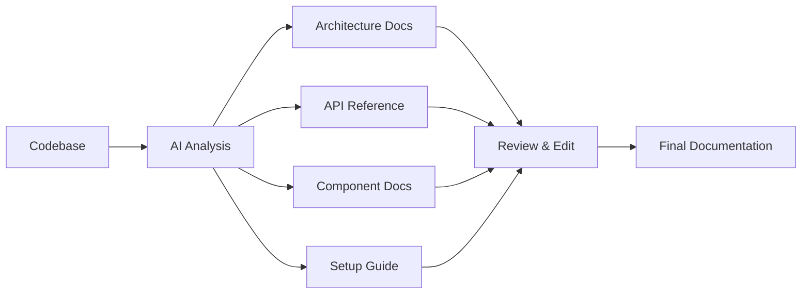
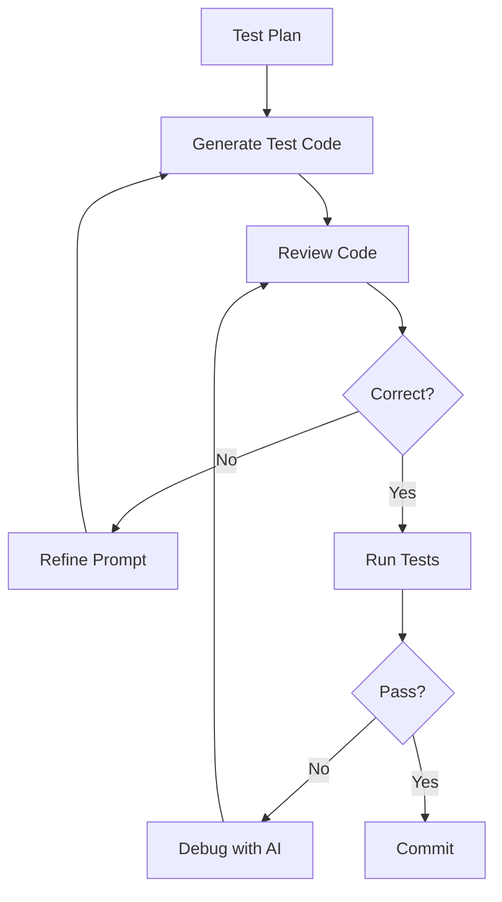

# Course: QA to QA Automation Engineer with AI

## Course Overview

**Target Audience**: Manual QA Engineers looking to level up to QA Automation with AI assistance
**Duration**: 40-60 hours (8-12 weeks, part-time)
**Prerequisites**: Basic QA experience, familiarity with testing concepts
**Outcome**: Ability to use AI tools to automate test creation, execution, documentation, and analysis

---

## Course Objectives

By the end of this course, students will be able to:

1. Set up and configure AI coding assistants (Claude Code, GitHub Copilot)
2. Provide effective context to AI for better code generation
3. Access and document private codebases using AI
4. Generate comprehensive test plans with AI assistance
5. Implement automated tests using AI-generated code
6. Review, validate, and improve AI-generated tests
7. Apply the 20 agentic design patterns to testing workflows
8. Integrate AI tools into CI/CD pipelines

---

## Module 1: Introduction to AI-Assisted Development

### 1.1 Understanding AI Coding Assistants
- What are LLMs and how they work (high-level)
- Claude Code vs GitHub Copilot vs ChatGPT
- When to use AI vs manual approaches
- Limitations and hallucination awareness

### 1.2 Setting Up Your AI Environment

#### Installing Claude Code
```bash
# Windows (PowerShell as Administrator)
winget install Anthropic.ClaudeCode

# macOS
brew install claude-code

# Linux
curl -fsSL https://claude.ai/install.sh | sh
```

#### Initial Configuration
```bash
# Authenticate
claude auth login

# Configure for your project
claude config set model sonnet
claude config set temperature 0  # Deterministic for testing
```

### 1.3 Understanding AI Context Windows
- Token limits and their implications
- How to structure information for AI
- The importance of relevant context
- Avoiding context overflow

### 1.4 Hands-On Exercise
- Install Claude Code
- Run first conversation
- Explore available tools and commands

---

## Module 2: Providing Effective Context to AI

### 2.1 The Context Hierarchy

```
Project Level Context
    ├── CLAUDE.md (project instructions)
    ├── .claude/settings.local.json
    └── Directory structure

Session Level Context
    ├── Current conversation
    ├── Files read in session
    └── Task-specific instructions

Prompt Level Context
    ├── Specific question/task
    ├── Relevant code snippets
    └── Expected output format
```

### 2.2 Creating a CLAUDE.md File

```markdown
# Project: E-Commerce Platform

## Architecture
- Frontend: React + TypeScript
- Backend: Node.js + Express
- Database: PostgreSQL
- Testing: Jest + Playwright

## Code Conventions
- Use TypeScript strict mode
- Prefer functional components
- Follow AAA pattern for tests (Arrange, Act, Assert)
- Naming: `test_<feature>_<scenario>_<expected_result>`

## Test Requirements
- All tests must have clear assertions
- Use data-testid for element selection
- Mock external APIs
- Target 80% code coverage

## Important Files
- `src/services/` - Business logic
- `src/api/` - API endpoints
- `tests/` - Test files
- `package.json` - Dependencies
```

### 2.3 Effective Prompting for Testing

#### Bad Prompt
```
Write tests for the login function
```

#### Good Prompt
```
I need to write unit tests for the authentication service in `src/services/auth.ts`.

**Function to test**: `authenticateUser(email: string, password: string)`

**Requirements**:
- Test successful authentication with valid credentials
- Test failure with invalid password
- Test failure with non-existent user
- Test rate limiting after 5 failed attempts
- Use Jest with TypeScript
- Mock the database calls
- Follow the project's AAA pattern

**Expected coverage**: Happy path + edge cases + error handling
```

### 2.4 The Context Preparation Workflow

1. **Identify** the scope of work
2. **Gather** relevant files and documentation
3. **Structure** information hierarchically
4. **Provide** examples of expected output
5. **Specify** constraints and requirements

### 2.5 Hands-On Exercise
- Create a CLAUDE.md for a sample project
- Practice writing effective prompts
- Compare AI outputs with different context levels

---

## Module 3: Accessing Private Repositories with AI

### 3.1 Setting Up GitHub CLI Authentication

```bash
# Install GitHub CLI
winget install GitHub.cli  # Windows
brew install gh             # macOS

# Authenticate with GitHub
gh auth login
# Select: GitHub.com
# Select: HTTPS
# Select: Login with a web browser
# Enter the code shown in the terminal

# Verify authentication
gh auth status

# Grant organization access
# Go to: https://github.com/settings/tokens
# Ensure your token has access to the organization
```

### 3.2 Listing Organization Repositories

```bash
# List all repos in an organization
gh repo list Ai-Whisperers --limit 100

# Get detailed information
gh repo list Ai-Whisperers --json name,description,isPrivate,primaryLanguage

# View a specific repository
gh repo view Ai-Whisperers/repo-name
```

### 3.3 Cloning and Exploring with AI

```bash
# Clone a private repository
gh repo clone Ai-Whisperers/project-name

# Navigate to project
cd project-name

# Start Claude Code session
claude

# Ask Claude to explore the codebase
> "Analyze this codebase and explain the architecture"
> "What testing frameworks are being used?"
> "Identify areas with low test coverage"
```

### 3.4 Using AI to Document Unfamiliar Code

#### Step 1: High-Level Overview
```
Please analyze this repository and provide:
1. Overall architecture diagram
2. Main components and their responsibilities
3. Data flow between components
4. External dependencies and integrations
```

#### Step 2: Deep Dive into Specific Areas
```
Focus on the authentication module in `src/auth/`:
1. List all public functions
2. Explain the authentication flow
3. Identify security measures
4. List dependencies
```

#### Step 3: Generate Documentation
```
Generate technical documentation for `src/services/payment.ts`:
1. Function signatures with JSDoc
2. Usage examples
3. Error handling behavior
4. Integration requirements
```

### 3.5 Hands-On Exercise
- Authenticate with GitHub CLI
- Clone a private repository
- Use Claude to generate architecture documentation
- Create a codebase overview document

---

## Module 4: Generating Complete Code Documentation

### 4.1 The Documentation Workflow



### 4.2 Prompts for Documentation Generation

#### Architecture Documentation
```
Analyze this project and create architecture documentation including:

1. **System Overview**
   - Purpose and goals
   - Key features
   - Technology stack

2. **Component Diagram**
   - Using Mermaid syntax
   - Show all major components
   - Show data flow

3. **Data Models**
   - Main entities
   - Relationships
   - Database schema

4. **API Endpoints**
   - REST endpoints
   - Request/Response formats
   - Authentication requirements

5. **External Integrations**
   - Third-party services
   - Configuration requirements
   - Fallback behavior

Format the output as Markdown with proper headings.
```

#### Function Documentation
```
Generate comprehensive JSDoc documentation for all functions in `src/services/`:

For each function, include:
- @description - What the function does
- @param - Each parameter with type and description
- @returns - Return value with type
- @throws - Possible exceptions
- @example - Usage example
- @see - Related functions
```

### 4.3 Documentation Quality Checklist

- [ ] All public APIs documented
- [ ] Examples for complex functions
- [ ] Error handling explained
- [ ] Dependencies listed
- [ ] Setup instructions complete
- [ ] Architecture diagrams included
- [ ] Up-to-date with current code

### 4.4 Hands-On Exercise
- Select a module from the cloned repository
- Generate complete documentation using AI
- Review and improve the generated docs
- Create a pull request with the documentation

---

## Module 5: Creating Test Plans with AI

### 5.1 The Test Planning Process

```
Requirements → Analysis → Test Strategy → Test Cases → Test Data → Execution Plan
```

### 5.2 Comprehensive Test Plan Prompt

```
Create a comprehensive test plan for the user authentication module.

**Context**:
- File: `src/services/auth.ts`
- Related: `src/api/auth.controller.ts`, `src/models/user.ts`
- Dependencies: bcrypt, jsonwebtoken, nodemailer

**Include**:

1. **Test Objectives**
   - What we're validating
   - Risk areas
   - Compliance requirements

2. **Test Scope**
   - In scope features
   - Out of scope
   - Dependencies to mock

3. **Test Categories**
   - Unit tests (isolated functions)
   - Integration tests (with database)
   - E2E tests (full flow)
   - Security tests
   - Performance tests

4. **Test Cases** (for each category)
   - Test ID
   - Description
   - Preconditions
   - Test steps
   - Expected result
   - Priority (P0-P3)
   - Test data requirements

5. **Test Data Requirements**
   - Valid/invalid users
   - Edge case data
   - Performance test data

6. **Environment Requirements**
   - Test database setup
   - Mock services
   - Environment variables

7. **Execution Schedule**
   - What runs on each commit
   - What runs nightly
   - What runs weekly

Output as Markdown with tables for test cases.
```

### 5.3 Test Case Template

| Test ID | Description | Preconditions | Steps | Expected Result | Priority |
|---------|-------------|---------------|-------|-----------------|----------|
| AUTH-001 | Valid login | User exists, correct password | 1. Call login API 2. Verify response | Returns JWT token | P0 |
| AUTH-002 | Invalid password | User exists | 1. Call login with wrong password | Returns 401 error | P0 |
| AUTH-003 | Rate limiting | 5 failed attempts | 1. Attempt 6th login | Returns 429 error | P1 |

### 5.4 AI-Generated Test Coverage Matrix

```
Ask AI to generate:

"Create a test coverage matrix for the payment service showing:
- Feature/Function in rows
- Test types in columns (Unit, Integration, E2E, Security, Performance)
- Coverage status (Covered, Partial, Missing)
- Priority for missing tests"
```

### 5.5 Hands-On Exercise
- Select a feature to test
- Generate a complete test plan with AI
- Review for completeness
- Prioritize test cases

---

## Module 6: Implementing Tests with AI

### 6.1 Test Implementation Workflow



### 6.2 Generating Unit Tests

```
Generate Jest unit tests for the following function:

```typescript
// src/services/calculator.ts
export function calculateDiscount(
  price: number,
  discountPercent: number,
  maxDiscount: number
): number {
  if (price < 0 || discountPercent < 0) {
    throw new Error('Invalid input: negative values not allowed');
  }

  const discount = price * (discountPercent / 100);
  return Math.min(discount, maxDiscount);
}
```

**Requirements**:
- Test all valid input combinations
- Test boundary conditions (0, max values)
- Test error cases
- Use descriptive test names
- Group related tests with describe blocks
- Include setup/teardown if needed
```

### 6.3 Generating Integration Tests

```
Generate integration tests for the user registration flow:

**Flow**:
1. POST /api/auth/register
2. Validates email format
3. Checks if user exists
4. Hashes password
5. Creates user in database
6. Sends welcome email
7. Returns success

**Requirements**:
- Use supertest for HTTP testing
- Use test database (not mocks)
- Clean up data after tests
- Test the complete flow end-to-end
- Include failure scenarios

**Test Database Setup**:
- Connection string in .env.test
- Run migrations before tests
- Truncate tables between tests
```

### 6.4 Generating E2E Tests with Playwright

```
Generate Playwright E2E tests for the login page:

**Page**: http://localhost:3000/login

**Elements**:
- Email input: data-testid="email-input"
- Password input: data-testid="password-input"
- Login button: data-testid="login-button"
- Error message: data-testid="error-message"

**Test Scenarios**:
1. Successful login redirects to dashboard
2. Invalid credentials shows error
3. Empty fields shows validation errors
4. Forgot password link works
5. Session persists after page reload

**Requirements**:
- Use Page Object Model
- Include visual regression tests
- Test on Chrome and Firefox
- Use test fixtures for user data
```

### 6.5 AI-Assisted Test Debugging

When tests fail, use this prompt:
```
This test is failing:

```javascript
[paste failing test]
```

Error message:
```
[paste error]
```

Relevant source code:
```javascript
[paste related source code]
```

Please:
1. Explain why the test is failing
2. Identify if it's a test issue or code issue
3. Provide the fix
4. Suggest additional test cases if needed
```

### 6.6 Hands-On Exercise
- Implement unit tests for a selected function
- Generate integration tests for an API endpoint
- Create E2E tests for a user flow
- Debug failing tests with AI assistance

---

## Module 7: Test Validation and Quality Assurance

### 7.1 Reviewing AI-Generated Tests

#### Quality Checklist
- [ ] Tests are actually testing something (not just running)
- [ ] Assertions are meaningful
- [ ] Edge cases covered
- [ ] Error handling tested
- [ ] No flaky tests (non-deterministic)
- [ ] Good isolation (no shared state)
- [ ] Readable test names
- [ ] Proper setup/teardown
- [ ] No hardcoded values (use constants/fixtures)
- [ ] Comments for complex logic

### 7.2 Common AI Test Generation Mistakes

1. **Incomplete assertions**
```javascript
// Bad: Just checks it doesn't crash
test('calculates discount', () => {
  const result = calculateDiscount(100, 10, 50);
  expect(result).toBeDefined();
});

// Good: Actually validates the result
test('calculates discount correctly', () => {
  const result = calculateDiscount(100, 10, 50);
  expect(result).toBe(10);
});
```

2. **Missing negative tests**
```javascript
// AI often focuses on happy path
// Make sure to request error cases explicitly
```

3. **Over-mocking**
```javascript
// Bad: Mocking everything makes tests useless
// Good: Mock only external dependencies
```

### 7.3 Mutation Testing

Use AI to generate mutations:
```
For this test file, generate mutations to verify test quality:

1. Change comparison operators (> to >=)
2. Remove boundary checks
3. Modify return values
4. Skip early returns

For each mutation:
- Describe the change
- Predict which test should catch it
- If no test catches it, suggest a new test
```

### 7.4 Test Coverage Analysis

```
Analyze test coverage for src/services/payment.ts:

1. List all functions and branches
2. Identify which tests cover each
3. Calculate coverage percentage
4. Highlight uncovered code paths
5. Suggest tests for missing coverage
6. Prioritize by risk

Use this format:
| Function | Lines | Branches | Tests | Coverage | Priority to Add |
```

### 7.5 Hands-On Exercise
- Review AI-generated tests against checklist
- Run mutation testing
- Analyze coverage gaps
- Improve test quality based on findings

---

## Module 8: Applying Agentic Patterns to Testing

### 8.1 Pattern: Prompt Chaining for Test Creation

```
Chain 1: Analyze code and identify testable units
Chain 2: Generate test plan for each unit
Chain 3: Implement tests based on plan
Chain 4: Validate tests and check coverage
Chain 5: Refine based on validation results
```

### 8.2 Pattern: Parallelization for Large Codebases

```
Step 1: Identify all modules to test
Step 2: Spawn parallel AI tasks:
  - Module A: Generate unit tests
  - Module B: Generate unit tests
  - Module C: Generate unit tests
Step 3: Normalize test formats
Step 4: Merge into test suite
Step 5: Run and validate
```

### 8.3 Pattern: Reflection for Quality Improvement

```
Draft: Generate initial tests
Critique: Review against test quality rubric
Revise: Improve based on critique
Repeat: Until quality threshold met

Prompt for critique:
"Review these tests against our quality standards:
- Meaningful assertions
- Edge cases
- Error handling
- Readability
Score each criterion and suggest improvements."
```

### 8.4 Pattern: RAG for Test Generation

```
Build knowledge base:
- Existing test patterns
- Project conventions
- Common bugs/edge cases
- Security vulnerabilities

When generating new tests:
1. Query knowledge base for similar patterns
2. Retrieve relevant examples
3. Generate tests based on patterns
4. Include known edge cases from history
```

### 8.5 Pattern: Human-in-the-Loop for Critical Tests

```
For security-critical or compliance tests:
1. AI generates initial tests
2. Human reviews and approves
3. AI refines based on feedback
4. Human final approval
5. Tests committed and tracked
```

### 8.6 Hands-On Exercise
- Implement a chained workflow for test generation
- Create a critique prompt for test quality
- Build a simple test pattern knowledge base

---

## Module 9: CI/CD Integration

### 9.1 GitHub Actions Workflow

```yaml
# .github/workflows/test.yml
name: Test Suite

on:
  push:
    branches: [main, develop]
  pull_request:
    branches: [main]

jobs:
  test:
    runs-on: ubuntu-latest

    steps:
      - uses: actions/checkout@v4

      - name: Setup Node.js
        uses: actions/setup-node@v4
        with:
          node-version: '20'
          cache: 'npm'

      - name: Install dependencies
        run: npm ci

      - name: Run unit tests
        run: npm run test:unit

      - name: Run integration tests
        run: npm run test:integration
        env:
          DATABASE_URL: ${{ secrets.TEST_DATABASE_URL }}

      - name: Run E2E tests
        run: npm run test:e2e

      - name: Upload coverage
        uses: codecov/codecov-action@v3
        with:
          token: ${{ secrets.CODECOV_TOKEN }}
```

### 9.2 Pre-commit Hooks

```json
// package.json
{
  "husky": {
    "hooks": {
      "pre-commit": "npm run test:unit -- --onlyChanged"
    }
  }
}
```

### 9.3 AI-Generated Test Reports

```
Generate a test execution report including:

1. Summary
   - Total tests
   - Passed/Failed/Skipped
   - Coverage percentage
   - Execution time

2. Failed Tests
   - Test name
   - Failure reason
   - Suggested fix

3. Coverage Gaps
   - Uncovered lines
   - Risk assessment
   - Test suggestions

4. Performance Issues
   - Slow tests (>1s)
   - Optimization suggestions

5. Recommendations
   - Critical issues to address
   - Suggested next steps

Format as Markdown for PR comments.
```

### 9.4 Hands-On Exercise
- Set up GitHub Actions workflow
- Configure coverage reporting
- Create pre-commit hooks
- Generate automated test reports

---

## Module 10: Final Project

### 10.1 Project Requirements

Choose a real codebase (from your organization or open source) and:

1. **Setup & Configuration** (20%)
   - Configure Claude Code for the project
   - Create comprehensive CLAUDE.md
   - Set up GitHub CLI access

2. **Documentation Generation** (20%)
   - Generate architecture documentation
   - Create API reference
   - Document setup procedures

3. **Test Planning** (20%)
   - Create comprehensive test plan
   - Define test coverage matrix
   - Prioritize test cases

4. **Test Implementation** (25%)
   - Implement unit tests (min 10)
   - Implement integration tests (min 5)
   - Implement E2E tests (min 3)

5. **Quality & CI/CD** (15%)
   - Review and validate tests
   - Set up CI pipeline
   - Generate test report

### 10.2 Evaluation Criteria

| Criterion | Weight | Requirements |
|-----------|--------|--------------|
| AI Usage Effectiveness | 25% | Clear prompts, good context, iterative improvement |
| Test Quality | 25% | Meaningful assertions, edge cases, error handling |
| Coverage | 20% | >70% line coverage, all critical paths |
| Documentation | 15% | Complete, accurate, well-structured |
| CI/CD | 15% | Working pipeline, automated reporting |

### 10.3 Deliverables

1. Project repository with:
   - CLAUDE.md
   - Generated documentation
   - Test plan document
   - All test files
   - CI/CD configuration

2. Demo video (5-10 min):
   - Show AI-assisted workflow
   - Run test suite
   - Explain key decisions

3. Reflection document:
   - What worked well
   - Challenges faced
   - Lessons learned
   - Future improvements

---

## Appendix A: Quick Reference - Essential Prompts

### Documentation
```
Analyze [file/module] and generate complete technical documentation
including purpose, API reference, usage examples, and dependencies.
```

### Test Planning
```
Create a test plan for [feature] with test cases covering happy path,
edge cases, error handling, and security. Include priority and test data.
```

### Test Generation
```
Generate [framework] tests for [function/API] with:
- Descriptive names
- AAA pattern
- Edge cases
- Error scenarios
- Mocks for dependencies
```

### Code Review
```
Review these tests for quality:
- Meaningful assertions?
- Edge cases covered?
- Proper isolation?
- Suggest improvements.
```

---

## Appendix B: Troubleshooting Guide

| Issue | Solution |
|-------|----------|
| AI generates wrong test framework | Specify framework in CLAUDE.md |
| Tests have no assertions | Explicitly request assertions in prompt |
| Missing edge cases | Ask "What edge cases are missing?" |
| Tests are flaky | Request deterministic approaches, avoid time-based tests |
| Coverage too low | Ask AI to identify uncovered paths |
| Tests too slow | Request performance optimization |

---

## Appendix C: Resources

### Documentation
- [Claude Code Docs](https://docs.claude.com)
- [Jest Documentation](https://jestjs.io)
- [Playwright Documentation](https://playwright.dev)

### Repositories to Explore
- Ai-Whisperers/agentic-schemas - Design patterns
- Ai-Whisperers/claude-portable-improving-system - Claude optimization
- Ai-Whisperers/analysis-engine - Production testing examples

### Community
- [Claude Code GitHub Issues](https://github.com/anthropics/claude-code/issues)
- AI Whisperers Discord

---

## Course Summary

This course transforms manual QA engineers into AI-empowered automation engineers by teaching:

1. **AI Tool Proficiency** - Setup, configuration, and effective usage
2. **Context Engineering** - Providing the right information for accurate results
3. **Documentation Skills** - Auto-generating comprehensive docs
4. **Test Planning** - Creating complete test strategies with AI
5. **Test Implementation** - Generating and validating automated tests
6. **Quality Assurance** - Reviewing and improving AI outputs
7. **CI/CD Integration** - Automating the complete workflow

The key insight is that AI doesn't replace the QA engineer - it amplifies their capabilities by handling the mechanical work while the engineer focuses on strategy, quality, and critical thinking.

---

*Course created by AI Whisperers - Empowering professionals with AI skills*
