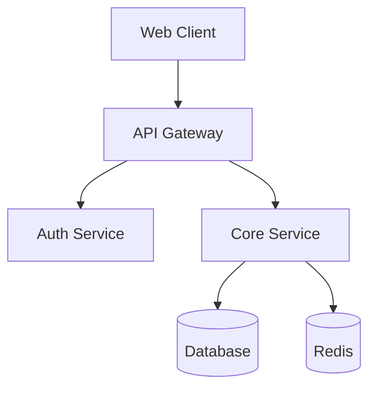

# Module 4: Generating Complete Code Documentation

## Duration: 5 hours

## Learning Objectives

By the end of this module, you will be able to:
- Generate architecture documentation with AI
- Create API reference documentation
- Produce setup guides and tutorials
- Review and improve AI-generated documentation

---

## 4.1 The Documentation Workflow

### Why Documentation Matters for QA

- Understand code before testing
- Identify test scenarios from specs
- Document test coverage
- Onboard team members faster

### Documentation Types

| Type | Purpose | Audience |
|------|---------|----------|
| Architecture | System overview | All engineers |
| API Reference | Endpoint details | Backend/QA |
| Setup Guide | Environment setup | New developers |
| Test Documentation | Test strategy | QA team |

> **Try It Now (3 min)**
> 
> Pick any small project you have access to and ask Claude:
> ```
> Analyze this codebase and give me a one-paragraph summary of:
> 1. What it does
> 2. The main technologies used
> 3. How the code is organized
> ```
> 
> This is the foundation of all documentation - AI can generate the first draft in seconds.

---

## 4.2 Architecture Documentation

### Prompt for Architecture Docs

```
Analyze this codebase and generate architecture documentation.

Create ARCHITECTURE.md with:

## 1. System Overview
- Purpose and business goals
- Key features
- Target users

## 2. Architecture Diagram
- Use Mermaid syntax
- Show all components
- Show data flow
- Include external services

## 3. Component Details
For each component:
- Purpose
- Technologies used
- Key files
- Dependencies
- API surface

## 4. Data Models
- Main entities with fields
- Relationships (ERD diagram)
- Database schema

## 5. Data Flow
- Request lifecycle
- Event processing
- Background jobs

## 6. Security Architecture
- Authentication method
- Authorization model
- Data protection

## 7. Deployment Architecture
- Infrastructure
- Environments
- CI/CD pipeline

Format as Markdown with Mermaid diagrams.
```

### Example Output Structure

```markdown
# Architecture Documentation

## System Overview
[Project Name] is a [type] application that [purpose].

## Architecture Diagram


## Components
### API Gateway
- **Purpose**: Route requests, rate limiting
- **Tech**: Express.js, helmet
- **Files**: `src/api/`
...
```

---

## 4.3 API Reference Documentation

### Prompt for API Docs

```
Generate API reference documentation for all endpoints.

For each endpoint include:

## [METHOD] [Path]

**Description**: What this endpoint does

**Authentication**: Required/Optional/None

**Request**:
- Headers
- Path parameters
- Query parameters
- Body schema with types

**Response**:
- Success (200/201)
- Client errors (400/401/403/404)
- Server errors (500)

**Example**:
```bash
curl -X METHOD URL \
  -H "Authorization: Bearer token" \
  -d '{"key": "value"}'
```

**Notes**: Rate limits, pagination, etc.

Generate for all public endpoints found in the codebase.
```

### OpenAPI/Swagger Generation

```
Generate OpenAPI 3.0 specification for this API.

Include:
- All endpoints with methods
- Request/response schemas
- Authentication schemes
- Example values
- Error responses

Output as YAML file.
```

---

## 4.4 Setup Guides

### Prompt for Setup Documentation

```
Create a comprehensive setup guide for new developers.

Include:

## Prerequisites
- Required software with versions
- Accounts needed
- Hardware requirements

## Quick Start (5 minutes)
- Fastest path to running the app
- Use Docker if available

## Development Setup
1. Clone repository
2. Install dependencies
3. Configure environment
4. Set up database
5. Run migrations
6. Start development server
7. Verify it works

## Environment Variables
| Variable | Description | Example | Required |
|----------|-------------|---------|----------|

## Common Tasks
- Run tests
- Build for production
- Deploy
- Debug

## Troubleshooting
- Common issues and solutions

Make it copy-paste friendly with all commands.
```

---

## 4.5 Test Documentation

### Prompt for Test Documentation

```
Generate test documentation for this project.

Create TEST-DOCUMENTATION.md with:

## Test Strategy
- Testing philosophy
- Test pyramid approach
- Coverage goals

## Test Structure
- Directory organization
- Naming conventions
- File patterns

## Running Tests
### All Tests
```bash
[command]
```

### By Type
- Unit: [command]
- Integration: [command]
- E2E: [command]

### With Coverage
```bash
[command]
```

## Writing Tests
- Required patterns
- Assertion style
- Mocking approach
- Test data management

## Test Utilities
- Available helpers
- Fixtures
- Factories

## CI Integration
- When tests run
- Required checks
- Failure handling

## Best Practices
- Do's and Don'ts
- Common pitfalls
```

---

## 4.6 Documentation Quality Review

### Review Checklist

- [ ] **Accuracy**: Does it match the code?
- [ ] **Completeness**: Are all components covered?
- [ ] **Clarity**: Can a newcomer understand it?
- [ ] **Examples**: Are there working examples?
- [ ] **Up-to-date**: Does it reflect current state?
- [ ] **Formatting**: Is Markdown valid?
- [ ] **Diagrams**: Do Mermaid diagrams render?
- [ ] **Links**: Do internal links work?

### Improvement Prompt

```
Review this documentation for quality:

[paste documentation]

Check for:
1. Accuracy against actual code
2. Missing sections or details
3. Unclear explanations
4. Missing examples
5. Outdated information
6. Broken formatting

For each issue:
- Location
- Problem
- Suggested fix
```

---

## 4.7 Hands-On Exercises

### Exercise 4.1: Generate Architecture Docs

**Objective**: Create architecture documentation for a project

**Steps**:
1. Clone a project you haven't documented
2. Use the architecture prompt
3. Review and improve the output
4. Add any missing components
5. Verify Mermaid diagrams render

**Deliverable**: Complete ARCHITECTURE.md

**Time**: 60 minutes

---

### Exercise 4.2: Create API Reference

**Objective**: Document all API endpoints

**Steps**:
1. Identify all API routes in the project
2. Use the API documentation prompt
3. Add examples for each endpoint
4. Include error responses
5. Test examples with curl

**Deliverable**: Complete API-REFERENCE.md

**Time**: 45 minutes

---

### Exercise 4.3: Write Setup Guide

**Objective**: Create a setup guide a new developer can follow

**Steps**:
1. Use the setup guide prompt
2. Actually follow the guide yourself
3. Note any missing steps
4. Add troubleshooting for issues you hit
5. Have someone else test it

**Deliverable**: Complete SETUP.md that works

**Time**: 45 minutes

---

## Knowledge Check

1. What are the four main types of documentation?
2. Why is architecture documentation important for QA?
3. What should an API endpoint doc include?
4. How do you verify documentation accuracy?
5. What makes a good setup guide?

---

## Summary

In this module, you learned:
- How to generate architecture documentation
- How to create API reference docs
- How to write setup guides
- How to document test strategies
- How to review documentation quality

---

## Next Steps

Proceed to **Module 5: Creating Test Plans with AI** to learn systematic test planning.

---

## Common Mistakes

Avoid these frequent errors when generating documentation with AI:

### 1. Publishing Without Verification
**Wrong**: AI generates ARCHITECTURE.md, you commit it directly without reading.
**Why it fails**: AI makes assumptions. It might describe components that don't exist, miss critical services, or get relationships wrong.
**Correct**: Treat AI docs as a first draft. Verify every claim against the actual codebase. Test the Mermaid diagrams render correctly.

### 2. Outdated Documentation
**Wrong**: Generating docs once and never updating them.
**Why it fails**: Code changes, docs don't. Within weeks, your beautiful architecture doc describes a system that no longer exists.
**Correct**: Regenerate docs when architecture changes. Add "Last updated" dates. Include doc updates in your PR checklist.

### 3. Copy-Paste API Examples Without Testing
**Wrong**: AI generates curl examples, you include them in docs without running them.
**Why it fails**: The endpoints might be wrong, authentication might be missing, request bodies might have incorrect fields.
**Correct**: Actually run every curl example. Verify responses match what you documented.

### 4. Too Much Detail
**Wrong**: 50-page architecture doc covering every utility function.
**Why it fails**: Nobody reads it. The important information is buried in noise. Maintenance becomes impossible.
**Correct**: Layer your documentation. High-level overview for everyone, detailed specs only where needed. Link to code for details.

### 5. No Examples
**Wrong**: API docs that describe endpoints but don't show how to call them.
**Why it fails**: Developers learn by example. Abstract descriptions don't stick.
**Correct**: Every API endpoint needs at least one working curl/code example. Every config section needs sample values.

### 6. Mermaid Diagrams That Don't Render
**Wrong**: Fancy Mermaid diagrams that look great in AI output but break in GitHub/GitLab.
**Why it fails**: Different Mermaid versions have different syntax. Not all features work everywhere.
**Correct**: Preview diagrams in your actual platform. Keep them simple. Test that they render after commit.

### 7. Setup Guide That Only Works on Your Machine
**Wrong**: "Just run `npm start`" when there are 15 environment variables to configure.
**Why it fails**: New developers spend hours debugging setup. They blame themselves when the docs are the problem.
**Correct**: Follow your own setup guide on a fresh machine (or have a new team member try it). Document every gotcha you hit.

---

## Module Progress

Track your completion:

- [ ] Read through all lesson content
- [ ] Completed hands-on exercises
- [ ] Passed module quiz (70%+)
- [ ] Can explain key concepts without notes
