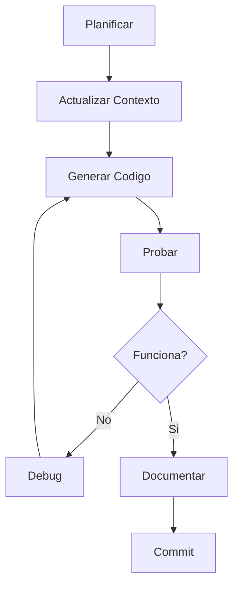

# Modulo 06: Patrones de Flujo de Trabajo

## Objetivo
Aprender patrones probados para trabajar eficientemente con IA en diferentes escenarios de desarrollo: nuevas features, correccion de bugs y refactorizacion.

## Patron 1: Desarrollo de Features

Proceso sistematico para implementar nuevas funcionalidades.



**Pasos:**
1. **Planificar**: Definir que hace la feature y sus criterios de aceptacion
2. **Contexto**: Actualizar CLAUDE.md con la nueva feature
3. **Generar**: Pedir a OpenCode la implementacion
4. **Probar**: Verificar que funciona como esperado
5. **Documentar**: Actualizar README y comentarios
6. **Commit**: Guardar cambios con mensaje descriptivo

## Patron 2: Correccion de Bugs

Proceso para identificar y corregir errores de forma eficiente.

**Pasos:**
1. **Reproducir**: Confirmar el bug y obtener mensaje de error exacto
2. **Aislar**: Identificar archivo y linea donde ocurre
3. **Explicar**: Describir a OpenCode: error, contexto, y comportamiento esperado
4. **Corregir**: Aplicar la solucion propuesta
5. **Verificar**: Confirmar que el bug esta resuelto
6. **Prevenir**: Agregar test para evitar regresion

**Ejemplo de prompt:**
```
Error: "TypeError: Cannot read property 'map' of undefined" en linea 45 de usuarios.js.
La funcion recibe un array de usuarios pero a veces llega undefined.
Corrige agregando validacion y manejo del caso vacio.
```

## Patron 3: Refactorizacion

Proceso para mejorar codigo existente sin cambiar funcionalidad.

**Pasos:**
1. **Asegurar**: Verificar que hay tests (o crearlos primero)
2. **Identificar**: Definir que mejorar (duplicacion, complejidad, nombres)
3. **Refactorizar**: Pedir cambios incrementales, uno a la vez
4. **Verificar**: Correr tests despues de cada cambio
5. **Revisar**: Confirmar que la funcionalidad no cambio

**Regla de oro**: Nunca refactorizar y agregar features al mismo tiempo.

## Antipatrones (Que NO Hacer)

1. **Prompt gigante**: Pedir demasiado en un solo prompt. Mejor dividir en pasos.

2. **Ignorar errores**: Seguir adelante cuando algo falla. Siempre corregir antes de continuar.

3. **Sin contexto**: Esperar que OpenCode adivine tu proyecto. Siempre usar CLAUDE.md.

## Resumen de Patrones

| Escenario | Primer Paso | Clave |
|-----------|-------------|-------|
| Nueva Feature | Planificar | Actualizar contexto primero |
| Bug | Reproducir | Incluir error exacto en prompt |
| Refactor | Tests | Verificar despues de cada cambio |

## Quiz

1. **¿Cual es el primer paso antes de refactorizar codigo?**
   <details>
   <summary>Ver respuesta</summary>
   Asegurar que existen tests. Si no hay, crearlos primero para verificar que la funcionalidad no cambia.
   </details>

2. **¿Por que es malo pedir demasiado en un solo prompt?**
   <details>
   <summary>Ver respuesta</summary>
   Porque aumenta la probabilidad de errores, dificulta el debugging, y hace imposible verificar cada parte.
   </details>

3. **¿Que informacion debe incluir un prompt para corregir un bug?**
   <details>
   <summary>Ver respuesta</summary>
   El mensaje de error exacto, el archivo y linea donde ocurre, y el comportamiento esperado vs actual.
   </details>

## Conclusion

Has completado los Fundamentos Principales. Ahora tienes:
- OpenCode instalado y configurado
- Conocimiento de MCPs, Skills, Hooks y Rules
- Dominio del marco CERO para prompts
- Archivos de contexto para tus proyectos
- Patrones de trabajo profesionales

**Siguiente paso**: Elegir tu track de especializacion en la Semana 2.
