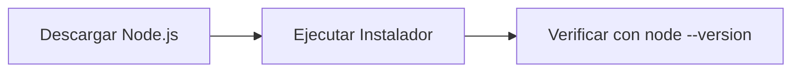

# Módulo 01: Instalación del Stack de IA

## Objetivo y Duración
**Objetivo**: Configurar tu entorno de trabajo con OpenCode y Oh My OpenCode para comenzar a utilizar IA en tus proyectos.
**Duración**: 2 horas (estimado).

## Requisitos Previos
Antes de comenzar, asegúrate de cumplir con los requisitos técnicos detallados en la guía de prerrequisitos del curso. Necesitarás una computadora con Windows, Mac o Linux, conexión a internet y una cuenta de correo activa.

## Parte 1: Instalar Node.js
Node.js es el entorno de ejecución necesario para que las herramientas de este curso funcionen.

### Paso 1: Descarga e Instalación
1. Ve a [nodejs.org](https://nodejs.org).
2. Descarga la versión **LTS** recomendada para tu sistema operativo.
3. Ejecuta el instalador y sigue las instrucciones, manteniendo las opciones por defecto.

### Paso 2: Verificación
Abre una terminal (PowerShell en Windows o Terminal en Mac/Linux) y ejecuta:
```bash
node --version
```
Deberías ver una versión v18 o superior.



## Parte 2: Instalar OpenCode
OpenCode es tu asistente de IA principal que funciona directamente desde la terminal.

### Paso 1: Instalación Global
En tu terminal, ejecuta el siguiente comando:
```bash
npm install -g opencode
```

### Paso 2: Configuración del Proveedor
OpenCode necesita conectarse a un modelo de IA. Configúralo con el proveedor indicado por tu instructor (ejemplo con Anthropic):
```bash
opencode configure --provider anthropic
```

### Paso 3: Verificación de Conexión
Verifica que OpenCode esté listo para usarse:
```bash
opencode status
opencode "Hola, ¿estás funcionando? Responde en español."
```

## Parte 3: Instalar Oh My OpenCode
Oh My OpenCode (OMO) añade "superpoderes" a OpenCode, como agentes especializados y automatizaciones.

### Paso 1: Instalación
Ejecuta el siguiente comando en la terminal:
```bash
npm install -g oh-my-opencode
```

### Paso 2: Inicialización
Prepara el entorno de OMO con:
```bash
omo init
```

## Parte 4: Primer Proyecto (Calculadora)
Vamos a crear una herramienta real usando tu nuevo stack de IA.

1. **Crear carpeta**:
   ```bash
   mkdir mi-calculadora
   cd mi-calculadora
   ```

2. **Generar código con IA**:
   ```bash
   opencode chat "Crea una calculadora simple en JavaScript con funciones de suma, resta, multiplicación y división. Incluye un archivo README.md en español."
   ```

3. **Probar la calculadora**:
   Crea un archivo de prueba o pide a OpenCode que lo haga:
   ```bash
   opencode chat "Crea un archivo prueba.js para probar las funciones de la calculadora."
   node prueba.js
   ```

## Verificación Final
Asegúrate de haber completado todos los puntos:
- [ ] `node --version` muestra v18+
- [ ] `opencode status` muestra "Connected"
- [ ] `omo --version` muestra la versión instalada
- [ ] El proyecto de la calculadora se generó correctamente

## Solución de Problemas
1. **"comando no encontrado"**: Cierra y vuelve a abrir tu terminal.
2. **Error de conexión**: Reintenta `opencode configure --provider [proveedor]`.
3. **Permisos en Windows**: Ejecuta PowerShell como Administrador si la instalación de npm falla.
4. **Versión de Node antigua**: Desinstala Node.js y descarga la versión LTS más reciente.
5. **IA responde en inglés**: Añade "Responde siempre en español" a tus peticiones.

## Quiz de Evaluación

<details>
<summary><b>1. ¿Cuál es el orden correcto de instalación del stack?</b></summary>
<blockquote>Node.js → OpenCode → Oh My OpenCode</blockquote>
</details>

<details>
<summary><b>2. ¿Qué comando se utiliza para verificar la conexión de OpenCode?</b></summary>
<blockquote><code>opencode status</code></blockquote>
</details>

<details>
<summary><b>3. ¿Es necesario instalar OpenCode antes que Oh My OpenCode?</b></summary>
<blockquote>Sí, Oh My OpenCode es una extensión que requiere la base de OpenCode para funcionar.</blockquote>
</details>

## Siguiente Módulo
[Módulo 02: Dominio de Configuración](./02-maestria-configuracion.md)
