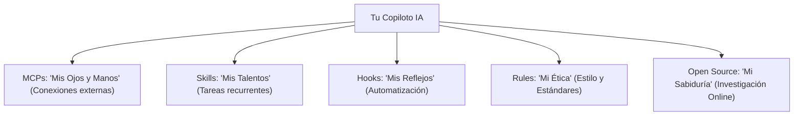

# Módulo 02: Maestría de Configuración con IA

> [!WARNING]
> **SI ESTÁS USANDO LA TERMINAL DE FORMA MANUAL, TE HAS EQUIVOCADO DE SIGLO.**
> A estas alturas, ya tienes a OpenCode instalado. A partir de este punto, cualquier edición de archivos `.json`, `.yaml` o instalaciones de MCPs debe ser realizada **exclusivamente** a través de la IA. Si tocas la terminal para configurar, estás perdiendo el tiempo.

## Objetivo y Filosofía

**Objetivo**: Delegar la configuración técnica y la inteligencia estratégica de tu entorno (MCPs, Skills, Hooks y Rules) a tu Copiloto IA, transformando pasos manuales en una conversación de alto nivel.

En esta nueva era, no instalamos manualmente; **describimos metas y pedimos investigación**. Tu trabajo es pedirle a la IA que busque las mejores prácticas de la comunidad Open Source y que las aplique para que tu proyecto no solo funcione, sino que sea de vanguardia.

## Los 4 Pilares de la Omnipotencia

La configuración reside en `~/.opencode/`, pero tú no necesitas navegar allí. Solo necesitas conocer el concepto:

---

## Parte 1: MCPs (Model Context Protocol)

_Los MCPs le dan a la IA acceso a tu mundo real (archivos, bases de datos)._

**Estrategia IA:** En lugar de buscar comandos de instalación, pídele a la IA que se "conecte" a lo que necesite.

> **Prompt Maestro:**
> "Busca online qué MCPs son tendencia en la comunidad open source para [Tipo de Proyecto]. Analiza nuestro repositorio actual y detecta TODAS las integraciones que nos faltan. No hagas lo mínimo: prepara, instala y configura CADA conector que pueda hacerme más productivo, desde acceso a archivos hasta integración con APIs externas y base de datos. Explícame el ecosistema completo que acabas de montar."

**¿Qué hará la IA?**

1. Escanea el mundo exterior por lo último en conectividad.
2. Audita tu proyecto para detectar puntos ciegos.
3. Implementa una infraestructura completa y robusta de MCPs, no solo un ejemplo.
4. Procede a instalarlos y configurarlos por ti.

### Ejemplo de Ejecución (OpenCode)

Así es como luce la "mente" de la IA cuando empieza a trabajar en tu entorno tras recibir un Prompt Maestro:

> **Thinking:** El usuario está pidiendo MCPs para un "Tipo de Proyecto" pero no especificó cuál. Veo que el repositorio actual parece ser un proyecto educativo con cursos y recursos compartidos. Veo que ya tiene algunos MCPs configurados en `.claude/mcp/`.
>
> **# Todos**
>
> - [•] Instalar y configurar MCP Servers de Web Search (DuckDuckGo, Brave, Context7)
> - [ ] Instalar y configurar MCP Servers de Databases (PostgreSQL, Qdrant, Redis)
> - [ ] Instalar y configurar MCP Servers de GitHub/Git avanzados
> - [ ] Instalar y configurar MCP Servers de Data Analytics (SQLite, Jupyter)
> - [ ] Instalar y configurar MCP Servers de Productividad (Notion, Slack, Fetch)
> - [ ] Crear documentación completa del ecosistema MCP configurado
> - [ ] Actualizar `settings.local.json` con todas las configuraciones

---

## Parte 2: Skills

_Recetas para que la IA haga tareas complejas en un solo paso._

**Estrategia IA:** Cuando sientas que estás repitiendo una instrucción (como poner un encabezado), pídele a la IA que cree una solución escalable para el proyecto.

> **Prompt Maestro:**
> "Investiga en la comunidad senior qué automatizaciones ('Skills') son esenciales hoy. Luego, analiza profundamente mi flujo de trabajo en este proyecto. No te limites a una propuesta: prepara y crea CADA habilidad recurrente que el proyecto necesite para ser escalable, desde gestión de documentación hasta boilerplates técnicos complejos. Quiero un set de talentos listo para usar."

**¿Qué hará la IA?**

1. Desarrolla una biblioteca completa de Skills personalizada.
2. Asegura que cada Skill siga estándares profesionales externos.
3. Documenta y deja operativo todo el sistema de talentos en un solo flujo.

---

## Parte 3: Hooks

_Acciones automáticas que ocurren "por debajo"._

**Estrategia IA:** Pídele a la IA que se asegure de que las cosas siempre estén bien hechas y alineadas con la calidad del proyecto, sin que tú lo pidas.

> **Prompt Maestro:**
> "Busca las mejores prácticas de CI/CD local en los repositorios más exitosos del mundo. Configura en este proyecto TODO el sistema de Hooks necesario para que el código sea impecable. No instales solo Prettier: piensa en seguridad, optimización de commits, validaciones cruzadas y todo lo que un entorno de alta performance requiere. Deja el proyecto blindado automáticamente."

**¿Qué hará la IA?**

1. Diseña una red de protección y automatización de archivos.
2. Instala dependencias y configura disparadores en múltiples niveles.
3. Garantiza que el proyecto funcione solo, siguiendo estándares globales.

---

## Parte 4: Rules

_Instrucciones de alto nivel que la IA nunca debe olvidar._

**Estrategia IA:** Define tu "personalidad de equipo" de forma dinámica basándote en la evolución del código.

> **Prompt Maestro:**
> "Cruza los estándares de Google, Airbnb y Microsoft con las necesidades reales de este repositorio. Crea un ecosistema de Reglas (`rules.yaml`) que sea exhaustivo. Quiero que definas mi forma de trabajar desde la arquitectura hasta el detalle más pequeño basado en la elite del Open Source. Configúralo todo para que actúes como el Lead Architect del proyecto."

**¿Qué hará la IA?**

1. Codifica una 'Constitución' técnica completa para tu proyecto.
2. Se alinea con los estándares corporativos más altos del mundo.
3. Proactivamente sugiere cambios estructurales basados en estas reglas.

---

## Verificación: La Gran Prueba

En lugar de marcar casillas manuales, pídele a la IA un reporte de estado:

> **Prompt de Verificación:**
> "Analiza mi configuración actual de MCPs, Skills, Hooks y Rules. ¿Está todo listo para empezar a programar siguiendo los estándares de FPUNA? Hazme un resumen de lo que tienes configurado y por qué es importante para mi productividad."

## Solución de Problemas (Vía Chat)

Si algo falla, no busques en Google. Pregúntale a tu socio:

- _"IA, veo que el MCP de Github no está respondiendo. ¿Puedes diagnosticar por qué y arreglarlo?"_
- _"El Hook de formateo no se disparó. Revisa mis archivos de configuración y corrígelos."_

---

## Siguiente Módulo

[Módulo 03: Ingeniería de Prompts](./03-ingenieria-prompts.md)
