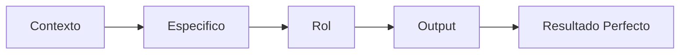

# Modulo 03: Ingenieria de Prompts

## Objetivo
Dominar el arte de escribir prompts efectivos utilizando el marco CERO para obtener resultados precisos y profesionales de la IA en una sola iteración.

## Marco CERO
El marco **CERO** es la estructura fundamental para comunicarte con OpenCode:

- **C - Contexto**: Explica la situación, el problema y por qué necesitas la solución.
- **E - Especifico**: Define exactamente qué debe hacer (tecnologías, nombres, lógica).
- **R - Rol**: Asigna una identidad experta a la IA (ej: "Actúa como Senior Developer").
- **O - Output**: Especifica el formato, estructura de archivos y estilo de entrega.

## Ejemplos de Prompts

### 1. Validación de Email
*   **Malo**: "Valida un email en JS."
*   **Bueno (CERO)**: "Actúa como experto en seguridad. Crea una función `validateEmail(email)` en JavaScript que use regex estricto. Debe retornar un objeto `{valid: boolean, reason: string}` con mensajes en español. Incluye 5 casos de prueba con Jest."

### 2. Refactorización de Código
*   **Malo**: "Mejora este código."
*   **Bueno (CERO)**: "Actúa como Senior Developer. Refactoriza la siguiente función para reducir su complejidad ciclomática. Aplica el principio DRY y extrae la lógica de base de datos a un helper. Mantén la funcionalidad original intacta."

### 3. Generación de Reportes
*   **Malo**: "Hazme un reporte de ventas."
*   **Bueno (CERO)**: "Actúa como Analista de Datos. Genera un reporte de ventas mensuales en formato Markdown. Usa tablas para el detalle por producto y resalta el 'Top 3' con negritas. Los montos deben estar en Guaraníes (₲) con separadores de miles."

## Tecnicas Avanzadas

**Chain of Thought (CoT)**: Consiste en pedir a la IA que "piense en voz alta". Al solicitar que explique su razonamiento paso a paso antes de dar la respuesta final, se reducen errores lógicos y se facilita la verificación del resultado.

**Few-Shot Learning**: Proporciona 2 o 3 ejemplos reales de entrada y salida antes de pedir la tarea. Esto ayuda a la IA a entender patrones complejos, estilos de escritura o formatos de datos muy específicos que son difíciles de describir solo con palabras.

**Role Prompting**: Asignar un rol (ej: "Profesor de FPUNA", "Auditor de Seguridad") cambia el tono, el nivel de detalle y las prioridades de la IA. Un "Senior Dev" priorizará la mantenibilidad, mientras que un "Estudiante" buscará simplicidad.

## Errores Comunes
1. **Ambigüedad**: Usar términos como "hazlo mejor" o "que sea rápido" sin métricas claras.
2. **Sobrecarga**: Pedir demasiadas tareas complejas en un solo prompt (mejor dividir).
3. **Falta de Restricciones**: No decir qué "no hacer" (ej: "no uses librerías externas").
4. **Ignorar el Formato**: No especificar si quieres JSON, Markdown o un archivo específico.
5. **Sin Contexto**: Omitir para quién es el código o dónde se ejecutará.

> **⚠️ Importante**: Además de estos errores de prompting, existen limitaciones inherentes de la IA que debes conocer (alucinaciones, sesgos, restricciones de contexto). Estos temas se abordan en detalle en los tracks especializados, especialmente en `01-DESARROLLO-SOFTWARE/starter-kit/COMMON-MISTAKES.md`.

## Ideas de Practica
1. **Conversor de Moneda**: Prompt para un sistema que convierta Gs a USD con validación de API.
2. **Gestor de Tareas**: Crear un CRUD básico en Python con persistencia en JSON.
3. **Analizador de Notas**: Sistema que reciba un array de alumnos y devuelva estadísticas.
4. **Generador de README**: Prompt que tome un código y genere documentación profesional.
5. **Buscador de Archivos**: Script que organice archivos por extensión con logs detallados.

## Quiz
1. **¿Qué significa la 'E' en el marco CERO?**
   

   
Ver respuesta

   **Especifico**: Definir con precisión técnica qué debe hacer la IA.
   

2. **¿Para qué sirve la técnica 'Few-Shot'?**
   

   
Ver respuesta

   Para enseñar a la IA un patrón o formato específico mediante ejemplos antes de la tarea.
   

3. **¿Por qué es importante el Contexto?**
   

   
Ver respuesta

   Porque permite a la IA entender el 'por qué' y ajustar la solución a las necesidades reales del entorno.
   

## Siguiente Modulo
[Modulo 04: Ingenieria de Contexto](./04-ingenieria-contexto.md)
