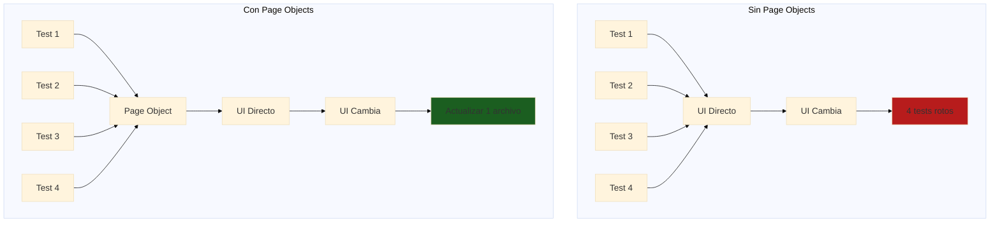
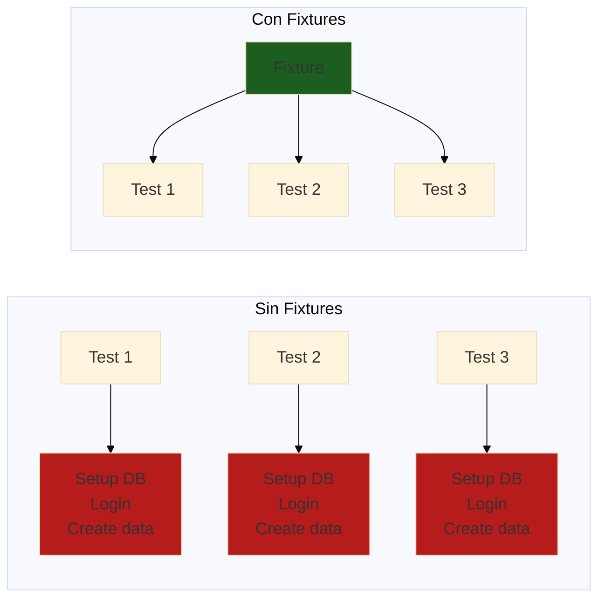

# Módulo 03: Arquitectura de Pruebas y Organización

## Resumen General

Construir frameworks de automatización de pruebas escalables y mantenibles requiere bases arquitectónicas sólidas. Este módulo te enseña a diseñar e implementar arquitecturas de pruebas profesionales usando patrones probados como Page Object Model, fixtures personalizadas y utilidades reutilizables.

**Duración**: 4 horas  
**Nivel**: Intermedio  
**Prerrequisitos**: Módulos 01 y 02 completados

---

## Objetivos de Aprendizaje

Al finalizar este módulo, serás capaz de:

1. Implementar el patrón Page Object Model (POM) para pruebas web
2. Crear fixtures personalizadas y funciones helper para reutilización
3. Diseñar estrategias efectivas de gestión de datos de prueba
4. Configurar ejecución de pruebas en múltiples ambientes
5. Organizar archivos y directorios de pruebas para escalabilidad
6. Aplicar principios SOLID al código de automatización de pruebas

---

## Por Qué Importa la Arquitectura de Pruebas

### Problemas de Mala Arquitectura

```
❌ Código duplicado entre pruebas
❌ Difícil de mantener cuando cambia la UI
❌ Pruebas frágiles que se rompen fácilmente
❌ Ejecución lenta de pruebas
❌ Difícil incorporar nuevos miembros al equipo
❌ Sin estructura o convenciones claras
```

### Beneficios de Buena Arquitectura

```
✅ Código DRY (Don't Repeat Yourself - No te repitas)
✅ Cambios en un lugar afectan todas las pruebas
✅ Pruebas resilientes que se adaptan a cambios
✅ Ejecución rápida y paralelizable
✅ Fácil incorporación con patrones claros
✅ Código base profesional y listo para producción
```

### Impacto en el Mundo Real

| Métrica | Mala Arquitectura | Buena Arquitectura |
|---------|-------------------|-------------------|
| **Tiempo de Mantenimiento de Pruebas** | 40% del tiempo de QA | 10% del tiempo de QA |
| **Creación de Nueva Prueba** | 2-4 horas | 30 minutos |
| **Impacto de Cambio en UI** | 50+ archivos por actualizar | 1-2 archivos por actualizar |
| **Tiempo de Incorporación** | 2-3 semanas | 3-5 días |
| **Estabilidad de Pruebas** | 60-70% tasa de éxito | 95%+ tasa de éxito |

---

## Estructura del Módulo

Este módulo está dividido en 5 secciones completas:

### [01 - Page Object Model](./tutorials/01-modelo-objeto-pagina.md)
**Duración**: 60 minutos

Aprende el patrón estándar de la industria para organizar código de pruebas UI:
- Qué es Page Object Model y por qué usarlo
- Implementando Page Objects en Playwright
- Patrón Component Object para elementos UI reutilizables
- Patrones avanzados de POM (herencia, composición)
- Ejemplos del mundo real de aplicaciones e-commerce

**Conceptos Clave**: Encapsulación, separación de responsabilidades, reusabilidad

---

### [02 - Fixtures y Helpers Personalizados](./tutorials/02-fixtures-personalizadas.md)
**Duración**: 45 minutos

Domina el sistema de fixtures de Playwright y crea utilidades de prueba poderosas:
- Entendiendo los fixtures de Playwright
- Creando fixtures personalizadas para autenticación, datos y más
- Funciones helper y utilidades de prueba
- Composición de fixtures y dependencias
- Manejo de alcance y ciclo de vida

**Conceptos Clave**: Principio DRY, setup/teardown de pruebas, contexto compartido

**📖 Tutorial**: [02-fixtures-personalizadas.md](./tutorials/02-fixtures-personalizadas.md)  
**🤖 Prompt de OpenCode**: [01-prompt-fixtures.md](./examples/01-prompt-fixtures.md)

---

### [03 - Gestión de Datos de Prueba](./tutorials/03-gestion-datos-prueba.md)
**Duración**: 45 minutos

Diseña estrategias para gestionar datos de prueba efectivamente:
- Generación de datos de prueba vs. fixtures estáticos
- Seeding y limpieza de base de datos
- Patrón Factory para datos de prueba
- Integración de Faker.js para datos realistas
- Aislamiento de datos entre pruebas

**Conceptos Clave**: Independencia de pruebas, data factories, estrategias de seeding

**📖 Tutorial**: [03-gestion-datos-prueba.md](./tutorials/03-gestion-datos-prueba.md)  
**🤖 Prompt de OpenCode**: [02-prompt-generacion-datos.md](./examples/02-prompt-generacion-datos.md)

---

### [04 - Configuración Multi-Ambiente](./tutorials/04-configuracion-multi-ambiente.md)
**Duración**: 45 minutos

Configura pruebas para ejecutarse en diferentes ambientes:
- Configuraciones específicas por ambiente
- Gestión de credenciales y secretos
- URL base y endpoints de API dinámicos
- Feature flags y pruebas condicionales
- Ambientes local vs. CI vs. producción

**Conceptos Clave**: Abstracción de ambiente, gestión de configuración, seguridad

**📖 Tutorial**: [04-configuracion-multi-ambiente.md](./tutorials/04-configuracion-multi-ambiente.md)  
**🤖 Prompt de OpenCode**: [03-prompt-configuracion-ambiente.md](./examples/03-prompt-configuracion-ambiente.md)

---

### [05 - Paralelización y Performance](./tutorials/05-paralelizacion.md)
**Duración**: 45 minutos

Optimiza la velocidad de ejecución de pruebas con paralelización:
- Entendiendo paralelización de pruebas en Playwright
- Configuración y manejo de workers
- Aislamiento de pruebas e independencia de datos
- Estrategias de sharding para CI/CD
- Técnicas de optimización de performance

**Conceptos Clave**: Concurrencia, performance, escalabilidad

---

## Lo Que Construirás

A lo largo de este módulo, construirás un **framework de pruebas listo para producción** para una aplicación e-commerce con:

### Estructura del Proyecto
```
e-commerce-tests/
├── tests/
│   ├── auth/
│   │   ├── login.spec.ts
│   │   └── registration.spec.ts
│   ├── products/
│   │   ├── browse.spec.ts
│   │   └── search.spec.ts
│   └── checkout/
│       ├── cart.spec.ts
│       └── payment.spec.ts
├── pages/
│   ├── LoginPage.ts
│   ├── ProductsPage.ts
│   ├── CartPage.ts
│   └── CheckoutPage.ts
├── components/
│   ├── Header.ts
│   ├── ProductCard.ts
│   └── Modal.ts
├── fixtures/
│   ├── auth.ts
│   ├── products.ts
│   └── database.ts
├── helpers/
│   ├── data-factory.ts
│   ├── api-helpers.ts
│   └── utils.ts
├── config/
│   ├── environments.ts
│   └── test-config.ts
├── playwright.config.ts
└── README.md
```

### Características
- ✅ Page Object Model para todas las páginas
- ✅ Component Objects para elementos UI reutilizables
- ✅ Fixtures personalizadas para auth y datos
- ✅ Data factories para generación de datos de prueba
- ✅ Soporte multi-ambiente (local, staging, producción)
- ✅ Organización completa de pruebas
- ✅ TypeScript en todo el proyecto
- ✅ 100+ pruebas demostrando patrones

---

## Verificación de Prerrequisitos

Antes de comenzar, asegúrate de tener:

### Prerrequisitos de Conocimiento
- ✅ Módulo 01 completado (Playwright Avanzado)
- ✅ Módulo 02 completado (API Testing)
- ✅ Comprensión básica de TypeScript/JavaScript
- ✅ Familiaridad con patrones async/await

### Prerrequisitos Técnicos
- ✅ Node.js v18+ instalado
- ✅ Playwright instalado y configurado
- ✅ VS Code o editor similar
- ✅ Git para control de versiones

### Verifica Tu Setup

Ejecuta estos comandos para verificar:

```bash
# Verificar versión de Node.js
node --version  # Debe ser v18 o superior

# Verificar instalación de Playwright
npx playwright --version

# Crear nuevo proyecto de pruebas
npm init playwright@latest test-architecture-demo

# Ejecutar prueba de ejemplo
cd test-architecture-demo
npx playwright test
```

---

## Enfoque de Aprendizaje

Este módulo usa una **metodología de construcción conjunta**:

1. **Aprende**: Lee conceptos y patrones
2. **Observa**: Revisa ejemplos de código completos
3. **Construye**: Implementa el patrón tú mismo
4. **Practica**: Completa los ejercicios
5. **Reflexiona**: Responde las preguntas del quiz

### Ritmo Recomendado

| Sección | Lectura | Código | Total |
|---------|---------|--------|-------|
| Sección 01 | 20 min | 40 min | 60 min |
| Sección 02 | 15 min | 30 min | 45 min |
| Sección 03 | 15 min | 30 min | 45 min |
| Sección 04 | 15 min | 30 min | 45 min |
| Sección 05 | 15 min | 30 min | 45 min |
| **Total** | **80 min** | **160 min** | **240 min (4h)** |

---

## Aprendizajes Clave

Después de completar este módulo, entenderás:

### Patrones de Diseño
- **Page Object Model**: Organización estándar de la industria para pruebas UI
- **Component Objects**: Abstracciones reutilizables de elementos UI
- **Factory Pattern**: Generación dinámica de datos de prueba
- **Fixture Pattern**: Contexto compartido y setup de pruebas

### Mejores Prácticas
- **Principio DRY**: No te repitas (Don't Repeat Yourself)
- **Responsabilidad Única**: Una clase, un propósito
- **Separación de Responsabilidades**: Lógica de prueba vs. lógica de página
- **Gestión de Configuración**: Settings específicos por ambiente

### Habilidades Profesionales
- **Organización de Código**: Estructuras de directorios escalables
- **Documentación**: READMEs claros y comentarios de código
- **Mantenibilidad**: Fácil de actualizar y extender
- **Colaboración en Equipo**: Convenciones y patrones compartidos

---

## Aplicaciones del Mundo Real

Estos patrones son usados por:

### Empresas
- **Google**: Uso extensivo de Page Objects en testing de Angular
- **Microsoft**: El propio test suite de Playwright usa estos patrones
- **Netflix**: Fixtures personalizadas para escenarios de prueba complejos
- **Amazon**: Data factories para testing de productos

### Proyectos Open Source
- **Ejemplos de documentación de Playwright**: Muestra el patrón POM
- **Testing Library**: Enfoque de testing basado en componentes
- **Cypress Real-World App**: Ejemplo completo de arquitectura

### Tu Carrera
- **Requerido para roles Senior de QA**: Conocimiento de arquitectura es esencial
- **Preguntas de Entrevista**: Espera preguntas sobre POM y patrones
- **Proyectos de Portfolio**: Demuestra organización profesional de pruebas
- **Liderazgo de Equipo**: Guía a QAs junior en mejores prácticas

---

## Métricas de Éxito

Sabrás que has dominado este módulo cuando puedas:

- [ ] Explicar los beneficios de Page Object Model a un colega
- [ ] Implementar un Page Object desde cero en menos de 15 minutos
- [ ] Crear fixtures personalizadas para escenarios de prueba complejos
- [ ] Diseñar una estrategia de datos de prueba para un nuevo proyecto
- [ ] Configurar ejecución de pruebas en múltiples ambientes
- [ ] Organizar un proyecto de pruebas con 50+ archivos de prueba
- [ ] Revisar código de pruebas e identificar problemas arquitectónicos
- [ ] Refactorizar pruebas frágiles usando estos patrones

---

## Recursos Adicionales

### Documentación Oficial
- [Playwright Best Practices](https://playwright.dev/documentacion/best-practices)
- [Playwright Fixtures Guide](https://playwright.dev/documentacion/test-fixtures)
- [Playwright Page Object Models](https://playwright.dev/documentacion/pom)

### Recursos de la Comunidad
- [Playwright GitHub Discussions](https://github.com/microsoft/playwright/discussions)
- [Awesome Playwright](https://github.com/mxschmitt/awesome-playwright)

### Libros y Artículos
- "Growing Object-Oriented Software, Guided by Tests" - Freeman & Pryce
- "xUnit Test Patterns" - Gerard Meszaros
- Artículos de Martin Fowler sobre patrones de testing

---

## Empezando

¿Listo para construir arquitecturas de pruebas profesionales? ¡Comencemos!

**👉 Comienza con [Sección 01: Page Object Model](./tutorials/01-modelo-objeto-pagina.md)**

---

---

## 🏗️ Sección 1: Page Object Model (POM) en Profundidad

### Concepto: Encapsulación de la UI

**Analogía**: Como tener un manual de instrucciones para cada sección de tu casa.



### Ejemplo Real: Sistema de Inscripciones FPUNA

**Sin Page Object** (código duplicado):
```typescript
// login.spec.ts
test('login exitoso', async ({ page }) => {
  await page.goto('https://inscripciones.fpuna.edu.py');
  await page.locator('#email-input').fill('juan@fpuna.edu.py');
  await page.locator('#password-input').fill('Password123!');
  await page.locator('button[type="submit"]').click();
  await expect(page.locator('.dashboard')).toBeVisible();
});

// enrollment.spec.ts
test('inscribirse a materia', async ({ page }) => {
  // ❌ Código duplicado
  await page.goto('https://inscripciones.fpuna.edu.py');
  await page.locator('#email-input').fill('juan@fpuna.edu.py');
  await page.locator('#password-input').fill('Password123!');
  await page.locator('button[type="submit"]').click();
  
  // Lógica de inscripción...
});
```

**Problema**: Si cambia el selector `#email-input` → 20+ archivos a actualizar 😱

**Con Page Object** (reutilizable):
```typescript
// pages/LoginPage.ts
import { Page, Locator } from '@playwright/test';

export class LoginPage {
  readonly page: Page;
  readonly emailInput: Locator;
  readonly passwordInput: Locator;
  readonly submitButton: Locator;
  readonly errorMessage: Locator;

  constructor(page: Page) {
    this.page = page;
    this.emailInput = page.locator('[data-testid="email"]');
    this.passwordInput = page.locator('[data-testid="password"]');
    this.submitButton = page.locator('[data-testid="login-button"]');
    this.errorMessage = page.locator('.error-toast');
  }

  /**
   * Navegar a la página de login
   */
  async goto() {
    await this.page.goto('https://inscripciones.fpuna.edu.py/login');
    await this.page.waitForLoadState('networkidle');
  }

  /**
   * Login con credenciales
   * @param email - Email del usuario
   * @param password - Contraseña
   */
  async login(email: string, password: string) {
    await this.emailInput.fill(email);
    await this.passwordInput.fill(password);
    await this.submitButton.click();
  }

  /**
   * Login como estudiante (datos por defecto)
   */
  async loginAsStudent() {
    await this.login('estudiante@fpuna.edu.py', 'Password123!');
  }

  /**
   * Login como admin
   */
  async loginAsAdmin() {
    await this.login('admin@fpuna.edu.py', 'Admin123!');
  }

  /**
   * Verificar mensaje de error
   */
  async getErrorMessage(): Promise<string> {
    return await this.errorMessage.textContent() || '';
  }

  /**
   * Verificar que estamos en dashboard (login exitoso)
   */
  async expectLoginSuccess() {
    await this.page.waitForURL(/.*dashboard/);
  }
}
```

**Uso en tests**:
```typescript
// login.spec.ts
import { test, expect } from '@playwright/test';
import { LoginPage } from '../pages/LoginPage';

test.describe('Login de Usuario', () => {
  let loginPage: LoginPage;

  test.beforeEach(async ({ page }) => {
    loginPage = new LoginPage(page);
    await loginPage.goto();
  });

  test('login exitoso con credenciales válidas', async () => {
    await loginPage.loginAsStudent();
    await loginPage.expectLoginSuccess();
  });

  test('muestra error con email inválido', async () => {
    await loginPage.login('invalido', 'Password123!');
    const error = await loginPage.getErrorMessage();
    expect(error).toContain('Email inválido');
  });

  test('muestra error con contraseña incorrecta', async () => {
    await loginPage.login('juan@fpuna.edu.py', 'WrongPassword');
    const error = await loginPage.getErrorMessage();
    expect(error).toContain('Contraseña incorrecta');
  });
});
```

✅ **Beneficio**: Si cambia el selector → actualizar **solo LoginPage.ts**

### POM Avanzado: Base Page Pattern

```typescript
// pages/BasePage.ts
import { Page, Locator } from '@playwright/test';

/**
 * Clase base para todos los Page Objects
 * Contiene funcionalidades comunes
 */
export abstract class BasePage {
  readonly page: Page;
  
  constructor(page: Page) {
    this.page = page;
  }

  /**
   * Esperar que un elemento sea visible
   */
  async waitForElement(locator: Locator, timeout = 5000) {
    await locator.waitFor({ state: 'visible', timeout });
  }

  /**
   * Click seguro (espera visible + click)
   */
  async safeClick(locator: Locator) {
    await this.waitForElement(locator);
    await locator.click();
  }

  /**
   * Fill seguro (espera visible + clear + fill)
   */
  async safeFill(locator: Locator, text: string) {
    await this.waitForElement(locator);
    await locator.clear();
    await locator.fill(text);
  }

  /**
   * Capturar screenshot con nombre descriptivo
   */
  async takeScreenshot(name: string) {
    await this.page.screenshot({
      path: `screenshots/${name}-${Date.now()}.png`,
      fullPage: true,
    });
  }

  /**
   * Obtener URL actual
   */
  getCurrentUrl(): string {
    return this.page.url();
  }
}
```

**Extender BasePage**:
```typescript
// pages/EnrollmentPage.ts
import { Page, Locator } from '@playwright/test';
import { BasePage } from './BasePage';

export class EnrollmentPage extends BasePage {
  readonly searchInput: Locator;
  readonly searchButton: Locator;
  readonly courseCards: Locator;
  readonly enrollButton: Locator;

  constructor(page: Page) {
    super(page); // Heredar de BasePage
    this.searchInput = page.locator('[data-testid="course-search"]');
    this.searchButton = page.locator('[data-testid="search-btn"]');
    this.courseCards = page.locator('.course-card');
    this.enrollButton = page.locator('[data-testid="enroll-btn"]');
  }

  async goto() {
    await this.page.goto('/courses');
    await this.page.waitForLoadState('networkidle');
  }

  /**
   * Buscar materia por nombre
   */
  async searchCourse(courseName: string) {
    await this.safeFill(this.searchInput, courseName); // Usa método de BasePage
    await this.safeClick(this.searchButton);
  }

  /**
   * Inscribirse a la primera materia disponible
   */
  async enrollInFirstCourse() {
    const firstCard = this.courseCards.first();
    await this.safeClick(firstCard);
    await this.safeClick(this.enrollButton);
  }

  /**
   * Obtener cantidad de materias mostradas
   */
  async getCourseCount(): Promise<number> {
    return await this.courseCards.count();
  }
}
```

### Component Object Pattern

Para elementos reutilizables (header, modal, cards):

```typescript
// components/HeaderComponent.ts
import { Page, Locator } from '@playwright/test';

export class HeaderComponent {
  readonly page: Page;
  readonly logo: Locator;
  readonly userMenu: Locator;
  readonly logoutButton: Locator;
  readonly notificationBell: Locator;

  constructor(page: Page) {
    this.page = page;
    this.logo = page.locator('[data-testid="logo"]');
    this.userMenu = page.locator('[data-testid="user-menu"]');
    this.logoutButton = page.locator('[data-testid="logout"]');
    this.notificationBell = page.locator('[data-testid="notifications"]');
  }

  /**
   * Logout del sistema
   */
  async logout() {
    await this.userMenu.click();
    await this.logoutButton.click();
  }

  /**
   * Obtener cantidad de notificaciones
   */
  async getNotificationCount(): Promise<number> {
    const badge = this.notificationBell.locator('.badge');
    const text = await badge.textContent();
    return parseInt(text || '0');
  }

  /**
   * Navegar a home via logo
   */
  async goHome() {
    await this.logo.click();
  }
}
```

**Uso en Page Objects**:
```typescript
// pages/DashboardPage.ts
import { Page } from '@playwright/test';
import { BasePage } from './BasePage';
import { HeaderComponent } from '../components/HeaderComponent';

export class DashboardPage extends BasePage {
  readonly header: HeaderComponent;
  
  constructor(page: Page) {
    super(page);
    this.header = new HeaderComponent(page); // Reutilizar componente
  }

  async goto() {
    await this.page.goto('/dashboard');
  }

  /**
   * Logout usando el componente de header
   */
  async logout() {
    await this.header.logout();
  }
}
```

### Generar Page Objects con OpenCode

```bash
opencode "Genera Page Object completo para página de 'Gestión de Calificaciones FPUNA':

URL: https://sistema.fpuna.edu.py/calificaciones

ELEMENTOS VISIBLES:
- Selector de semestre (dropdown)
- Tabla de materias con columnas: Materia, Parcial 1, Parcial 2, Final, Promedio
- Botón 'Descargar PDF'
- Botón 'Exportar Excel'
- Filtro de búsqueda por materia
- Badge de promedio general

ACCIONES REQUERIDAS:
1. seleccionarSemestre(semestre: string)
2. buscarMateria(nombre: string)
3. obtenerCalificacion(materia: string, tipo: 'P1'|'P2'|'Final'): Promise<number>
4. descargarPDF(): Promise<void>
5. exportarExcel(): Promise<void>
6. obtenerPromedioGeneral(): Promise<number>

REQUISITOS:
- Extender BasePage
- TypeScript estricto
- data-testid para todos los selectores
- Comentarios en español
- Métodos async/await
- Manejo de errores (throw si elemento no existe)

OUTPUT: GradesPage.ts completo"
```

---

## 🔧 Sección 2: Fixtures y Helpers

### Concepto: Compartir Setup entre Tests



### Custom Fixtures en Playwright

```typescript
// fixtures/authFixture.ts
import { test as base } from '@playwright/test';
import { LoginPage } from '../pages/LoginPage';
import { DashboardPage } from '../pages/DashboardPage';

type AuthFixtures = {
  authenticatedPage: DashboardPage;
  loginAsStudent: () => Promise<void>;
  loginAsAdmin: () => Promise<void>;
};

/**
 * Fixture personalizado para autenticación
 */
export const test = base.extend<AuthFixtures>({
  /**
   * Página ya autenticada como estudiante
   */
  authenticatedPage: async ({ page }, use) => {
    const loginPage = new LoginPage(page);
    await loginPage.goto();
    await loginPage.loginAsStudent();
    
    const dashboardPage = new DashboardPage(page);
    await use(dashboardPage);
    
    // Cleanup: logout después del test
    await dashboardPage.logout();
  },

  /**
   * Helper para login como estudiante
   */
  loginAsStudent: async ({ page }, use) => {
    const login = async () => {
      const loginPage = new LoginPage(page);
      await loginPage.goto();
      await loginPage.loginAsStudent();
    };
    await use(login);
  },

  /**
   * Helper para login como admin
   */
  loginAsAdmin: async ({ page }, use) => {
    const login = async () => {
      const loginPage = new LoginPage(page);
      await loginPage.goto();
      await loginPage.loginAsAdmin();
    };
    await use(login);
  },
});

export { expect } from '@playwright/test';
```

**Uso en tests**:
```typescript
// enrollment.spec.ts
import { test, expect } from '../fixtures/authFixture';
import { EnrollmentPage } from '../pages/EnrollmentPage';

test.describe('Inscripción a Materias', () => {
  test('estudiante puede inscribirse a materia disponible', async ({ authenticatedPage }) => {
    // ✅ Ya está logueado como estudiante!
    const enrollmentPage = new EnrollmentPage(authenticatedPage.page);
    await enrollmentPage.goto();
    
    await enrollmentPage.searchCourse('Cálculo I');
    await enrollmentPage.enrollInFirstCourse();
    
    // Verificaciones...
  });
});
```

### Test Data Fixtures

```typescript
// fixtures/testDataFixture.ts
import { test as base } from '@playwright/test';
import { faker } from '@faker-js/faker';

type TestDataFixtures = {
  studentData: {
    nombre: string;
    apellido: string;
    email: string;
    cedula: string;
  };
  courseData: {
    nombre: string;
    codigo: string;
    creditos: number;
    cupo: number;
  };
};

export const test = base.extend<TestDataFixtures>({
  /**
   * Genera datos de estudiante aleatorios
   */
  studentData: async ({}, use) => {
    const data = {
      nombre: faker.person.firstName(),
      apellido: faker.person.lastName(),
      email: faker.internet.email({ provider: 'fpuna.edu.py' }),
      cedula: faker.number.int({ min: 1000000, max: 9999999 }).toString(),
    };
    await use(data);
  },

  /**
   * Genera datos de materia aleatorios
   */
  courseData: async ({}, use) => {
    const data = {
      nombre: faker.helpers.arrayElement([
        'Cálculo I',
        'Física General',
        'Programación I',
        'Química Básica',
      ]),
      codigo: `MAT-${faker.number.int({ min: 100, max: 999 })}`,
      creditos: faker.helpers.arrayElement([3, 4, 5]),
      cupo: faker.number.int({ min: 20, max: 40 }),
    };
    await use(data);
  },
});
```

### Helper Utilities

```typescript
// helpers/dateHelpers.ts
/**
 * Formatear fecha al formato FPUNA (DD/MM/YYYY)
 */
export function formatFPUNADate(date: Date): string {
  const day = date.getDate().toString().padStart(2, '0');
  const month = (date.getMonth() + 1).toString().padStart(2, '0');
  const year = date.getFullYear();
  return `${day}/${month}/${year}`;
}

/**
 * Obtener semestre actual
 */
export function getCurrentSemester(): string {
  const month = new Date().getMonth() + 1;
  const year = new Date().getFullYear();
  return month <= 6 ? `1/${year}` : `2/${year}`;
}

/**
 * Calcular fecha de examen (15 semanas desde inicio de semestre)
 */
export function calculateExamDate(semesterStart: Date): Date {
  const examDate = new Date(semesterStart);
  examDate.setDate(examDate.getDate() + (15 * 7)); // 15 semanas
  return examDate;
}
```

```typescript
// helpers/gradeHelpers.ts
/**
 * Calcular promedio de calificaciones
 */
export function calculateAverage(grades: number[]): number {
  if (grades.length === 0) return 0;
  const sum = grades.reduce((acc, grade) => acc + grade, 0);
  return Math.round((sum / grades.length) * 10) / 10; // 1 decimal
}

/**
 * Verificar si aprobó la materia (≥60)
 */
export function isPassing(finalGrade: number): boolean {
  return finalGrade >= 60;
}

/**
 * Calcular calificación final (Paraguay: P1=30%, P2=30%, Final=40%)
 */
export function calculateFinalGrade(p1: number, p2: number, finalExam: number): number {
  return Math.round((p1 * 0.3 + p2 * 0.3 + finalExam * 0.4) * 10) / 10;
}
```

**Uso en tests**:
```typescript
// grades.spec.ts
import { test, expect } from '../fixtures/authFixture';
import { calculateFinalGrade, isPassing } from '../helpers/gradeHelpers';

test('calcular calificación final correctamente', async () => {
  const p1 = 75;
  const p2 = 80;
  const finalExam = 85;
  
  const finalGrade = calculateFinalGrade(p1, p2, finalExam);
  
  expect(finalGrade).toBe(80.5); // 75*0.3 + 80*0.3 + 85*0.4
  expect(isPassing(finalGrade)).toBe(true);
});
```

---

## 📊 Sección 3: Gestión de Datos de Prueba

### Factory Pattern para Test Data

```typescript
// factories/StudentFactory.ts
import { faker } from '@faker-js/faker';

export interface Student {
  id?: number;
  nombre: string;
  apellido: string;
  email: string;
  cedula: string;
  carrera: string;
  semestre: number;
}

export class StudentFactory {
  /**
   * Crear estudiante con datos válidos por defecto
   */
  static create(overrides: Partial<Student> = {}): Student {
    const firstName = faker.person.firstName();
    const lastName = faker.person.lastName();
    
    return {
      nombre: firstName,
      apellido: lastName,
      email: `${firstName.toLowerCase()}.${lastName.toLowerCase()}@fpuna.edu.py`,
      cedula: faker.number.int({ min: 1000000, max: 9999999 }).toString(),
      carrera: faker.helpers.arrayElement([
        'Ingeniería Informática',
        'Ingeniería Electrónica',
        'Ingeniería Civil',
        'Arquitectura',
      ]),
      semestre: faker.number.int({ min: 1, max: 10 }),
      ...overrides, // Sobrescribir campos específicos
    };
  }

  /**
   * Crear múltiples estudiantes
   */
  static createMany(count: number, overrides: Partial<Student> = {}): Student[] {
    return Array.from({ length: count }, () => this.create(overrides));
  }

  /**
   * Crear estudiante de primer semestre
   */
  static createFreshman(overrides: Partial<Student> = {}): Student {
    return this.create({ semestre: 1, ...overrides });
  }

  /**
   * Crear estudiante próximo a graduarse
   */
  static createSenior(overrides: Partial<Student> = {}): Student {
    return this.create({ semestre: 10, ...overrides });
  }
}
```

**Uso**:
```typescript
// student.spec.ts
import { test, expect } from '@playwright/test';
import { StudentFactory } from '../factories/StudentFactory';

test('crear estudiante nuevo', async ({ page }) => {
  const student = StudentFactory.create();
  
  // Llenar formulario con datos generados
  await page.fill('[name="nombre"]', student.nombre);
  await page.fill('[name="email"]', student.email);
  // ...
});

test('crear 100 estudiantes para prueba de carga', async () => {
  const students = StudentFactory.createMany(100, {
    carrera: 'Ingeniería Informática',
  });
  
  // Insertar en DB o crear via API
  // ...
});
```

### Database Seeding

```typescript
// helpers/dbSeeder.ts
import { PrismaClient } from '@prisma/client';
import { StudentFactory } from '../factories/StudentFactory';
import { CourseFactory } from '../factories/CourseFactory';

const prisma = new PrismaClient();

export class DatabaseSeeder {
  /**
   * Seed estudiantes de prueba
   */
  static async seedStudents(count = 10) {
    const students = StudentFactory.createMany(count);
    
    for (const student of students) {
      await prisma.student.create({ data: student });
    }
    
    console.log(`✅ Creados ${count} estudiantes de prueba`);
  }

  /**
   * Seed materias del primer semestre
   */
  static async seedFirstSemesterCourses() {
    const courses = [
      { codigo: 'MAT101', nombre: 'Cálculo I', creditos: 5, cupo: 30 },
      { codigo: 'FIS101', nombre: 'Física I', creditos: 5, cupo: 30 },
      { codigo: 'PRG101', nombre: 'Programación I', creditos: 4, cupo: 25 },
      { codigo: 'QUI101', nombre: 'Química General', creditos: 4, cupo: 25 },
    ];

    for (const course of courses) {
      await prisma.course.create({ data: course });
    }

    console.log(`✅ Creadas ${courses.length} materias`);
  }

  /**
   * Limpiar toda la base de datos de prueba
   */
  static async clean() {
    await prisma.enrollment.deleteMany();
    await prisma.student.deleteMany();
    await prisma.course.deleteMany();
    console.log('🧹 Base de datos limpiada');
  }

  /**
   * Reset completo: limpiar + seed
   */
  static async reset() {
    await this.clean();
    await this.seedStudents();
    await this.seedFirstSemesterCourses();
    console.log('🔄 Base de datos reseteada');
  }
}
```

**Uso en tests**:
```typescript
// enrollment.spec.ts
import { test, expect } from '@playwright/test';
import { DatabaseSeeder } from '../helpers/dbSeeder';

test.beforeAll(async () => {
  await DatabaseSeeder.reset(); // DB limpia antes de la suite
});

test.afterAll(async () => {
  await DatabaseSeeder.clean(); // Limpiar después
});

test('inscribirse a materia disponible', async ({ page }) => {
  // DB ya tiene estudiantes y materias seeded
  // ...
});
```

---

## 🌍 Sección 4: Configuración Multi-Ambiente

### Environment Config Pattern

```typescript
// config/environments.ts
export type Environment = 'local' | 'staging' | 'production';

export interface EnvironmentConfig {
  baseURL: string;
  apiURL: string;
  dbURL: string;
  timeout: number;
  retries: number;
}

const configs: Record<Environment, EnvironmentConfig> = {
  local: {
    baseURL: 'http://localhost:3000',
    apiURL: 'http://localhost:4000/api',
    dbURL: 'postgresql://localhost:5432/fpuna_test',
    timeout: 30000,
    retries: 0,
  },
  staging: {
    baseURL: 'https://staging.fpuna.edu.py',
    apiURL: 'https://api-staging.fpuna.edu.py',
    dbURL: process.env.STAGING_DB_URL!,
    timeout: 60000,
    retries: 2,
  },
  production: {
    baseURL: 'https://sistema.fpuna.edu.py',
    apiURL: 'https://api.fpuna.edu.py',
    dbURL: process.env.PROD_DB_URL!,
    timeout: 60000,
    retries: 3,
  },
};

/**
 * Obtener configuración del ambiente actual
 */
export function getConfig(): EnvironmentConfig {
  const env = (process.env.TEST_ENV || 'local') as Environment;
  return configs[env];
}
```

```typescript
// playwright.config.ts
import { defineConfig } from '@playwright/test';
import { getConfig } from './config/environments';

const config = getConfig();

export default defineConfig({
  testDir: './tests',
  timeout: config.timeout,
  retries: config.retries,
  
  use: {
    baseURL: config.baseURL,
    trace: 'on-first-retry',
    screenshot: 'only-on-failure',
  },

  projects: [
    {
      name: 'chromium',
      use: { browserName: 'chromium' },
    },
  ],
});
```

**Correr en diferentes ambientes**:
```bash
# Local (default)
npx playwright test

# Staging
TEST_ENV=staging npx playwright test

# Production (solo smoke tests)
TEST_ENV=production npx playwright test --grep @smoke
```

---

## 📁 Sección 5: Patrones de Organización de Pruebas

### Estructura de Directorios Recomendada

```
qa-automation-framework/
├── tests/
│   ├── e2e/                        # End-to-end tests
│   │   ├── auth/
│   │   │   ├── login.spec.ts
│   │   │   └── registration.spec.ts
│   │   ├── enrollment/
│   │   │   ├── search.spec.ts
│   │   │   ├── enroll.spec.ts
│   │   │   └── unenroll.spec.ts
│   │   └── grades/
│   │       ├── view.spec.ts
│   │       └── export.spec.ts
│   └── api/                        # API tests
│       ├── students.api.spec.ts
│       └── courses.api.spec.ts
│
├── pages/                          # Page Objects
│   ├── BasePage.ts
│   ├── LoginPage.ts
│   ├── DashboardPage.ts
│   ├── EnrollmentPage.ts
│   └── GradesPage.ts
│
├── components/                     # Component Objects
│   ├── HeaderComponent.ts
│   ├── SidebarComponent.ts
│   └── ModalComponent.ts
│
├── fixtures/                       # Custom fixtures
│   ├── authFixture.ts
│   ├── testDataFixture.ts
│   └── apiFixture.ts
│
├── factories/                      # Data factories
│   ├── StudentFactory.ts
│   ├── CourseFactory.ts
│   └── EnrollmentFactory.ts
│
├── helpers/                        # Utility functions
│   ├── dateHelpers.ts
│   ├── gradeHelpers.ts
│   ├── dbSeeder.ts
│   └── apiHelpers.ts
│
├── config/                         # Configuration
│   ├── environments.ts
│   └── testConfig.ts
│
├── playwright.config.ts            # Playwright config
├── package.json
└── README.md
```

### Tagging Tests

```typescript
// enrollment.spec.ts
import { test, expect } from '@playwright/test';

test.describe('Inscripción a Materias', () => {
  test('búsqueda básica @smoke @regression', async ({ page }) => {
    // Test crítico - corre en smoke y regression
  });

  test('filtrar por carrera @regression', async ({ page }) => {
    // Solo regression
  });

  test('inscripción masiva @slow @nightly', async ({ page }) => {
    // Test lento - solo nightly builds
  });
});
```

**Correr por tags**:
```bash
# Solo smoke tests
npx playwright test --grep @smoke

# Todo excepto slow tests
npx playwright test --grep-invert @slow

# Smoke AND regression
npx playwright test --grep "^.*@smoke.*@regression.*$"
```

---

## 🎯 Ejemplo del Mundo Real: E-Commerce FPUNA Store

### Implementación Completa

```typescript
// pages/ProductsPage.ts
import { Page, Locator } from '@playwright/test';
import { BasePage } from './BasePage';

export class ProductsPage extends BasePage {
  readonly searchInput: Locator;
  readonly categoryFilter: Locator;
  readonly priceSort: Locator;
  readonly productCards: Locator;
  readonly addToCartButtons: Locator;
  readonly cartBadge: Locator;

  constructor(page: Page) {
    super(page);
    this.searchInput = page.locator('[data-testid="product-search"]');
    this.categoryFilter = page.locator('[data-testid="category-filter"]');
    this.priceSort = page.locator('[data-testid="price-sort"]');
    this.productCards = page.locator('.product-card');
    this.addToCartButtons = page.locator('[data-testid="add-to-cart"]');
    this.cartBadge = page.locator('[data-testid="cart-count"]');
  }

  async goto() {
    await this.page.goto('/products');
  }

  async searchProduct(query: string) {
    await this.safeFill(this.searchInput, query);
    await this.page.keyboard.press('Enter');
  }

  async filterByCategory(category: string) {
    await this.categoryFilter.selectOption(category);
  }

  async sortByPrice(order: 'asc' | 'desc') {
    await this.priceSort.selectOption(order);
  }

  async addFirstProductToCart() {
    await this.addToCartButtons.first().click();
  }

  async getCartItemCount(): Promise<number> {
    const text = await this.cartBadge.textContent();
    return parseInt(text || '0');
  }

  async getProductCount(): Promise<number> {
    return await this.productCards.count();
  }
}
```

```typescript
// products.spec.ts
import { test, expect } from '../fixtures/authFixture';
import { ProductsPage } from '../pages/ProductsPage';

test.describe('FPUNA Store - Gestión de Productos @e2e', () => {
  let productsPage: ProductsPage;

  test.beforeEach(async ({ authenticatedPage }) => {
    productsPage = new ProductsPage(authenticatedPage.page);
    await productsPage.goto();
  });

  test('buscar producto por nombre @smoke', async () => {
    await productsPage.searchProduct('Notebook');
    const count = await productsPage.getProductCount();
    expect(count).toBeGreaterThan(0);
  });

  test('agregar producto al carrito @regression', async () => {
    const initialCount = await productsPage.getCartItemCount();
    await productsPage.addFirstProductToCart();
    const newCount = await productsPage.getCartItemCount();
    expect(newCount).toBe(initialCount + 1);
  });

  test('filtrar por categoría @regression', async () => {
    await productsPage.filterByCategory('Electrónica');
    // Verificar que todos los productos son de electrónica
  });
});
```

---

## Navegación

- [← Volver al README del Track](../../README.md)
- [→ Comenzar Sección 01: Page Object Model](./tutorials/01-modelo-objeto-pagina.md)
- [📝 Ejercicio del Módulo](./EXERCISE.md)

---

*Módulo 03 - Arquitectura de Pruebas y Organización*  
*FPUNA Verano 2026 - Track de Automatización QA*
