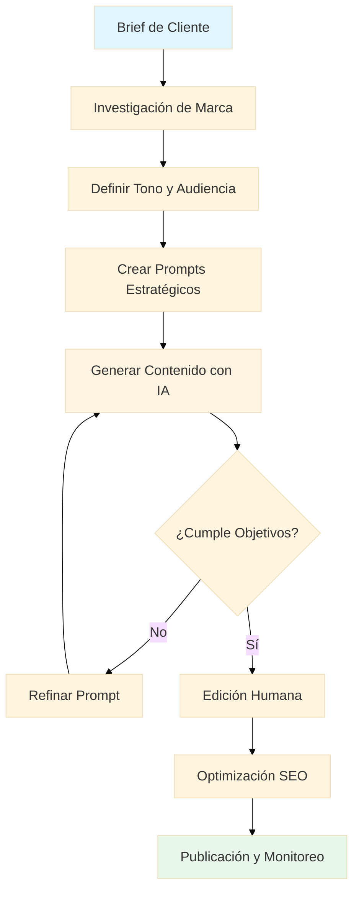
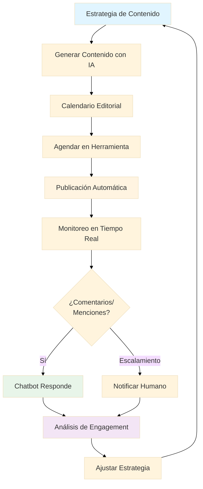
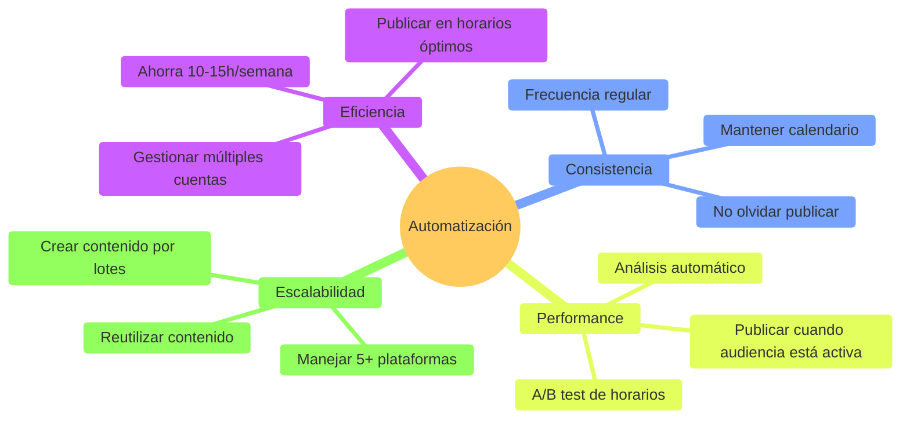

# 📝 Módulo 01: Creación de Contenido con IA

**Duración:** 4 horas  
**Nivel:** Principiante - Intermedio  
**Track:** Marketing y Comunicación

---

## 🎯 ¿Qué Vas a Lograr?

Al finalizar este módulo, serás capaz de:

- [ ] Crear contenido publicitario profesional usando ChatGPT y herramientas de IA
- [ ] Generar copies persuasivos para redes sociales, emails y landing pages
- [ ] Optimizar contenido para SEO y mejorar el posicionamiento orgánico
- [ ] Desarrollar estrategias de contenido para marcas paraguayas
- [ ] Automatizar la creación de calendarios editoriales y briefs creativos

---

## 🧠 Analogía: La IA como tu Equipo Creativo 24/7

Imagina que tienes un equipo de redactores publicitarios que trabaja las 24 horas, nunca se cansa, y puede escribir en cualquier tono o estilo que necesites. Así funciona la IA para contenido:

- **ChatGPT** es como tu copywriter senior que entiende tu marca
- **OpenCode** es tu asistente creativo que genera múltiples versiones
- **Prompts bien diseñados** son las instrucciones claras que das a tu equipo

En Paraguay, agencias como **Tabú** o **Factoría Creativa** están incorporando IA para acelerar su producción de contenido, pero la estrategia y la creatividad humana siguen siendo esenciales.

---

## 📊 Flujo de Trabajo de Creación con IA

---

## 🎨 Parte 1: Fundamentos de Copywriting con IA (60 minutos)

### 1.1 ¿Por Qué la IA Revoluciona el Marketing de Contenidos?

En Paraguay, el marketing digital está creciendo explosivamente:
- **+180% crecimiento** de inversión en ads digitales (2022-2025)
- Marcas como **Tigo**, **Personal** y **Visión Banco** usan contenido constantemente
- Agencias buscan copywriters que dominen IA (salario: ₲8-15M/mes)

**Desafío tradicional:** Un copywriter puede escribir 5-10 piezas de contenido al día.  
**Con IA:** Puedes generar 50-100 variaciones, enfocándote en estrategia y edición.

### 1.2 Anatomía de un Prompt Efectivo

**Formula CLEAR para Prompts:**
- **C**ontexto: ¿Quién es la marca? ¿Qué vende?
- **L**ongitud: ¿Cuántas palabras/caracteres?
- **E**stilo: Tono (casual, profesional, divertido)
- **A**udiencia: ¿A quién le hablas?
- **R**esultado: ¿Qué acción quieres que tomen?

---

## 🤖 Módulo 03: Automatización de Redes Sociales

**Duración:** 4 horas  
**Nivel:** Intermedio  
**Track:** Marketing y Comunicación

---

## 🎯 ¿Qué Vas a Lograr?

Al finalizar este módulo, serás capaz de:

- [ ] Automatizar publicaciones en múltiples plataformas (IG, FB, Twitter, LinkedIn)
- [ ] Crear calendarios editoriales estratégicos con IA
- [ ] Desarrollar chatbots para atención al cliente 24/7
- [ ] Monitorear menciones y sentiment con social listening
- [ ] Optimizar horarios de publicación con analytics
- [ ] Usar OpenCode para generar contenido a escala

---

## 🧠 Analogía: Las Redes Sociales como una Fábrica

Imagina que manejas una fábrica de contenido:

- **Calendario editorial** = Línea de producción organizada
- **Herramientas de scheduling** = Maquinaria que trabaja 24/7
- **Chatbots** = Empleados que atienden sin descanso
- **Social listening** = Sensores de calidad que detectan problemas
- **OpenCode** = Ingeniero que optimiza procesos

En Paraguay, marcas como **Tigo**, **Personal** y **Stock** publican 20-50 posts semanales. Hacerlo manualmente es imposible - la automatización no es opcional, **es necesaria**.

---

## 📊 Flujo de Automatización Completo

---

## 📅 Parte 1: Calendario Editorial y Scheduling (60 minutos)

### 1.1 ¿Por Qué Automatizar Publicaciones?

**Beneficios Clave:**

**Estadísticas Paraguay**:
- ✅ **87% de usuarios** están en redes sociales
- ✅ **3.5 horas promedio** de uso diario
- ✅ **Mejor horario:** 12-14h y 19-21h (horario paraguayo)
- ✅ **Plataformas top:** Facebook (85%), Instagram (62%), TikTok (48%)

---

## ✅ Checklist de Dominio del Módulo

Verifica que puedes hacer lo siguiente sin ayuda:

**Fundamentos:**
- [ ] Escribir prompts claros con el método CLEAR
- [ ] Identificar el tono de marca de cualquier empresa
- [ ] Generar 10+ variaciones de un copy en menos de 5 minutos
- [ ] Adaptar contenido entre diferentes canales (IG → Email → Blog)

**Estrategia:**
- [ ] Crear un calendario editorial de 4 semanas
- [ ] Definir pilares de contenido para una marca
- [ ] Optimizar contenido para SEO con keywords
- [ ] Diseñar un brand voice guide desde cero

**Automatización:**
- [ ] Generar 30+ posts en una sesión
- [ ] Crear templates reutilizables
- [ ] Hacer batch processing de contenido
- [ ] Integrar IA en flujo de trabajo actual

---

*Módulo 01 - Núcleo Común: Creación de Contenido + Automatización de Redes Sociales | FPUNA 2026*
