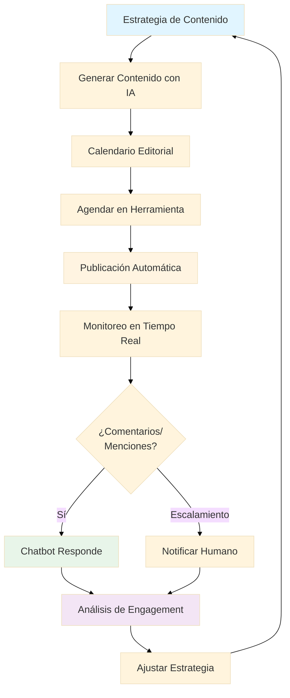
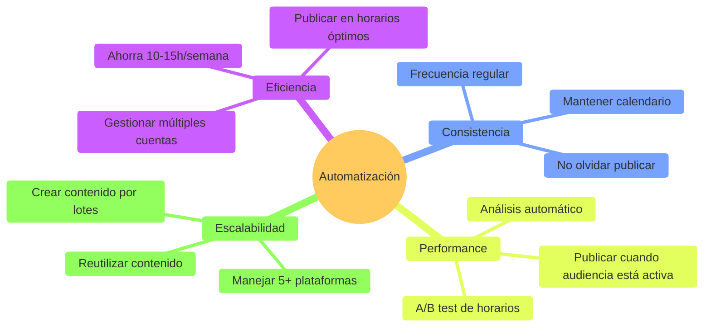
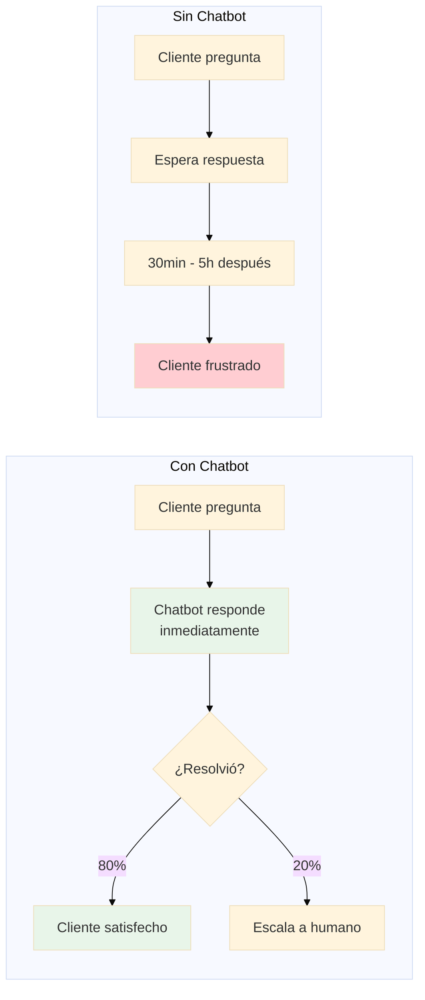
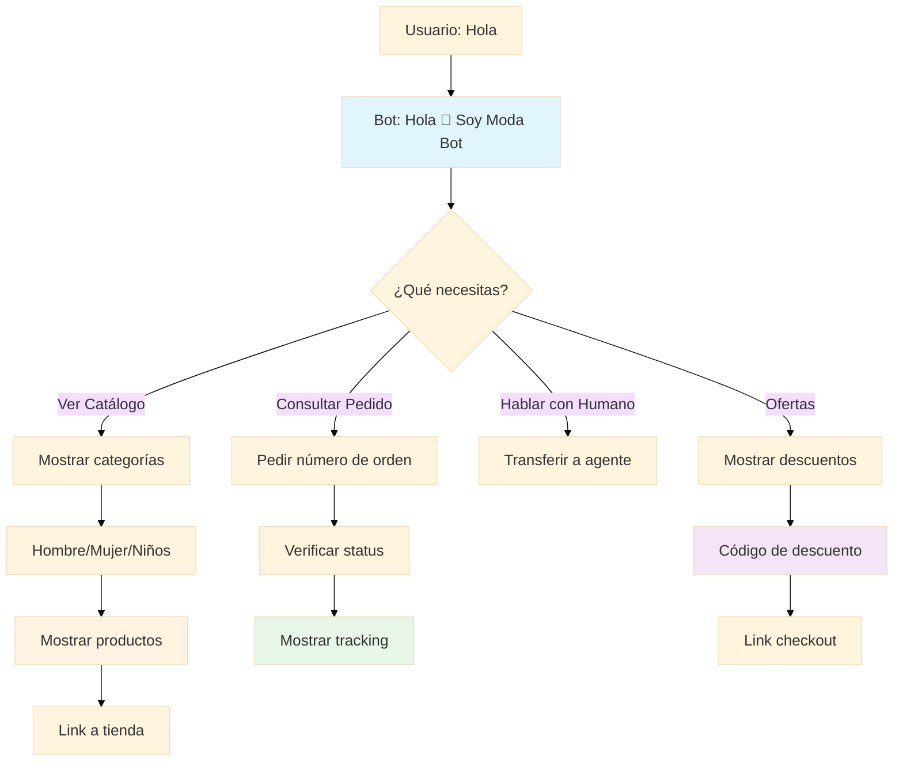
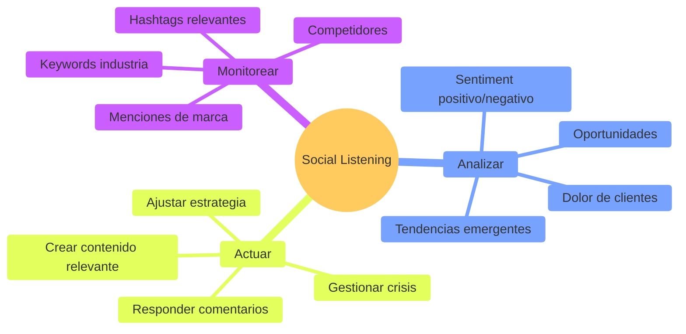

# 🤖 Módulo 03: Automatización de Redes Sociales

**Duración:** 4 horas  
**Nivel:** Intermedio  
**Track:** Marketing y Comunicación

---

## 🎯 ¿Qué Vas a Lograr?

Al finalizar este módulo, serás capaz de:

- [ ] Automatizar publicaciones en múltiples plataformas (IG, FB, Twitter, LinkedIn)
- [ ] Crear calendarios editoriales estratégicos con IA
- [ ] Desarrollar chatbots para atención al cliente 24/7
- [ ] Monitorear menciones y sentiment con social listening
- [ ] Optimizar horarios de publicación con analytics
- [ ] Usar OpenCode para generar contenido a escala

---

## 🧠 Analogía: Las Redes Sociales como una Fábrica

Imagina que manejas una fábrica de contenido:

- **Calendario editorial** = Línea de producción organizada
- **Herramientas de scheduling** = Maquinaria que trabaja 24/7
- **Chatbots** = Empleados que atienden sin descanso
- **Social listening** = Sensores de calidad que detectan problemas
- **OpenCode** = Ingeniero que optimiza procesos

En Paraguay, marcas como **Tigo**, **Personal** y **Stock** publican 20-50 posts semanales. Hacerlo manualmente es imposible - la automatización no es opcional, **es necesaria**.

---

## 📊 Flujo de Automatización Completo



---

## 📅 Parte 1: Calendario Editorial y Scheduling (60 minutos)

### 1.1 ¿Por Qué Automatizar Publicaciones?

**Beneficios Clave:**



**Estadísticas Paraguay**:
- ✅ **87% de usuarios** están en redes sociales
- ✅ **3.5 horas promedio** de uso diario
- ✅ **Mejor horario:** 12-14h y 19-21h (horario paraguayo)
- ✅ **Plataformas top:** Facebook (85%), Instagram (62%), TikTok (48%)

### 1.2 Crear un Calendario Editorial

**Framework de Pilares de Contenido:**

| Pilar | % | Objetivo | Ejemplo |
|-------|---|----------|---------|
| **Educación** | 40% | Aportar valor | Tips de marketing, tutoriales |
| **Inspiración** | 20% | Conectar emocionalmente | Casos de éxito, testimonios |
| **Entretenimiento** | 20% | Engagement | Memes, encuestas, challenges |
| **Promoción** | 20% | Conversión | Ofertas, lanzamientos |

**Calendario Mensual (Ejemplo: E-commerce Paraguay)**

```
SEMANA 1:
Lun: [Educación] "5 Tips para Comprar Online Seguro"
Mié: [Entretenimiento] Encuesta: ¿Cuál es tu marca favorita?
Vie: [Inspiración] Testimonio de cliente satisfecho
Dom: [Promoción] Descuento flash 24h

SEMANA 2:
Lun: [Educación] "Cómo Elegir Talla Correcta"
Mié: [Promoción] Nueva colección de verano
Vie: [Entretenimiento] Meme sobre compras online
Dom: [Inspiración] Behind the scenes del equipo

SEMANA 3:
Lun: [Educación] "Métodos de Pago en Paraguay"
Mié: [Entretenimiento] "Tag a friend que necesita esto"
Vie: [Promoción] Envío gratis este fin de semana
Dom: [Inspiración] Historia de emprendimiento

SEMANA 4:
Lun: [Educación] "Cómo Rastrear tu Pedido"
Mié: [Promoción] Últimos días de oferta
Vie: [Entretenimiento] Quiz: ¿Qué estilo te define?
Dom: [Inspiración] Recap del mes
```

### 1.3 Herramientas de Scheduling

**Comparativa de Plataformas:**

| Herramienta | Gratis | De Pago | Redes Soportadas | Mejor Para |
|-------------|--------|---------|------------------|------------|
| **Buffer** | 3 cuentas | $6/mes (10 cuentas) | IG, FB, Twitter, LinkedIn | Pequeños negocios |
| **Hootsuite** | 2 cuentas | $99/mes (10 cuentas) | Todas + TikTok | Agencias |
| **Meta Business Suite** | ✅ Gratis | - | IG + FB solamente | Principiantes |
| **Later** | 1 cuenta | $18/mes (6 cuentas) | IG, FB, Twitter, Pinterest | Visual content |
| **Metricool** | 1 marca | $12/mes (5 marcas) | Todas + analytics | Analytics focus |

**Recomendación Paraguay**: Empezar con **Meta Business Suite** (gratis) + **Buffer Free** (3 cuentas).

### 1.4 Setup de Buffer (Paso a Paso)

**Paso 1: Crear Cuenta**
1. Ir a buffer.com
2. Crear cuenta gratuita
3. Conectar primeras 3 cuentas (ej: Facebook, Instagram, LinkedIn)

**Paso 2: Configurar Horarios Óptimos**

```
Facebook:
- Lunes a Viernes: 12:00, 18:00, 20:00
- Sábado: 11:00, 19:00
- Domingo: 19:00

Instagram:
- Lunes a Viernes: 7:00, 12:30, 19:30
- Sábado: 10:00, 16:00
- Domingo: 18:00

LinkedIn:
- Martes y Jueves: 8:00, 12:00
```

**Paso 3: Crear Cola de Contenido**

```
1. Ir a "Publishing" > "Queue"
2. Seleccionar red social
3. Agregar post:
   - Copy del post
   - Imagen/video
   - Hashtags
   - Link (si aplica)
4. Click "Add to Queue"
5. Buffer publicará automáticamente en próximo horario
```

**Paso 4: Batch Creation (Crear por Lotes)**

```
1. Preparar 10-15 posts en Google Sheets
2. Copiar textos + tener imágenes listas
3. Bloquear 1 hora para subirlos todos
4. Resultado: 2 semanas de contenido listo
```

### 1.5 Generar Calendario con OpenCode

**Prompt para OpenCode:**

```
Crea un calendario editorial completo para mi negocio:

NEGOCIO: Cafetería en Asunción (Café Literario)
OBJETIVO: Aumentar visitas al local + awareness
AUDIENCIA: Profesionales 25-45 años, amantes de la cultura

PLATAFORMAS:
- Instagram (principal)
- Facebook
- TikTok (experimental)

FRECUENCIA:
- Instagram: 5 posts/semana + 7 stories/semana
- Facebook: 3 posts/semana
- TikTok: 2 videos/semana

PILARES:
1. Café de especialidad (educación)
2. Eventos culturales (inspiración)
3. Comunidad local (entretenimiento)
4. Promociones (conversión)

GENERA:
1. Calendario de 4 semanas (formato tabla)
2. 20 ideas específicas de posts
3. 10 ideas de stories interactivos
4. 5 ideas de videos TikTok
5. Horarios óptimos sugeridos
6. Hashtags estratégicos para cada post

CONTEXTO: Paraguay, Asunción, cultura local importante

TODO en español, listo para copiar a Buffer
```

---

## 💬 Parte 2: Chatbots y Atención Automatizada (90 minutos)

### 2.1 ¿Por Qué Chatbots?

**Estadísticas Clave:**
- 📱 **78% de clientes** esperan respuesta en <1 hora
- ⏰ **64% prefieren** mensaje vs llamada telefónica
- 🤖 **Chatbots resuelven** 60-80% de consultas simples
- 💰 **Ahorran** 30% en costos de atención al cliente



### 2.2 Plataformas de Chatbots

**Comparativa:**

| Plataforma | Gratis | De Pago | Mejor Para | Curva Aprendizaje |
|------------|--------|---------|------------|-------------------|
| **ManyChat** | 1000 contactos | $15/mes | Instagram + FB | Baja |
| **Chatfuel** | 50 contactos | $15/mes | Facebook Messenger | Baja |
| **MobileMonkey** | 1 chatbot | $19/mes | Multi-plataforma | Media |
| **Tidio** | 3 agentes | $19/mes | Web + Messenger | Baja |
| **WhatsApp Business API** | Gratis | Pay per message | WhatsApp | Alta |

**Recomendación Paraguay**: **ManyChat Free** (1000 contactos suficiente para empezar).

### 2.3 Crear Chatbot en ManyChat (Paso a Paso)

**Caso de Uso: E-commerce de Ropa**

**Flujo del Chatbot:**



**Implementación en ManyChat:**

**Paso 1: Configurar Mensaje de Bienvenida**

```
Trigger: Usuario envía primer mensaje
Respuesta:
---
¡Hola! 👋 Soy el asistente virtual de Moda Asunción.

¿En qué puedo ayudarte hoy?

[Botón: 🛍️ Ver Catálogo]
[Botón: 📦 Consultar Pedido]
[Botón: 💬 Hablar con Persona]
[Botón: 🔥 Ver Ofertas]
---
```

**Paso 2: Flujo de Catálogo**

```
Usuario clickea: Ver Catálogo
Bot responde:
---
Perfecto! ¿Para quién estás buscando?

[Botón: 👨 Hombre]
[Botón: 👩 Mujer]
[Botón: 👶 Niños]
---

Si clickea "Mujer":
---
Genial! Estas son nuestras categorías:

[Botón: 👗 Vestidos]
[Botón: 👚 Blusas]
[Botón: 👖 Jeans]
[Botón: 👠 Calzado]
---

Si clickea "Vestidos":
---
Estos son nuestros vestidos más vendidos:

[Imagen: Vestido Floral]
Vestido Floral - ₲250.000
[Botón: Ver Más]

[Imagen: Vestido Casual]
Vestido Casual - ₲180.000
[Botón: Ver Más]

👉 Ver catálogo completo: [LINK]
---
```

**Paso 3: Consultar Pedido**

```
Usuario clickea: Consultar Pedido
Bot responde:
---
Claro! Para consultar tu pedido, necesito tu número de orden.

Lo encuentras en el email de confirmación (ej: #12345)

Escríbelo aquí 👇
---

Usuario escribe: 12345
Bot busca en base de datos (integración con Shopify/WooCommerce)
Bot responde:
---
Encontré tu pedido! 📦

Pedido: #12345
Status: En camino 🚚
Fecha estimada: 18 de Enero
Tracking: [LINK]

¿Algo más en lo que pueda ayudarte?

[Botón: Sí]
[Botón: No, gracias]
---
```

**Paso 4: Transferir a Humano**

```
Usuario clickea: Hablar con Persona
Bot responde:
---
Entiendo, te voy a conectar con un miembro de nuestro equipo.

Mientras tanto, ¿podrías contarme brevemente tu consulta? Así el agente estará preparado 😊
---

Usuario escribe su consulta
Bot guarda mensaje
Bot notifica a agente humano (Slack/Email)
Bot responde:
---
Perfecto! Ya notifiqué a nuestro equipo.

Te responderemos en menos de 30 minutos.

Horario de atención:
Lun-Vie: 8:00-18:00
Sáb: 9:00-13:00

Gracias por tu paciencia! 🙏
---
```

### 2.4 Integrar con OpenCode

**Prompt para OpenCode:**

```
Necesito crear un chatbot completo para WhatsApp Business:

NEGOCIO: Restaurante de comida rápida (Asunción)
OBJETIVO: Tomar pedidos automatizados

FLUJO REQUERIDO:
1. Saludo + mostrar menú
2. Usuario selecciona plato(s)
3. Confirmar dirección de entrega
4. Calcular costo de envío (según zona)
5. Mostrar total
6. Opciones de pago (efectivo/transferencia)
7. Confirmar pedido
8. Enviar a cocina (integración con sistema)

MENU:
- Hamburguesas: 5 opciones (₲25K-45K)
- Pizzas: 8 opciones (₲35K-65K)
- Bebidas: 6 opciones (₲8K-15K)
- Postres: 4 opciones (₲12K-18K)

ZONAS DE ENTREGA:
- Centro: ₲10K
- Villa Morra: ₲15K
- San Lorenzo: ₲20K
- Fuera de rango: No delivery

GENERA:
1. Diagrama de flujo completo (Mermaid)
2. Scripts de todos los mensajes
3. Lógica de validación (direcciones, montos)
4. Integración con Google Sheets para registrar pedidos
5. Notificaciones a cocina

PLATAFORMA: ManyChat o código custom
TODO en español, contexto Paraguay
```

---

## 🔍 Parte 3: Social Listening (Monitoreo) (60 minutos)

### 3.1 ¿Qué es Social Listening?

**Definición**: Monitorear menciones de tu marca, competidores, keywords relevantes en redes sociales para:
- Detectar crisis antes que escalen
- Identificar oportunidades de venta
- Entender sentiment de clientes
- Analizar estrategias de competencia



### 3.2 Herramientas de Social Listening

**Gratuitas:**
- **TweetDeck** (Twitter)
- **Google Alerts** (Web mentions)
- **Mention Free** (10 alertas)

**De Pago:**
- **Hootsuite** ($99/mes) - Monitoreo completo
- **Sprout Social** ($249/mes) - Analytics avanzado
- **Brandwatch** ($800/mes) - Enterprise level

**Para Paraguay**: **Google Alerts** + **Hootsuite Free** es suficiente.

### 3.3 Configurar Alertas

**Google Alerts Setup:**

```
1. Ir a google.com/alerts
2. Crear alertas para:
   - "Nombre de tu marca"
   - "Nombre de tu marca" + "Paraguay"
   - "Producto principal" + "recomendación"
   - "Competidor 1"
   - "Competidor 2"
   - "Palabra clave industria" + "Paraguay"

3. Configuración:
   - Frecuencia: Diariamente
   - Fuentes: Automático
   - Idioma: Español
   - Región: Paraguay
   - Cantidad: Todos los resultados
   - Enviar a: [tu email]
```

**Ejemplo - Cafetería:**

```
Alertas:
1. "Café Literario"
2. "Café Literario" + "Asunción"
3. "mejor café Asunción"
4. "cafeterías con wifi Asunción"
5. "Café Martínez" (competidor)
6. "Starbucks Paraguay" (competidor)
```

### 3.4 Análisis de Sentiment con IA

**Caso Real: Crisis Management**

**Escenario**: Un cliente publica en Twitter:

> "@MarcaX me enviaron producto dañado y NO responden mis mensajes. Pésimo servicio. #NoCompren"

**Sin Social Listening**: Descubres 2 días después, cuando ya tiene 200 RTs.

**Con Social Listening**: Alerta inmediata, respondes en <30 min:

> "Hola @Cliente, lamentamos mucho esto. Ya contactamos a nuestro equipo de soporte para resolver tu caso prioritariamente. Te enviamos DM con solución. Disculpas por la experiencia."

**Resultado**: Cliente edita tweet, crisis evitada.

### 3.5 Dashboard de Monitoreo con OpenCode

**Prompt para OpenCode:**

```
Crea un sistema automatizado de social listening:

MARCA: Tienda de Tecnología (Paraguay)

PLATAFORMAS A MONITOREAR:
- Twitter: @NombreMarca + menciones sin tag
- Facebook: Comentarios en posts + reviews
- Instagram: Comentarios + menciones en stories
- Google Reviews: Nuevas reviews

KEYWORDS:
- "Nombre Marca"
- "servicio técnico Paraguay"
- "mejores tiendas de tecnología Asunción"
- Competidores: TechStore, DigitalPY

ALERTAS:
1. Sentiment negativo → Email inmediato + Slack
2. Mención de "producto dañado" → Prioridad alta
3. Pregunta sobre precio → Notificar ventas
4. Mención de competidor → Guardar para análisis

GENERA:
1. Script Python que:
   - Use API de Twitter
   - Scraping de Facebook (si es posible)
   - Monitoreo de Google Reviews
   - Análisis de sentiment con NLP
2. Dashboard simple (Streamlit o Gradio)
3. Sistema de alertas (email + Slack)
4. Reporte semanal automatizado

TECNOLOGÍAS: Python, Tweepy, TextBlob (sentiment), Pandas
```

---

## 📊 Parte 4: Analytics y Optimización (30 minutos)

### 4.1 Métricas Clave por Plataforma

**Instagram:**
- **Reach** (alcance): Cuántas cuentas vieron tu post
- **Engagement Rate**: (Likes + Comments + Shares) / Followers * 100
- **Story Completion Rate**: % que ve historia completa
- **Link Clicks**: Clics en bio o swipe ups

**Meta Instagram**: 3-5% engagement es bueno.

**Facebook:**
- **Post Reach**: Orgánico vs pagado
- **Engagement**: Reacciones + comentarios + compartidos
- **Click-Through Rate (CTR)**: Clics en links
- **Video Watch Time**: Minutos totales vistos

**Meta Facebook**: 1-2% engagement para páginas.

**LinkedIn:**
- **Impressions**: Veces que se mostró
- **Engagement**: Reacciones + comentarios
- **Follower Growth**: Nuevos seguidores
- **Profile Views**: Visitas a tu perfil

**Meta LinkedIn**: 2-5% engagement (más alto que otras redes).

### 4.2 Mejor Horario para Publicar (Paraguay)

**Datos Generales Paraguay**:

| Red Social | Mejor Día | Mejores Horas | Evitar |
|------------|-----------|---------------|--------|
| **Facebook** | Mié, Jue, Vie | 12-14h, 19-21h | Dom mañana |
| **Instagram** | Lun, Mié, Jue | 7-9h, 12-13h, 19-20h | Vie noche |
| **LinkedIn** | Mar, Mié, Jue | 7-9h, 12-13h | Fin de semana |
| **TikTok** | Vie, Sáb | 18-22h | Lunes |
| **Twitter** | Lun-Vie | 8-10h, 17-19h | Sáb-Dom |

**Tip**: Usa analytics de cada plataforma para ver cuándo TU audiencia está activa (puede variar).

### 4.3 A/B Testing en Redes Sociales

**Elementos a Testear:**

1. **Copy del Post**
   - A: "Compra ahora con 20% descuento"
   - B: "Solo hoy: Ahorra ₲50.000 en tu compra"

2. **Imágenes**
   - A: Producto solo
   - B: Producto en uso (persona usando)

3. **Call to Action**
   - A: "Comprar Ahora"
   - B: "Ver Oferta"
   - C: "Más Info"

4. **Hashtags**
   - A: 3 hashtags generales
   - B: 10 hashtags mezclados
   - C: 5 hashtags nicho

**Proceso:**
1. Publicar Versión A el Lunes 12pm
2. Publicar Versión B el Miércoles 12pm
3. Analizar después de 48h cada uno
4. Comparar: Reach, Engagement, Link Clicks
5. Implementar ganador

---

## ✅ Checklist de Dominio del Módulo

Verifica que puedes hacer lo siguiente sin ayuda:

**Scheduling:**
- [ ] Crear calendario editorial de 4 semanas
- [ ] Configurar Buffer/Hootsuite con 3+ cuentas
- [ ] Identificar horarios óptimos para tu audiencia
- [ ] Hacer batch creation (10+ posts en 1 hora)

**Chatbots:**
- [ ] Crear chatbot básico en ManyChat
- [ ] Diseñar flujo conversacional lógico
- [ ] Integrar transferencia a humano
- [ ] Conectar con base de datos (pedidos, etc.)

**Social Listening:**
- [ ] Configurar Google Alerts estratégicamente
- [ ] Monitorear menciones en tiempo real
- [ ] Analizar sentiment (positivo/negativo)
- [ ] Gestionar crisis proactivamente

**Analytics:**
- [ ] Interpretar métricas clave por plataforma
- [ ] Identificar mejor horario de publicación
- [ ] Realizar A/B testing de contenido
- [ ] Optimizar estrategia basada en datos

---

## 📚 Recursos Recomendados

### Herramientas Gratuitas

**Scheduling:**
- **Buffer Free:** buffer.com (3 cuentas)
- **Meta Business Suite:** business.facebook.com (IG + FB)
- **TweetDeck:** tweetdeck.twitter.com (Twitter)

**Chatbots:**
- **ManyChat Free:** manychat.com (1000 contactos)
- **Tidio:** tidio.com (3 agentes)

**Social Listening:**
- **Google Alerts:** google.com/alerts
- **TweetDeck:** Para monitorear Twitter

**Diseño:**
- **Canva:** canva.com (gratis)

### Cursos Recomendados

**Gratuitos:**
- **Meta Blueprint:** facebook.com/blueprint
- **Buffer Academy:** buffer.com/resources
- **HubSpot Social Media:** academy.hubspot.com

**De Pago:**
- **Hootsuite Social Marketing:** hootsuite.com/education (~USD 199)
- **Social Media Examiner:** socialmediaexaminer.com (~USD 47/mes)

---

## 🎯 Proyecto Final: Automatización Completa

Crea un **Sistema de Automatización** end-to-end:

### Caso: Gym Local en Asunción

**Negocio:** "Fitness Pro" - Gimnasio

**Tu Tarea:**

1. **Calendario Editorial (30%):**
   - 4 semanas de contenido
   - 3 plataformas (IG, FB, TikTok)
   - Pilares: Educación (ejercicios), Inspiración (transformaciones), Comunidad, Promociones
   - Mínimo 15 posts/semana

2. **Chatbot (30%):**
   - Flujo completo en ManyChat
   - Casos: Consultar precios, agendar clase de prueba, horarios
   - Transferencia a humano
   - Integración con calendario (Google Calendar)

3. **Social Listening (20%):**
   - Configurar 5 alertas relevantes
   - Estrategia de respuesta (< 1h)
   - Ejemplos de crisis management

4. **Analytics (20%):**
   - Dashboard con métricas clave
   - Mejor horario identificado
   - Plan de A/B testing (3 experimentos)

**Entregable:**
- Calendario (Google Sheets o Notion)
- Chatbot funcional (demo video)
- Documento de estrategia (PDF)
- Presentación (10 min)

---

## 💡 Tips de Expertos Paraguayos

### Gabriela Ortiz - Social Media Manager en Personal

> "En Paraguay, el 92% del tráfico social viene de móvil. Si tus posts no se ven bien en pantalla pequeña, estás perdiendo alcance. Siempre previsualiza en móvil antes de publicar."

### Ricardo Silva - Founder de AgenciaPY

> "Los chatbots en WhatsApp convierten 3x más que en Messenger en Paraguay. La gente confía más en WhatsApp. Invierte en WhatsApp Business API si puedes."

### Claudia Benítez - Growth Hacker

> "El mejor horario para publicar es cuando TU audiencia está activa, no las estadísticas generales. Revisa analytics semanalmente y ajusta. En Paraguay, horarios de almuerzo (12-14h) son oro."

---

## 🚀 Próximos Pasos

Ahora que dominas automatización de redes sociales, estás listo para:

1. **Módulo 04:** Herramientas de Diseño con IA (crear visuales impactantes)
2. **Módulo 05:** Gestión de Campañas (integrar todo en campañas completas)

**Acción inmediata:**
- Configura Buffer con tus cuentas
- Crea calendario de próximos 7 días
- Implementa primer chatbot simple

---

## 📺 Recommended YouTube Resources

**Visualiza estos videos para automatizar y escalar tus redes sociales**:

### 🔗 Video 1: Social Media Automation - Buffer, Later & Scheduling Strategy
- **Título**: Automatización de Redes Sociales - Estrategia de Scheduling Profesional
- **Canal**: Social Media Examiner
- **Duración**: 130 minutos
- **Contenido**: Herramientas scheduling (Buffer, Later, Hootsuite), content calendar best practices, batching, timezone optimization, posting patterns
- **Link**: https://www.youtube.com/watch?v=VYI_qdJJLTU
- **Por qué verlo**: Publicar en las mejores horas = 3x más engagement. Automatización = consistencia sin quemarse

### 🔗 Video 2: Social Listening & Community Engagement - Chatbots & AI
- **Título**: Social Listening y Community Management - Chatbots Inteligentes
- **Canal**: MobileMonkey / AI Marketing
- **Duración**: 120 minutos
- **Contenido**: Social listening tools (Mention, Brand24), chatbot builders (ManyChat, Drift), engagement automation, respuesta 24/7, lead qualification
- **Link**: https://www.youtube.com/watch?v=aqOPjNLkRKA
- **Por qué verlo**: 70% de clientes expectan respuesta en <1 hora. Chatbots IA responden en SEGUNDOS - conversión automática

### 🔗 Video 3: TikTok & Emerging Platforms - Algorithm Hacks & Viral Strategies
- **Título**: TikTok y Plataformas Emergentes - Hacks del Algoritmo
- **Canal**: Creator Academy / TikTok Official
- **Duración**: 105 minutos
- **Contenido**: Comprender algoritmo TikTok, Hook en primeros 3 segundos, trending sounds, duetos/stitches, creator fund, analytics
- **Link**: https://www.youtube.com/watch?v=JlwVQiC_Rvc
- **Por qué verlo**: TikTok creció 500% en LATAM. El futuro es video corto. Domina algoritmo = alcance viral sin pagar ads

---

## 📞 Contacto y Consultas

**Instructor:** [Nombre]  
**Email:** [email]  
**Grupo WhatsApp:** [link]  
**Horario consultas:** Martes y Jueves 18:00-19:00

**Feedback del módulo:** [Google Form]

---

## 🌟 Casos de Éxito - Alumni FPUNA

### Martín López - Class 2025

"Automaticé las redes de mi cliente (restaurante). Pasé de dedicar 2h/día a 30min/semana. El engagement subió 45% porque publicamos en horarios óptimos. Mi cliente quedó tan contento que firmó contrato anual."

### Daniela Vera - Class 2024

"Implementé chatbot para consultas de productos. Ahora atendemos 24/7 sin contratar más gente. Resolvemos 70% de consultas automáticamente. Tiempo de respuesta bajó de 4h a <5min."

### Pablo Cardozo - Class 2025

"Con social listening detectamos una queja en Twitter antes que se viralizara. Respondimos en 15min con solución. El cliente borró el tweet negativo y nos recomendó. Crisis evitada."

---

**¡Automatiza tu estrategia y multiplica resultados! 🤖**

---

*Última actualización: Enero 2026*  
*Módulo creado por: FPUNA - Marketing y Comunicación Digital*
