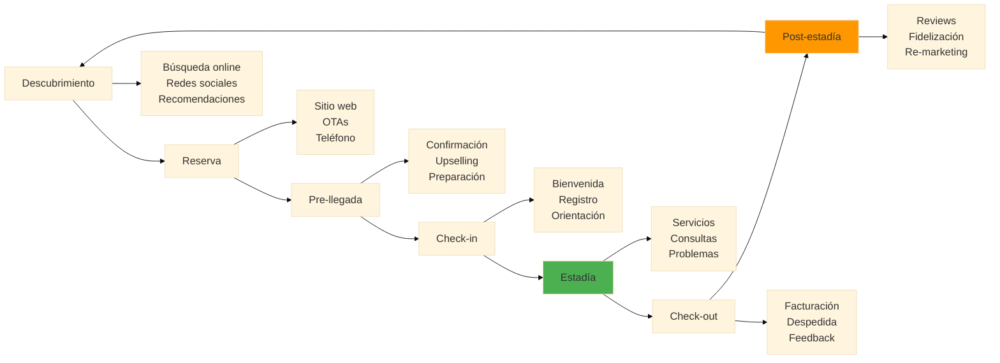
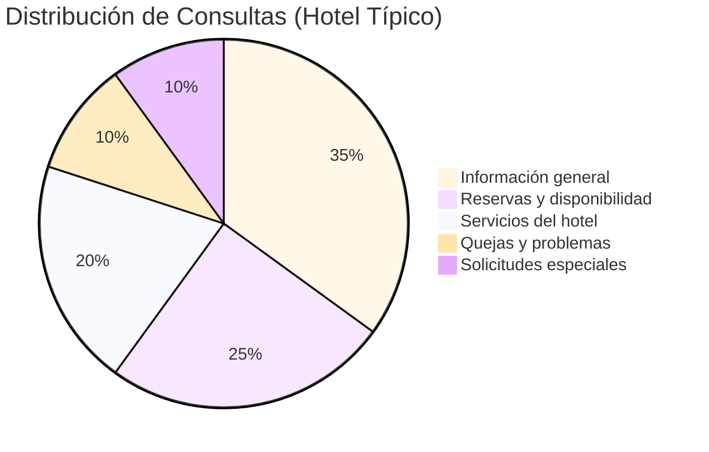
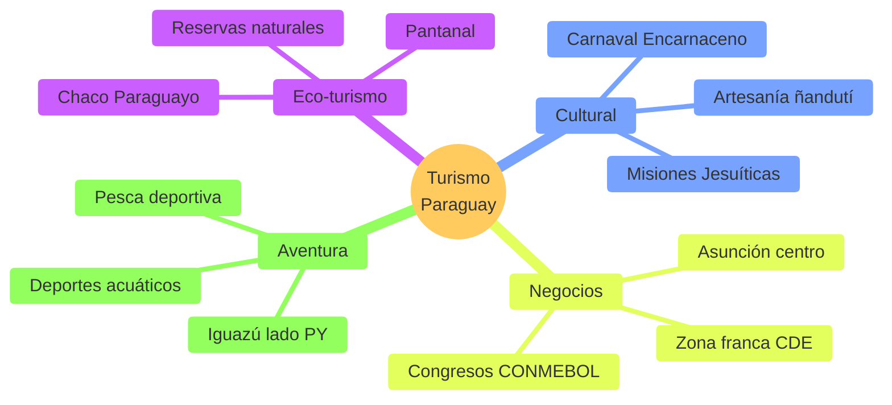
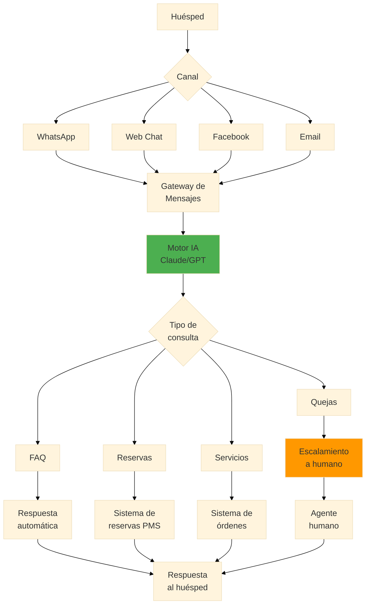
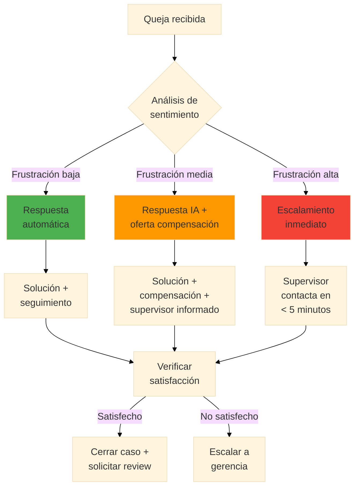
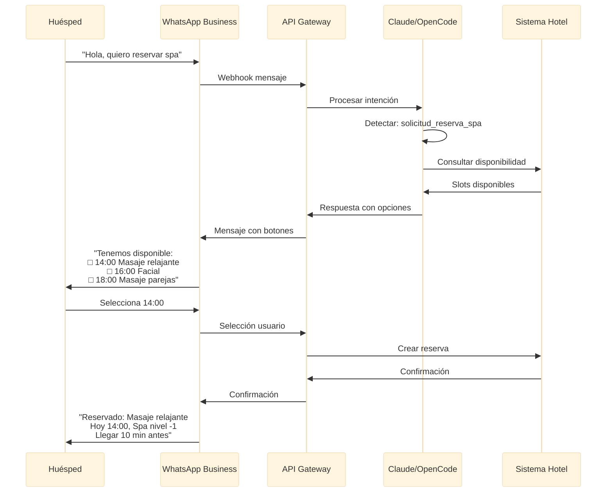
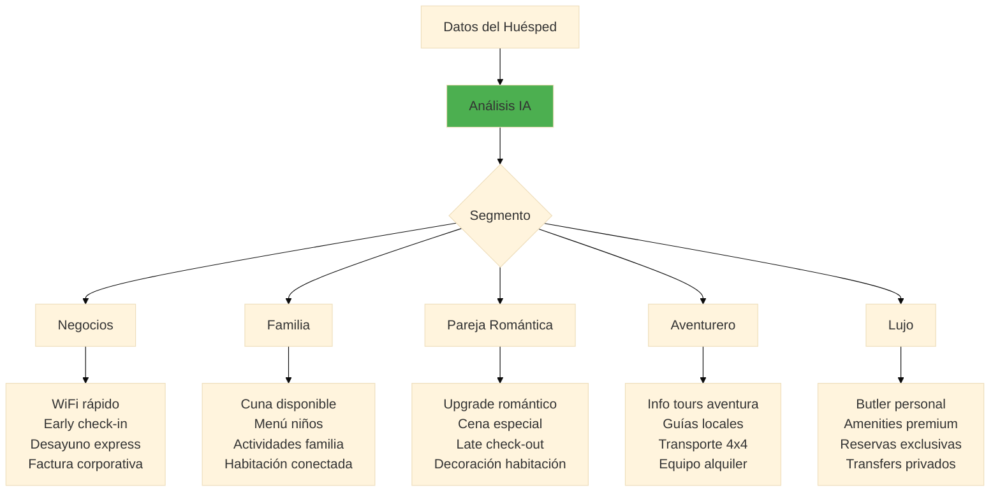
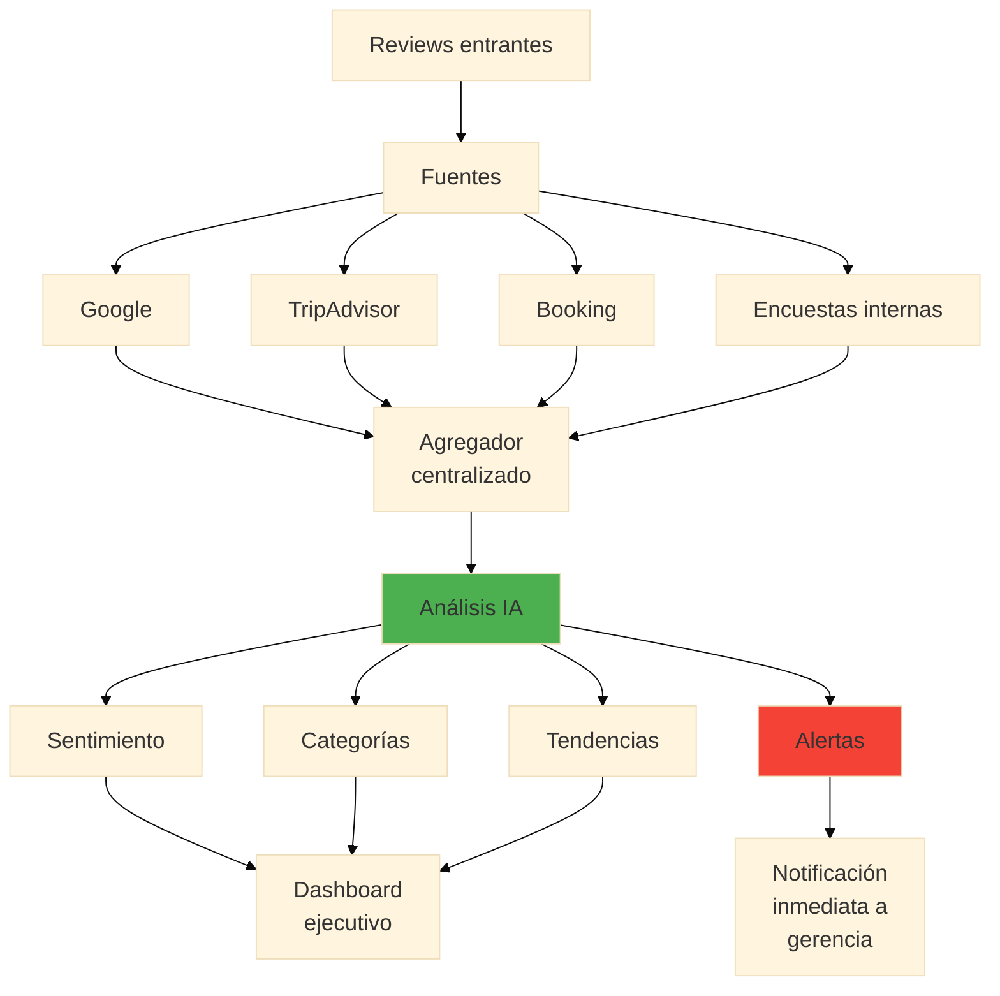
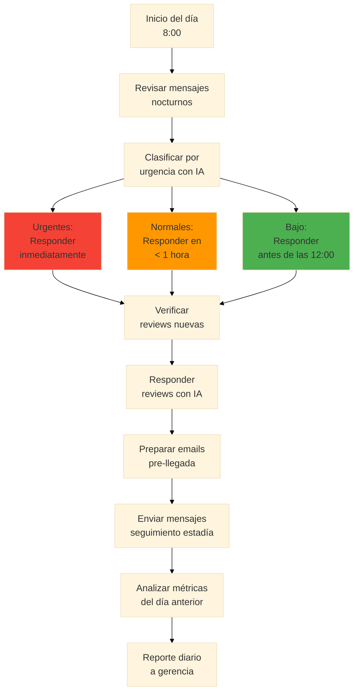

# 🏨 Servicio al Cliente con IA

**Duración:** 4 horas
**Nivel:** Intermedio
**Track:** Hospitalidad y Turismo

---

## ¿Qué Vas a Lograr?

Al completar este módulo, vas a poder:

- [ ] Implementar chatbots inteligentes para atención al huésped 24/7
- [ ] Crear respuestas personalizadas usando IA para diferentes tipos de consultas
- [ ] Diseñar sistemas de gestión de quejas y resolución de problemas con IA
- [ ] Automatizar comunicaciones con huéspedes (pre-llegada, durante estadía, post-checkout)
- [ ] Analizar feedback de clientes para mejora continua usando Claude/OpenCode

---

## La Analogía del Conserje Digital

Imagina el mejor conserje de un hotel 5 estrellas: conoce a cada huésped por nombre, recuerda sus preferencias, anticipa sus necesidades, y está disponible las 24 horas. Ahora imagina que podés clonar ese conserje y ponerlo en cada punto de contacto: WhatsApp, email, recepción, y web.

Eso es exactamente lo que la IA permite hacer en hospitalidad. No reemplaza el toque humano—lo amplifica. El objetivo es que tu equipo humano se enfoque en las interacciones de alto valor mientras la IA maneja las consultas rutinarias con la misma calidad.

---

## Parte 1: Fundamentos del Servicio al Cliente en Hospitalidad

### 1.1 El Ciclo del Huésped



**En cada etapa, la IA puede agregar valor:**

| Etapa | Oportunidad IA | Ejemplo |
|-------|---------------|---------|
| Descubrimiento | Contenido personalizado | Descripciones de destino por perfil |
| Reserva | Chatbot de ventas | Responder dudas 24/7 |
| Pre-llegada | Comunicación proactiva | Email de preparación personalizado |
| Check-in | Auto-servicio inteligente | Kiosko con reconocimiento |
| Estadía | Asistente virtual | WhatsApp para solicitudes |
| Check-out | Proceso simplificado | Factura automática |
| Post-estadía | Seguimiento | Solicitud de review personalizada |

### 1.2 Tipos de Consultas en Hospitalidad



**Las consultas más comunes (y automatizables):**

1. **Información general (35%)** - Horarios, ubicación, amenities
2. **Reservas (25%)** - Disponibilidad, precios, modificaciones
3. **Servicios (20%)** - Room service, spa, transporte
4. **Quejas (10%)** - Requieren tacto humano + IA de apoyo
5. **Solicitudes especiales (10%)** - Cumpleaños, aniversarios, dietas

### 1.3 Contexto Paraguay: El Turismo que Viene



**Datos clave:**
- **5% del PIB** viene del turismo
- **Crecimiento:** 15% anual post-pandemia
- **Principal origen:** Argentina, Brasil, Uruguay
- **Oportunidad:** Bajo nivel de digitalización = ventaja competitiva

---

## Parte 2: Chatbots para Atención al Huésped

### 2.1 Arquitectura de un Chatbot Hotelero



### 2.2 Prompt Engineering para Hospitalidad

**El System Prompt del Conserje Virtual:**

```markdown
Sos "Ana", la asistente virtual del Hotel Guaraní, un hotel 4 estrellas
en el centro de Asunción, Paraguay.

## Tu personalidad:
- Cálida y profesional, como un buen anfitrión paraguayo
- Usás "usted" por defecto, pero podés cambiar a "vos" si el huésped lo prefiere
- Conocés profundamente Paraguay y podés recomendar lugares auténticos
- Siempre buscás superar las expectativas del huésped

## Tu conocimiento:
- Horarios del hotel: Check-in 15:00, Check-out 11:00
- Restaurante "Mbokaja": 6:30-10:30 desayuno, 12:00-15:00 almuerzo, 19:00-23:00 cena
- Piscina: 7:00-22:00
- Gimnasio: 24 horas con tarjeta de habitación
- WiFi: Red "HotelGuarani_Guest", contraseña en tarjeta de habitación
- Spa: Reservas con 2 horas de anticipación

## Tus límites:
- No podés hacer reservas directamente (derivar al sistema de reservas)
- No podés procesar pagos
- Ante quejas serias, siempre ofrecés conectar con un supervisor
- No inventés información sobre disponibilidad o precios

## Formato de respuestas:
- Máximo 3-4 oraciones por mensaje
- Usá emojis con moderación (máximo 1-2 por mensaje)
- Siempre terminá preguntando si podés ayudar en algo más
```

### 2.3 Respuestas para Consultas Comunes

**Plantilla: Consulta de horarios**

```markdown
**Prompt para generar respuesta:**
Un huésped pregunta: "¿A qué hora es el desayuno?"

Genera una respuesta cálida que incluya:
1. El horario del desayuno (6:30-10:30)
2. Ubicación del restaurante (planta baja, Restaurante Mbokaja)
3. Un detalle extra que agregue valor (ej: vista, especialidad)
4. Ofrecimiento de ayuda adicional
```

**Respuesta generada:**

> ¡Buenos días! 🌅 El desayuno se sirve de 6:30 a 10:30 en nuestro Restaurante Mbokaja, en la planta baja. Le recomiendo probar nuestro chipá recién horneado y el cocido con leche—¡son los favoritos de nuestros huéspedes! ¿Hay algo más en lo que pueda ayudarle?

**Plantilla: Solicitud de servicio**

```markdown
**Prompt para generar respuesta:**
Un huésped escribe: "Necesito toallas extra en la habitación 405"

Genera una respuesta que:
1. Confirme que recibiste la solicitud
2. Dé un tiempo estimado realista (15-20 minutos)
3. Ofrezca una alternativa si hay demora
4. Sea breve y eficiente
```

**Respuesta generada:**

> ¡Por supuesto! Envío toallas adicionales a la habitación 405 ahora mismo. Nuestro equipo de housekeeping las llevará en aproximadamente 15 minutos. Si necesita algo urgente mientras tanto, puede llamar al 0 desde el teléfono de la habitación. ¿Necesita algo más?

### 2.4 Manejo de Quejas con IA



**Prompt para responder quejas:**

```markdown
**Contexto:** Un huésped se queja de que el aire acondicionado no funciona
y ha estado esperando 2 horas por mantenimiento.

**Genera una respuesta que:**
1. Reconozca el problema y la frustración (empatía genuina)
2. Se disculpe sin excusas
3. Ofrezca una solución inmediata Y una compensación
4. Dé un nombre y contacto directo para seguimiento
5. NO suene robótica ni genérica

**Tono:** Profesional pero humano, como si fueras el gerente del hotel.
```

**Respuesta generada:**

> Estimado huésped, lamento muchísimo lo que está pasando. Dos horas sin aire acondicionado en Asunción es inaceptable, y entiendo completamente su frustración.
>
> Esto es lo que vamos a hacer ahora mismo:
> 1. Nuestro técnico principal, Carlos, va en camino a su habitación (llegará en 10 minutos máximo)
> 2. Si no podemos resolver el problema en 30 minutos, lo reubicamos en una suite sin costo adicional
> 3. Como disculpa, el minibar de esta noche corre por cuenta del hotel
>
> Mi nombre es María González, supervisora de turno. Mi celular directo es 0981-XXX-XXX. Por favor escríbame personalmente si hay cualquier otro inconveniente.
>
> Nuevamente, mis sinceras disculpas. Esto no representa el servicio que queremos darle.

### 2.5 Integración con WhatsApp Business



**Configuración básica WhatsApp Business API:**

```python
# Ejemplo conceptual de webhook para WhatsApp
# (Para demostración - implementación real requiere Meta Business verification)

def procesar_mensaje_whatsapp(mensaje, numero_huesped):
    """
    Procesa mensajes entrantes de WhatsApp y genera respuestas con IA.
    """

    # 1. Identificar huésped en PMS
    huesped = buscar_huesped_por_telefono(numero_huesped)

    # 2. Construir contexto personalizado
    contexto = f"""
    Huésped: {huesped.nombre}
    Habitación: {huesped.habitacion}
    Check-in: {huesped.fecha_checkin}
    Check-out: {huesped.fecha_checkout}
    Preferencias: {huesped.preferencias}
    Historial: {huesped.interacciones_recientes}
    """

    # 3. Generar respuesta con Claude
    respuesta = claude.generar_respuesta(
        system_prompt=SYSTEM_PROMPT_CONSERJE,
        contexto=contexto,
        mensaje_huesped=mensaje
    )

    # 4. Detectar si requiere acción en PMS
    if respuesta.requiere_accion:
        ejecutar_accion_pms(respuesta.accion, huesped)

    # 5. Enviar respuesta
    enviar_whatsapp(numero_huesped, respuesta.texto)

    # 6. Registrar interacción
    registrar_interaccion(huesped, mensaje, respuesta)
```

---

## Parte 3: Personalización de Experiencias

### 3.1 Segmentación de Huéspedes con IA



**Prompt para personalización:**

```markdown
**Datos del huésped:**
- Nombre: María García
- Origen: Buenos Aires, Argentina
- Motivo viaje: "Aniversario de bodas" (mencionado en reserva)
- Habitación: Suite con vista
- Estadía: 3 noches
- Primera vez en el hotel: Sí
- Llegada: Viernes 18:00

**Genera:**
1. Email de bienvenida pre-llegada personalizado
2. 3 sugerencias de upselling apropiadas para el contexto
3. Instrucciones para el equipo sobre cómo personalizar su llegada
```

**Email generado:**

> **Asunto:** María, todo listo para su aniversario en Hotel Guaraní 🥂
>
> Estimada María,
>
> ¡Felicitaciones por su aniversario de bodas! Es un honor que hayan elegido celebrar este momento tan especial con nosotros en Asunción.
>
> Su suite con vista al río Paraguay está siendo preparada con atención especial. Como detalle de nuestra parte, encontrarán una botella de espumante Familia Zuccardi esperándolos.
>
> **Para hacer su estadía aún más memorable:**
> - 🍽️ Reservé una mesa romántica en nuestro restaurante Mbokaja para el sábado 20:30 (ventana con vista nocturna). ¿La confirmo?
> - 💆 Tenemos disponible un masaje en pareja en el spa el domingo a las 11:00—perfecto antes de su check-out
> - 🚗 Puedo coordinar un tour privado a las Misiones Jesuíticas de Trinidad (Patrimonio UNESCO, a 2 horas)
>
> Su check-in está programado para las 18:00 del viernes. Si su vuelo llega antes, avíseme y veo si podemos adelantar el acceso a la habitación.
>
> ¡Los esperamos!
>
> Ana Benítez
> Coordinadora de Experiencias
> Hotel Guaraní
> +595 21 XXX XXXX

### 3.2 Comunicaciones Automatizadas por Etapa

**Pre-llegada (24-48 horas antes):**

```markdown
**Prompt:**
Genera un mensaje de WhatsApp pre-llegada para un huésped que llega mañana.
Incluir: confirmación de reserva, oferta de early check-in, pregunta sobre
hora de llegada para preparar la habitación.
Máximo 4 líneas.
```

**Resultado:**
> ¡Hola [Nombre]! Mañana lo esperamos en Hotel Guaraní 🏨 Su habitación [Tipo] está confirmada. ¿A qué hora aproximada llega? Si desea, podemos coordinar early check-in (sujeto a disponibilidad, +$20). ¿Necesita transfer desde el aeropuerto?

**Durante estadía (Day 2):**

```markdown
**Prompt:**
El huésped lleva 1 noche. Genera un mensaje de seguimiento no intrusivo
preguntando si todo está bien y ofreciendo una recomendación local.
```

**Resultado:**
> Buenos días [Nombre] ☀️ ¿Cómo durmió anoche? Si necesita algo, estoy a un mensaje. Tip del día: El Café de Acá (a 2 cuadras) tiene el mejor café de especialidad de Asunción—pida el "cortado paraguayo". ¡Que disfrute!

**Post-checkout (24 horas después):**

```markdown
**Prompt:**
El huésped hizo checkout ayer. Genera mensaje de despedida que:
1. Agradezca la estadía
2. Pida feedback de forma no agresiva
3. Invite a compartir en redes/TripAdvisor si tuvo buena experiencia
```

**Resultado:**
> Hola [Nombre], fue un placer tenerlo con nosotros 🙏 Esperamos que haya disfrutado Asunción. Si tiene un minuto, nos encantaría saber cómo fue su experiencia: [link encuesta corta]. Y si le gustó su estadía, una reseña en Google/TripAdvisor nos ayuda muchísimo. ¡Hasta la próxima! 🇵🇾

---

## Parte 4: Análisis de Feedback con IA

### 4.1 Procesamiento de Reviews



### 4.2 Prompt para Análisis de Reviews

```markdown
**Instrucción:**
Analiza las siguientes 10 reviews del último mes y genera:

1. **Resumen ejecutivo** (3 oraciones)
2. **Sentimiento general** (1-10)
3. **Top 3 aspectos positivos** mencionados
4. **Top 3 áreas de mejora** identificadas
5. **Citas textuales** más representativas (1 positiva, 1 negativa)
6. **Recomendaciones de acción** (prioridad alta/media/baja)

**Reviews:**
[Pegar aquí las reviews]

**Formato de salida:** Tabla ejecutiva + bullets
```

**Ejemplo de análisis generado:**

| Métrica | Valor |
|---------|-------|
| Sentimiento promedio | 7.8/10 |
| Reviews analizadas | 10 |
| Tendencia vs mes anterior | ↑ +0.3 |

**Aspectos positivos:**
1. ✅ Ubicación céntrica (mencionado 8/10)
2. ✅ Amabilidad del personal (mencionado 7/10)
3. ✅ Desayuno variado (mencionado 6/10)

**Áreas de mejora:**
1. ⚠️ Aire acondicionado ruidoso (mencionado 4/10)
2. ⚠️ WiFi lento en habitaciones (mencionado 3/10)
3. ⚠️ Demora en room service (mencionado 2/10)

**Citas representativas:**
> "La ubicación es inmejorable, a pasos de todo. El personal súper atento, especialmente María en recepción." ⭐⭐⭐⭐⭐

> "Todo bien excepto el aire acondicionado que hacía un ruido terrible. No dormí bien ninguna noche." ⭐⭐⭐

**Recomendaciones:**

| Acción | Prioridad | Responsable |
|--------|-----------|-------------|
| Mantenimiento preventivo A/C todas las habitaciones | 🔴 Alta | Mantenimiento |
| Upgrade infraestructura WiFi | 🟡 Media | IT |
| Revisar tiempos de room service | 🟡 Media | F&B |

### 4.3 Respuestas Automáticas a Reviews

**Prompt para review positiva:**

```markdown
**Review (5 estrellas):**
"Excelente hotel, muy bien ubicado. El personal muy amable, especialmente
Carlos en recepción que nos ayudó con todo. El desayuno espectacular.
Volveremos seguro!"

**Genera respuesta que:**
1. Agradezca específicamente lo mencionado
2. Mencione al empleado por nombre (importante para moral)
3. Invite a volver con un toque personal
4. Sea breve (3-4 oraciones)
5. NO suene como plantilla genérica
```

**Respuesta:**
> ¡Muchas gracias por sus palabras! Me alegra saber que Carlos y todo el equipo pudieron hacer su estadía memorable—voy a compartir esto con él personalmente. El chipá del desayuno es receta de la abuela de nuestra chef, así que ese cumplido va directo a ella. ¡Los esperamos de vuelta! - María, Gerente General

**Prompt para review negativa:**

```markdown
**Review (2 estrellas):**
"Decepcionado. La habitación estaba sucia cuando llegamos, tuvieron que
limpiarla de nuevo. El wifi no funcionaba. Por el precio que pagamos,
esperábamos mucho más."

**Genera respuesta que:**
1. Se disculpe genuinamente (sin excusas)
2. Reconozca cada problema específico
3. Explique qué acción correctiva se tomó
4. Ofrezca contacto directo para remediar
5. NO sea defensiva ni confrontacional
```

**Respuesta:**
> Estimado huésped, lamento profundamente su experiencia. Tiene toda la razón—encontrar una habitación sucia es inaceptable, y el WiFi debería funcionar impecablemente. Ya hablé con los equipos de housekeeping y sistemas para que esto no vuelva a ocurrir. Me gustaría compensarle personalmente en su próxima visita. ¿Podría escribirme a mbenitez@hotelguarani.com.py? Quiero asegurarme de que su próxima experiencia sea la que merece. - María Benítez, Gerente General

---

## Parte 5: Implementación Práctica con OpenCode

### 5.1 Configuración del Asistente Virtual

**Archivo: `.claude/hotel-assistant.md`**

```markdown
# Hotel Guaraní - Asistente Virtual

## Rol
Sos el asistente virtual del Hotel Guaraní, Asunción, Paraguay.
Tu nombre es "Ana" y tu objetivo es brindar servicio excepcional.

## Conocimiento del Hotel

### Información General
- Dirección: Av. Mariscal López 1234, Asunción
- Teléfono: +595 21 XXX XXXX
- Categoría: 4 estrellas
- Habitaciones: 120 (Standard, Superior, Suite, Suite Presidencial)

### Horarios
| Servicio | Horario |
|----------|---------|
| Recepción | 24 horas |
| Desayuno | 6:30 - 10:30 |
| Almuerzo | 12:00 - 15:00 |
| Cena | 19:00 - 23:00 |
| Piscina | 7:00 - 22:00 |
| Gimnasio | 24 horas |
| Spa | 9:00 - 21:00 (con cita) |
| Room Service | 24 horas |

### Tarifas Base (referencia)
- Standard: $80-100/noche
- Superior: $120-150/noche
- Suite: $200-250/noche
- Suite Presidencial: $400-500/noche

*Nota: Siempre verificar disponibilidad real en sistema*

### Servicios Especiales
- Transfer aeropuerto: $35 (sedan), $50 (van)
- Early check-in: $30 (sujeto a disponibilidad)
- Late check-out: $30 hasta 14:00, $50 hasta 18:00
- Cuna: Sin cargo
- Mascota: $25/noche (áreas designadas)

## Estilo de Comunicación
- Profesional pero cálido
- Usar "usted" por defecto
- Respuestas concisas (máximo 4 oraciones)
- Siempre ofrecer ayuda adicional
- Usar emojis con moderación (máximo 1-2)

## Límites
- NO confirmar reservas (derivar a sistema)
- NO procesar pagos
- NO inventar disponibilidad
- Escalar quejas serias a supervisor
```

### 5.2 Prompts Listos para Usar

**Biblioteca de prompts para servicio al cliente:**

```markdown
## Prompt 1: Respuesta a consulta general
Responde como Ana, asistente virtual del Hotel Guaraní.
Consulta del huésped: "[INSERTAR CONSULTA]"
Usa la información del hotel para dar una respuesta precisa y cálida.

## Prompt 2: Manejo de queja
Un huésped tiene la siguiente queja: "[INSERTAR QUEJA]"
Genera una respuesta empática que:
- Reconozca el problema
- Se disculpe sinceramente
- Ofrezca una solución concreta
- Proporcione contacto de supervisor si es grave

## Prompt 3: Upselling contextual
Huésped: [NOMBRE]
Motivo de viaje: [MOTIVO]
Tipo de habitación reservada: [TIPO]
Genera 3 ofertas de upselling relevantes para su perfil.

## Prompt 4: Respuesta a review
Plataforma: [Google/TripAdvisor/Booking]
Puntuación: [ESTRELLAS]
Texto: "[REVIEW]"
Genera una respuesta apropiada para publicar.

## Prompt 5: Email pre-llegada
Huésped: [NOMBRE]
Fecha llegada: [FECHA]
Habitación: [TIPO]
Notas especiales: [NOTAS]
Genera email de bienvenida personalizado.
```

### 5.3 Flujo de Trabajo Diario



---

## Ejercicios Prácticos

### Ejercicio 1: Crear Sistema de Respuestas FAQ

**Objetivo:** Construir una base de 20 respuestas automáticas para las consultas más frecuentes.

**Instrucciones:**
1. Usando OpenCode, genera respuestas para estas 20 preguntas comunes:

```
1. ¿A qué hora es el check-in/check-out?
2. ¿Tienen estacionamiento?
3. ¿El desayuno está incluido?
4. ¿Tienen WiFi? ¿Es gratis?
5. ¿Aceptan mascotas?
6. ¿Tienen piscina?
7. ¿Cómo llego desde el aeropuerto?
8. ¿Tienen room service 24 horas?
9. ¿Puedo hacer early check-in?
10. ¿Tienen gimnasio?
11. ¿Hay restaurante en el hotel?
12. ¿Aceptan tarjetas de crédito?
13. ¿Tienen caja fuerte en las habitaciones?
14. ¿Ofrecen servicio de lavandería?
15. ¿Tienen spa?
16. ¿Hay cajero automático cerca?
17. ¿Organizan tours?
18. ¿Tienen salones para eventos?
19. ¿La habitación tiene minibar?
20. ¿Tienen habitaciones para no fumadores?
```

2. Para cada respuesta:
   - Máximo 3 oraciones
   - Incluir información específica
   - Terminar ofreciendo ayuda adicional

**Entregable:** Documento con las 20 preguntas y respuestas formateadas.

---

### Ejercicio 2: Simulación de Manejo de Quejas

**Objetivo:** Practicar respuestas a quejas de diferentes niveles de severidad.

**Escenarios para resolver:**

**Escenario A (Leve):**
> "El minibar estaba vacío cuando llegué a la habitación."

**Escenario B (Moderado):**
> "Pedí room service hace 1 hora y todavía no llega. Tengo hambre y una reunión en 30 minutos."

**Escenario C (Grave):**
> "Encontré una cucaracha en el baño. Estoy con mis hijos y esto es inaceptable. Quiero que me devuelvan el dinero."

**Para cada escenario:**
1. Genera la respuesta inicial con OpenCode
2. Define qué compensación ofrecerías
3. Indica si escalarías a supervisor y por qué
4. Escribe el mensaje de seguimiento al día siguiente

---

### Ejercicio 3: Personalización de Experiencias

**Objetivo:** Crear comunicaciones personalizadas para diferentes perfiles de huéspedes.

**Perfiles:**

| Perfil | Datos |
|--------|-------|
| **A** | Ejecutivo argentino, viaje de negocios, 2 noches, llegada lunes 22:00 |
| **B** | Familia brasileña (2 adultos, 2 niños), vacaciones, 5 noches, primera vez en Paraguay |
| **C** | Pareja paraguaya, aniversario 25 años, suite, fin de semana |

**Para cada perfil, genera:**
1. Email de bienvenida pre-llegada
2. Mensaje de WhatsApp de bienvenida al hacer check-in
3. Tres recomendaciones personalizadas de actividades/servicios
4. Mensaje de seguimiento al segundo día

---

### Ejercicio 4: Dashboard de Reviews

**Objetivo:** Analizar un conjunto de reviews y crear un reporte ejecutivo.

**Reviews para analizar:**

```
Review 1 (5⭐): "Increíble ubicación, personal muy atento. Desayuno variado
y delicioso. El único detalle: la presión del agua de la ducha podría mejorar."

Review 2 (4⭐): "Muy buen hotel para negocios. WiFi rápido, buena cama.
El restaurante cierra muy temprano (23:00), llegué tarde y no pude cenar."

Review 3 (3⭐): "Hotel correcto pero nada especial. La habitación estaba
limpia pero es pequeña para el precio. Estacionamiento muy caro."

Review 4 (5⭐): "¡Espectacular! Celebramos nuestro aniversario y el hotel
nos sorprendió con champagne y pétalos. Gracias Carlos de recepción!"

Review 5 (2⭐): "Decepcionado. El aire acondicionado hacía mucho ruido,
no pude dormir bien. Pedí cambio de habitación y no había disponible."

Review 6 (4⭐): "Buena relación calidad-precio. Ubicación perfecta para
conocer Asunción. Desayuno buffet muy completo. Recomendado."

Review 7 (5⭐): "Excelente servicio, desde el transfer hasta el checkout.
Todo impecable. El spa es pequeño pero muy bueno."

Review 8 (3⭐): "El hotel está bien pero la insonorización es mala.
Se escucha todo del pasillo. Para el precio esperaba más."

Review 9 (4⭐): "Muy buena estadía. La piscina es linda pero pequeña.
El personal siempre dispuesto a ayudar. Volvería."

Review 10 (1⭐): "Pésima experiencia. Reservé habitación con vista y me
dieron una que da al estacionamiento. No quisieron cambiarme. No vuelvo."
```

**Tareas:**
1. Analiza las reviews con OpenCode
2. Calcula el sentimiento promedio
3. Identifica los 3 temas positivos más mencionados
4. Identifica los 3 problemas más frecuentes
5. Genera respuestas apropiadas para las reviews de 1⭐ y 2⭐
6. Crea 3 recomendaciones de mejora con prioridad

---

### Ejercicio 5: Chatbot de WhatsApp (Diseño)

**Objetivo:** Diseñar el flujo completo de un chatbot para WhatsApp.

**Tareas:**

1. **Mapear los flujos principales:**
   - Consulta de información
   - Solicitud de servicio
   - Reporte de problema
   - Reserva de amenities

2. **Crear el árbol de decisiones:**
   - ¿Qué preguntas hace el bot?
   - ¿Cuándo escala a humano?
   - ¿Qué respuestas rápidas ofrece?

3. **Diseñar las plantillas de mensaje:**
   - Mensaje de bienvenida
   - Menú principal
   - Confirmaciones
   - Despedida

4. **Definir métricas de éxito:**
   - Tasa de resolución automática objetivo
   - Tiempo promedio de respuesta
   - Satisfacción del huésped

**Entregable:** Documento con diagramas de flujo y plantillas de mensaje.

---

## Preguntas de Evaluación

### Opción Múltiple

**1. ¿Cuál es el porcentaje típico de consultas que son "información general" en un hotel?**
- a) 15%
- b) 25%
- c) 35%
- d) 45%

**2. ¿Qué debe hacer el chatbot cuando detecta una queja con alta frustración?**
- a) Ofrecer un descuento automático
- b) Pedir más detalles
- c) Escalar inmediatamente a un humano
- d) Enviar una encuesta de satisfacción

**3. ¿Cuál es el elemento MÁS importante en una respuesta a una queja?**
- a) Ofrecer compensación monetaria
- b) Explicar por qué ocurrió el problema
- c) Mostrar empatía genuina y disculparse
- d) Derivar al gerente general

**4. En el ciclo del huésped, ¿cuál es la mejor etapa para hacer upselling?**
- a) Durante la reserva inicial
- b) Pre-llegada (24-48 horas antes)
- c) Durante el check-out
- d) Post-estadía

**5. ¿Qué información NO debería confirmar un chatbot directamente?**
- a) Horarios del restaurante
- b) Disponibilidad de habitaciones en tiempo real
- c) Ubicación del gimnasio
- d) Horario de check-in

**6. Para un huésped de negocios, ¿cuál servicio es probablemente MÁS relevante?**
- a) Servicio de cuna
- b) Early check-in y WiFi rápido
- c) Paquete romántico
- d) Tours de aventura

**7. ¿Cuántas oraciones máximo debería tener una respuesta de chatbot?**
- a) 1-2 oraciones
- b) 3-4 oraciones
- c) 5-6 oraciones
- d) Sin límite

**8. ¿Cuál es una métrica clave para evaluar el éxito de un chatbot hotelero?**
- a) Número total de mensajes enviados
- b) Tasa de resolución sin intervención humana
- c) Velocidad de tipeo del bot
- d) Cantidad de emojis usados

**9. En una respuesta a un review negativo, ¿qué se debe evitar?**
- a) Disculparse
- b) Ofrecer contacto directo
- c) Dar excusas o ser defensivo
- d) Mencionar acciones correctivas

**10. ¿Qué porcentaje del PIB de Paraguay proviene del turismo aproximadamente?**
- a) 1%
- b) 5%
- c) 10%
- d) 15%

---

## Respuestas

1. **c) 35%** - Las consultas de información general (horarios, ubicación, amenities) representan la mayor proporción de consultas, lo que las hace ideales para automatización.

2. **c) Escalar inmediatamente a un humano** - Las quejas con alta frustración requieren el toque humano. El chatbot debe reconocer el sentimiento y transferir rápidamente a un supervisor.

3. **c) Mostrar empatía genuina y disculparse** - Antes de cualquier solución o compensación, el huésped necesita sentirse escuchado y que su frustración es válida.

4. **b) Pre-llegada (24-48 horas antes)** - El huésped ya está comprometido con la compra y emocionado por el viaje. Es el momento ideal para ofrecer upgrades, servicios adicionales o experiencias especiales.

5. **b) Disponibilidad de habitaciones en tiempo real** - Esta información cambia constantemente y requiere verificación en el sistema de reservas (PMS). El chatbot debe derivar estas consultas al sistema de reservas o a un agente.

6. **b) Early check-in y WiFi rápido** - Los viajeros de negocios priorizan eficiencia, conectividad y flexibilidad de horarios sobre servicios recreativos.

7. **b) 3-4 oraciones** - Las respuestas deben ser concisas pero completas. Muy cortas parecen frías; muy largas no se leen en mobile.

8. **b) Tasa de resolución sin intervención humana** - Esta métrica indica qué tan efectivo es el chatbot resolviendo consultas automáticamente, que es su propósito principal.

9. **c) Dar excusas o ser defensivo** - Las respuestas defensivas empeoran la situación. Se debe aceptar responsabilidad, disculparse y enfocarse en la solución.

10. **b) 5%** - El turismo representa aproximadamente el 5% del PIB paraguayo, con potencial de crecimiento significativo, especialmente en eco-turismo y turismo cultural.

---

## 📺 Recommended YouTube Resources

**Visualiza estos videos para dominar chatbots y servicio al cliente con IA**:

### 🔗 Video 1: AI Chatbot Development - WhatsApp Business, ManyChat & Integration
- **Título**: Desarrollo de Chatbots IA - Automatización de Servicio al Cliente
- **Canal**: Chatbot Training Academy
- **Duración**: 130 minutos
- **Contenido**: ManyChat setup, WhatsApp Business API, flujos de conversación, integraciones, natural language processing, handoff a humano
- **Link**: https://www.youtube.com/watch?v=6L8jqiYsD9c
- **Por qué verlo**: 80% de clientes prefieren chat. Chatbot 24/7 = respuestas en SEGUNDOS. Conversión 3x mejor que email.

### 🔗 Video 2: Customer Experience in Hospitality - AI for Hotels & Resorts
- **Título**: Experiencia del Huésped en Hotelería - IA para Hoteles Modernos
- **Canal**: Hospitality Technology Channel
- **Duración**: 125 minutos
- **Contenido**: Guest journey mapping, chatbots en pre-llegada, durante estadía, post-checkout, upselling inteligente, recovery de reviews negativos
- **Link**: https://www.youtube.com/watch?v=aHjZvPKZ2_E
- **Por qué verlo**: Hotelería en Paraguay = 20% crecimiento anual. Hoteles con IA tienen 40% más ocupación y mejor rating

### 🔗 Video 3: Reputation Management & Review Handling - Online Reviews Strategy
- **Título**: Gestión de Reputación Online - Estrategia de Reviews y Respuestas
- **Canal**: Local Search Professional
- **Duración**: 110 minutos
- **Contenido**: Review generation, response strategies, sentimiento analysis, review monitoring, competitive analysis, impact en booking/reservas
- **Link**: https://www.youtube.com/watch?v=sUSfZCpJH8c
- **Por qué verlo**: 92% de viajeros leen reviews. Una estrella de diferencia = 25% menos reservas. Gestiona proactivamente.

---

## Recursos Adicionales

### Herramientas Recomendadas

| Herramienta | Uso | Costo |
|-------------|-----|-------|
| WhatsApp Business API | Chatbot oficial | Variable |
| Tidio | Chat web + WhatsApp | Freemium |
| ManyChat | Automatización mensajes | Freemium |
| ReviewTrackers | Monitoreo reviews | Pago |
| Trustpilot | Gestión reputación | Pago |
| Google Business | Reviews Google | Gratis |

### Lecturas Sugeridas

1. "The Hotel & Travel Industry's Guide to AI" - Revinate
2. "Guest Messaging: Best Practices" - Booking.com Partners
3. "AI in Hospitality" - Cornell Hotel School Research

### Comunidades

- **Hospitality Net** - Noticias industria hotelera
- **Hotel Tech Report** - Reviews tecnología hotelera
- **FEHGRA** - Federación hotelera Argentina (aplicable a región)

---

## Próximo Módulo

En el **Módulo 2: Gestión de Ingresos con IA**, aprenderás:
- Dynamic pricing con IA
- Forecasting de demanda
- Optimización de revenue
- Estrategias de upselling basadas en datos

---

*Módulo 1 de 4 | Track: Hospitalidad y Turismo | FPUNA 2026*
