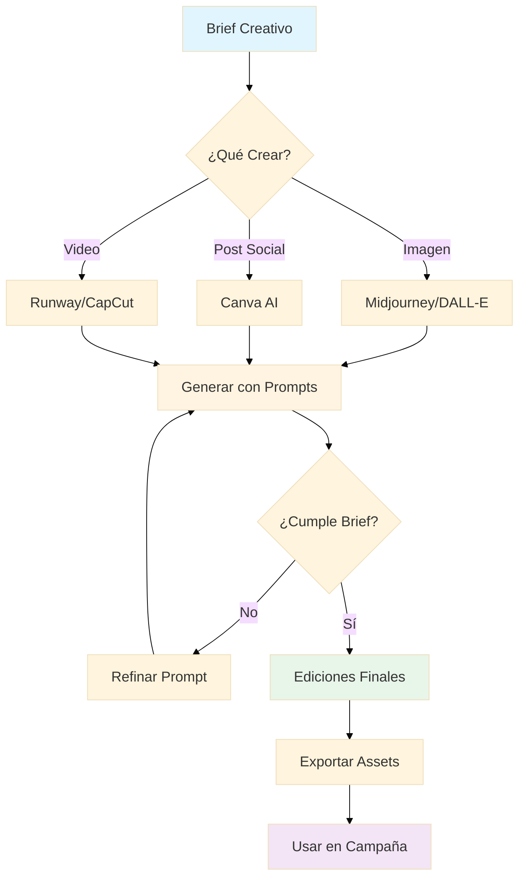
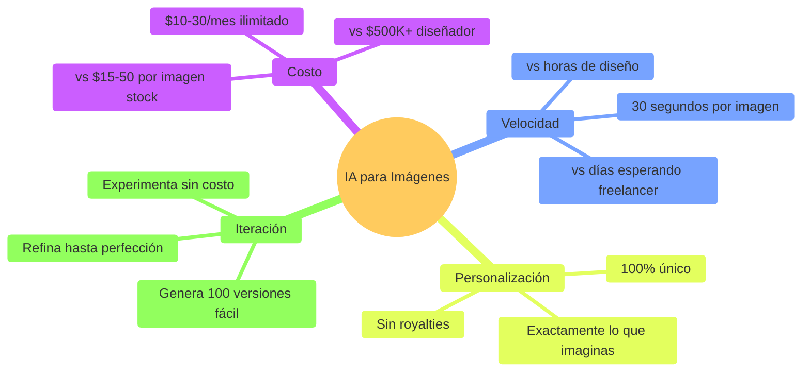

# Especialización A: Marketing Digital y E-commerce

## Trayecto Curricular
Módulos especializados para profesionales del marketing digital y comercio electrónico que buscan dominar las estrategias digitales modernas y optimización de conversión.

### Módulos Específicos
- **Publicidad Digital Avanzada**: Programmatic buying, retargeting
- **E-commerce Optimización**: Conversion rate optimization, A/B testing
- **Analytics y Métricas**: Google Analytics 4, data visualization avanzada
- **Automatización Marketing**: Workflows avanzados, customer journey
- **Growth Hacking**: Estrategias de crecimiento exponencial

## Competencias Especializadas
- Diseño de estrategias multicanal avanzadas
- Optimización técnica de conversiones
- Análisis predictivo de comportamiento usuario
- Automatización de marketing full-funnel
- Growth hacking para mercados competitivos

## Oportunidades Profesionales
- Growth Marketing Manager en startups tecnológicas
- E-commerce Director en retail digital
- Performance Marketing Specialist en agencias
- Product Marketing Manager para plataformas SaaS
- Consultancy digital para empresas tradicionales

---

# 🎨 Módulo 04: Herramientas de Diseño con IA

**Duración:** 4 horas  
**Nivel:** Principiante (sin experiencia en diseño requerida)  
**Track:** Marketing y Comunicación

---

## 🎯 ¿Qué Vas a Lograr?

Al finalizar este módulo, serás capaz de:

- [ ] Generar imágenes profesionales con Midjourney y DALL-E
- [ ] Diseñar posts para redes sociales con Canva AI
- [ ] Crear videos cortos con IA (Runway, CapCut)
- [ ] Mantener consistencia de marca visual
- [ ] Editar fotos con herramientas AI (remover fondos, upscaling)
- [ ] Usar OpenCode para automatizar generación de assets visuales

**⚠️ Importante**: No necesitas saber diseño gráfico. La IA hace el trabajo pesado, tú diriges la creatividad.

---

## 🧠 Analogía: IA como tu Departamento Creativo

Imagina que tienes un equipo de diseñadores trabajando para ti:

- **Midjourney/DALL-E** = Ilustrador profesional que trabaja 24/7
- **Canva AI** = Diseñador gráfico que conoce todas las tendencias
- **Runway** = Editor de video que crea animaciones rápido
- **OpenCode** = Director creativo que coordina todo

En Paraguay, agencias como **Tabú** y **Factoría** cobran ₲500K-2M por diseño de campaña. Con IA, puedes crear assets profesionales por **USD 10-30/mes**.

---

## 📊 Flujo de Diseño con IA



---

## 🖼️ Parte 1: Generación de Imágenes con IA (60 minutos)

### 1.1 ¿Por Qué Usar IA para Imágenes?

**Ventajas vs Stock Photos / Diseñadores:**



**Casos de Uso Paraguay:**
- 🍔 **Restaurante**: Fotos de platos que no existen (mockups de nuevo menú)
- 🏠 **Inmobiliaria**: Renders de propiedades antes de construir
- 👕 **E-commerce**: Modelos usando tu ropa (sin fotógrafo)
- 🎉 **Eventos**: Posters y flyers profesionales
- 📱 **Apps**: Iconos y screenshots para stores

### 1.2 Midjourney vs DALL-E vs Stable Diffusion

**Comparativa:**

| Herramienta | Costo | Mejor Para | Calidad | Curva Aprendizaje |
|-------------|-------|------------|---------|-------------------|
| **Midjourney** | $10/mes (200 imgs) | Arte, ilustraciones | ⭐⭐⭐⭐⭐ | Media |
| **DALL-E 3** | $20/mes (ChatGPT Plus) | Texto en imágenes | ⭐⭐⭐⭐ | Baja |
| **Stable Diffusion** | Gratis (local) | Control total | ⭐⭐⭐⭐ | Alta |
| **Leonardo.ai** | Gratis (150 imgs/día) | Variedad estilos | ⭐⭐⭐⭐ | Baja |

**Recomendación Paraguay**: Empezar con **Leonardo.ai (gratis)** + **DALL-E 3** (si ya tienes ChatGPT Plus).

### 1.3 Anatomía de un Prompt Perfecto

**Formula para Prompts de Imagen:**

```
[SUJETO] + [ACCIÓN] + [CONTEXTO] + [ESTILO] + [ILUMINACIÓN] + [MOOD] + [PARÁMETROS TÉCNICOS]
```

**Ejemplo Malo:**
```
un logo para cafetería
```

**Ejemplo Excelente:**
```
Logotipo minimalista para cafetería moderna llamada "Café Literario", 
combina taza de café humeante con silueta de libro abierto, 
paleta de colores: marrón cálido (#8B4513) y crema (#F5DEB3), 
estilo: flat design, limpio y profesional, 
fondo: transparente, 
vector art, alta resolución
```

**Resultado**: ✅ Logo profesional listo para usar

### 1.4 Ejemplos de Prompts por Caso de Uso

#### A) Post para Instagram (Restaurante)

```
Fotografía profesional cenital (top-down) de hamburguesa gourmet 
con carne angus, queso cheddar derretido, lechuga fresca, tomate, 
cebolla caramelizada, salsa especial, pan brioche tostado, 
acompanyada de papas fritas doradas y salsa a un costado, 
sobre mesa de madera rústica con textura visible, 
iluminación natural suave desde ventana lateral, 
profundidad de campo reducida (bokeh en fondo), 
mood: apetitoso y acogedor, 
colores vibrantes pero naturales, 
estilo: food photography profesional,
--ar 1:1 (cuadrado para Instagram)
```

#### B) Banner para E-commerce

```
Banner web moderno para tienda de ropa femenina, 
mujer paraguaya joven (25-30 años) sonriente usando vestido casual de verano, 
colores pasteles (rosa, celeste, blanco), 
fondo: ciudad de Asunción desenfocada (landmarks reconocibles), 
texto en espacio negativo: "NUEVA COLECCIÓN VERANO 2026", 
composición: regla de tercios, modelo a la derecha, 
estilo: lifestyle photography, luminoso y fresco, 
iluminación: golden hour, 
mood: aspiracional pero accesible,
--ar 16:9 (banner web)
```

#### C) Ilustración para Redes Sociales

```
Ilustración vectorial plana (flat design) estilo moderno, 
escena: emprendedor paraguayo trabajando en laptop en café, 
al fondo: skyline de Asunción simplificado con Panteón de los Héroes, 
paleta de colores: azul (#3498db), naranja (#e67e22), blanco, 
elementos: laptop, taza de café, celular, cuaderno, 
composición limpia con espacio negativo, 
estilo: minimalista, profesional pero amigable, 
sin texto, 
formato: cuadrado 1:1
```

---

## 🎨 Parte 2: Canva AI para Diseño Rápido (60 minutos)

### 2.1 ¿Por Qué Canva?

**Canva** = Photoshop simplificado + plantillas infinitas + IA integrada

**Plan Gratis vs Pro:**

| Feature | Gratis | Pro ($12.99/mes) |
|---------|--------|------------------|
| Plantillas | 250K+ | 610K+ |
| Fotos stock | 200K+ | 100M+ |
| Background Remover | ❌ | ✅ 1000/mes |
| Magic Eraser | ❌ | ✅ |
| Brand Kit | 1 | Ilimitado |
| Resize (Magic Resize) | ❌ | ✅ |
| Team collaboration | ❌ | ✅ |

**Recomendación**: Empezar gratis, upgrade si usas diario.

### 2.2 Crear Post de Instagram (Paso a Paso)

**Caso: E-commerce de Ropa**

**Paso 1: Elegir Plantilla**
1. Abrir canva.com
2. Buscar "Instagram Post" (1080x1080px)
3. Filtrar: E-commerce, Fashion
4. Elegir plantilla que te guste

**Paso 2: Personalizar**

```
Elementos a cambiar:
- Texto principal: "NUEVA COLECCIÓN"
- Subtexto: "Verano 2026 - Ya Disponible"
- Logo: Subir tu logo (esquina superior)
- Colores: Aplicar paleta de tu marca
- Foto: Reemplazar con tu producto
```

**Paso 3: Usar IA (Magic Edit)**

Si la foto de modelo no es perfecta:
```
1. Seleccionar área a editar
2. Click "Magic Edit"
3. Describir cambio: "cambiar fondo a playa paraguaya"
4. Generar
```

---

## 🎬 Parte 3: Videos con IA (60 minutos)

### 3.1 Herramientas de Video AI

| Herramienta | Gratis | De Pago | Mejor Para | Dificultad |
|-------------|--------|---------|------------|------------|
| **Runway** | 125 créditos | $12/mes | Efectos profesionales | Media |
| **CapCut** | ✅ Totalmente gratis | - | Edición rápida redes | Baja |
| **Descript** | 1h/mes | $12/mes | Videos con transcripción | Baja |
| **Synthesia** | - | $30/mes | Avatares AI (sin cámara) | Baja |
| **Canva Video** | ✅ Gratis | - | Animaciones simples | Baja |

**Recomendación Paraguay**: **CapCut (gratis)** para empezar.

---

## ✅ Checklist de Dominio del Módulo

Verifica que puedes hacer lo siguiente sin ayuda:

**Generación de Imágenes:**
- [ ] Escribir prompts efectivos para Midjourney/DALL-E
- [ ] Generar ilustraciones para posts sociales
- [ ] Crear mockups de productos
- [ ] Refinar resultados con parámetros

**Canva:**
- [ ] Diseñar post de Instagram en <10 minutos
- [ ] Configurar Brand Kit completo
- [ ] Crear plantillas reutilizables
- [ ] Usar Magic Edit y Background Remover

**Video:**
- [ ] Editar video corto (15-30 seg) en CapCut
- [ ] Agregar subtítulos automáticos
- [ ] Aplicar transiciones y efectos
- [ ] Exportar en formato correcto para plataforma

---

*Módulo 04 - Especialización Marketing Digital | FPUNA 2026*
