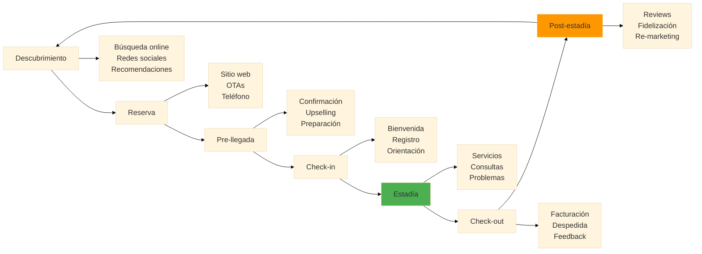
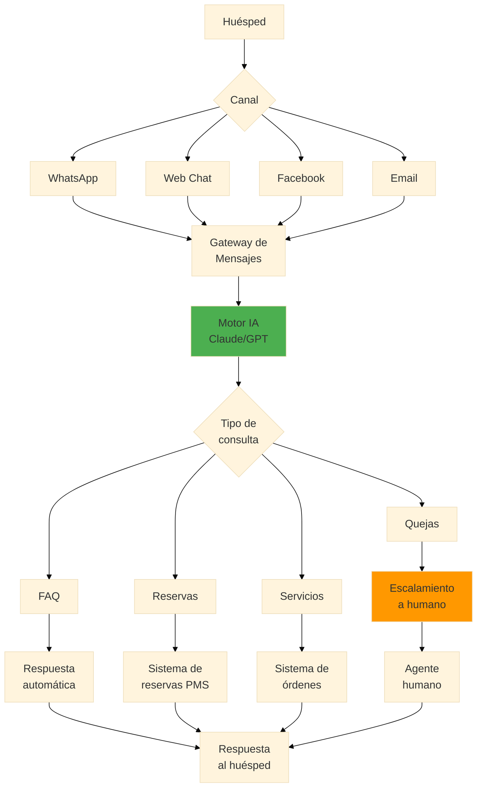
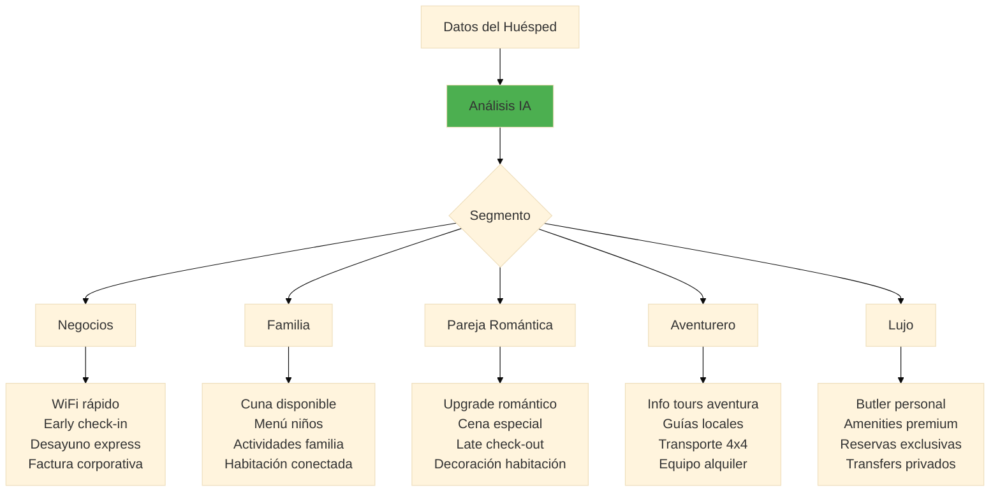

# Especialización B: Gestión de Negocios y Consultoría

## Trayecto Curricular
Ruta académica para futuros gestores empresariales y consultores especializados en estrategia corporativa y transformación digital de organizaciones.

### Módulos Específicos
- **Finanzas Corporativas**: Análisis financiero avanzado, valoración empresas
- **Gestión del Cambio**: Transformación organizacional, OD consulting
- **Consultoría Estratégica**: Metodologías de consulting, project management
- **Negociación Empresarial**: Técnicas avanzadas de negociación
- **Liderazgo Ejecutivo**: Dirección de equipos de alto rendimiento

## Competencias Especializadas
- Análisis financiero y modelado empresarial
- Diseño e implementación de estrategias corporativas
- Gestión de proyectos complejos de transformación
- Comunicación ejecutiva y presentación de resultados
- Liderazgo en entornos VUCA (volátiles, inciertos, complejos, ambiguos)

## Oportunidades Profesionales
- Consultor senior en firmas como McKinsey, Deloitte
- Director de estrategia en corporaciones multinacionales
- CEO o COO en empresas en crecimiento
- Inversionista venture capital y private equity
- Emprendedor con competencias de scaling empresarial

---

# 🏨 Servicio al Cliente con IA

**Duración:** 4 horas
**Nivel:** Intermedio
**Track:** Hospitalidad y Turismo

---

## ¿Qué Vas a Lograr?

Al completar este módulo, vas a poder:

- [ ] Implementar chatbots inteligentes para atención al huésped 24/7
- [ ] Crear respuestas personalizadas usando IA para diferentes tipos de consultas
- [ ] Diseñar sistemas de gestión de quejas y resolución de problemas con IA
- [ ] Automatizar comunicaciones con huéspedes (pre-llegada, durante estadía, post-checkout)
- [ ] Analizar feedback de clientes para mejora continua usando Claude/OpenCode

---

## La Analogía del Conserje Digital

Imagina el mejor conserje de un hotel 5 estrellas: conoce a cada huésped por nombre, recuerda sus preferencias, anticipa sus necesidades, y está disponible las 24 horas. Ahora imagina que podés clonar ese conserje y ponerlo en cada punto de contacto: WhatsApp, email, recepción, y web.

Eso es exactamente lo que la IA permite hacer en hospitalidad. No reemplaza el toque humano—lo amplifica. El objetivo es que tu equipo humano se enfoque en las interacciones de alto valor mientras la IA maneja las consultas rutinarias con la misma calidad.

---

## Parte 1: Fundamentos del Servicio al Cliente en Hospitalidad

### 1.1 El Ciclo del Huésped

**En cada etapa, la IA puede agregar valor:**

| Etapa | Oportunidad IA | Ejemplo |
|-------|---------------|---------|
| Descubrimiento | Contenido personalizado | Descripciones de destino por perfil |
| Reserva | Chatbot de ventas | Responder dudas 24/7 |
| Pre-llegada | Comunicación proactiva | Email de preparación personalizado |
| Check-in | Auto-servicio inteligente | Kiosko con reconocimiento |
| Estadía | Asistente virtual | WhatsApp para solicitudes |
| Check-out | Proceso simplificado | Factura automática |
| Post-estadía | Seguimiento | Solicitud de review personalizada |

---

## Parte 2: Chatbots para Atención al Huésped

### 2.1 Arquitectura de un Chatbot Hotelero

---

## Parte 3: Personalización de Experiencias

### 3.1 Segmentación de Huéspedes con IA

---

*Módulo 04B - Especialización Hospitalidad | FPUNA 2026*
