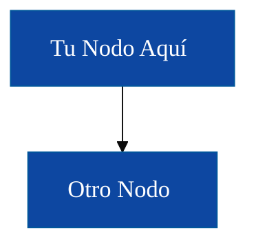
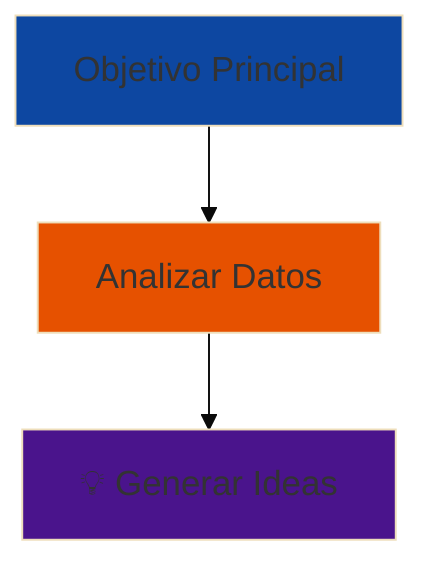
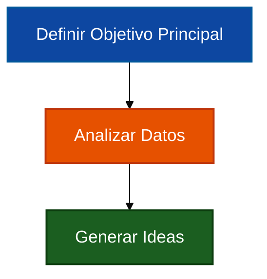

# Guía de Estilos para Diagramas - FPUNA 2026

**Versión:** 1.0  
**Fecha:** Enero 2026  
**Estado:** Estándar Oficial - TODOS los diagramas deben cumplir

---

## 🎯 Propósito

Esta guía asegura que todos los diagramas Mermaid del curso sean:
- **Accesibles**: Cumplimiento WCAG AAA (contraste mínimo 7:1)
- **Legibles**: Texto claro, tamaño apropiado
- **Consistentes**: Semántica de colores uniforme en todos los módulos
- **Profesionales**: Diseños limpios y ordenados

---

## 🎨 Paleta de Colores (Cumplimiento WCAG AAA)

### Colores Primarios (Usar Estos)

| Nombre del Color | Código Hex | Caso de Uso | Ratio de Contraste |
|------------------|------------|-------------|-------------------|
| **Azul Primario** | `#0d47a1` | Información, flujo principal, conceptos primarios | 10.4:1 ✅ |
| **Verde Éxito** | `#1b5e20` | Resultados positivos, caminos correctos, mejores prácticas | 9.7:1 ✅ |
| **Naranja Advertencia** | `#e65100` | Precaución, estados intermedios, atención requerida | 7.1:1 ✅ |
| **Rojo Error** | `#b71c1c` | Errores, alertas, caminos incorrectos | 8.9:1 ✅ |
| **Púrpura Acento** | `#4a148c` | Casos especiales, temas avanzados, destacados | 11.2:1 ✅ |
| **Gris Neutro** | `#424242` | Estados neutrales, fondos | 11.9:1 ✅ |

### Colores de Texto

| Color de Fondo | Color de Texto | Propósito |
|----------------|----------------|-----------|
| Colores oscuros (arriba) | `#ffffff` (blanco) | Máximo contraste sobre fondos oscuros |
| Blanco/Claro | Colores oscuros (arriba) | Máximo contraste sobre fondos claros |

### Mapeo Semántico de Colores (CONSISTENTE EN TODOS LOS DIAGRAMAS)

| Concepto | Color | Justificación |
|----------|-------|---------------|
| **Correcto/Bueno/Éxito** | Verde Éxito (`#1b5e20`) | Señal positiva universal |
| **Incorrecto/Malo/Error** | Rojo Error (`#b71c1c`) | Señal negativa universal |
| **Advertencia/Precaución** | Naranja Advertencia (`#e65100`) | Atención requerida |
| **Información/Neutral** | Azul Primario (`#0d47a1`) | Estado por defecto |
| **Avanzado/Especial** | Púrpura Acento (`#4a148c`) | Indica mayor complejidad |
| **Genérico/Marcador** | Gris Neutro (`#424242`) | Elementos no semánticos |

---

## 📏 Estándares de Tipografía

### Tamaño de Fuente

**TODOS los diagramas DEBEN incluir:**

```mermaid
%%{init: {'theme':'base', 'themeVariables': {'fontSize':'18px'}}}%%
```

### Guías de Texto

| Regla | Estándar | Ejemplo |
|-------|----------|---------|
| **Máx. líneas por caja** | 2 líneas | ✅ "Servicio Usuario<br>Autenticación y Perfiles" |
| **Máx. palabras por línea** | 8 palabras | ✅ "Generar reporte completo de cobertura de pruebas" |
| **Sin emoji en cajas** | Solo texto | ❌ "🎯 Objetivo Principal"<br>✅ "Objetivo Principal" |
| **Claridad de etiquetas** | Descriptivo, conciso | ✅ "Capa de Base de Datos"<br>❌ "Cosas de BD" |

### ¿Por Qué Sin Emoji?

- ❌ Se renderizan diferente en cada plataforma (Windows/Mac/Linux)
- ❌ Los lectores de pantalla no pueden interpretarlos correctamente
- ❌ Fallan en sistemas antiguos (se muestran como □)
- ❌ Violaciones de accesibilidad WCAG
- ✅ Usar emoji SOLO en encabezados markdown, no en cajas de diagramas

---

## 🏗️ Complejidad de Diagramas

### Límites de Nodos

| Tipo de Diagrama | Máx. Nodos | Justificación |
|------------------|------------|---------------|
| **Diagrama de flujo** | 7 nodos | Ley de Miller (5±2 elementos) |
| **Grafo** | 7 nodos | Claridad visual |
| **Mapa mental** | 12 nodos (3 por rama) | La estructura jerárquica permite más |
| **Secuencia** | 5 actores | Legibilidad en flujo secuencial |

**Si necesitas más:** Divide en múltiples diagramas o usa subgrafos.

### Límites de Flechas

- **Máximo 10 flechas** por diagrama
- Usa subgrafos para agrupar nodos relacionados
- Prefiere flujo lineal claro sobre redes complejas

---

## 📐 Configuraciones Estándar de Mermaid

### Plantilla Base (Copiar Esto)



### Estilizado Manual (Cuando Sea Necesario)


---

## 🔄 Guía de Migración

### Reemplazar Colores Antiguos

| Color Antiguo (Pastel Claro) | Color Nuevo (WCAG AAA) | Buscar/Reemplazar |
|------------------------------|------------------------|-------------------|
| `#E1F5FF` (azul bebé) | `#0d47a1` (azul primario) | Reemplazo global |
| `#FFF4E1` (crema) | `#e65100` (naranja advertencia) | Reemplazo global |
| `#FFE1F5` (rosa bebé) | `#4a148c` (púrpura acento) | Reemplazo global |
| `#E1FFE1` (verde menta) | `#1b5e20` (verde éxito) | Reemplazo global |
| `#FFE1E1` (rosa claro) | `#b71c1c` (rojo error) | Reemplazo global |
| `#FFB6C1` (rosa claro 2) | `#b71c1c` (rojo error) | Reemplazo global |
| `#90EE90` (verde claro) | `#1b5e20` (verde éxito) | Reemplazo global |

### Eliminar Emoji

**Patrón a buscar:** Cualquier emoji en etiquetas de nodos

```regex
\["[^\]]*[🎯📊🌐💼💾🗄️⚡🔌📐🔬📄☕🔄📋🎓🚀💡🏗️]\s*([^"]+)"\]
```

**Reemplazar con:** Etiquetas solo de texto

### Agregar fontSize

**Buscar:** `^```mermaid$`  
**Reemplazar con:**
```
```mermaid
%%{init: {'theme':'base', 'themeVariables': {'fontSize':'18px'}}}%%
```

---

## ✅ Lista de Verificación Antes de Confirmar Diagramas

- [ ] Todos los colores tienen ratio de contraste mínimo 7:1
- [ ] `fontSize: 18px` configurado
- [ ] Sin emoji en cajas de diagramas
- [ ] Máximo 2 líneas por nodo
- [ ] Máximo 7 nodos (o agrupados apropiadamente en subgrafos)
- [ ] Colores semánticos usados consistentemente
- [ ] Probado en móvil (ancho 320px)
- [ ] Probado en proyector (1920x1080)

---

## 🎓 Ejemplos: Antes y Después

### ❌ ANTES (No Cumple)



**Problemas:**
- Emoji en cajas (falla de accesibilidad)
- Pasteles claros (falla de contraste)
- Sin fontSize especificado

### ✅ DESPUÉS (Cumple)



**Mejoras:**
- ✅ Etiquetas solo de texto
- ✅ Colores cumpliendo WCAG AAA
- ✅ fontSize de 18px
- ✅ Significado semántico claro

---

## 📚 Recursos

- **Verificador de Contraste WCAG:** https://webaim.org/resources/contrastchecker/
- **Documentación de Mermaid:** https://mermaid.js.org/
- **Simulador de Daltonismo:** https://www.color-blindness.com/coblis-color-blindness-simulator/

---

## 🔄 Historial de Versiones

| Versión | Fecha | Cambios |
|---------|-------|---------|
| 1.0 | Enero 2026 | Lanzamiento inicial - Estándares WCAG AAA establecidos |

---

*Este es un documento vivo. Sugiere mejoras mediante pull request.*
