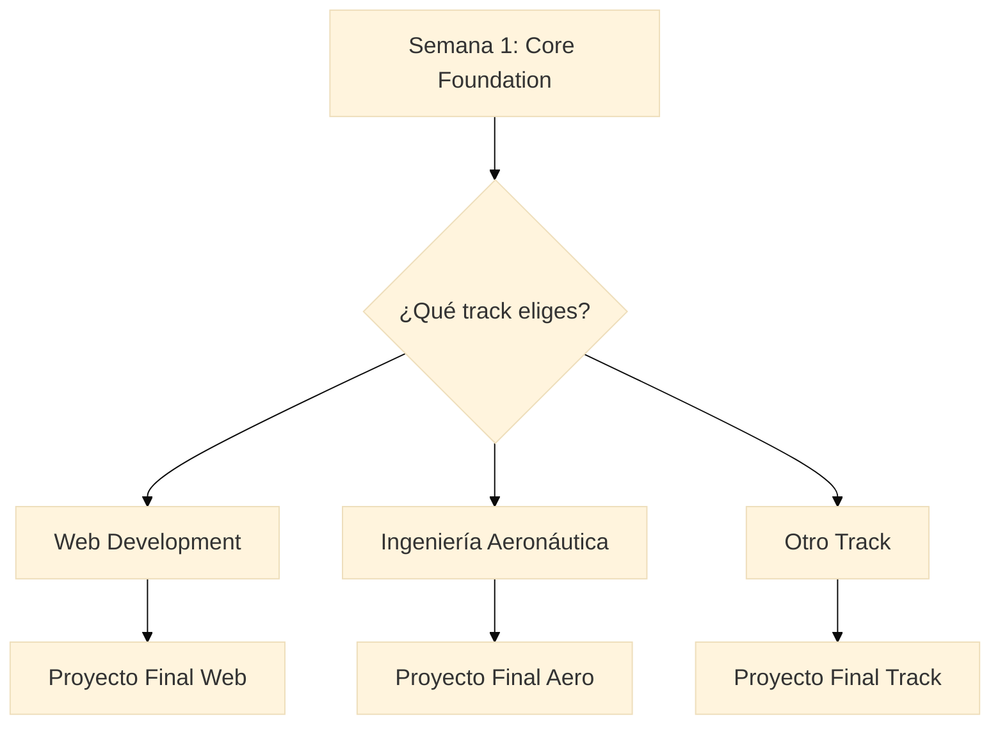

# Guía del Estudiante - FPUNA 2026

## Programa de Desarrollo Aumentado con IA

**Bienvenido/a al curso de verano más innovador de FPUNA** 🎓

Esta guía te ayudará a navegar exitosamente el programa, aprovechar al máximo los materiales, y lograr tus objetivos de aprendizaje.

---

## 📋 Tabla de Contenidos

1. [Bienvenida y Visión General](#bienvenida-y-visión-general)
2. [Estructura del Programa](#estructura-del-programa)
3. [Cómo Navegar el Curso](#cómo-navegar-el-curso)
4. [Prerequisitos y Preparación](#prerequisitos-y-preparación)
5. [Rutas de Estudio Recomendadas](#rutas-de-estudio-recomendadas)
6. [Cómo Usar los Materiales](#cómo-usar-los-materiales)
7. [Evaluaciones y Quizzes](#evaluaciones-y-quizzes)
8. [Consejos para el Éxito](#consejos-para-el-éxito)
9. [Obtener Ayuda y Soporte](#obtener-ayuda-y-soporte)
10. [Configuración Técnica](#configuración-técnica)
11. [Preguntas Frecuentes](#preguntas-frecuentes)

---

## 🎯 Bienvenida y Visión General

### ¿Qué aprenderás?

En este programa de 2 semanas aprenderás a:

✅ **Configurar y usar herramientas de IA** como OpenCode y Oh My OpenCode  
✅ **Acelerar tu trabajo académico** con asistentes de IA especializados  
✅ **Aplicar IA a tu disciplina específica** (ingeniería, marketing, investigación, etc.)  
✅ **Desarrollar proyectos reales** usando técnicas de desarrollo aumentado con IA  
✅ **Adoptar mejores prácticas** de la industria para trabajar con IA

### ¿Por qué este curso es diferente?

- **Práctico desde el día 1**: No solo teoría, sino configuración y uso real
- **Personalizado a tu carrera**: Contenido especializado para tu disciplina
- **Herramientas profesionales**: Las mismas herramientas usadas en empresas top
- **Proyecto final aplicado**: Creas algo útil para tu campo de estudio
- **100% gratuito**: Todas las herramientas son de código abierto o tienen versión gratuita

### ¿Qué NO es este curso?

❌ No es un curso de programación desde cero  
❌ No es solo teoría sobre IA  
❌ No requiere conocimientos previos de machine learning  
❌ No enseña a crear modelos de IA (enseña a USAR IA ya existente)

---

## 📚 Estructura del Programa

### Semana 1: Fundamentos Universales (8 horas)

**Para**: TODOS los estudiantes (todas las carreras juntas)

| Día | Módulo | Tema | Duración |
|-----|--------|------|----------|
| **Lunes** | Core-01 | Instalación del Stack de IA | 1.5 horas |
| **Lunes** | Core-02 | Dominio de Configuración | 1.5 horas |
| **Martes** | Core-03 | Ingeniería de Prompts | 1.5 horas |
| **Martes** | Core-04 | Ingeniería de Contexto | 1.5 horas |
| **Miércoles** | Core-05 | Proyecto en Vivo (Demo 1-Shot) | 1 hora |
| **Miércoles** | Core-06 | Patrones de Trabajo | 1 hora |

**Objetivo**: Al terminar la Semana 1, tendrás OpenCode completamente configurado y sabrás usarlo para proyectos básicos.

### Semana 2: Especialización por Carrera (10 horas)

**Para**: Grupos separados por track/carrera

#### Tracks Disponibles

| Track | Para quién | Módulos | Herramientas Especiales |
|-------|------------|---------|------------------------|
| **Web Development** | Desarrollo Web Full-Stack | 5 | Next.js, Prisma, Tailwind |
| **Ingeniería Aeronáutica** | Estudiantes de Aeronáutica | 5 | CATIA V5, ANSYS Fluent |
| **Desarrollo de Software** | Ingeniería Informática | 5 | Git, Docker, APIs |
| **QA Automation** | Testing y Calidad | 1 | Playwright, API Testing |
| **Marketing y Comunicación** | Marketing Digital | 1 | Analytics, Social Media |
| **Investigación Académica** | Investigadores, Posgrado | 1 | Papers, Research Tools |
| **Electrónica y Automatización** | Ing. Electrónica, Mecatrónica | 5 | AutoCAD, KiCad |
| **Hospitalidad y Turismo** | Hotelería y Turismo | 4 | CRM, Booking Systems |

**Objetivo**: Aplicar las herramientas de IA a problemas reales de tu carrera.

---

## 🗺️ Cómo Navegar el Curso

### Estructura de Directorios

```
FPUNA-2026/
│
├── 📂 00-FUNDAMENTOS/     ← Empieza aquí (Semana 1)
│   ├── 01-ai-stack-setup/
│   ├── 02-configuration-mastery/
│   ├── 03-prompt-engineering/
│   ├── 04-context-engineering/
│   ├── 05-live-project/
│   └── 06-workflow-patterns/
│
├── 📂 COMPARTIDO/                     ← Recursos compartidos
│   ├── instalacion-opencode/
│   ├── configuracion-mcp/
│   ├── sistema-skills/
│   └── plantillas-proyecto/
│
├── 📂 08-WEB-DEVELOPMENT/            ← Ejemplo de Track (Semana 2)
│   ├── 01-nextjs-foundations/
│   ├── 02-full-stack-development/
│   ├── 03-auth-authorization/
│   ├── 04-ui-ux-styling/
│   └── 05-deployment-ai/
│
└── 📂 03-INGENIERIA-AERONAUTICA/    ← Otro ejemplo de Track
    ├── 01-cad-with-ai/
    ├── 02-aerodynamics-cfd/
    ├── 03-structures-materials/
    ├── 04-propulsion-systems/
    └── 05-aircraft-design/
```

### Anatomía de un Módulo

Cada módulo sigue esta estructura consistente:

```
📄 [nombre-modulo].md
├── 📌 Introducción
├── 🎯 Objetivos de Aprendizaje
├── 📋 Prerequisitos                  ← NUEVO: Revisa ANTES de empezar
│   ├── Conocimientos requeridos
│   ├── Software necesario
│   ├── Autoevaluación
│   └── Lista de verificación
├── 📚 Contenido Principal
│   ├── Sección 1: Teoría
│   ├── Sección 2: Práctica guiada
│   └── Sección 3: Ejercicio hands-on
├── ✅ Quiz de Evaluación             ← NUEVO: 10 preguntas con respuestas
└── ➡️ Próximos Pasos
```

### Sistema de Navegación

**En cada módulo encontrarás**:

- **Prerequisitos** al inicio → Revisa que cumples con lo necesario
- **Enlaces de navegación** al final → Ir al siguiente módulo
- **Referencias cruzadas** → Enlaces a recursos relacionados
- **Quizzes de validación** → Autoevalúa tu comprensión

---

## 📝 Prerequisitos y Preparación

### Antes de Empezar el Curso

#### Conocimientos Mínimos

| Skill | Nivel Requerido | Cómo Validar |
|-------|-----------------|--------------|
| **Uso de computadora** | Básico | Puedes instalar software, navegar carpetas |
| **Inglés técnico** | Lectura básica | Puedes leer documentación en inglés |
| **Línea de comandos** | Muy básico | Has usado Terminal o CMD alguna vez |
| **Editor de texto** | Básico | Sabes usar Notepad++ o VS Code |

**Nota**: NO necesitas saber programación avanzada. El curso te guiará paso a paso.

#### Equipo Necesario

**Hardware mínimo**:
- ✅ Computadora con Windows 10/11, macOS 10.15+, o Linux
- ✅ 8 GB RAM (recomendado: 16 GB)
- ✅ 20 GB espacio en disco
- ✅ Conexión a Internet estable

**Software que instalarás (durante Core-01)**:
- Node.js 18+ (gratis)
- Visual Studio Code (gratis)
- Git (gratis)
- OpenCode (gratis)
- Oh My OpenCode (gratis)

#### Cuentas que Necesitas

Crea estas cuentas ANTES del primer día:

1. **GitHub** (github.com) - Para control de versiones
2. **Anthropic** (anthropic.com) - Para API de Claude (opcional, hay plan gratuito)
3. **OpenAI** (openai.com) - Para API de GPT (opcional)

**Importante**: Puedes empezar sin APIs de pago. Hay formas gratuitas de usar el curso.

### Preparación por Track (Semana 2)

Dependiendo de tu track, necesitarás software adicional:

#### Web Development
- Node.js (ya instalado en Core-01)
- PostgreSQL o SQLite

#### Ingeniería Aeronáutica
- CATIA V5 (si tienes licencia de FPUNA)
- ANSYS Fluent (acceso de laboratorio)

#### QA Automation
- Playwright (se instala durante el track)
- Postman (gratis)

#### Marketing
- Acceso a redes sociales (Facebook, Instagram, LinkedIn)
- Google Analytics (cuenta gratuita)

**Nota**: Los requisitos específicos están en la sección de Prerequisites de cada módulo.

---

## 🛤️ Rutas de Estudio Recomendadas

### Ruta Estándar (Recomendada para 90% de estudiantes)



**Timeline**:
- **Días 1-3**: Core Foundation (módulos 01-06)
- **Día 4**: Transición a Track + Módulo 1 del Track
- **Días 5-8**: Módulos 2-5 del Track
- **Días 9-10**: Proyecto Final + Presentación

### Ruta Acelerada (Para estudiantes con experiencia previa)

Si ya tienes experiencia con:
- VS Code y herramientas de desarrollo
- Git y GitHub
- Línea de comandos

**Puedes**:
1. Revisar Core-01 y Core-02 en 1 hora (lectura rápida)
2. Enfocarte más en Core-03 y Core-04 (nuevos para ti)
3. Dedicar más tiempo a los módulos de especialización

**No puedes**:
❌ Saltarte completamente los Core modules  
❌ Ir directo al Track sin configurar OpenCode  
❌ Saltarte los Prerequisites de cada módulo

### Ruta para Principiantes Totales

Si nunca has programado o usado herramientas de desarrollo:

**Semana Pre-Curso (opcional)**:
- Tutorial básico de línea de comandos (2 horas)
- Instalar VS Code y familiarizarte (1 hora)
- Tutorial básico de Git (1 hora)

**Durante el Curso**:
- Dedica 30 minutos extra por módulo Core
- Practica cada ejemplo hands-on
- No avances hasta dominar el módulo actual
- Usa el Slack del curso para preguntas

---

## 📖 Cómo Usar los Materiales

### Formato de los Módulos

Todos los módulos están en **Markdown** (.md). Puedes leerlos en:

1. **GitHub** (online, con formato bonito)
2. **VS Code** (con preview, recomendado durante prácticas)
3. **Cualquier editor de texto** (sin formato)

### Sistema de Prerequisites (NUEVO)

**Cada módulo mejorado tiene una sección de Prerequisites** que incluye:

#### 1. Conocimientos Previos Requeridos

Lista específica de qué debes saber. Ejemplo:

```markdown
✅ Entiendes qué es una API
✅ Has usado la línea de comandos básica
✅ Sabes qué es JSON
```

**Cómo usar**: Si no cumples con algo, busca el módulo anterior que lo enseña.

#### 2. Software y Herramientas

Lista de software que debe estar instalado. Ejemplo:

```markdown
✅ Node.js 18+ instalado
✅ VS Code con extensión Playwright
✅ Git configurado con tu usuario
```

**Cómo usar**: Instala todo ANTES de empezar el módulo. Sigue los enlaces de instalación.

#### 3. Autoevaluación de Preparación

Preguntas para validar si estás listo. Ejemplo:

```markdown
1. ¿Puedes ejecutar `node --version` y ver una versión 18+?
2. ¿Tienes un proyecto de prueba donde practicar?
3. ¿Entiendes la diferencia entre desarrollo y producción?
```

**Cómo usar**: Responde honestamente. Si contestas "No" a algo crítico, prepárate más.

#### 4. Lista de Verificación Pre-Módulo

Checklist práctica. Ejemplo:

```markdown
- [ ] Leí los objetivos del módulo
- [ ] Instalé el software necesario
- [ ] Revisé el módulo anterior
- [ ] Tengo 1.5 horas sin interrupciones
```

**Cómo usar**: Marca cada item antes de empezar el contenido principal.

### Cómo Estudiar Efectivamente

#### Durante la Lectura

1. **Lee los objetivos primero** → Saber a dónde vas
2. **Revisa los Prerequisites completos** → Validar preparación
3. **Lee el contenido principal** → Entender conceptos
4. **Pausa en cada ejemplo hands-on** → Practicar inmediatamente
5. **Toma el quiz al final** → Validar comprensión

#### Durante la Práctica

**NO hagas**:
❌ Copiar y pegar código sin entender  
❌ Avanzar si algo no funciona  
❌ Saltarte ejercicios "porque ya entendí"

**SÍ haz**:
✅ Escribe el código tú mismo (aprenderás más)  
✅ Experimenta cambiando valores  
✅ Rompe cosas intencionalmente para ver qué pasa  
✅ Anota dudas y pregúntalas en Slack

#### Manejo del Tiempo

| Módulo Core | Tiempo Estimado | Recomendación |
|-------------|-----------------|---------------|
| Core-01, 02 | 1.5 horas c/u | Una sesión matutina |
| Core-03, 04 | 1.5 horas c/u | Una sesión vespertina |
| Core-05 | 1 hora | Práctica intensiva |
| Core-06 | 1 hora | Consolidación |

**Tracks especializados**: 2 horas por módulo (más complejos)

---

## 📝 Evaluaciones y Quizzes

### Sistema de Quizzes (NUEVO)

**Cada módulo mejorado incluye un quiz de 10 preguntas** con:

- ✅ **Preguntas de opción múltiple** (A, B, C, D)
- ✅ **Answer Key incluido** (respuestas correctas + explicación)
- ✅ **Categorías variadas**: Conceptos, Comandos, Troubleshooting, Best Practices

### Cómo Usar los Quizzes

#### Paso 1: Toma el Quiz Sin Mirar las Respuestas

Después de leer el módulo:
1. Ve a la sección "Evaluación"
2. Responde las 10 preguntas en un papel o documento
3. NO mires el Answer Key todavía

#### Paso 2: Califica Tu Quiz

1. Ve a la sección "Answer Key"
2. Compara tus respuestas
3. Cuenta cuántas acertaste

#### Paso 3: Interpreta Tu Resultado

| Resultado | Interpretación | Acción Recomendada |
|-----------|----------------|-------------------|
| **9-10 correctas** | Excelente dominio | Continúa al siguiente módulo |
| **7-8 correctas** | Buen entendimiento | Revisa temas que fallaste, luego continúa |
| **5-6 correctas** | Comprensión parcial | Relee las secciones donde fallaste |
| **< 5 correctas** | Necesitas repasar | Vuelve a estudiar el módulo completo |

#### Paso 4: Aprende de los Errores

**El Answer Key incluye explicaciones**. Para cada pregunta que fallaste:

1. Lee la explicación de por qué la respuesta correcta es correcta
2. Vuelve a leer esa sección del módulo
3. Practica ese concepto específico
4. Retoma el quiz después de repasar

### No Hay Calificaciones Formales (¡Es Autogestión!)

**Importante**: Los quizzes son para TU beneficio, no para una nota.

- ✅ Úsalos honestamente para validar tu aprendizaje
- ✅ Repítelos cuantas veces necesites
- ✅ Pregunta en Slack si no entiendes una respuesta
- ❌ No te engañes a ti mismo pasando sin entender

---

## 💡 Consejos para el Éxito

### Mentalidad de Aprendizaje

#### 1. La IA es tu Asistente, No tu Reemplazo

**Correcto**:
- Usas IA para acelerar tareas repetitivas
- Entiendes el código que la IA genera
- Validas que la solución de IA sea correcta

**Incorrecto**:
- Copias ciegamente lo que la IA genera
- No entiendes qué hace el código
- Asumes que la IA siempre tiene razón

#### 2. Falla Rápido, Aprende Rápido

**No tengas miedo de**:
- Romper cosas (puedes usar Git para revertir)
- Hacer preguntas "tontas" (no existen)
- Intentar cosas que no estás seguro si funcionarán

**El mejor aprendizaje viene de**:
- Enfrentar errores y resolverlos
- Experimentar y probar hipótesis
- Comparar tu código con el de compañeros

#### 3. Colabora, No Compitas

**Este curso fomenta**:
- ✅ Ayudar a compañeros que tienen dudas
- ✅ Compartir descubrimientos útiles en Slack
- ✅ Trabajar en pares para ejercicios
- ✅ Revisar el código de otros (peer review)

**NO es**:
- ❌ Una competencia de quién termina primero
- ❌ Un espacio para demostrar superioridad
- ❌ Un ambiente donde guardar conocimiento

### Mejores Prácticas Técnicas

#### Durante Semana 1 (Core Foundation)

1. **Documenta tu configuración**: Anota qué instalaste y cómo
2. **Crea un proyecto de prueba**: Un repo donde experimentar libremente
3. **Practica comandos básicos**: Git, npm, node
4. **Configura backups**: Sync tu código con GitHub

#### Durante Semana 2 (Especialización)

1. **Lee prerequisites ANTES de clase**: Llegarás preparado
2. **Instala software específico con anticipación**: Evita perder tiempo
3. **Ten un editor de código listo**: VS Code configurado
4. **Prepara preguntas específicas**: Para aprovechar al instructor

#### Organización de Archivos

```
mis-proyectos-fpuna/
├── 00-core-practice/          # Experimentos de Semana 1
│   ├── primer-prompt.md
│   ├── test-opencode/
│   └── ejercicios-core/
├── 01-track-web/              # Proyectos de tu track
│   ├── modulo-01/
│   ├── modulo-02/
│   └── proyecto-final/
└── recursos/                  # Notas y recursos
    ├── mis-notas.md
    ├── comandos-utiles.md
    └── troubleshooting.md
```

### Hábitos de Estudio Efectivos

#### Técnica Pomodoro Adaptada

```
25 min: Lectura/Estudio enfocado
5 min:  Break (levántate, estira)
25 min: Práctica hands-on
5 min:  Break
25 min: Ejercicio del módulo
10 min: Quiz y reflexión

Total: ~90 minutos = 1 módulo
```

#### Revisión Espaciada

| Día | Actividad |
|-----|-----------|
| **Día 1** | Aprendes Core-01 |
| **Día 2** | Revisas resumen Core-01 (5 min) + Aprendes Core-02 |
| **Día 3** | Revisas Core-01 y 02 (10 min) + Aprendes Core-03 |
| **Día 5** | Repaso general Semana 1 (30 min) |

#### Método Feynman (Enseña para Aprender)

Después de cada módulo:
1. Explica el concepto a un compañero (o a un pato de goma)
2. Si te trabas en algo, vuelve a estudiar esa parte
3. Simplifica tu explicación (si no puedes explicarlo simple, no lo entiendes)

---

## 🆘 Obtener Ayuda y Soporte

### Canales de Soporte

#### 1. Slack Workspace (Primario)

**Canales principales**:
- `#general` - Anuncios y discusión general
- `#core-foundation` - Preguntas de Semana 1
- `#track-[nombre]` - Preguntas específicas de tu track
- `#troubleshooting` - Problemas técnicos
- `#show-and-tell` - Comparte tus proyectos

**Cómo preguntar efectivamente**:

✅ **Buena pregunta**:
```
Hola! Estoy en Core-02, sección de configuración MCP.
Cuando ejecuto `opencode config validate`, obtengo este error:
[copiar error aquí]

Ya intenté:
- Reiniciar VS Code
- Verificar que el archivo existe

¿Alguien sabe qué puede estar pasando?
```

❌ **Mala pregunta**:
```
No funciona, ayuda!!!
```

#### 2. Horas de Oficina (Office Hours)

**Cuándo**: Lunes a Viernes, 4:00 PM - 5:00 PM  
**Dónde**: Sala 301 (o Zoom link en Slack)  
**Para qué**: Preguntas complejas, debugging 1-on-1, revisión de proyectos

**Cómo aprovecharlas**:
1. Lleva tu código listo (en una laptop)
2. Explica qué intentaste hacer
3. Muestra el error específico
4. Pregunta por conceptos que no entiendas

#### 3. Foros del Curso (GitHub Discussions)

**Para**:
- Discusiones largas sobre conceptos
- Propuestas de mejoras al curso
- Compartir recursos útiles que encontraste

**No para**:
- Urgencias (usa Slack)
- Bugs de software (reporta en GitHub Issues)

#### 4. Recursos de Documentación

**Cuando tengas dudas técnicas, busca primero en**:

| Herramienta | Documentación Oficial |
|-------------|----------------------|
| **OpenCode** | [opencode.ai](https://opencode.ai/) |
| **Node.js** | [nodejs.org/docs](https://nodejs.org/docs) |
| **Git** | [git-scm.com/doc](https://git-scm.com/doc) |
| **VS Code** | [code.visualstudio.com/docs](https://code.visualstudio.com/docs) |

### Problemas Comunes y Soluciones

#### "OpenCode no se instala"

**Solución**:
1. Verifica que tienes Node.js 18+: `node --version`
2. Visita https://opencode.ai/ para instrucciones actualizadas
3. Intenta: `curl -fsSL https://opencode.ai/install | bash` (macOS/Linux)
4. O usa npm: `npm install -g opencode`
5. Si falla, comparte el error completo en `#troubleshooting`

#### "No puedo acceder a las APIs de IA"

**Solución**:
1. Verifica que tienes créditos en tu cuenta Anthropic/OpenAI
2. Revisa que la API key esté en `.env` correctamente
3. Usa la versión gratuita del curso (no requiere APIs propias)

#### "El código del ejemplo no funciona"

**Solución**:
1. Verifica que copiaste todo el código (incluye imports)
2. Revisa que las versiones de dependencias sean correctas
3. Compara con el ejemplo oficial en GitHub
4. Pregunta en Slack con el código que usaste

---

## ⚙️ Configuración Técnica

### Checklist de Instalación (Antes del Día 1)

#### Básico (Obligatorio)

```markdown
- [ ] Node.js 18+ instalado
      Verificar: `node --version`
      Descargar: https://nodejs.org

- [ ] Git instalado
      Verificar: `git --version`
      Descargar: https://git-scm.com

- [ ] VS Code instalado
      Descargar: https://code.visualstudio.com

- [ ] Cuenta de GitHub creada
      Registrarse: https://github.com/signup

- [ ] Git configurado con tu info
      Ejecutar: `git config --global user.name "Tu Nombre"`
      Ejecutar: `git config --global user.email "tu@email.com"`
```

#### OpenCode (Se instala en Core-01)

```markdown
- [ ] OpenCode instalado globalmente
      Sitio oficial: https://opencode.ai/
      macOS/Linux: `curl -fsSL https://opencode.ai/install | bash`
      NPM: `npm install -g opencode`
      Homebrew: `brew install opencode`

- [ ] Verificar instalación
      Ejecutar: `opencode --version`

- [ ] Iniciar OpenCode
      Ejecutar: `opencode`
```

#### Opcional (Mejora la Experiencia)

```markdown
- [ ] Oh My OpenCode instalado
      Instrucciones en Core-02

- [ ] Anthropic API Key (si tienes plan de pago)
      Obtener en: https://console.anthropic.com

- [ ] GitHub Copilot (si tienes licencia de estudiante)
      Aplicar en: https://education.github.com
```

### Configuración Recomendada de VS Code

#### Extensiones Útiles

| Extensión | Para qué | Prioridad |
|-----------|----------|-----------|
| **OpenCode** | Interacción con IA | Obligatoria |
| **Prettier** | Formateo de código | Recomendada |
| **ESLint** | Linting de JavaScript | Recomendada |
| **GitLens** | Mejor visualización de Git | Opcional |
| **Markdown Preview Enhanced** | Leer módulos con formato | Opcional |

#### Settings Recomendados

Abre `settings.json` en VS Code y agrega:

```json
{
  "editor.formatOnSave": true,
  "editor.tabSize": 2,
  "files.autoSave": "afterDelay",
  "terminal.integrated.defaultProfile.windows": "Git Bash"
}
```

### Troubleshooting de Instalación

#### Windows

**Problema**: "No se reconoce npm como comando"
**Solución**: Agrega Node.js al PATH
```
1. Panel de Control → Sistema → Variables de entorno
2. Editar PATH
3. Agregar: C:\Program Files\nodejs\
4. Reiniciar terminal
```

#### macOS

**Problema**: "Permission denied al instalar npm packages"
**Solución**: Usa nvm (Node Version Manager)
```bash
curl -o- https://raw.githubusercontent.com/nvm-sh/nvm/v0.39.0/install.sh | bash
nvm install 18
nvm use 18
```

#### Linux

**Problema**: "EACCES: permission denied"
**Solución**: Configura npm prefix
```bash
mkdir ~/.npm-global
npm config set prefix '~/.npm-global'
echo 'export PATH=~/.npm-global/bin:$PATH' >> ~/.bashrc
source ~/.bashrc
```

---

## ❓ Preguntas Frecuentes

### Sobre el Curso

**P: ¿Necesito saber programar para tomar este curso?**  
R: No necesitas ser experto, pero ayuda tener conocimientos básicos. Lo más importante es tener actitud de aprender y no tener miedo de experimentar.

**P: ¿Las herramientas son gratis?**  
R: Sí, todas las herramientas base son gratuitas. Las APIs de IA tienen planes gratuitos limitados, pero el curso se puede completar sin pagar.

**P: ¿Puedo cambiar de track después de empezar Semana 2?**  
R: Sí, pero perderás tiempo. Es mejor elegir bien desde el inicio. Habla con el instructor si tienes dudas.

**P: ¿Hay certificado al terminar?**  
R: Sí, FPUNA otorga certificado de asistencia si completas el 80% del curso y el proyecto final.

### Sobre los Materiales

**P: ¿Los módulos están en español o inglés?**  
R: Todos los módulos están en español. Algunos términos técnicos se mantienen en inglés (estándar de la industria).

**P: ¿Puedo descargar todos los materiales?**  
R: Sí, todo está en GitHub. Puedes clonar el repositorio y tener todo offline.

**P: ¿Los quizzes son obligatorios?**  
R: No hay evaluaciones formales obligatorias, pero los quizzes te ayudan a validar tu aprendizaje. Úsalos como herramienta de estudio.

**P: ¿Qué pasa si no apruebo un quiz?**  
R: No hay "aprobar" o "reprobar". Los quizzes son autogestionados para TU beneficio. Repítelos hasta entender los conceptos.

### Sobre Soporte

**P: ¿Hay clases en vivo o es todo asincrónico?**  
R: Depende de la modalidad de tu cohort. Normalmente hay 2 horas de clase presencial + trabajo autónomo.

**P: ¿Qué hago si me quedo atascado en un problema?**  
R: Sigue este orden:
1. Relee el módulo
2. Busca en Google/Stack Overflow
3. Pregunta en Slack `#troubleshooting`
4. Asiste a Office Hours

**P: ¿Puedo contactar directamente al instructor?**  
R: Usa Slack o Office Hours. Evita emails para preguntas técnicas (otros también aprenderán de tu pregunta en Slack).

### Sobre el Proyecto Final

**P: ¿Cuándo empiezo el proyecto final?**  
R: Después de completar todos los módulos de tu track (últimos 2 días del curso).

**P: ¿Puedo trabajar en equipo para el proyecto final?**  
R: Sí, equipos de 2-3 personas son permitidos y recomendados.

**P: ¿Qué pasa si no termino el proyecto a tiempo?**  
R: Puedes pedir extensión de 1 semana para entregar. Habla con el instructor.

---

## 🚀 ¡Estás Listo para Empezar!

### Tu Próximo Paso

✅ **Has leído esta guía completa**  
✅ **Entiendes la estructura del programa**  
✅ **Sabes cómo navegar los materiales**  
✅ **Conoces dónde obtener ayuda**

**Ahora ve a**:

➡️ **[00-FUNDAMENTOS/01-ai-stack-setup.md](./00-FUNDAMENTOS/01-ai-stack-setup.md)**

### Recordatorios Finales

1. **Lee los Prerequisites** de cada módulo ANTES de empezar
2. **Toma los quizzes** honestamente para validar tu aprendizaje
3. **Pregunta en Slack** cuando tengas dudas
4. **Practica cada ejemplo** hands-on
5. **Disfruta el proceso** - estás aprendiendo habilidades del futuro

---

## 📞 Contacto

**Coordinador del Curso**: [nombre]@fpuna.edu.py  
**Soporte Técnico**: soporte-ia@fpuna.edu.py  
**Slack Workspace**: fpuna-verano-2026.slack.com  
**GitHub Repositorio**: github.com/fpuna/verano-2026

---

**¡Bienvenido/a al futuro del desarrollo aumentado con IA!** 🎓🤖

*Última actualización: Enero 2026*  
*Versión: 1.0*
