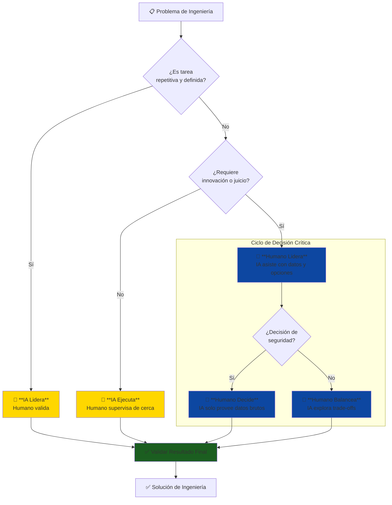

# ⚖️ Límites de IA en Ingeniería: Dónde Confiar y Dónde Cuestionar

### Filosofía Fundamental

> **"La IA acelera la ejecución de lo que ya sabes hacer, no reemplaza tu criterio de ingeniero"**

En cualquier disciplina de ingeniería (CAD, Aerodinámica, Estructuras), OpenCode es un **asistente técnico poderoso**, pero **NO un ingeniero**. Entender esta distinción es crítico para tu éxito y seguridad profesional.

---

## 🤖 Lo que IA Hace EXCELENTEMENTE

### 1. Tareas Repetitivas con Patrones Conocidos
- **Ejemplo**: Generar 100 variantes de coordenadas de un perfil alar, ejecutar simulaciones con diferentes ángulos, exportar resultados a 5 formatos distintos.
- **Por qué funciona**: La tarea tiene un patrón definido, no requiere creatividad, y el resultado es objetivamente validable.
- **Mejora**: **10-15x más rápido** que un humano.

### 2. Optimización en un Espacio de Soluciones Definido
- **Ejemplo**: Encontrar el ángulo de flap óptimo entre 0-45°, ajustar el espesor de un perfil para maximizar L/D, encontrar la mejor posición para un componente para lograr un CG específico.
- **Por qué funciona**: El espacio de búsqueda es finito, el objetivo es claro (maximizar/minimizar), y las restricciones son conocidas.
- **Mejora**: **20-40% mejor** que la intuición inicial.

### 3. Síntesis y Documentación
- **Ejemplo**: Crear un reporte técnico a partir de datos de simulación, generar una tabla comparativa de 10 diseños, documentar automáticamente los parámetros de un modelo CAD.
- **Por qué funciona**: Los datos de entrada ya están estructurados y el formato de salida es estándar.
- **Mejora**: **20x más rápido** que la escritura manual.

### 4. Detección de Anomalías
- **Ejemplo**: Detectar inconsistencias en una malla CFD, identificar parámetros de simulación fuera de un rango normal, alertar sobre una convergencia sospechosa.
- **Por qué funciona**: Se entrena con una "línea base" de lo que es normal y puede detectar desviaciones estadísticas.
- **Mejora**: **Reduce errores humanos en 60-80%**.

---

## 🧠 Lo que IA Hace POBREMENTE (Requiere TU Juicio)

### 1. Innovación Verdadera sin Precedentes
- **Por qué falla**: La IA no tiene intuición física. No puede "inventar" una nueva configuración de ala que nunca ha visto en sus datos de entrenamiento.
- **Tu Rol**: Usar tu creatividad, basada en principios de física e ingeniería, para proponer soluciones novedosas.

### 2. Decisiones de Seguridad Críticas
- **Por qué falla**: La IA no entiende el concepto de "riesgo aceptable" o las consecuencias de una falla. No puede decidir si un factor de seguridad es "suficiente".
- **Tu Rol**: Aplicar normativas (FAA, EASA, DINAC), considerar el peor escenario, y asumir la responsabilidad legal y ética de la seguridad del diseño.
- **Regla de oro**: **NUNCA confíes en una IA para decisiones que pongan vidas en riesgo.**

### 3. Comprensión del Contexto y Restricciones Implícitas
- **Por qué falla**: La IA no conoce el contexto local. No sabe la disponibilidad de materiales en Paraguay, las capacidades de manufactura de un taller específico, el presupuesto del cliente, o las condiciones climáticas de Asunción.
- **Tu Rol**: Aportar el conocimiento del ecosistema: cultural, económico, político y técnico.

### 4. Trade-offs con Criterios Subjetivos
- **Por qué falla**: La IA no puede balancear "diseño simple y robusto" vs. "diseño óptimo pero complejo", porque "simple" y "robusto" no son métricas objetivas.
- **Tu Rol**: Realizar juicios de ingeniería basados en la experiencia, la mantenibilidad, la filosofía de diseño del proyecto y las prioridades (a veces no declaradas) del cliente.

---

## 🎯 Estrategia Híbrida: Workflow Humano-IA Óptimo

---

## 📋 Checklist: ¿Cuándo Confiar en la IA?

### ✅ Confía (pero siempre verifica) SI:
- [ ] La tarea es repetitiva y con un patrón conocido.
- [ ] El resultado puede ser validado objetivamente (con números, lógica o un sanity check).
- [ ] NO afecta directamente la seguridad crítica.
- [ ] Un error es recuperable y no tiene consecuencias graves.

### ⚠️ Desconfía (usa la IA solo para explorar opciones) SI:
- [ ] Es la primera vez que resuelves este tipo de problema.
- [ ] Involucra juicios de seguridad, regulaciones o trade-offs subjetivos.
- [ ] NO entiendes cómo la IA llegó al resultado.
- [ ] El resultado "parece demasiado bueno para ser verdad".

### ❌ NUNCA Confíes (usa la IA solo para obtener datos brutos) SI:
- [ ] La decisión final afecta la seguridad de las personas.
- [ ] Se requiere la firma de un ingeniero para certificación legal.
- [ ] Un error tendría consecuencias irreversibles.
