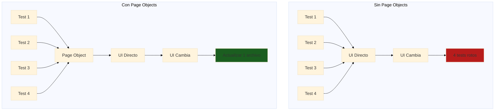
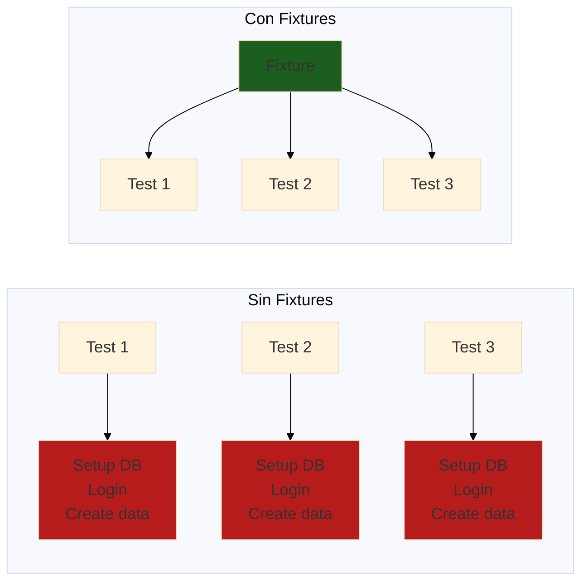

# Módulo 03: Arquitectura de Pruebas y Organización

## Resumen General

Construir frameworks de automatización de pruebas escalables y mantenibles requiere bases arquitectónicas sólidas. Este módulo te enseña a diseñar e implementar arquitecturas de pruebas profesionales usando patrones probados como Page Object Model, fixtures personalizadas y utilidades reutilizables.

**Duración**: 4 horas  
**Nivel**: Intermedio  
**Prerrequisitos**: Módulos 01 y 02 completados

---

## Objetivos de Aprendizaje

Al finalizar este módulo, serás capaz de:

1. Implementar el patrón Page Object Model (POM) para pruebas web
2. Crear fixtures personalizadas y funciones helper para reutilización
3. Diseñar estrategias efectivas de gestión de datos de prueba
4. Configurar ejecución de pruebas en múltiples ambientes
5. Organizar archivos y directorios de pruebas para escalabilidad
6. Aplicar principios SOLID al código de automatización de pruebas

---

## Por Qué Importa la Arquitectura de Pruebas

### Problemas de Mala Arquitectura

```
❌ Código duplicado entre pruebas
❌ Difícil de mantener cuando cambia la UI
❌ Pruebas frágiles que se rompen fácilmente
❌ Ejecución lenta de pruebas
❌ Difícil incorporar nuevos miembros al equipo
❌ Sin estructura o convenciones claras
```

### Beneficios de Buena Arquitectura

```
✅ Código DRY (Don't Repeat Yourself - No te repitas)
✅ Cambios en un lugar afectan todas las pruebas
✅ Pruebas resilientes que se adaptan a cambios
✅ Ejecución rápida y paralelizable
✅ Fácil incorporación con patrones claros
✅ Código base profesional y listo para producción
```

### Impacto en el Mundo Real

| Métrica | Mala Arquitectura | Buena Arquitectura |
|---------|-------------------|-------------------|
| **Tiempo de Mantenimiento de Pruebas** | 40% del tiempo de QA | 10% del tiempo de QA |
| **Creación de Nueva Prueba** | 2-4 horas | 30 minutos |
| **Impacto de Cambio en UI** | 50+ archivos por actualizar | 1-2 archivos por actualizar |
| **Tiempo de Incorporación** | 2-3 semanas | 3-5 días |
| **Estabilidad de Pruebas** | 60-70% tasa de éxito | 95%+ tasa de éxito |

---

## Estructura del Módulo

Este módulo está dividido en 5 secciones completas:

### [01 - Page Object Model](./tutorials/01-modelo-objeto-pagina.md)
**Duración**: 60 minutos

Aprende el patrón estándar de la industria para organizar código de pruebas UI:
- Qué es Page Object Model y por qué usarlo
- Implementando Page Objects en Playwright
- Patrón Component Object para elementos UI reutilizables
- Patrones avanzados de POM (herencia, composición)
- Ejemplos del mundo real de aplicaciones e-commerce

**Conceptos Clave**: Encapsulación, separación de responsabilidades, reusabilidad

---

### [02 - Fixtures y Helpers Personalizados](./tutorials/02-fixtures-personalizadas.md)
**Duración**: 45 minutos

Domina el sistema de fixtures de Playwright y crea utilidades de prueba poderosas:
- Entendiendo los fixtures de Playwright
- Creando fixtures personalizadas para autenticación, datos y más
- Funciones helper y utilidades de prueba
- Composición de fixtures y dependencias
- Manejo de alcance y ciclo de vida

**Conceptos Clave**: Principio DRY, setup/teardown de pruebas, contexto compartido

**📖 Tutorial**: [02-fixtures-personalizadas.md](./tutorials/02-fixtures-personalizadas.md)  
**🤖 Prompt de OpenCode**: [01-prompt-fixtures.md](./examples/01-prompt-fixtures.md)

---

### [03 - Gestión de Datos de Prueba](./tutorials/03-gestion-datos-prueba.md)
**Duración**: 45 minutos

Diseña estrategias para gestionar datos de prueba efectivamente:
- Generación de datos de prueba vs. fixtures estáticos
- Seeding y limpieza de base de datos
- Patrón Factory para datos de prueba
- Integración de Faker.js para datos realistas
- Aislamiento de datos entre pruebas

**Conceptos Clave**: Independencia de pruebas, data factories, estrategias de seeding

**📖 Tutorial**: [03-gestion-datos-prueba.md](./tutorials/03-gestion-datos-prueba.md)  
**🤖 Prompt de OpenCode**: [02-prompt-generacion-datos.md](./examples/02-prompt-generacion-datos.md)

---

### [04 - Configuración Multi-Ambiente](./tutorials/04-configuracion-multi-ambiente.md)
**Duración**: 45 minutos

Configura pruebas para ejecutarse en diferentes ambientes:
- Configuraciones específicas por ambiente
- Gestión de credenciales y secretos
- URL base y endpoints de API dinámicos
- Feature flags y pruebas condicionales
- Ambientes local vs. CI vs. producción

**Conceptos Clave**: Abstracción de ambiente, gestión de configuración, seguridad

**📖 Tutorial**: [04-configuracion-multi-ambiente.md](./tutorials/04-configuracion-multi-ambiente.md)  
**🤖 Prompt de OpenCode**: [03-prompt-configuracion-ambiente.md](./examples/03-prompt-configuracion-ambiente.md)

---

### [05 - Paralelización y Performance](./tutorials/05-paralelizacion.md)
**Duración**: 45 minutos

Optimiza la velocidad de ejecución de pruebas con paralelización:
- Entendiendo paralelización de pruebas en Playwright
- Configuración y manejo de workers
- Aislamiento de pruebas e independencia de datos
- Estrategias de sharding para CI/CD
- Técnicas de optimización de performance

**Conceptos Clave**: Concurrencia, performance, escalabilidad

---

## Lo Que Construirás

A lo largo de este módulo, construirás un **framework de pruebas listo para producción** para una aplicación e-commerce con:

### Estructura del Proyecto
```
e-commerce-tests/
├── tests/
│   ├── auth/
│   │   ├── login.spec.ts
│   │   └── registration.spec.ts
│   ├── products/
│   │   ├── browse.spec.ts
│   │   └── search.spec.ts
│   └── checkout/
│       ├── cart.spec.ts
│       └── payment.spec.ts
├── pages/
│   ├── LoginPage.ts
│   ├── ProductsPage.ts
│   ├── CartPage.ts
│   └── CheckoutPage.ts
├── components/
│   ├── Header.ts
│   ├── ProductCard.ts
│   └── Modal.ts
├── fixtures/
│   ├── auth.ts
│   ├── products.ts
│   └── database.ts
├── helpers/
│   ├── data-factory.ts
│   ├── api-helpers.ts
│   └── utils.ts
├── config/
│   ├── environments.ts
│   └── test-config.ts
├── playwright.config.ts
└── README.md
```

### Características
- ✅ Page Object Model para todas las páginas
- ✅ Component Objects para elementos UI reutilizables
- ✅ Fixtures personalizadas para auth y datos
- ✅ Data factories para generación de datos de prueba
- ✅ Soporte multi-ambiente (local, staging, producción)
- ✅ Organización completa de pruebas
- ✅ TypeScript en todo el proyecto
- ✅ 100+ pruebas demostrando patrones

---

## Verificación de Prerrequisitos

Antes de comenzar, asegúrate de tener:

### Prerrequisitos de Conocimiento
- ✅ Módulo 01 completado (Playwright Avanzado)
- ✅ Módulo 02 completado (API Testing)
- ✅ Comprensión básica de TypeScript/JavaScript
- ✅ Familiaridad con patrones async/await

### Prerrequisitos Técnicos
- ✅ Node.js v18+ instalado
- ✅ Playwright instalado y configurado
- ✅ VS Code o editor similar
- ✅ Git para control de versiones

### Verifica Tu Setup

Ejecuta estos comandos para verificar:

```bash
# Verificar versión de Node.js
node --version  # Debe ser v18 o superior

# Verificar instalación de Playwright
npx playwright --version

# Crear nuevo proyecto de pruebas
npm init playwright@latest test-architecture-demo

# Ejecutar prueba de ejemplo
cd test-architecture-demo
npx playwright test
```

---

## Enfoque de Aprendizaje

Este módulo usa una **metodología de construcción conjunta**:

1. **Aprende**: Lee conceptos y patrones
2. **Observa**: Revisa ejemplos de código completos
3. **Construye**: Implementa el patrón tú mismo
4. **Practica**: Completa los ejercicios
5. **Reflexiona**: Responde las preguntas del quiz

### Ritmo Recomendado

| Sección | Lectura | Código | Total |
|---------|---------|--------|-------|
| Sección 01 | 20 min | 40 min | 60 min |
| Sección 02 | 15 min | 30 min | 45 min |
| Sección 03 | 15 min | 30 min | 45 min |
| Sección 04 | 15 min | 30 min | 45 min |
| Sección 05 | 15 min | 30 min | 45 min |
| **Total** | **80 min** | **160 min** | **240 min (4h)** |

---

## Aprendizajes Clave

Después de completar este módulo, entenderás:

### Patrones de Diseño
- **Page Object Model**: Organización estándar de la industria para pruebas UI
- **Component Objects**: Abstracciones reutilizables de elementos UI
- **Factory Pattern**: Generación dinámica de datos de prueba
- **Fixture Pattern**: Contexto compartido y setup de pruebas

### Mejores Prácticas
- **Principio DRY**: No te repitas (Don't Repeat Yourself)
- **Responsabilidad Única**: Una clase, un propósito
- **Separación de Responsabilidades**: Lógica de prueba vs. lógica de página
- **Gestión de Configuración**: Settings específicos por ambiente

### Habilidades Profesionales
- **Organización de Código**: Estructuras de directorios escalables
- **Documentación**: READMEs claros y comentarios de código
- **Mantenibilidad**: Fácil de actualizar y extender
- **Colaboración en Equipo**: Convenciones y patrones compartidos

---

## Aplicaciones del Mundo Real

Estos patrones son usados por:

### Empresas
- **Google**: Uso extensivo de Page Objects en testing de Angular
- **Microsoft**: El propio test suite de Playwright usa estos patrones
- **Netflix**: Fixtures personalizadas para escenarios de prueba complejos
- **Amazon**: Data factories para testing de productos

### Proyectos Open Source
- **Ejemplos de documentación de Playwright**: Muestra el patrón POM
- **Testing Library**: Enfoque de testing basado en componentes
- **Cypress Real-World App**: Ejemplo completo de arquitectura

### Tu Carrera
- **Requerido para roles Senior de QA**: Conocimiento de arquitectura es esencial
- **Preguntas de Entrevista**: Espera preguntas sobre POM y patrones
- **Proyectos de Portfolio**: Demuestra organización profesional de pruebas
- **Liderazgo de Equipo**: Guía a QAs junior en mejores prácticas

---

## Métricas de Éxito

Sabrás que has dominado este módulo cuando puedas:

- [ ] Explicar los beneficios de Page Object Model a un colega
- [ ] Implementar un Page Object desde cero en menos de 15 minutos
- [ ] Crear fixtures personalizadas para escenarios de prueba complejos
- [ ] Diseñar una estrategia de datos de prueba para un nuevo proyecto
- [ ] Configurar ejecución de pruebas en múltiples ambientes
- [ ] Organizar un proyecto de pruebas con 50+ archivos de prueba
- [ ] Revisar código de pruebas e identificar problemas arquitectónicos
- [ ] Refactorizar pruebas frágiles usando estos patrones

---

## Recursos Adicionales

### Documentación Oficial
- [Playwright Best Practices](https://playwright.dev/documentacion/best-practices)
- [Playwright Fixtures Guide](https://playwright.dev/documentacion/test-fixtures)
- [Playwright Page Object Models](https://playwright.dev/documentacion/pom)

### Recursos de la Comunidad
- [Playwright GitHub Discussions](https://github.com/microsoft/playwright/discussions)
- [Awesome Playwright](https://github.com/mxschmitt/awesome-playwright)

### Libros y Artículos
- "Growing Object-Oriented Software, Guided by Tests" - Freeman & Pryce
- "xUnit Test Patterns" - Gerard Meszaros
- Artículos de Martin Fowler sobre patrones de testing

---

## Empezando

¿Listo para construir arquitecturas de pruebas profesionales? ¡Comencemos!

**👉 Comienza con [Sección 01: Page Object Model](./tutorials/01-modelo-objeto-pagina.md)**

---

---

## 🏗️ Sección 1: Page Object Model (POM) en Profundidad

### Concepto: Encapsulación de la UI

**Analogía**: Como tener un manual de instrucciones para cada sección de tu casa.



### Ejemplo Real: Sistema de Inscripciones FPUNA

**Sin Page Object** (código duplicado):
```typescript
// login.spec.ts
test('login exitoso', async ({ page }) => {
  await page.goto('https://inscripciones.fpuna.edu.py');
  await page.locator('#email-input').fill('juan@fpuna.edu.py');
  await page.locator('#password-input').fill('Password123!');
  await page.locator('button[type="submit"]').click();
  await expect(page.locator('.dashboard')).toBeVisible();
});

// enrollment.spec.ts
test('inscribirse a materia', async ({ page }) => {
  // ❌ Código duplicado
  await page.goto('https://inscripciones.fpuna.edu.py');
  await page.locator('#email-input').fill('juan@fpuna.edu.py');
  await page.locator('#password-input').fill('Password123!');
  await page.locator('button[type="submit"]').click();
  
  // Lógica de inscripción...
});
```

**Problema**: Si cambia el selector `#email-input` → 20+ archivos a actualizar 😱

**Con Page Object** (reutilizable):
```typescript
// pages/LoginPage.ts
import { Page, Locator } from '@playwright/test';

export class LoginPage {
  readonly page: Page;
  readonly emailInput: Locator;
  readonly passwordInput: Locator;
  readonly submitButton: Locator;
  readonly errorMessage: Locator;

  constructor(page: Page) {
    this.page = page;
    this.emailInput = page.locator('[data-testid="email"]');
    this.passwordInput = page.locator('[data-testid="password"]');
    this.submitButton = page.locator('[data-testid="login-button"]');
    this.errorMessage = page.locator('.error-toast');
  }

  /**
   * Navegar a la página de login
   */
  async goto() {
    await this.page.goto('https://inscripciones.fpuna.edu.py/login');
    await this.page.waitForLoadState('networkidle');
  }

  /**
   * Login con credenciales
   * @param email - Email del usuario
   * @param password - Contraseña
   */
  async login(email: string, password: string) {
    await this.emailInput.fill(email);
    await this.passwordInput.fill(password);
    await this.submitButton.click();
  }

  /**
   * Login como estudiante (datos por defecto)
   */
  async loginAsStudent() {
    await this.login('estudiante@fpuna.edu.py', 'Password123!');
  }

  /**
   * Login como admin
   */
  async loginAsAdmin() {
    await this.login('admin@fpuna.edu.py', 'Admin123!');
  }

  /**
   * Verificar mensaje de error
   */
  async getErrorMessage(): Promise<string> {
    return await this.errorMessage.textContent() || '';
  }

  /**
   * Verificar que estamos en dashboard (login exitoso)
   */
  async expectLoginSuccess() {
    await this.page.waitForURL(/.*dashboard/);
  }
}
```

**Uso en tests**:
```typescript
// login.spec.ts
import { test, expect } from '@playwright/test';
import { LoginPage } from '../pages/LoginPage';

test.describe('Login de Usuario', () => {
  let loginPage: LoginPage;

  test.beforeEach(async ({ page }) => {
    loginPage = new LoginPage(page);
    await loginPage.goto();
  });

  test('login exitoso con credenciales válidas', async () => {
    await loginPage.loginAsStudent();
    await loginPage.expectLoginSuccess();
  });

  test('muestra error con email inválido', async () => {
    await loginPage.login('invalido', 'Password123!');
    const error = await loginPage.getErrorMessage();
    expect(error).toContain('Email inválido');
  });

  test('muestra error con contraseña incorrecta', async () => {
    await loginPage.login('juan@fpuna.edu.py', 'WrongPassword');
    const error = await loginPage.getErrorMessage();
    expect(error).toContain('Contraseña incorrecta');
  });
});
```

✅ **Beneficio**: Si cambia el selector → actualizar **solo LoginPage.ts**

### POM Avanzado: Base Page Pattern

```typescript
// pages/BasePage.ts
import { Page, Locator } from '@playwright/test';

/**
 * Clase base para todos los Page Objects
 * Contiene funcionalidades comunes
 */
export abstract class BasePage {
  readonly page: Page;
  
  constructor(page: Page) {
    this.page = page;
  }

  /**
   * Esperar que un elemento sea visible
   */
  async waitForElement(locator: Locator, timeout = 5000) {
    await locator.waitFor({ state: 'visible', timeout });
  }

  /**
   * Click seguro (espera visible + click)
   */
  async safeClick(locator: Locator) {
    await this.waitForElement(locator);
    await locator.click();
  }

  /**
   * Fill seguro (espera visible + clear + fill)
   */
  async safeFill(locator: Locator, text: string) {
    await this.waitForElement(locator);
    await locator.clear();
    await locator.fill(text);
  }

  /**
   * Capturar screenshot con nombre descriptivo
   */
  async takeScreenshot(name: string) {
    await this.page.screenshot({
      path: `screenshots/${name}-${Date.now()}.png`,
      fullPage: true,
    });
  }

  /**
   * Obtener URL actual
   */
  getCurrentUrl(): string {
    return this.page.url();
  }
}
```

**Extender BasePage**:
```typescript
// pages/EnrollmentPage.ts
import { Page, Locator } from '@playwright/test';
import { BasePage } from './BasePage';

export class EnrollmentPage extends BasePage {
  readonly searchInput: Locator;
  readonly searchButton: Locator;
  readonly courseCards: Locator;
  readonly enrollButton: Locator;

  constructor(page: Page) {
    super(page); // Heredar de BasePage
    this.searchInput = page.locator('[data-testid="course-search"]');
    this.searchButton = page.locator('[data-testid="search-btn"]');
    this.courseCards = page.locator('.course-card');
    this.enrollButton = page.locator('[data-testid="enroll-btn"]');
  }

  async goto() {
    await this.page.goto('/courses');
    await this.page.waitForLoadState('networkidle');
  }

  /**
   * Buscar materia por nombre
   */
  async searchCourse(courseName: string) {
    await this.safeFill(this.searchInput, courseName); // Usa método de BasePage
    await this.safeClick(this.searchButton);
  }

  /**
   * Inscribirse a la primera materia disponible
   */
  async enrollInFirstCourse() {
    const firstCard = this.courseCards.first();
    await this.safeClick(firstCard);
    await this.safeClick(this.enrollButton);
  }

  /**
   * Obtener cantidad de materias mostradas
   */
  async getCourseCount(): Promise<number> {
    return await this.courseCards.count();
  }
}
```

### Component Object Pattern

Para elementos reutilizables (header, modal, cards):

```typescript
// components/HeaderComponent.ts
import { Page, Locator } from '@playwright/test';

export class HeaderComponent {
  readonly page: Page;
  readonly logo: Locator;
  readonly userMenu: Locator;
  readonly logoutButton: Locator;
  readonly notificationBell: Locator;

  constructor(page: Page) {
    this.page = page;
    this.logo = page.locator('[data-testid="logo"]');
    this.userMenu = page.locator('[data-testid="user-menu"]');
    this.logoutButton = page.locator('[data-testid="logout"]');
    this.notificationBell = page.locator('[data-testid="notifications"]');
  }

  /**
   * Logout del sistema
   */
  async logout() {
    await this.userMenu.click();
    await this.logoutButton.click();
  }

  /**
   * Obtener cantidad de notificaciones
   */
  async getNotificationCount(): Promise<number> {
    const badge = this.notificationBell.locator('.badge');
    const text = await badge.textContent();
    return parseInt(text || '0');
  }

  /**
   * Navegar a home via logo
   */
  async goHome() {
    await this.logo.click();
  }
}
```

**Uso en Page Objects**:
```typescript
// pages/DashboardPage.ts
import { Page } from '@playwright/test';
import { BasePage } from './BasePage';
import { HeaderComponent } from '../components/HeaderComponent';

export class DashboardPage extends BasePage {
  readonly header: HeaderComponent;
  
  constructor(page: Page) {
    super(page);
    this.header = new HeaderComponent(page); // Reutilizar componente
  }

  async goto() {
    await this.page.goto('/dashboard');
  }

  /**
   * Logout usando el componente de header
   */
  async logout() {
    await this.header.logout();
  }
}
```

### Generar Page Objects con OpenCode

```bash
opencode "Genera Page Object completo para página de 'Gestión de Calificaciones FPUNA':

URL: https://sistema.fpuna.edu.py/calificaciones

ELEMENTOS VISIBLES:
- Selector de semestre (dropdown)
- Tabla de materias con columnas: Materia, Parcial 1, Parcial 2, Final, Promedio
- Botón 'Descargar PDF'
- Botón 'Exportar Excel'
- Filtro de búsqueda por materia
- Badge de promedio general

ACCIONES REQUERIDAS:
1. seleccionarSemestre(semestre: string)
2. buscarMateria(nombre: string)
3. obtenerCalificacion(materia: string, tipo: 'P1'|'P2'|'Final'): Promise<number>
4. descargarPDF(): Promise<void>
5. exportarExcel(): Promise<void>
6. obtenerPromedioGeneral(): Promise<number>

REQUISITOS:
- Extender BasePage
- TypeScript estricto
- data-testid para todos los selectores
- Comentarios en español
- Métodos async/await
- Manejo de errores (throw si elemento no existe)

OUTPUT: GradesPage.ts completo"
```

---

## 🔧 Sección 2: Fixtures y Helpers

### Concepto: Compartir Setup entre Tests



### Custom Fixtures en Playwright

```typescript
// fixtures/authFixture.ts
import { test as base } from '@playwright/test';
import { LoginPage } from '../pages/LoginPage';
import { DashboardPage } from '../pages/DashboardPage';

type AuthFixtures = {
  authenticatedPage: DashboardPage;
  loginAsStudent: () => Promise<void>;
  loginAsAdmin: () => Promise<void>;
};

/**
 * Fixture personalizado para autenticación
 */
export const test = base.extend<AuthFixtures>({
  /**
   * Página ya autenticada como estudiante
   */
  authenticatedPage: async ({ page }, use) => {
    const loginPage = new LoginPage(page);
    await loginPage.goto();
    await loginPage.loginAsStudent();
    
    const dashboardPage = new DashboardPage(page);
    await use(dashboardPage);
    
    // Cleanup: logout después del test
    await dashboardPage.logout();
  },

  /**
   * Helper para login como estudiante
   */
  loginAsStudent: async ({ page }, use) => {
    const login = async () => {
      const loginPage = new LoginPage(page);
      await loginPage.goto();
      await loginPage.loginAsStudent();
    };
    await use(login);
  },

  /**
   * Helper para login como admin
   */
  loginAsAdmin: async ({ page }, use) => {
    const login = async () => {
      const loginPage = new LoginPage(page);
      await loginPage.goto();
      await loginPage.loginAsAdmin();
    };
    await use(login);
  },
});

export { expect } from '@playwright/test';
```

**Uso en tests**:
```typescript
// enrollment.spec.ts
import { test, expect } from '../fixtures/authFixture';
import { EnrollmentPage } from '../pages/EnrollmentPage';

test.describe('Inscripción a Materias', () => {
  test('estudiante puede inscribirse a materia disponible', async ({ authenticatedPage }) => {
    // ✅ Ya está logueado como estudiante!
    const enrollmentPage = new EnrollmentPage(authenticatedPage.page);
    await enrollmentPage.goto();
    
    await enrollmentPage.searchCourse('Cálculo I');
    await enrollmentPage.enrollInFirstCourse();
    
    // Verificaciones...
  });
});
```

### Test Data Fixtures

```typescript
// fixtures/testDataFixture.ts
import { test as base } from '@playwright/test';
import { faker } from '@faker-js/faker';

type TestDataFixtures = {
  studentData: {
    nombre: string;
    apellido: string;
    email: string;
    cedula: string;
  };
  courseData: {
    nombre: string;
    codigo: string;
    creditos: number;
    cupo: number;
  };
};

export const test = base.extend<TestDataFixtures>({
  /**
   * Genera datos de estudiante aleatorios
   */
  studentData: async ({}, use) => {
    const data = {
      nombre: faker.person.firstName(),
      apellido: faker.person.lastName(),
      email: faker.internet.email({ provider: 'fpuna.edu.py' }),
      cedula: faker.number.int({ min: 1000000, max: 9999999 }).toString(),
    };
    await use(data);
  },

  /**
   * Genera datos de materia aleatorios
   */
  courseData: async ({}, use) => {
    const data = {
      nombre: faker.helpers.arrayElement([
        'Cálculo I',
        'Física General',
        'Programación I',
        'Química Básica',
      ]),
      codigo: `MAT-${faker.number.int({ min: 100, max: 999 })}`,
      creditos: faker.helpers.arrayElement([3, 4, 5]),
      cupo: faker.number.int({ min: 20, max: 40 }),
    };
    await use(data);
  },
});
```

### Helper Utilities

```typescript
// helpers/dateHelpers.ts
/**
 * Formatear fecha al formato FPUNA (DD/MM/YYYY)
 */
export function formatFPUNADate(date: Date): string {
  const day = date.getDate().toString().padStart(2, '0');
  const month = (date.getMonth() + 1).toString().padStart(2, '0');
  const year = date.getFullYear();
  return `${day}/${month}/${year}`;
}

/**
 * Obtener semestre actual
 */
export function getCurrentSemester(): string {
  const month = new Date().getMonth() + 1;
  const year = new Date().getFullYear();
  return month <= 6 ? `1/${year}` : `2/${year}`;
}

/**
 * Calcular fecha de examen (15 semanas desde inicio de semestre)
 */
export function calculateExamDate(semesterStart: Date): Date {
  const examDate = new Date(semesterStart);
  examDate.setDate(examDate.getDate() + (15 * 7)); // 15 semanas
  return examDate;
}
```

```typescript
// helpers/gradeHelpers.ts
/**
 * Calcular promedio de calificaciones
 */
export function calculateAverage(grades: number[]): number {
  if (grades.length === 0) return 0;
  const sum = grades.reduce((acc, grade) => acc + grade, 0);
  return Math.round((sum / grades.length) * 10) / 10; // 1 decimal
}

/**
 * Verificar si aprobó la materia (≥60)
 */
export function isPassing(finalGrade: number): boolean {
  return finalGrade >= 60;
}

/**
 * Calcular calificación final (Paraguay: P1=30%, P2=30%, Final=40%)
 */
export function calculateFinalGrade(p1: number, p2: number, finalExam: number): number {
  return Math.round((p1 * 0.3 + p2 * 0.3 + finalExam * 0.4) * 10) / 10;
}
```

**Uso en tests**:
```typescript
// grades.spec.ts
import { test, expect } from '../fixtures/authFixture';
import { calculateFinalGrade, isPassing } from '../helpers/gradeHelpers';

test('calcular calificación final correctamente', async () => {
  const p1 = 75;
  const p2 = 80;
  const finalExam = 85;
  
  const finalGrade = calculateFinalGrade(p1, p2, finalExam);
  
  expect(finalGrade).toBe(80.5); // 75*0.3 + 80*0.3 + 85*0.4
  expect(isPassing(finalGrade)).toBe(true);
});
```

---

## 📊 Sección 3: Gestión de Datos de Prueba

### Factory Pattern para Test Data

```typescript
// factories/StudentFactory.ts
import { faker } from '@faker-js/faker';

export interface Student {
  id?: number;
  nombre: string;
  apellido: string;
  email: string;
  cedula: string;
  carrera: string;
  semestre: number;
}

export class StudentFactory {
  /**
   * Crear estudiante con datos válidos por defecto
   */
  static create(overrides: Partial<Student> = {}): Student {
    const firstName = faker.person.firstName();
    const lastName = faker.person.lastName();
    
    return {
      nombre: firstName,
      apellido: lastName,
      email: `${firstName.toLowerCase()}.${lastName.toLowerCase()}@fpuna.edu.py`,
      cedula: faker.number.int({ min: 1000000, max: 9999999 }).toString(),
      carrera: faker.helpers.arrayElement([
        'Ingeniería Informática',
        'Ingeniería Electrónica',
        'Ingeniería Civil',
        'Arquitectura',
      ]),
      semestre: faker.number.int({ min: 1, max: 10 }),
      ...overrides, // Sobrescribir campos específicos
    };
  }

  /**
   * Crear múltiples estudiantes
   */
  static createMany(count: number, overrides: Partial<Student> = {}): Student[] {
    return Array.from({ length: count }, () => this.create(overrides));
  }

  /**
   * Crear estudiante de primer semestre
   */
  static createFreshman(overrides: Partial<Student> = {}): Student {
    return this.create({ semestre: 1, ...overrides });
  }

  /**
   * Crear estudiante próximo a graduarse
   */
  static createSenior(overrides: Partial<Student> = {}): Student {
    return this.create({ semestre: 10, ...overrides });
  }
}
```

**Uso**:
```typescript
// student.spec.ts
import { test, expect } from '@playwright/test';
import { StudentFactory } from '../factories/StudentFactory';

test('crear estudiante nuevo', async ({ page }) => {
  const student = StudentFactory.create();
  
  // Llenar formulario con datos generados
  await page.fill('[name="nombre"]', student.nombre);
  await page.fill('[name="email"]', student.email);
  // ...
});

test('crear 100 estudiantes para prueba de carga', async () => {
  const students = StudentFactory.createMany(100, {
    carrera: 'Ingeniería Informática',
  });
  
  // Insertar en DB o crear via API
  // ...
});
```

### Database Seeding

```typescript
// helpers/dbSeeder.ts
import { PrismaClient } from '@prisma/client';
import { StudentFactory } from '../factories/StudentFactory';
import { CourseFactory } from '../factories/CourseFactory';

const prisma = new PrismaClient();

export class DatabaseSeeder {
  /**
   * Seed estudiantes de prueba
   */
  static async seedStudents(count = 10) {
    const students = StudentFactory.createMany(count);
    
    for (const student of students) {
      await prisma.student.create({ data: student });
    }
    
    console.log(`✅ Creados ${count} estudiantes de prueba`);
  }

  /**
   * Seed materias del primer semestre
   */
  static async seedFirstSemesterCourses() {
    const courses = [
      { codigo: 'MAT101', nombre: 'Cálculo I', creditos: 5, cupo: 30 },
      { codigo: 'FIS101', nombre: 'Física I', creditos: 5, cupo: 30 },
      { codigo: 'PRG101', nombre: 'Programación I', creditos: 4, cupo: 25 },
      { codigo: 'QUI101', nombre: 'Química General', creditos: 4, cupo: 25 },
    ];

    for (const course of courses) {
      await prisma.course.create({ data: course });
    }

    console.log(`✅ Creadas ${courses.length} materias`);
  }

  /**
   * Limpiar toda la base de datos de prueba
   */
  static async clean() {
    await prisma.enrollment.deleteMany();
    await prisma.student.deleteMany();
    await prisma.course.deleteMany();
    console.log('🧹 Base de datos limpiada');
  }

  /**
   * Reset completo: limpiar + seed
   */
  static async reset() {
    await this.clean();
    await this.seedStudents();
    await this.seedFirstSemesterCourses();
    console.log('🔄 Base de datos reseteada');
  }
}
```

**Uso en tests**:
```typescript
// enrollment.spec.ts
import { test, expect } from '@playwright/test';
import { DatabaseSeeder } from '../helpers/dbSeeder';

test.beforeAll(async () => {
  await DatabaseSeeder.reset(); // DB limpia antes de la suite
});

test.afterAll(async () => {
  await DatabaseSeeder.clean(); // Limpiar después
});

test('inscribirse a materia disponible', async ({ page }) => {
  // DB ya tiene estudiantes y materias seeded
  // ...
});
```

---

## 🌍 Sección 4: Configuración Multi-Ambiente

### Environment Config Pattern

```typescript
// config/environments.ts
export type Environment = 'local' | 'staging' | 'production';

export interface EnvironmentConfig {
  baseURL: string;
  apiURL: string;
  dbURL: string;
  timeout: number;
  retries: number;
}

const configs: Record<Environment, EnvironmentConfig> = {
  local: {
    baseURL: 'http://localhost:3000',
    apiURL: 'http://localhost:4000/api',
    dbURL: 'postgresql://localhost:5432/fpuna_test',
    timeout: 30000,
    retries: 0,
  },
  staging: {
    baseURL: 'https://staging.fpuna.edu.py',
    apiURL: 'https://api-staging.fpuna.edu.py',
    dbURL: process.env.STAGING_DB_URL!,
    timeout: 60000,
    retries: 2,
  },
  production: {
    baseURL: 'https://sistema.fpuna.edu.py',
    apiURL: 'https://api.fpuna.edu.py',
    dbURL: process.env.PROD_DB_URL!,
    timeout: 60000,
    retries: 3,
  },
};

/**
 * Obtener configuración del ambiente actual
 */
export function getConfig(): EnvironmentConfig {
  const env = (process.env.TEST_ENV || 'local') as Environment;
  return configs[env];
}
```

```typescript
// playwright.config.ts
import { defineConfig } from '@playwright/test';
import { getConfig } from './config/environments';

const config = getConfig();

export default defineConfig({
  testDir: './tests',
  timeout: config.timeout,
  retries: config.retries,
  
  use: {
    baseURL: config.baseURL,
    trace: 'on-first-retry',
    screenshot: 'only-on-failure',
  },

  projects: [
    {
      name: 'chromium',
      use: { browserName: 'chromium' },
    },
  ],
});
```

**Correr en diferentes ambientes**:
```bash
# Local (default)
npx playwright test

# Staging
TEST_ENV=staging npx playwright test

# Production (solo smoke tests)
TEST_ENV=production npx playwright test --grep @smoke
```

---

## 📁 Sección 5: Patrones de Organización de Pruebas

### Estructura de Directorios Recomendada

```
qa-automation-framework/
├── tests/
│   ├── e2e/                        # End-to-end tests
│   │   ├── auth/
│   │   │   ├── login.spec.ts
│   │   │   └── registration.spec.ts
│   │   ├── enrollment/
│   │   │   ├── search.spec.ts
│   │   │   ├── enroll.spec.ts
│   │   │   └── unenroll.spec.ts
│   │   └── grades/
│   │       ├── view.spec.ts
│   │       └── export.spec.ts
│   └── api/                        # API tests
│       ├── students.api.spec.ts
│       └── courses.api.spec.ts
│
├── pages/                          # Page Objects
│   ├── BasePage.ts
│   ├── LoginPage.ts
│   ├── DashboardPage.ts
│   ├── EnrollmentPage.ts
│   └── GradesPage.ts
│
├── components/                     # Component Objects
│   ├── HeaderComponent.ts
│   ├── SidebarComponent.ts
│   └── ModalComponent.ts
│
├── fixtures/                       # Custom fixtures
│   ├── authFixture.ts
│   ├── testDataFixture.ts
│   └── apiFixture.ts
│
├── factories/                      # Data factories
│   ├── StudentFactory.ts
│   ├── CourseFactory.ts
│   └── EnrollmentFactory.ts
│
├── helpers/                        # Utility functions
│   ├── dateHelpers.ts
│   ├── gradeHelpers.ts
│   ├── dbSeeder.ts
│   └── apiHelpers.ts
│
├── config/                         # Configuration
│   ├── environments.ts
│   └── testConfig.ts
│
├── playwright.config.ts            # Playwright config
├── package.json
└── README.md
```

### Tagging Tests

```typescript
// enrollment.spec.ts
import { test, expect } from '@playwright/test';

test.describe('Inscripción a Materias', () => {
  test('búsqueda básica @smoke @regression', async ({ page }) => {
    // Test crítico - corre en smoke y regression
  });

  test('filtrar por carrera @regression', async ({ page }) => {
    // Solo regression
  });

  test('inscripción masiva @slow @nightly', async ({ page }) => {
    // Test lento - solo nightly builds
  });
});
```

**Correr por tags**:
```bash
# Solo smoke tests
npx playwright test --grep @smoke

# Todo excepto slow tests
npx playwright test --grep-invert @slow

# Smoke AND regression
npx playwright test --grep "^.*@smoke.*@regression.*$"
```

---

## 🎯 Ejemplo del Mundo Real: E-Commerce FPUNA Store

### Implementación Completa

```typescript
// pages/ProductsPage.ts
import { Page, Locator } from '@playwright/test';
import { BasePage } from './BasePage';

export class ProductsPage extends BasePage {
  readonly searchInput: Locator;
  readonly categoryFilter: Locator;
  readonly priceSort: Locator;
  readonly productCards: Locator;
  readonly addToCartButtons: Locator;
  readonly cartBadge: Locator;

  constructor(page: Page) {
    super(page);
    this.searchInput = page.locator('[data-testid="product-search"]');
    this.categoryFilter = page.locator('[data-testid="category-filter"]');
    this.priceSort = page.locator('[data-testid="price-sort"]');
    this.productCards = page.locator('.product-card');
    this.addToCartButtons = page.locator('[data-testid="add-to-cart"]');
    this.cartBadge = page.locator('[data-testid="cart-count"]');
  }

  async goto() {
    await this.page.goto('/products');
  }

  async searchProduct(query: string) {
    await this.safeFill(this.searchInput, query);
    await this.page.keyboard.press('Enter');
  }

  async filterByCategory(category: string) {
    await this.categoryFilter.selectOption(category);
  }

  async sortByPrice(order: 'asc' | 'desc') {
    await this.priceSort.selectOption(order);
  }

  async addFirstProductToCart() {
    await this.addToCartButtons.first().click();
  }

  async getCartItemCount(): Promise<number> {
    const text = await this.cartBadge.textContent();
    return parseInt(text || '0');
  }

  async getProductCount(): Promise<number> {
    return await this.productCards.count();
  }
}
```

```typescript
// products.spec.ts
import { test, expect } from '../fixtures/authFixture';
import { ProductsPage } from '../pages/ProductsPage';

test.describe('FPUNA Store - Gestión de Productos @e2e', () => {
  let productsPage: ProductsPage;

  test.beforeEach(async ({ authenticatedPage }) => {
    productsPage = new ProductsPage(authenticatedPage.page);
    await productsPage.goto();
  });

  test('buscar producto por nombre @smoke', async () => {
    await productsPage.searchProduct('Notebook');
    const count = await productsPage.getProductCount();
    expect(count).toBeGreaterThan(0);
  });

  test('agregar producto al carrito @regression', async () => {
    const initialCount = await productsPage.getCartItemCount();
    await productsPage.addFirstProductToCart();
    const newCount = await productsPage.getCartItemCount();
    expect(newCount).toBe(initialCount + 1);
  });

  test('filtrar por categoría @regression', async () => {
    await productsPage.filterByCategory('Electrónica');
    // Verificar que todos los productos son de electrónica
  });
});
```

---

## Navegación

- [← Volver al README del Track](../../README.md)
- [→ Comenzar Sección 01: Page Object Model](./tutorials/01-modelo-objeto-pagina.md)
- [📝 Ejercicio del Módulo](./EXERCISE.md)

---

*Módulo 03 - Arquitectura de Pruebas y Organización*  
*FPUNA Verano 2026 - Track de Automatización QA*


---


# Tutorial: Page Object Model (POM)
## Módulo 03: Arquitectura de Tests

**Duración**: 30 minutos  
**Nivel**: Intermedio

---

## ¿Por Qué POM?

```typescript
// ❌ Sin POM: Selectores esparcidos, difícil mantener
test('login', async ({ page }) => {
  await page.fill('[name="email"]', 'user@test.com');
  await page.fill('[name="password"]', 'pass');
  await page.click('button.login-btn');
});

test('editar perfil', async ({ page }) => {
  await page.click('button.profile-btn'); // Selector repetido
  await page.fill('[name="nombre"]', 'Juan');
});

// Si el selector cambia, ¡actualizar todos los tests!
```

---

## Solución: Page Object

```typescript
// ✅ login-page.ts
export class LoginPage {
  constructor(private page: Page) {}

  async goto() {
    await this.page.goto('/login');
  }

  async fillEmail(email: string) {
    await this.page.fill('[name="email"]', email);
  }

  async fillPassword(password: string) {
    await this.page.fill('[name="password"]', password);
  }

  async clickLogin() {
    await this.page.click('button.login-btn');
  }

  async login(email: string, password: string) {
    await this.fillEmail(email);
    await this.fillPassword(password);
    await this.clickLogin();
  }
}

// ✅ En tests: Usar page object
test('login', async ({ page }) => {
  const loginPage = new LoginPage(page);
  await loginPage.goto();
  await loginPage.login('user@test.com', 'pass');
  
  await expect(page).toHaveURL('/dashboard');
});
```

---

## Beneficios

✅ **Mantenibilidad**: Cambiar selector en un lugar  
✅ **Reutilización**: Métodos usables en múltiples tests  
✅ **Readabilidad**: Tests parecen pseudocódigo  
✅ **Escalabilidad**: Fácil agregar páginas nuevas

---

## Estructura Profesional

```
pages/
├── base.page.ts (clase base)
├── login.page.ts
├── dashboard.page.ts
├── profile.page.ts
└── products.page.ts

tests/
├── auth.spec.ts
├── dashboard.spec.ts
└── shopping.spec.ts
```

---

*Tutorial: Page Object Model - Módulo 03 - FPUNA 2026*


---


# Tutorial: Custom Fixtures y Test Helpers Reutilizables
## Módulo 03: Arquitectura de Pruebas

**Duración**: 45 minutos  
**Nivel**: Intermedio-Avanzado  
**Prerequisitos**: Conceptos básicos de Playwright, Module 01

---

## ¿Por Qué Necesitamos Fixtures Personalizados?

### El Problema Real

Imagina que en tus tests necesitas hacer cosas repetitivas:

```typescript
// ❌ Código repetido en CADA test
test('crear usuario y verificar en dashboard', async ({ page }) => {
  // 1. Autenticar
  await page.goto('/login');
  await page.fill('[name="email"]', 'admin@fpuna.edu.py');
  await page.fill('[name="password"]', 'admin123');
  await page.click('button[type="submit"]');
  await page.waitForURL('/dashboard');
  
  // 2. Navegar a formulario
  await page.click('a[href="/usuarios/nuevo"]');
  
  // 3. Llenar datos
  await page.fill('[name="nombre"]', 'Juan Pérez');
  await page.fill('[name="email"]', 'juan@fpuna.edu.py');
  
  // 4. Crear usuario
  await page.click('button[type="submit"]');
  
  // FINALMENTE: El test comienza aquí
  await expect(page.getByText('juan@fpuna.edu.py')).toBeVisible();
});

test('editar usuario y verificar cambios', async ({ page }) => {
  // REPETIR TODO NUEVAMENTE 😢
  await page.goto('/login');
  // ... 20 líneas de setup que ya hicimos
});
```

**Problemas**:
- 🔄 Duplicación de código (maintenance nightmare)
- 🐢 Tests lentos (setup repetido)
- 📝 Difícil de leer (setup vs. test real)
- 🐛 Propenso a errores (cambios en un test no afectan otros)

### La Solución: Fixtures

**Fixtures** = Código de setup/teardown que se ejecuta **automáticamente** antes/después de cada test.

```typescript
// ✅ Fixture personalizado: crea usuario autenticado
test.extend<{ adminUser: Page }>({
  adminUser: async ({ page }, use) => {
    // SETUP: Autentica y navega
    await page.goto('/login');
    await page.fill('[name="email"]', 'admin@fpuna.edu.py');
    await page.fill('[name="password"]', 'admin123');
    await page.click('button[type="submit"]');
    await page.waitForURL('/dashboard');
    
    // Pasar la página autenticada al test
    await use(page);
    
    // TEARDOWN (opcional): Limpiar después del test
    await page.goto('/');  // Logout implícito
  }
});

// Ahora los tests son LIMPIOS
test('crear usuario', async ({ adminUser }) => {
  // adminUser ya está autenticado
  await adminUser.click('a[href="/usuarios/nuevo"]');
  await adminUser.fill('[name="nombre"]', 'Juan Pérez');
  await adminUser.click('button[type="submit"]');
  
  await expect(adminUser.getByText('juan@fpuna.edu.py')).toBeVisible();
});
```

**Beneficios**:
- 🎯 Tests enfocados en lo que REALMENTE testean
- ⚡ Setup centralizado = cambios en UN lugar
- 🔧 Reutilizable en múltiples tests
- 🧹 Cleanup automático

---

## Conceptos Clave

### 1. Anatomía de un Fixture

```typescript
test.extend<{ miFixture: TipoDeRetorno }>({
  miFixture: async ({ page }, use) => {
    // ═════════════════════════════════
    // FASE 1: SETUP (antes del test)
    // ═════════════════════════════════
    console.log('Preparando datos...');
    
    const usuario = {
      id: 1,
      nombre: 'María González',
      email: 'maria@fpuna.edu.py'
    };
    
    // ═════════════════════════════════
    // FASE 2: USO (durante el test)
    // ═════════════════════════════════
    // Pasar valores al test
    await use(usuario);
    
    // ═════════════════════════════════
    // FASE 3: TEARDOWN (después del test)
    // ═════════════════════════════════
    console.log('Limpiando datos...');
  }
});
```

### 2. Flujo de Ejecución

```
Test inicia
    ↓
SETUP del fixture se ejecuta
    ↓
Fixture.use() pasa datos al test
    ↓
TEST REAL se ejecuta (aquí testeas)
    ↓
Test termina
    ↓
TEARDOWN se ejecuta (limpieza)
```

### 3. Tipos de Fixtures

| Tipo | Ejemplo | Cuándo |
|------|---------|--------|
| **Simples** | Datos estáticos | Datos de prueba constantes |
| **Con Setup** | Crear usuario en BD | Preparar estado antes de test |
| **Con Cleanup** | Borrar datos después | Evitar contaminar BD |
| **Complejos** | Múltiples dependencias | Combinación de varios fixtures |

---

## Ejemplos Prácticos

### Ejemplo 1: Fixture Simple (Datos de Prueba)

```typescript
import { test } from '@playwright/test';

// Fixture que proporciona datos de usuario
const testUser = {
  email: 'usuario@fpuna.edu.py',
  password: 'password123',
  nombre: 'Juan Pérez',
  rol: 'estudiante'
};

test.extend<{ usuario: typeof testUser }>({
  usuario: async ({}, use) => {
    // No hay setup/teardown, solo proveemos datos
    await use(testUser);
  }
});

// Usar el fixture en tests
test('login con datos válidos', async ({ page, usuario }) => {
  await page.goto('/login');
  await page.fill('[name="email"]', usuario.email);
  await page.fill('[name="password"]', usuario.password);
  await page.click('button[type="submit"]');
  
  await expect(page).toHaveURL('/dashboard');
});
```

### Ejemplo 2: Fixture con Setup y Teardown

```typescript
import { test, expect } from '@playwright/test';

test.extend<{ 
  usuarioEnBD: { id: number; email: string } 
}>({
  usuarioEnBD: async ({}, use) => {
    // ══════════════════════════
    // SETUP: Crear usuario en BD
    // ══════════════════════════
    const response = await fetch('http://api.localhost/usuarios', {
      method: 'POST',
      headers: { 'Content-Type': 'application/json' },
      body: JSON.stringify({
        nombre: 'Test User',
        email: 'test-' + Date.now() + '@fpuna.edu.py',
        password: 'TestPass123!'
      })
    });
    
    const usuario = await response.json();
    console.log('✅ Usuario creado:', usuario.id);
    
    // Usar en tests
    await use(usuario);
    
    // ══════════════════════════
    // TEARDOWN: Borrar usuario
    // ══════════════════════════
    await fetch(`http://api.localhost/usuarios/${usuario.id}`, {
      method: 'DELETE'
    });
    console.log('🗑️ Usuario eliminado:', usuario.id);
  }
});

// Test que usa el fixture
test('usuario puede ver su perfil', async ({ page, usuarioEnBD }) => {
  // Usuario YA existe en la BD
  await page.goto(`/usuario/${usuarioEnBD.id}`);
  
  await expect(page.getByText(usuarioEnBD.email)).toBeVisible();
});
```

### Ejemplo 3: Fixture Autenticado (Muy Usado)

```typescript
import { test } from '@playwright/test';

test.extend<{ 
  usuarioAutenticado: { page: Page; usuario: any } 
}>({
  usuarioAutenticado: async ({ page }, use) => {
    // SETUP: Login automático
    await page.goto('/login');
    await page.fill('[name="email"]', 'usuario@fpuna.edu.py');
    await page.fill('[name="password"]', 'password123');
    await page.click('button[type="submit"]');
    
    // Esperar a que se complete el login
    await page.waitForURL('/dashboard');
    
    const usuario = {
      email: 'usuario@fpuna.edu.py',
      nombre: 'Juan Pérez'
    };
    
    // Pasar página autenticada al test
    await use({ page, usuario });
    
    // TEARDOWN: Logout (opcional)
    await page.goto('/logout');
  }
});

// Uso limpio
test('usuario puede crear proyecto', async ({ usuarioAutenticado }) => {
  const { page } = usuarioAutenticado;
  
  // Ya estamos logueados, empezamos el test
  await page.click('button[text="Nuevo Proyecto"]');
  await page.fill('[name="nombre"]', 'Mi Proyecto');
  await page.click('button[type="submit"]');
  
  await expect(page.getByText('Mi Proyecto')).toBeVisible();
});
```

### Ejemplo 4: Fixture Complejo (Múltiples Dependencias)

```typescript
import { test } from '@playwright/test';

// Fixture 1: Datos de usuario
test.extend<{ datosUsuario: any }>({
  datosUsuario: async ({}, use) => {
    const datos = {
      email: 'test@fpuna.edu.py',
      nombre: 'María González'
    };
    await use(datos);
  }
});

// Fixture 2: Usuario en BD (depende del Fixture 1)
test.extend<{ usuarioEnBD: any }>({
  usuarioEnBD: async ({ datosUsuario }, use) => {
    // Usar datosUsuario del fixture anterior
    const response = await fetch('http://api.localhost/usuarios', {
      method: 'POST',
      headers: { 'Content-Type': 'application/json' },
      body: JSON.stringify({
        ...datosUsuario,
        password: 'TestPass123!'
      })
    });
    
    const usuario = await response.json();
    await use(usuario);
    
    // Cleanup
    await fetch(`http://api.localhost/usuarios/${usuario.id}`, {
      method: 'DELETE'
    });
  }
});

// Fixture 3: Usuario autenticado en página
test.extend<{ app: { page: Page; usuario: any } }>({
  app: async ({ page, usuarioEnBD }, use) => {
    // Combina todo: BD + navegador
    await page.goto('/login');
    await page.fill('[name="email"]', usuarioEnBD.email);
    await page.fill('[name="password"]', 'TestPass123!');
    await page.click('button[type="submit"]');
    
    await page.waitForURL('/dashboard');
    
    await use({ page, usuario: usuarioEnBD });
  }
});

// Test que usa todo el "stack" de fixtures
test('usuario puede ver proyectos', async ({ app }) => {
  // app.usuario viene de BD
  // app.page está autenticada
  
  await app.page.click('a[href="/proyectos"]');
  
  const countResponse = await app.page.request.get(
    'http://api.localhost/proyectos'
  );
  const proyectos = await countResponse.json();
  
  expect(proyectos.length).toBeGreaterThan(0);
});
```

---

## Test Helpers Reutilizables

Los **helpers** son funciones que **NO son fixtures** pero se usan frecuentemente en tests.

### Helper Básico: Crear Usuario

```typescript
// helpers/users.ts
export async function crearUsuario(page: Page, datos: {
  email: string;
  nombre: string;
  password: string;
}) {
  // Navegar al formulario
  await page.click('a[href="/usuarios/nuevo"]');
  
  // Llenar formulario
  await page.fill('[name="nombre"]', datos.nombre);
  await page.fill('[name="email"]', datos.email);
  await page.fill('[name="password"]', datos.password);
  
  // Crear
  await page.click('button[type="submit"]');
  
  // Esperar confirmación
  await page.waitForSelector('.alert-success');
  
  return {
    nombre: datos.nombre,
    email: datos.email
  };
}

// Usar en test
import { crearUsuario } from './helpers/users';

test('crear usuario desde formulario', async ({ page }) => {
  await page.goto('/');
  
  const usuario = await crearUsuario(page, {
    email: 'nuevo@fpuna.edu.py',
    nombre: 'Carlos Ramírez',
    password: 'SecurePass123!'
  });
  
  await expect(page.getByText(usuario.email)).toBeVisible();
});
```

### Helper Avanzado: Navegar con Verificación

```typescript
// helpers/navigation.ts
export async function navegarSegura(
  page: Page,
  ruta: string,
  timeout: number = 5000
) {
  // Navegar
  await page.goto(ruta, { waitUntil: 'networkidle' });
  
  // Esperar a que la página cargue
  await page.waitForLoadState('domcontentloaded');
  
  // Verificar que no hay errores
  const errores = await page.locator('.error-banner').count();
  if (errores > 0) {
    const mensaje = await page.locator('.error-banner').textContent();
    throw new Error(`Error al navegar a ${ruta}: ${mensaje}`);
  }
  
  return page;
}

// Usar
test('navegar entre módulos', async ({ page }) => {
  await navegarSegura(page, '/dashboard');
  await navegarSegura(page, '/usuarios');
  await navegarSegura(page, '/reportes');
});
```

---

## Mejores Prácticas

### ✅ BUENO

```typescript
// 1. Fixtures descriptivos y específicos
test.extend<{ usuarioAdminAutenticado: Page }>({ /* ... */ });

// 2. Cleanup automático
test.extend<{ datosTemporal: any }>({
  datosTemporal: async ({}, use) => {
    const datos = crearDatos();
    await use(datos);
    borrarDatos(datos);  // ✅ Cleanup
  }
});

// 3. Fixtures reutilizables entre archivos
// hooks.ts
export const testWithAuth = test.extend<{ auth: Page }>({
  auth: async ({ page }, use) => {
    // Setup centralizado
    await autenticar(page);
    await use(page);
  }
});

// mi-test.ts
import { testWithAuth } from './hooks';

testWithAuth('es un test autenticado', async ({ auth }) => {
  // auth ya está preparado
});
```

### ❌ MALO

```typescript
// 1. Fixture poco descriptivo
test.extend<{ data: any }>({ /* ... */ });  // ¿Qué data?

// 2. Sin cleanup
test.extend<{ usuario: any }>({
  usuario: async ({}, use) => {
    const u = crearUsuario();
    await use(u);
    // ❌ Se queda en la BD para siempre
  }
});

// 3. Fixtures dentro de archivos de test
// ❌ No reutilizable, duplicado en cada archivo
```

---

## Debugging Fixtures

### Ver Qué Está Pasando

```typescript
test.extend<{ debug: any }>({
  debug: async ({}, use) => {
    console.log('🔧 SETUP del fixture');
    
    await use(null);
    
    console.log('🔧 TEARDOWN del fixture');
  }
});

test('con debug', async ({ debug }) => {
  console.log('🧪 DENTRO DEL TEST');
});

// Output:
// 🔧 SETUP del fixture
// 🧪 DENTRO DEL TEST
// 🔧 TEARDOWN del fixture
```

---

## Resumen

| Concepto | Uso |
|----------|-----|
| **Fixture** | Setup/teardown automático antes/después de tests |
| **test.extend()** | Crear fixtures personalizados |
| **use()** | Pasar datos del fixture al test |
| **Helper** | Función reutilizable (no es fixture) |
| **Cleanup** | Limpiar datos después del test |

---

## Próximas Secciones en Este Módulo

- [01_Page_Object_Model.md](./01_Page_Object_Model.md) - Patrón POM para tests mantenibles
- [03_Test_Data_Management.md](./03_Test_Data_Management.md) - Gestionar datos de prueba
- [04_Multi_Environment_Config.md](./04_Multi_Environment_Config.md) - Configurar múltiples ambientes
- [05_Parallelization_Performance.md](./05_Parallelization_Performance.md) - Optimizar velocidad

---

*Tutorial: Custom Fixtures y Helpers - Módulo 03 Arquitectura de Pruebas - FPUNA 2026*


---


# Tutorial: Gestión de Datos de Prueba (Test Data Management)
## Módulo 03: Arquitectura de Pruebas

**Duración**: 45 minutos  
**Nivel**: Intermedio-Avanzado  
**Prerequisitos**: Module 01-02, Custom Fixtures (02_Custom_Fixtures_Helpers.md)

---

## El Problema: Datos Contaminados

### Escenario Real

```typescript
// ❌ Test 1: Crear usuario
test('crear usuario', async ({ page }) => {
  await page.goto('/usuarios/nuevo');
  await page.fill('[name="email"]', 'test@fpuna.edu.py');
  await page.fill('[name="nombre"]', 'Usuario Test');
  await page.click('button[type="submit"]');
  
  // Usuario queda en la BD después del test 😢
});

// ❌ Test 2: Buscar usuarios
test('buscar usuarios por nombre', async ({ page }) => {
  // La BD contiene usuarios de test anteriores
  // El test falla porque hay más resultados de lo esperado
  await page.goto('/usuarios');
  await page.fill('[name="buscar"]', 'Usuario');
  
  const resultados = await page.locator('tbody tr').count();
  expect(resultados).toBe(1);  // ❌ Fail: encuentra 5 usuarios de tests pasados
});

// ❌ Test 3: Limite de usuarios
test('mostrar error cuando BD está llena', async ({ page }) => {
  // La BD tiene datos basura de tests anteriores
  // El error ocurre por eso, no por el código
});
```

**Problemas**:
- 🗑️ **Contaminación de datos** - Datos viejos interfieren con tests nuevos
- 🎲 **Tests frágiles** - El resultado depende del historial de ejecuciones
- 🔄 **No reproducible** - Test pasa en CI pero falla localmente
- 📊 **Reportes inexactos** - No sabes qué está fallando realmente

---

## Conceptos Clave

### 1. Ciclo de Vida de Datos de Prueba

```
Inicio del Test
    ↓
PREPARACIÓN: Crear datos necesarios
    ↓
EJECUCIÓN: Test usa esos datos
    ↓
VERIFICACIÓN: Assertions
    ↓
LIMPIEZA: Borrar datos creados
    ↓
Fin del Test (BD limpia para siguiente test)
```

### 2. Estrategias de Datos

| Estrategia | Uso | Ventajas |
|------------|-----|----------|
| **Factory** | Crear datos bajo demanda | Flexible, reutilizable |
| **Fixture** | Datos predeterminados | Rápido, simple |
| **Seeder** | Datos iniciales en BD | Datos realistas |
| **Cleanup** | Borrar después del test | BD siempre limpia |

### 3. Niveles de Datos

```
BD Real (servidor)
    ↓
- Datos globales (usuarios, configs)
- Datos de test (creados por fixtures)
- Datos temporales (durante test)

Navegador (cliente)
    ↓
- Local storage
- Session storage
- IndexedDB
```

---

## Ejemplos Prácticos

### Ejemplo 1: Factory Pattern (Crear Datos)

```typescript
// factories/users.ts
import { Page } from '@playwright/test';

export interface CreateUserInput {
  email?: string;
  nombre?: string;
  rol?: 'admin' | 'profesor' | 'estudiante';
  activo?: boolean;
}

// Factory que crea usuarios en la API
export async function crearUsuario(
  page: Page,
  datos: CreateUserInput = {}
) {
  // Usar datos por defecto si no se proporcionan
  const datosCompletos = {
    email: datos.email || `usuario-${Date.now()}@fpuna.edu.py`,
    nombre: datos.nombre || 'Usuario Test',
    rol: datos.rol || 'estudiante',
    activo: datos.activo !== undefined ? datos.activo : true
  };

  // Crear mediante API (más rápido que UI)
  const response = await page.request.post('http://api.localhost/usuarios', {
    data: datosCompletos
  });

  if (!response.ok()) {
    throw new Error(`No se pudo crear usuario: ${response.status()}`);
  }

  const usuario = await response.json();
  return usuario;
}

// Usar el factory en tests
test('búsqueda de usuarios', async ({ page }) => {
  // Crear 3 usuarios de prueba
  const usuario1 = await crearUsuario(page, { nombre: 'María González' });
  const usuario2 = await crearUsuario(page, { nombre: 'Carlos Ramírez' });
  const usuario3 = await crearUsuario(page, { nombre: 'Juan Pérez' });

  // Test usa datos creados
  await page.goto('/usuarios');
  await page.fill('[name="buscar"]', 'González');

  // Verificar que encuentra el usuario correcto
  await expect(page.getByText('María González')).toBeVisible();
  
  // Otros usuarios NO deberían aparecer
  await expect(page.getByText('Carlos Ramírez')).not.toBeVisible();
});
```

### Ejemplo 2: Factory con Builder Pattern

```typescript
// factories/proyectos.ts
export class ProyectoBuilder {
  private datos = {
    nombre: 'Proyecto Test',
    descripcion: 'Un proyecto de prueba',
    estado: 'activo' as const,
    fechaInicio: new Date().toISOString().split('T')[0],
    fechaFin: new Date(Date.now() + 30 * 24 * 60 * 60 * 1000)
                  .toISOString().split('T')[0]
  };

  nombre(nombre: string): this {
    this.datos.nombre = nombre;
    return this;
  }

  descripcion(desc: string): this {
    this.datos.descripcion = desc;
    return this;
  }

  estado(estado: 'activo' | 'pausado' | 'completado'): this {
    this.datos.estado = estado;
    return this;
  }

  async crear(page: Page) {
    const response = await page.request.post(
      'http://api.localhost/proyectos',
      { data: this.datos }
    );

    return await response.json();
  }
}

// Usar con fluidez
test('crear proyecto personalizado', async ({ page }) => {
  const proyecto = await new ProyectoBuilder()
    .nombre('Sistema de Calificaciones')
    .descripcion('Plataforma para gestionar notas')
    .estado('activo')
    .crear(page);

  // Verificar que se creó correctamente
  await page.goto('/proyectos');
  await expect(page.getByText('Sistema de Calificaciones')).toBeVisible();
});
```

### Ejemplo 3: Fixture con Limpieza Automática

```typescript
// fixtures/data.ts
import { test as base } from '@playwright/test';

interface DataFixture {
  crearUsuario: (datos?: any) => Promise<any>;
  limpiar: () => Promise<void>;
}

export const test = base.extend<DataFixture>({
  crearUsuario: async ({ page }, use) => {
    const usuariosCreados: any[] = [];

    // Función que crea usuario Y registra para limpieza
    const crearUsuario = async (datos: any = {}) => {
      const datosCompletos = {
        email: datos.email || `user-${Date.now()}@fpuna.edu.py`,
        nombre: datos.nombre || 'Test User',
        ...datos
      };

      const response = await page.request.post(
        'http://api.localhost/usuarios',
        { data: datosCompletos }
      );

      const usuario = await response.json();
      usuariosCreados.push(usuario.id);  // Registrar para limpiar después

      return usuario;
    };

    await use(crearUsuario);

    // LIMPIEZA: Borrar todos los usuarios creados en este test
    console.log(`Borrando ${usuariosCreados.length} usuarios de prueba...`);
    for (const id of usuariosCreados) {
      await page.request.delete(`http://api.localhost/usuarios/${id}`);
    }
  }
});

// Usar
import { test } from '../fixtures/data';

test('crear múltiples usuarios', async ({ page, crearUsuario }) => {
  // Crear usuarios
  const u1 = await crearUsuario({ nombre: 'Usuario 1' });
  const u2 = await crearUsuario({ nombre: 'Usuario 2' });
  const u3 = await crearUsuario({ nombre: 'Usuario 3' });

  // Test
  await page.goto('/usuarios');
  await expect(page.getByText('Usuario 1')).toBeVisible();
  await expect(page.getByText('Usuario 2')).toBeVisible();
  await expect(page.getByText('Usuario 3')).toBeVisible();

  // Automáticamente: Se borran u1, u2, u3 después del test 🎯
});
```

### Ejemplo 4: Seeder para Datos Iniciales

```typescript
// seeds/database.seed.ts
export async function seedDatabase(page: Page) {
  console.log('📊 Sembrando BD con datos iniciales...');

  // 1. Crear usuarios base
  const usuarios = [
    {
      email: 'admin@fpuna.edu.py',
      nombre: 'Administrador',
      rol: 'admin',
      password: 'admin123'
    },
    {
      email: 'profesor@fpuna.edu.py',
      nombre: 'Profesor Test',
      rol: 'profesor',
      password: 'profesor123'
    },
    {
      email: 'estudiante@fpuna.edu.py',
      nombre: 'Estudiante Test',
      rol: 'estudiante',
      password: 'estudiante123'
    }
  ];

  for (const usuario of usuarios) {
    const response = await page.request.post(
      'http://api.localhost/usuarios',
      { data: usuario }
    );

    if (response.ok()) {
      console.log(`✅ Usuario creado: ${usuario.email}`);
    }
  }

  // 2. Crear cursos
  const cursos = [
    { nombre: 'Programación I', codigo: 'INF-101' },
    { nombre: 'Bases de Datos', codigo: 'INF-201' },
    { nombre: 'Testing Avanzado', codigo: 'INF-301' }
  ];

  for (const curso of cursos) {
    const response = await page.request.post(
      'http://api.localhost/cursos',
      { data: curso }
    );

    if (response.ok()) {
      console.log(`✅ Curso creado: ${curso.nombre}`);
    }
  }

  console.log('✨ Semilla completada');
}

// Usar en fixture
export const test = base.extend({
  db: async ({ page }, use) => {
    // Ejecutar seeder ANTES de los tests
    await seedDatabase(page);

    await use(null);

    // Cleanup después (opcional)
    console.log('Limpiando BD...');
  }
});
```

### Ejemplo 5: Datos Realistas con Faker

```typescript
// factories/faker-users.ts
import { faker } from '@faker-js/faker/locale/es_MX';

export class FakerUserFactory {
  static crearDatos(overrides = {}) {
    return {
      email: faker.internet.email(),
      nombre: faker.name.fullName(),
      telefono: faker.phone.number(),
      direccion: faker.address.streetAddress(),
      fechaNacimiento: faker.date.birthdate({ min: 18, max: 65 }).toISOString().split('T')[0],
      ...overrides
    };
  }

  static crearBatch(cantidad: number) {
    return Array.from({ length: cantidad }, () => this.crearDatos());
  }
}

// Usar
test('importar múltiples usuarios realistas', async ({ page }) => {
  // Crear 10 usuarios con datos realistas
  const usuarios = FakerUserFactory.crearBatch(10);

  // Subir a BD
  for (const usuario of usuarios) {
    await page.request.post('http://api.localhost/usuarios', {
      data: usuario
    });
  }

  // Test que estos usuarios aparecen correctamente
  await page.goto('/usuarios');
  const rows = page.locator('table tbody tr');
  
  await expect(rows).toHaveCount(10);
});
```

---

## Mejores Prácticas

### ✅ BUENO

```typescript
// 1. Usar factories para crear datos
const usuario = await crearUsuario(page, { rol: 'admin' });

// 2. Limpieza automática después de tests
test.extend({
  usuario: async ({}, use) => {
    const u = await crearUsuario();
    await use(u);
    await borrarUsuario(u.id);  // Limpiar
  }
});

// 3. Usar API para datos, no UI
// Crear datos mediante API es 10x más rápido que UI
const usuario = await page.request.post('/usuarios', { data });

// 4. Datos independientes por test
// Cada test crea SUS propios datos
test('test 1', async ({ page, crearUsuario }) => {
  const u = await crearUsuario();  // Sus datos
});

test('test 2', async ({ page, crearUsuario }) => {
  const u = await crearUsuario();  // Sus datos (diferentes)
});

// 5. Usar nombres únicos para evitar colisiones
const email = `test-${Date.now()}-${Math.random()}@fpuna.edu.py`;
```

### ❌ MALO

```typescript
// ❌ Hardcodear emails que se repiten
const email = 'test@fpuna.edu.py';  // Mismo para TODOS los tests

// ❌ No limpiar datos
test('crear usuario', async ({ page }) => {
  await page.goto('/usuarios/nuevo');
  await page.fill('[name="email"]', 'test@fpuna.edu.py');
  // Usuario queda en la BD para siempre
});

// ❌ Esperar que tests se ejecuten en orden específico
test('test 1', async ({ page }) => {
  // Crea usuario
});

test('test 2', async ({ page }) => {
  // Asume que usuario de test 1 existe 😢
});

// ❌ Mezclar datos de UI con datos de test
// Datos que el usuario ve en producción con datos de test
```

---

## Debugging de Datos

### Ver Qué Datos Existen

```typescript
test('debug: listar todos los usuarios en BD', async ({ page }) => {
  const response = await page.request.get('http://api.localhost/usuarios');
  const usuarios = await response.json();

  console.log('📊 Total usuarios en BD:', usuarios.length);
  console.log(JSON.stringify(usuarios, null, 2));

  // Filtrar usuarios de test
  const usuariosTest = usuarios.filter(u => u.email.includes('@test'));
  console.log('🧪 Usuarios de test:', usuariosTest.length);
});
```

---

## Resumen

| Concepto | Qué Es | Cuándo |
|----------|--------|--------|
| **Factory** | Función que crea datos | Crear datos bajo demanda |
| **Fixture** | Setup automático | Datos predeterminados |
| **Seeder** | Script que llena BD | Datos iniciales antes de tests |
| **Cleanup** | Borrar datos después | Mantener BD limpia |
| **Faker** | Datos realistas aleatorios | Tests más realistas |

---

## Próximas Secciones en Este Módulo

- [01_Page_Object_Model.md](./01_Page_Object_Model.md) - Patrón POM para organización
- [02_Custom_Fixtures_Helpers.md](./02_Custom_Fixtures_Helpers.md) - Fixtures personalizados
- [04_Multi_Environment_Config.md](./04_Multi_Environment_Config.md) - Múltiples ambientes
- [05_Parallelization_Performance.md](./05_Parallelization_Performance.md) - Optimizar velocidad

---

*Tutorial: Gestión de Datos de Prueba - Módulo 03 Arquitectura de Pruebas - FPUNA 2026*


---


# Tutorial: Configuración Multi-Ambiente
## Módulo 03: Arquitectura de Pruebas

**Duración**: 40 minutos  
**Nivel**: Intermedio  
**Prerequisitos**: Module 01-02

---

## El Problema: Mismo Test, Diferentes Ambientes

### Escenario Real

```typescript
// ❌ Problema: URLs hardcodeadas
test('login en admin', async ({ page }) => {
  // ¿A cuál servidor vamos?
  await page.goto('http://localhost:3000/login');  // Local
  
  // ¿Credenciales de quién?
  await page.fill('[name="email"]', 'admin@fpuna.edu.py');
  await page.fill('[name="password"]', 'password123');
  
  await page.click('button[type="submit"]');
});

// El mismo test se debe ejecutar en:
// ✅ Local (desarrollo)
// ✅ Staging (pruebas antes de producción)
// ✅ Producción (verificación final)

// Pero no queremos cambiar el código manualmente 😢
```

**Problemas**:
- 🔄 Cambiar URLs manualmente en CADA archivo de test
- 🔐 Credenciales hardcodeadas = Riesgo de seguridad
- 🐛 Fácil olvidar cambiar un ambiente antes de ejecutar
- 📝 Duplicación de tests para cada ambiente

---

## Concepto: Variables de Ambiente

```
┌─────────────────────────────────────────┐
│         ARCHIVO DE CONFIGURACIÓN        │
├─────────────────────────────────────────┤
│  .env.local:                            │
│  PLAYWRIGHT_BASE_URL=http://localhost   │
│  API_URL=http://localhost:3001          │
│  TEST_USER_EMAIL=user@test              │
│                                         │
│  .env.staging:                          │
│  PLAYWRIGHT_BASE_URL=https://staging    │
│  API_URL=https://api.staging            │
│  TEST_USER_EMAIL=user@staging           │
│                                         │
│  .env.prod:                             │
│  PLAYWRIGHT_BASE_URL=https://prod       │
│  API_URL=https://api.prod               │
│  TEST_USER_EMAIL=user@prod              │
└─────────────────────────────────────────┘
         ↓
    TEST LE LO VARIABLES
         ↓
    FUNCIONA EN CUALQUIER AMBIENTE
```

---

## Ejemplos Prácticos

### Ejemplo 1: Configuración Básica con .env

```bash
# .env.local
PLAYWRIGHT_BASE_URL=http://localhost:3000
API_URL=http://localhost:3001
TEST_EMAIL=usuario@test.local
TEST_PASSWORD=TestPass123!
LOG_LEVEL=debug

# .env.staging
PLAYWRIGHT_BASE_URL=https://staging.fpuna.edu.py
API_URL=https://api-staging.fpuna.edu.py
TEST_EMAIL=usuario@test.staging
TEST_PASSWORD=StagingPass123!
LOG_LEVEL=info

# .env.prod
PLAYWRIGHT_BASE_URL=https://fpuna.edu.py
API_URL=https://api.fpuna.edu.py
TEST_EMAIL=usuario@prod
TEST_PASSWORD=ProdPass123!
LOG_LEVEL=error
```

```typescript
// playwright.config.ts
import { defineConfig, devices } from '@playwright/test';
import dotenv from 'dotenv';

// Cargar variables según ambiente
const ambiente = process.env.AMBIENTE || 'local';
dotenv.config({ path: `.env.${ambiente}` });

export default defineConfig({
  use: {
    baseURL: process.env.PLAYWRIGHT_BASE_URL,
  },
  projects: [
    {
      name: 'chromium',
      use: { ...devices['Desktop Chrome'] }
    }
  ]
});
```

```typescript
// test-login.spec.ts
import { test, expect } from '@playwright/test';

test('login con credenciales de test', async ({ page, baseURL }) => {
  // No necesita hardcodear URL
  await page.goto('/login');  // Usa baseURL de config
  
  // Usar credenciales del .env
  await page.fill('[name="email"]', process.env.TEST_EMAIL!);
  await page.fill('[name="password"]', process.env.TEST_PASSWORD!);
  
  await page.click('button[type="submit"]');
  
  // Verificar éxito
  await expect(page).toHaveURL('/dashboard');
});

// Ejecutar:
// npm test (usa .env.local)
// AMBIENTE=staging npm test (usa .env.staging)
// AMBIENTE=prod npm test (usa .env.prod)
```

### Ejemplo 2: Archivo de Configuración TypeScript

```typescript
// config/environments.ts
export const environments = {
  local: {
    baseURL: 'http://localhost:3000',
    apiURL: 'http://localhost:3001',
    testUser: {
      email: 'admin@test.local',
      password: 'TestPass123!'
    },
    timeout: 30000,
    slowMo: 100  // Debug más lento
  },

  staging: {
    baseURL: 'https://staging.fpuna.edu.py',
    apiURL: 'https://api-staging.fpuna.edu.py',
    testUser: {
      email: 'admin@staging',
      password: 'StagingPass123!'
    },
    timeout: 60000,
    slowMo: 0
  },

  production: {
    baseURL: 'https://fpuna.edu.py',
    apiURL: 'https://api.fpuna.edu.py',
    testUser: {
      email: 'admin@prod',
      password: 'ProdPass123!'
    },
    timeout: 60000,
    slowMo: 0,
    headless: true  // Siempre headless en prod
  }
};

// Obtener ambiente actual
export function getEnvironment() {
  const env = (process.env.AMBIENTE || 'local') as keyof typeof environments;
  
  if (!environments[env]) {
    throw new Error(`Ambiente desconocido: ${env}`);
  }
  
  return environments[env];
}
```

```typescript
// playwright.config.ts
import { defineConfig } from '@playwright/test';
import { getEnvironment } from './config/environments';

const config = getEnvironment();

export default defineConfig({
  use: {
    baseURL: config.baseURL,
    ...config
  }
});
```

```typescript
// tests/login.spec.ts
import { test, expect } from '@playwright/test';
import { getEnvironment } from '../config/environments';

test('login con ambiente configurado', async ({ page }) => {
  const config = getEnvironment();
  
  await page.goto('/login');
  await page.fill('[name="email"]', config.testUser.email);
  await page.fill('[name="password"]', config.testUser.password);
  
  await page.click('button[type="submit"]');
  await expect(page).toHaveURL('/dashboard');
});
```

### Ejemplo 3: Configuración Condicional Avanzada

```typescript
// config/config.ts
interface Config {
  baseURL: string;
  apiURL: string;
  auth: {
    email: string;
    password: string;
  };
  timeouts: {
    page: number;
    api: number;
    assertion: number;
  };
  features: {
    bypassAuth: boolean;  // Saltarse login en tests
    recordVideo: boolean;
    captureScreenshot: boolean;
  };
}

const baseConfig: Config = {
  baseURL: 'http://localhost:3000',
  apiURL: 'http://localhost:3001',
  auth: {
    email: 'test@test.local',
    password: 'TestPass123!'
  },
  timeouts: {
    page: 30000,
    api: 10000,
    assertion: 5000
  },
  features: {
    bypassAuth: true,  // Local es rápido
    recordVideo: false,
    captureScreenshot: false
  }
};

const stagingConfig: Config = {
  ...baseConfig,
  baseURL: 'https://staging.fpuna.edu.py',
  apiURL: 'https://api-staging.fpuna.edu.py',
  auth: {
    email: 'test@staging',
    password: 'StagingPass123!'
  },
  features: {
    bypassAuth: false,  // Staging usa login real
    recordVideo: true,  // Grabar videos en staging
    captureScreenshot: true
  }
};

const prodConfig: Config = {
  ...stagingConfig,
  baseURL: 'https://fpuna.edu.py',
  apiURL: 'https://api.fpuna.edu.py',
  auth: {
    email: process.env.PROD_TEST_EMAIL!,
    password: process.env.PROD_TEST_PASSWORD!
  },
  timeouts: {
    page: 60000,  // Más tiempo en prod
    api: 15000,
    assertion: 10000
  }
};

export function getConfig(): Config {
  const env = process.env.AMBIENTE || 'local';

  switch (env) {
    case 'staging':
      return stagingConfig;
    case 'prod':
      return prodConfig;
    case 'local':
    default:
      return baseConfig;
  }
}
```

### Ejemplo 4: Feature Flags en Tests

```typescript
// Algunos tests solo se ejecutan en ciertos ambientes
// features/api-testing.spec.ts

import { test, expect } from '@playwright/test';
import { getConfig } from '../config/config';

test.describe('API Testing', () => {
  // Este test solo se ejecuta en local/staging (no en prod)
  test('crear datos de prueba', async ({ page }) => {
    const config = getConfig();

    test.skip(
      process.env.AMBIENTE === 'prod',
      'No crear datos en producción'
    );

    const response = await page.request.post(`${config.apiURL}/usuarios`, {
      data: {
        email: 'test@test.local',
        nombre: 'Usuario Test'
      }
    });

    expect(response.ok()).toBe(true);
  });

  // Este test se ejecuta en todos los ambientes
  test('verificar endpoints públicos', async ({ page }) => {
    const response = await page.request.get(
      process.env.API_URL + '/health'
    );

    expect(response.status()).toBe(200);
  });

  // Este test solo en producción
  test('verificar SSL en producción', async ({ page }) => {
    test.skip(
      process.env.AMBIENTE !== 'prod',
      'Solo verificar SSL en producción'
    );

    const response = await page.request.get('https://fpuna.edu.py');
    expect(response.ok()).toBe(true);
  });
});
```

### Ejemplo 5: Credenciales Seguras

```typescript
// ❌ Malo: Hardcodear contraseñas
const password = 'MySecurePassword123!';

// ✅ Bueno: Variables de ambiente
const password = process.env.TEST_PASSWORD!;

// ✅ Mejor: Variables de CI/CD
// En GitHub Actions:
// - Usar GitHub Secrets para credenciales
// - CI/CD pasa credenciales como env vars
// - Nunca guardar credenciales en repo

// .github/workflows/test.yml
jobs:
  test:
    runs-on: ubuntu-latest
    env:
      PROD_TEST_EMAIL: ${{ secrets.PROD_TEST_EMAIL }}
      PROD_TEST_PASSWORD: ${{ secrets.PROD_TEST_PASSWORD }}
    steps:
      - run: npm test
```

---

## Mejores Prácticas

### ✅ BUENO

```typescript
// 1. Usar baseURL de config
await page.goto('/login');  // Relativo, usa baseURL

// 2. Cargar credenciales de variables
const email = process.env.TEST_EMAIL!;

// 3. Configuración por ambiente
const config = getEnvironment();
const timeout = config.timeout;

// 4. Feature flags para tests
test.skip(isProduction, 'No ejecutar en producción');

// 5. Secrets en CI/CD
// GitHub Secrets → Env vars → Config
```

### ❌ MALO

```typescript
// ❌ URLs hardcodeadas
await page.goto('http://localhost:3000/login');

// ❌ Contraseñas en código
const password = 'AdminPass123!';

// ❌ No soportar múltiples ambientes
// El test solo funciona en local

// ❌ Credenciales en repo
// .env con datos reales guardado en Git
```

---

## Ejecutar Tests en Diferentes Ambientes

```bash
# Local (default)
npm test

# Staging
AMBIENTE=staging npm test

# Producción
AMBIENTE=prod npm test

# Con variables adicionales
AMBIENTE=staging LOG_LEVEL=debug npm test

# En CI/CD (GitHub Actions)
- name: Run tests on staging
  env:
    AMBIENTE: staging
    PROD_TEST_EMAIL: ${{ secrets.PROD_TEST_EMAIL }}
  run: npm test
```

---

## Resumen

| Concepto | Uso |
|----------|-----|
| **.env** | Archivo con variables por ambiente |
| **baseURL** | URL base para todos los tests |
| **getEnvironment()** | Función para obtener config |
| **Feature flags** | Activar/desactivar tests por ambiente |
| **Secrets en CI/CD** | Credenciales seguras en pipelines |

---

## Próximas Secciones en Este Módulo

- [01_Page_Object_Model.md](./01_Page_Object_Model.md) - Patrón POM
- [02_Custom_Fixtures_Helpers.md](./02_Custom_Fixtures_Helpers.md) - Fixtures personalizados
- [03_Test_Data_Management.md](./03_Test_Data_Management.md) - Gestión de datos
- [05_Parallelization_Performance.md](./05_Parallelization_Performance.md) - Optimizar velocidad

---

*Tutorial: Configuración Multi-Ambiente - Módulo 03 Arquitectura de Pruebas - FPUNA 2026*


---


# Tutorial: Paralelización y Optimización de Performance
## Módulo 03: Arquitectura de Pruebas

**Duración**: 45 minutos  
**Nivel**: Avanzado  
**Prerequisitos**: Module 01-02, conceptos de fixtures

---

## El Problema: Tests Lentos

### Escenario Real

```
❌ Ejecución Serial (uno por uno):
Test 1  [████████████████] 30 segundos
Test 2  [████████████████] 30 segundos  
Test 3  [████████████████] 30 segundos
Test 4  [████████████████] 30 segundos
Test 5  [████████████████] 30 segundos
────────────────────────────────────────
TOTAL:                    150 segundos (2.5 minutos)

✅ Ejecución Paralela (varios a la vez):
Test 1  [████████████████] 30 seg
Test 2  [████████████████] 30 seg (simultáneo)
Test 3  [████████████████] 30 seg (simultáneo)
Test 4  [████████████████] 30 seg (simultáneo)
Test 5  [████████████████] 30 seg (simultáneo)
────────────────────────────────────────
TOTAL:                     30 segundos (¡5x más rápido!)
```

**Beneficios**:
- ⚡ Tests 5x más rápido (50 tests de 30s → 5 minutos)
- 💰 CI/CD más barato (menos tiempo de máquina)
- 🔄 Feedback más rápido para developers
- 📊 Tests ejecutables en menos de 5 minutos

---

## Concepto: Paralelización

```
┌─────────────────────────────────────────┐
│    Playwright Test Suite (50 tests)     │
├─────────────────────────────────────────┤
│                                         │
│  Worker 1       Worker 2       Worker 3│
│  ┌─────┐       ┌─────┐       ┌─────┐  │
│  │Test1│       │Test6│       │Test11│ │
│  ├─────┤       ├─────┤       ├─────┤  │
│  │Test2│       │Test7│       │Test12│ │
│  ├─────┤       ├─────┤       ├─────┤  │
│  │Test3│       │Test8│       │Test13│ │
│  ├─────┤       ├─────┤       ├─────┤  │
│  │Test4│       │Test9│       │Test14│ │
│  ├─────┤       ├─────┤       ├─────┤  │
│  │Test5│       │Test10│      │Test15│ │
│  └─────┘       └─────┘       └─────┘  │
│                                         │
│  Todos corren SIMULTÁNEAMENTE           │
└─────────────────────────────────────────┘
```

**Clave**: Cada worker es un proceso **independiente** con su propio navegador.

---

## Ejemplos Prácticos

### Ejemplo 1: Configuración Básica de Paralelización

```typescript
// playwright.config.ts
import { defineConfig, devices } from '@playwright/test';

export default defineConfig({
  // ════════════════════════════════════════
  // PARALELIZACIÓN GLOBAL
  // ════════════════════════════════════════
  
  // Número de workers (procesos simultáneos)
  // Default: CPU cores
  workers: 4,  // Ejecutar 4 tests simultáneamente
  
  // Ejecutar tests en paralelo dentro de un archivo
  fullyParallel: true,

  // ════════════════════════════════════════
  // CONFIGURACIÓN DE TIMEOUTS
  // ════════════════════════════════════════
  
  // Timeout por test
  timeout: 30 * 1000,  // 30 segundos por test
  
  // Timeout global
  globalTimeout: 30 * 60 * 1000,  // 30 minutos total

  // ════════════════════════════════════════
  // PROYECTOS (pueden tener diferente config)
  // ════════════════════════════════════════
  
  projects: [
    {
      name: 'chromium',
      use: { ...devices['Desktop Chrome'] }
    },
    {
      name: 'firefox',
      use: { ...devices['Desktop Firefox'] }
    },
    // Nota: Cada proyecto se ejecuta EN SERIE
    // pero tests dentro del proyecto EN PARALELO
  ],

  // ════════════════════════════════════════
  // MODO DE FALLOS
  // ════════════════════════════════════════
  
  // Detener al primer fallo
  forbidOnly: true,  // Bloquea test.only en CI
  
  // Cantidad máxima de fallos antes de parar
  maxFailures: 3  // Parar después de 3 fallos
});
```

### Ejemplo 2: Paralelización con Aislamiento de Datos

```typescript
// ✅ CORRECTO: Cada test tiene sus propios datos

import { test, expect } from '@playwright/test';

test('crear usuario A', async ({ page }) => {
  // Test 1 crea usuario A
  const usuarioA = await crearUsuario(page, { nombre: 'Usuario A' });
  
  // Test 2 puede estar corriendo SIMULTÁNEAMENTE creando usuario B
  // Sin interferencia porque cada uno tiene su BD aislada
  
  expect(usuarioA.id).toBeGreaterThan(0);
});

test('crear usuario B', async ({ page }) => {
  // Independiente del test anterior
  const usuarioB = await crearUsuario(page, { nombre: 'Usuario B' });
  expect(usuarioB.id).toBeGreaterThan(0);
});

test('crear usuario C', async ({ page }) => {
  // También independiente
  const usuarioC = await crearUsuario(page, { nombre: 'Usuario C' });
  expect(usuarioC.id).toBeGreaterThan(0);
});

// Ejecución:
// [Worker 1] Test 1: Usuario A (0-30s)
// [Worker 2] Test 2: Usuario B (0-30s) - SIMULTÁNEO
// [Worker 3] Test 3: Usuario C (0-30s) - SIMULTÁNEO
// Total: 30 segundos (no 90 segundos)
```

### Ejemplo 3: Test.describe.configure() para Control Fino

```typescript
// Por defecto: paralelo
test('test paralelo 1', async ({ page }) => {
  // Ejecuta en paralelo con otros tests
});

test('test paralelo 2', async ({ page }) => {
  // Ejecuta en paralelo
});

// ═══════════════════════════════════════

// Grupo de tests SERIALES (uno tras otro)
test.describe('Secuencia de Login', () => {
  test.describe.configure({ mode: 'serial' });

  test('paso 1: navegar a login', async ({ page }) => {
    await page.goto('/login');
    await expect(page).toHaveURL('/login');
  });

  test('paso 2: llenar formulario', async ({ page }) => {
    // Este test SIEMPRE se ejecuta DESPUÉS del paso 1
    // Porque están en modo serial
    await page.fill('[name="email"]', 'usuario@test');
    await page.fill('[name="password"]', 'password');
  });

  test('paso 3: verificar login', async ({ page }) => {
    // Se ejecuta DESPUÉS del paso 2
    await expect(page).toHaveURL('/dashboard');
  });
});

// ═══════════════════════════════════════

// Más tests paralelos (no afectados por serial)
test('otro test en paralelo', async ({ page }) => {
  // Ejecuta en paralelo con todo lo demás
});
```

### Ejemplo 4: Optimizar Performance además de Paralelizar

```typescript
// playwright.config.ts
export default defineConfig({
  workers: process.env.CI ? 4 : 6,  // Más workers en local, menos en CI
  fullyParallel: true,
  timeout: 30 * 1000,

  use: {
    // ════════════════════════════════════
    // OPTIMIZACIONES
    // ════════════════════════════════════
    
    // No grabar videos en todos los tests (más rápido)
    video: 'retain-on-failure',  // Solo si falla
    
    // Screenshots solo en fallas
    screenshot: 'only-on-failure',
    
    // No grabar traza de todos
    trace: 'on-first-retry',  // Si falla 1era vez, grabar traza en reintentos
    
    // Actionability timeout más corto
    actionTimeout: 5000,  // 5s en lugar de 30s por acción
    
    // Navigation timeout
    navigationTimeout: 10000,  // 10s para navegar a páginas
  },

  webServer: {
    command: 'npm run dev',
    url: 'http://127.0.0.1:3000',
    // Solo iniciar servidor una vez
    // y reusarlo en TODOS los workers
    reuseExistingServer: true
  }
});
```

### Ejemplo 5: Estrategia de Sharding (Dividir Tests)

```typescript
// playwright.config.ts
export default defineConfig({
  // Información de sharding
  shard: {
    // Máquina 1 de 3 ejecuta tests 1-17
    // Máquina 2 de 3 ejecuta tests 18-34
    // Máquina 3 de 3 ejecuta tests 35-50
    
    current: parseInt(process.env.SHARD_INDEX || '1'),
    total: parseInt(process.env.SHARD_COUNT || '1')
  }
});

// En CI/CD (GitHub Actions):
strategy:
  matrix:
    shard: [1, 2, 3]

steps:
  - run: npm test
    env:
      SHARD_INDEX: ${{ matrix.shard }}
      SHARD_COUNT: 3

// Resultado:
// - Job 1 ejecuta 1/3 de tests
// - Job 2 ejecuta 1/3 de tests  
// - Job 3 ejecuta 1/3 de tests
// Los 3 corren en paralelo en GitHub = 3x más rápido
```

### Ejemplo 6: Fixtures para Paralelización Segura

```typescript
// ✅ Fixture que aísla datos por worker
import { test as base } from '@playwright/test';

export const test = base.extend({
  usuarioTest: async ({ page }, use) => {
    // Crear usuario ÚNICO para este worker
    // Cada worker obtiene su propio usuario
    
    const workerId = process.env.TEST_WORKER_INDEX || '0';
    const email = `test-${workerId}-${Date.now()}@fpuna.edu.py`;
    
    const usuario = await crearUsuario(page, { email });
    
    console.log(`[Worker ${workerId}] Usuario: ${email}`);
    
    await use(usuario);
    
    // Limpiar datos del usuario
    await borrarUsuario(usuario.id);
  }
});

// Uso
test('test 1 con usuario aislado', async ({ usuarioTest }) => {
  // usuarioTest es único para este worker
  // No interfiere con otros workers
  console.log('Usuario:', usuarioTest.email);
});

test('test 2 con usuario aislado', async ({ usuarioTest }) => {
  // Otro usuario, también único
  console.log('Usuario:', usuarioTest.email);
});
```

---

## Mejores Prácticas

### ✅ BUENO

```typescript
// 1. Cada test es independiente
test('test 1', async ({ page }) => {
  // Crear SUS propios datos
  const u = await crearUsuario();
  // Limpiar después
});

test('test 2', async ({ page }) => {
  // Sus propios datos, independientes
  const u = await crearUsuario();
});

// 2. Usar fixtures para aislamiento
test.extend({
  usuarioAislado: async ({}, use) => {
    const u = crearUsuario();
    await use(u);
    borrarUsuario(u);
  }
});

// 3. Serial solo cuando es necesario
test.describe('Secuencia', () => {
  test.describe.configure({ mode: 'serial' });
  // Mínimo de tests seriales
});

// 4. Reutilizar servidor web
webServer: { reuseExistingServer: true }

// 5. Screenshots solo en fallos
screenshot: 'only-on-failure'
```

### ❌ MALO

```typescript
// ❌ Tests que dependen el uno del otro
test('crear usuario', async ({ page }) => {
  const u = await crearUsuario();
  // Usuario queda para siguiente test
});

test('editar usuario', async ({ page }) => {
  // Asume que el usuario del test anterior existe
  // Falla si el anterior no se ejecutó primero
});

// ❌ Datos hardcodeados (colisión en paralelo)
const email = 'test@fpuna.edu.py';  // MISMO para todos!

// ❌ Todo serial
test.describe('Tests', () => {
  test.describe.configure({ mode: 'serial' });  // ❌ Muy lento
  // Todos los tests aquí corren uno por uno
});

// ❌ Grabar videos/screenshots de TODOS
video: 'on'  // Muy lento
screenshot: 'on'  // Muy lento
```

---

## Debugging de Tests Paralelos

### Ver Qué Worker Está Ejecutando

```typescript
test('debug: ver worker info', async ({ page }) => {
  const workerId = process.env.TEST_WORKER_INDEX || 'desconocido';
  const totalWorkers = process.env.TEST_PARALLEL_INDEX || 'desconocido';
  
  console.log(`[Worker ${workerId}] Test ejecutando`);
  console.log(`[Total workers: ${totalWorkers}]`);
  
  // Output:
  // [Worker 0] Test ejecutando
  // [Total workers: 4]
});
```

### Ejecutar Con Menos Workers para Debugging

```bash
# Ejecutar con solo 1 worker (serial)
npx playwright test --workers=1

# Ejecutar un archivo específico
npx playwright test archivo-problematico.spec.ts --workers=1

# Ver información de workers
npx playwright test --reporter=verbose
```

---

## Resumen

| Concepto | Qué Es | Beneficio |
|----------|--------|----------|
| **Paralelización** | Correr múltiples tests simultáneamente | 5x más rápido |
| **Workers** | Procesos independientes | Cada uno con su navegador |
| **Aislamiento** | Cada test con sus propios datos | Sin interferencias |
| **Sharding** | Dividir tests entre máquinas | Escalabilidad en CI/CD |
| **Serial** | Ejecutar tests uno por uno | Para tests dependientes |

---

## Próximas Secciones en Este Módulo

- [01_Page_Object_Model.md](./01_Page_Object_Model.md) - Patrón POM
- [02_Custom_Fixtures_Helpers.md](./02_Custom_Fixtures_Helpers.md) - Fixtures personalizados
- [03_Test_Data_Management.md](./03_Test_Data_Management.md) - Gestión de datos
- [04_Multi_Environment_Config.md](./04_Multi_Environment_Config.md) - Múltiples ambientes

---

*Tutorial: Paralelización y Performance - Módulo 03 Arquitectura de Pruebas - FPUNA 2026*


---


# OpenCode Prompt: Generar Custom Fixtures para Playwright
## Módulo 03: Arquitectura de Pruebas

**Propósito**: Generar código de Playwright fixtures reutilizables  
**Nivel**: Intermedio-Avanzado  
**Aplicable a**: Cualquier proyecto con tests complejos

---

## Cómo Usar Este Prompt

1. **Copiar el prompt completo** de la sección "PROMPT PARA OPENCODE"
2. **Abrir OpenCode** en tu VS Code
3. **Pegar el prompt** en la ventana de OpenCode
4. **Ejecutar** y recibir código de fixtures generado
5. **Adaptar** a tu proyecto específico

---

## PROMPT PARA OPENCODE

### Versión Simple (Fixtures Básicos)

```
Genera un archivo `fixtures.ts` para Playwright tests que exporte:

1. Un fixture llamado "usuarioAutenticado" que:
   - Navegue a '/login'
   - Complete autenticación con email 'admin@test.local' y password 'admin123'
   - Espere a estar en '/dashboard'
   - Retorne la página autenticada
   - Tenga cleanup (logout) después del test

2. Un fixture llamado "datosUsuario" que:
   - Exporte datos estáticos: { email: 'test@local', nombre: 'Test User', rol: 'admin' }
   - Se pueda reutilizar en múltiples tests

3. Un fixture llamado "crearUsuarioAPI" que:
   - Sea una función que cree usuario via POST /api/usuarios
   - Acepte parámetros personalizados (email, nombre, rol)
   - Retorne el usuario creado
   - Registre IDs para cleanup automático
   - Borre usuarios después del test

Lenguaje: TypeScript
Incluir: Comentarios en español, tipos TypeScript correctos, best practices de Playwright
```

### Versión Avanzada (Fixtures Complejos)

```
Genera un sistema completo de fixtures para Playwright que incluya:

**Fixture 1: setupBD**
- Conectar a BD de prueba (via API)
- Ejecutar script de "seed" con datos iniciales (usuarios, productos, categorías)
- Pasar la conexión BD al test
- Cleanup: Limpiar datos creados después del test

**Fixture 2: contextoAutenticado**
- Tomar fixture setupBD como dependencia
- Crear usuario de prueba en BD
- Navegara '/login' y autenticar con ese usuario
- Retornar objeto { page, usuario, bd }
- Cleanup: Logout + Borrar usuario BD

**Fixture 3: dataFactory** (factory pattern)
- Exportar clase UsuarioFactory con métodos:
  - .adminUser() → datos de admin
  - .normalUser() → datos de usuario normal
  - .conRol(rol: string) → usuario con rol específico
  - .batch(cantidad: number) → array de usuarios
- Exportar clase ProyectoFactory con métodos similares
- Usar Faker para datos realistas

**Fixture 4: storage**
- Guardar storageState en .auth.json después de autenticar
- Permitir recuperar autenticación previa sin login (rápido)
- Métodos: save(), load(), clear()

Estructura: TypeScript, eslint compatible, comentarios en español
Requirements: Importar { test as base } de @playwright/test
Output: Archivo único 'fixtures/complete-setup.ts' que exporte todo
```

---

## EJEMPLOS DE CÓDIGO GENERADO

### Ejemplo 1: Fixture Simple Generado

```typescript
import { test as base, expect } from '@playwright/test';
import { Page } from '@playwright/test';

// Fixture: Usuario autenticado
export const test = base.extend<{
  usuarioAutenticado: Page;
}>({
  usuarioAutenticado: async ({ page }, use) => {
    // SETUP: Autenticar
    console.log('🔐 Autenticando usuario...');
    
    await page.goto('/login');
    await page.fill('[name="email"]', 'admin@test.local');
    await page.fill('[name="password"]', 'admin123');
    await page.click('button[type="submit"]');
    
    // Esperar a que el login complete
    await page.waitForURL('/dashboard');
    console.log('✅ Usuario autenticado correctamente');
    
    // Usar en test
    await use(page);
    
    // TEARDOWN: Logout
    console.log('🚪 Logout...');
    await page.goto('/logout');
  }
});

// Fixture: Datos estáticos
export const datosUsuario = {
  email: 'test@local',
  nombre: 'Test User',
  rol: 'admin'
};

// Fixture: Crear usuario via API
export async function crearUsuarioAPI(
  page: Page,
  datos: Partial<typeof datosUsuario> = {}
) {
  const datosCompletos = {
    ...datosUsuario,
    ...datos,
    email: datos.email || `test-${Date.now()}@local`
  };

  const response = await page.request.post('/api/usuarios', {
    data: datosCompletos
  });

  if (!response.ok()) {
    throw new Error(
      `No se pudo crear usuario: ${response.status()}`
    );
  }

  return await response.json();
}

// Uso en test
test('usuario autenticado puede acceder dashboard', async ({
  usuarioAutenticado
}) => {
  // usuarioAutenticado ya está en /dashboard
  await expect(usuarioAutenticado.locator('h1')).toContainText('Dashboard');
});
```

### Ejemplo 2: Factory Pattern Generado

```typescript
import { faker } from '@faker-js/faker/locale/es_MX';
import { Page } from '@playwright/test';

// Factory: Usuarios
export class UsuarioFactory {
  static async adminUser(page: Page) {
    return await this.crearEnAPI(page, {
      email: 'admin@test.local',
      nombre: 'Administrador',
      rol: 'admin'
    });
  }

  static async normalUser(page: Page) {
    return await this.crearEnAPI(page, {
      email: `user-${Date.now()}@test.local`,
      nombre: faker.name.fullName(),
      rol: 'usuario'
    });
  }

  static async conRol(page: Page, rol: string) {
    return await this.crearEnAPI(page, {
      email: `${rol}-${Date.now()}@test.local`,
      nombre: faker.name.fullName(),
      rol
    });
  }

  static async batch(page: Page, cantidad: number) {
    const usuarios = [];
    for (let i = 0; i < cantidad; i++) {
      const usuario = await this.normalUser(page);
      usuarios.push(usuario);
    }
    return usuarios;
  }

  private static async crearEnAPI(page: Page, datos: any) {
    const response = await page.request.post('/api/usuarios', {
      data: datos
    });

    if (!response.ok()) {
      throw new Error(`Fallo al crear usuario: ${response.status()}`);
    }

    return await response.json();
  }
}

// Factory: Proyectos
export class ProyectoFactory {
  static async crear(page: Page, datos: any = {}) {
    return await page.request.post('/api/proyectos', {
      data: {
        nombre: faker.lorem.words(3),
        descripcion: faker.lorem.paragraph(),
        estado: 'activo',
        ...datos
      }
    });
  }

  static async batch(page: Page, cantidad: number) {
    const proyectos = [];
    for (let i = 0; i < cantidad; i++) {
      const p = await this.crear(page);
      proyectos.push(p);
    }
    return proyectos;
  }
}

// Uso
test('crear múltiples usuarios con factory', async ({ page }) => {
  const admin = await UsuarioFactory.adminUser(page);
  const usuarios = await UsuarioFactory.batch(page, 5);

  console.log('Admin:', admin.email);
  console.log('Total usuarios:', usuarios.length);
});
```

---

## CASOS DE USO

### Caso 1: Tests de Autenticación

```
Prompt: "Genera fixtures para tests de autenticación que incluya:
- Fixture: usuarioAdmin autenticado
- Fixture: usuarioProfesor autenticado
- Fixture: usuarioEstudiante autenticado
- Cada uno con sus propias credenciales
- Cleanup automático después de tests"
```

### Caso 2: Tests de BD Multi-Tenancy

```
Prompt: "Genera fixtures para tests de multi-tenancy (múltiples clientes) que:
- Cree tenantA y tenantB en BD
- Autentique como admin de cada tenant
- Asegure que datos de tenantA no sean visibles en tenantB
- Limpie ambos tenants después del test"
```

### Caso 3: Tests de Flujos Complejos

```
Prompt: "Genera fixtures que soporten flujo: Usuario→Proyecto→Tareas→Completar que:
- Cree usuario
- Cree proyecto perteneciente al usuario
- Cree 5 tareas en el proyecto
- Proporcione estado limpio para cada paso
- Limpie todo al final"
```

---

## TIPS Y TRUCOS

### Tip 1: Reutilizar Fixtures

```typescript
// ✅ Combinar fixtures
export const test = base.extend({
  bd: async ({}, use) => { /* setup BD */ },
  usuario: async ({ bd }, use) => { /* usa bd */ }
});

// usuario automaticamente tiene acceso a bd
```

### Tip 2: Pasar Parámetros a Fixtures

```typescript
// ✅ Fixture parametrizado
test.extend({
  usuarioConRol: async ({ }, use) => {
    // En el test puedes pasar rol
    await use((rol: string) => crearUsuario(rol));
  }
});

// Uso
test('admin puede hacer X', async ({ usuarioConRol }) => {
  const admin = await usuarioConRol('admin');
});
```

### Tip 3: Debugging Fixtures

```typescript
// ✅ Logs para debugging
test.extend({
  miFixture: async ({}, use) => {
    console.log('🔧 SETUP fixture');
    await use(data);
    console.log('🔧 TEARDOWN fixture');
  }
});
```

---

## CHECKLIST DESPUÉS DE GENERAR

- [ ] Código genera sin errores de TypeScript
- [ ] Tipos están correctamente definidos
- [ ] Cleanup se ejecuta después de cada test
- [ ] No hay valores hardcodeados (usar variables env)
- [ ] Funciona con paralelización
- [ ] Documentación incluida

---

*Prompt: Custom Fixtures - Módulo 03 Arquitectura de Pruebas - FPUNA 2026*


---


# OpenCode Prompt: Generar Test Data con Factories y Faker
## Módulo 03: Arquitectura de Pruebas

**Propósito**: Generar factories para crear datos de prueba realistas  
**Nivel**: Intermedio  
**Aplicable a**: Tests que necesitan múltiples datos

---

## PROMPT PARA OPENCODE

### Versión Básica (Factories Simples)

```
Genera un archivo `factories/usuarios.ts` para Playwright que incluya:

1. Clase UsuarioFactory con métodos estáticos que retornen objetos usuario:
   - admin() → usuario con rol 'admin'
   - profesor() → usuario con rol 'profesor'
   - estudiante() → usuario con rol 'estudiante'

2. Cada método debe retornar objeto con:
   - email: string (único, con timestamp)
   - nombre: string (usar Faker para datos realistas)
   - rol: string
   - activo: boolean (default true)
   - fechaCreacion: string (ISO date)

3. Método batch(cantidad: number) que retorne array de estudiantes

Usa biblioteca @faker-js/faker (locale: es_MX para nombres en español)
Lenguaje: TypeScript
Incluir ejemplos de cómo usar la factory
```

### Versión Avanzada (Factories con BD)

```
Genera sistema completo de test data factories que:

**Archivo: factories/database.ts**
1. Clase DBFactory que cree datos directamente en BD via API:
   - async crearUsuario(datos: Partial<Usuario>)
   - async crearUsuarios(cantidad: number) → array de usuarios creados
   - async crearProyecto(usuario: Usuario, datos?: any) → proyecto con owner
   - async crearTareas(proyecto: Proyecto, cantidad: number) → array tareas
   - async crearCurso(nombre: string, codigo: string)
   - async enrolarEstudiantes(curso: Curso, estudiantes: Usuario[])

2. Cada método:
   - Usa Faker para datos realistas
   - Retorna objeto creado con ID de BD
   - Registra ID para cleanup automático
   - Maneja errores apropiadamente

**Archivo: factories/builders.ts**
3. Clases Builder para construcción de datos complejos:
   - UsuarioBuilder: fluent API para crear usuarios personalizados
   - ProyectoBuilder: fluent API para proyectos con tareas
   - CursoBuilder: fluent API para cursos con estudiantes

4. Ejemplo de uso:
   const usuario = new UsuarioBuilder()
     .nombre('María González')
     .rol('profesor')
     .activo(true)
     .build();

**Archivo: factories/fixtures.ts**
5. Fixtures que usen las factories:
   - dataFactory: proporciona instancia de DBFactory
   - limpiezaAutomatica: tracker de IDs para eliminar al final

Estructura: TypeScript, imports organizados, comentarios en español
Output: 3 archivos listos para usar en tests
```

---

## EJEMPLOS DE CÓDIGO GENERADO

### Ejemplo 1: Factory Simple

```typescript
import { faker } from '@faker-js/faker/locale/es_MX';

export interface Usuario {
  email: string;
  nombre: string;
  rol: 'admin' | 'profesor' | 'estudiante';
  activo: boolean;
  fechaCreacion: string;
}

export class UsuarioFactory {
  /**
   * Crea datos de usuario administrador
   */
  static admin(): Usuario {
    return {
      email: `admin-${Date.now()}@fpuna.edu.py`,
      nombre: 'Administrador Sistema',
      rol: 'admin',
      activo: true,
      fechaCreacion: new Date().toISOString()
    };
  }

  /**
   * Crea datos de usuario profesor
   */
  static profesor(): Usuario {
    return {
      email: `profesor-${Date.now()}@fpuna.edu.py`,
      nombre: faker.name.fullName(),
      rol: 'profesor',
      activo: true,
      fechaCreacion: new Date().toISOString()
    };
  }

  /**
   * Crea datos de usuario estudiante
   */
  static estudiante(): Usuario {
    return {
      email: `estudiante-${Date.now()}@fpuna.edu.py`,
      nombre: faker.name.fullName(),
      rol: 'estudiante',
      activo: true,
      fechaCreacion: new Date().toISOString()
    };
  }

  /**
   * Crea array de N estudiantes
   */
  static batch(cantidad: number): Usuario[] {
    return Array.from({ length: cantidad }, () => this.estudiante());
  }

  /**
   * Crea usuario personalizado
   */
  static custom(overrides: Partial<Usuario>): Usuario {
    return {
      ...this.estudiante(),
      ...overrides,
      email: overrides.email || `user-${Date.now()}@fpuna.edu.py`
    };
  }
}

// Uso en tests
import { test } from '@playwright/test';

test('crear múltiples estudiantes', async ({ page }) => {
  // Generar datos
  const estudiantes = UsuarioFactory.batch(10);

  console.log(`Estudiantes: ${estudiantes.length}`);
  console.log(`Primer estudiante: ${estudiantes[0].nombre}`);

  // Crear en BD
  for (const estudiante of estudiantes) {
    await page.request.post('/api/usuarios', {
      data: estudiante
    });
  }
});
```

### Ejemplo 2: Builder Pattern

```typescript
import { faker } from '@faker-js/faker/locale/es_MX';

export class UsuarioBuilder {
  private datos = {
    email: `user-${Date.now()}@fpuna.edu.py`,
    nombre: faker.name.fullName(),
    rol: 'estudiante' as const,
    activo: true,
    password: 'TestPass123!'
  };

  email(email: string): this {
    this.datos.email = email;
    return this;
  }

  nombre(nombre: string): this {
    this.datos.nombre = nombre;
    return this;
  }

  rol(rol: 'admin' | 'profesor' | 'estudiante'): this {
    this.datos.rol = rol;
    return this;
  }

  activo(activo: boolean): this {
    this.datos.activo = activo;
    return this;
  }

  build() {
    return { ...this.datos };
  }

  async crear(page: Page) {
    const response = await page.request.post('/api/usuarios', {
      data: this.build()
    });

    if (!response.ok()) {
      throw new Error(`Fallo crear usuario: ${response.status()}`);
    }

    return await response.json();
  }
}

export class ProyectoBuilder {
  private datos = {
    nombre: faker.lorem.words(3),
    descripcion: faker.lorem.paragraph(),
    estado: 'activo' as const,
    tasas: []
  };

  nombre(nombre: string): this {
    this.datos.nombre = nombre;
    return this;
  }

  agregarTarea(nombre: string): this {
    this.datos.tasas.push({ nombre, completada: false });
    return this;
  }

  estado(estado: 'activo' | 'pausado' | 'completado'): this {
    this.datos.estado = estado;
    return this;
  }

  build() {
    return { ...this.datos };
  }

  async crear(page: Page) {
    const response = await page.request.post('/api/proyectos', {
      data: this.build()
    });

    return await response.json();
  }
}

// Uso fluido
test('crear usuario y proyecto', async ({ page }) => {
  const usuario = await new UsuarioBuilder()
    .nombre('María González')
    .rol('profesor')
    .activo(true)
    .crear(page);

  const proyecto = await new ProyectoBuilder()
    .nombre('Sistema de Calificaciones')
    .agregarTarea('Definir requirements')
    .agregarTarea('Diseñar BD')
    .agregarTarea('Implementar API')
    .agregarTarea('Tests')
    .crear(page);

  console.log(`Proyecto creado: ${proyecto.nombre}`);
  console.log(`Total tareas: ${proyecto.tareas.length}`);
});
```

### Ejemplo 3: Fixture con Cleanup Automático

```typescript
import { test as base } from '@playwright/test';
import { Page } from '@playwright/test';

interface DataFixture {
  dataFactory: {
    crearUsuario: (datos?: any) => Promise<any>;
    crearProyecto: (datos?: any) => Promise<any>;
    limpiar: () => Promise<void>;
  };
}

export const test = base.extend<DataFixture>({
  dataFactory: async ({ page }, use) => {
    const creados = {
      usuarioIds: [] as number[],
      proyectoIds: [] as number[]
    };

    const crearUsuario = async (datos: any = {}) => {
      const response = await page.request.post('/api/usuarios', {
        data: {
          email: `test-${Date.now()}@fpuna.edu.py`,
          nombre: faker.name.fullName(),
          rol: 'estudiante',
          ...datos
        }
      });

      const usuario = await response.json();
      creados.usuarioIds.push(usuario.id);
      return usuario;
    };

    const crearProyecto = async (datos: any = {}) => {
      const response = await page.request.post('/api/proyectos', {
        data: {
          nombre: faker.lorem.words(3),
          ...datos
        }
      });

      const proyecto = await response.json();
      creados.proyectoIds.push(proyecto.id);
      return proyecto;
    };

    const limpiar = async () => {
      // Borrar todos los usuarios creados
      for (const id of creados.usuarioIds) {
        await page.request.delete(`/api/usuarios/${id}`);
      }

      // Borrar todos los proyectos creados
      for (const id of creados.proyectoIds) {
        await page.request.delete(`/api/proyectos/${id}`);
      }

      console.log(`✨ Limpieza: ${creados.usuarioIds.length} usuarios, ${creados.proyectoIds.length} proyectos`);
    };

    await use({
      crearUsuario,
      crearProyecto,
      limpiar
    });

    // Ejecutar limpiar después del test
    await limpiar();
  }
});

// Uso
test('crear múltiples datos que se limpian automáticamente', async ({
  dataFactory
}) => {
  const usuario = await dataFactory.crearUsuario();
  const proyecto = await dataFactory.crearProyecto();

  // Tests aquí
  console.log('Usuario:', usuario.email);
  console.log('Proyecto:', proyecto.nombre);

  // Automáticamente: Se limpian todos después del test 🎯
});
```

---

## CASOS DE USO

### Caso 1: Tests de Reportes Estadísticos

```
Prompt: "Genera factories para tests de reportes que creen:
- 100 estudiantes con calificaciones variadas
- 10 cursos diferentes
- Registros de asistencia aleatorios
- Todos los datos creados vía API
- Método para limpiar bulk todo al final"
```

### Caso 2: Tests de Escalabilidad

```
Prompt: "Genera factory para tests de carga que cree:
- Método crear_bulk(cantidad: 10000) usuarios rápidamente
- Optimizado para tests de performance
- Usa batch requests en lugar de individual
- Método para medir tiempo de creación"
```

### Caso 3: Tests de Validaciones

```
Prompt: "Genera factories que creen:
- usuarioSinEmail()
- usuarioConEmailInvalido()
- usuarioConContraseñaDebil()
- usuarioConNombreMuyLargo()
- Cada uno para probar validaciones diferentes"
```

---

## TIPS Y TRUCOS

### Tip 1: Emails Únicos

```typescript
// ✅ Garantizar unicidad
email: `test-${Date.now()}-${Math.random()}@fpuna.edu.py`

// ❌ Puede colisionar
email: `test@fpuna.edu.py`
```

### Tip 2: Faker Localizado

```typescript
// ✅ Nombres en español
import { faker } from '@faker-js/faker/locale/es_MX';
const nombre = faker.name.fullName();  // "María González"

// ❌ Nombres en inglés
import { faker } from '@faker-js/faker';
const nombre = faker.name.fullName();  // "John Smith"
```

### Tip 3: Validaciones en Factory

```typescript
// ✅ Factory valida antes de crear
private validar() {
  if (!this.datos.email.includes('@')) {
    throw new Error('Email inválido');
  }
}

async crear(page: Page) {
  this.validar();
  // Crear...
}
```

---

## CHECKLIST DESPUÉS DE GENERAR

- [ ] Código compila sin errores TypeScript
- [ ] Faker genera datos realistas
- [ ] Emails son únicos (timestamp + random)
- [ ] Factory tiene método build() y crear()
- [ ] Cleanup funciona correctamente
- [ ] Ejemplos de uso incluidos

---

*Prompt: Test Data Generation - Módulo 03 Arquitectura de Pruebas - FPUNA 2026*


---


# OpenCode Prompt: Generar Configuración Multi-Ambiente
## Módulo 03: Arquitectura de Pruebas

**Propósito**: Generar sistema de configuración para tests en múltiples ambientes  
**Nivel**: Intermedio  
**Aplicable a**: Proyectos con local/staging/prod

---

## PROMPT PARA OPENCODE

### Versión Simple (Config Básica)

```
Genera un archivo `config/environments.ts` para Playwright que:

1. Exporte objeto 'environments' con propiedades para 3 ambientes:
   - local: 
     baseURL: http://localhost:3000
     apiURL: http://localhost:3001
     testUser: { email: 'test@local', password: 'test123' }
     timeout: 30000
   
   - staging:
     baseURL: https://staging.fpuna.edu.py
     apiURL: https://api-staging.fpuna.edu.py
     testUser: { email: 'test@staging', password: 'staging123' }
     timeout: 60000
   
   - prod:
     baseURL: https://fpuna.edu.py
     apiURL: https://api.fpuna.edu.py
     testUser: { email: process.env.PROD_EMAIL, password: process.env.PROD_PASSWORD }
     timeout: 60000

2. Función getEnvironment() que:
   - Lee variable AMBIENTE (default: 'local')
   - Retorna configuración del ambiente
   - Valida que el ambiente exista

3. Comentarios en español explicando cada sección

Lenguaje: TypeScript
Output: Un archivo listo para usar en playwright.config.ts
```

### Versión Avanzada (Config Completa con Features)

```
Genera sistema completo de configuración multi-ambiente que:

**Archivo: config/environments.ts**
1. Interfaz Config con propiedades:
   baseURL: string
   apiURL: string
   testUser: { email, password }
   db: { host, port, database, user, password }
   features: { bypassAuth, recordVideo, captureScreenshot, parallelWorkers }
   logging: { level, color }
   timeouts: { page, api, assertion }
   retries: { tests, api }

2. Configuración para cada ambiente:
   local (dev):
     - URLs localhost
     - Credentials de desarrollo
     - bypassAuth: true
     - parallelWorkers: 6
     - recordVideo: false
     - logging.level: debug
   
   staging:
     - URLs staging.fpuna
     - Credenciales staging
     - bypassAuth: false
     - parallelWorkers: 4
     - recordVideo: true
     - logging.level: info
   
   prod:
     - URLs fpuna.edu.py
     - Credenciales de variables ENV
     - bypassAuth: false
     - parallelWorkers: 2
     - recordVideo: false
     - logging.level: error

3. Función getConfig() que valide ambiente y cargue variables ENV

**Archivo: config/logging.ts**
4. Sistema de logging que respete log level de config:
   - debug(): solo si level === 'debug'
   - info(): si level <= 'info'
   - warn(): si level <= 'warn'
   - error(): siempre
   - Incluya timestamp y colores

**Archivo: playwright.config.ts generator**
5. Genera fragment de playwright.config.ts que use config:
   - use: { baseURL, timeout, ... }
   - webServer: basado en ambiente
   - workers: parallelWorkers de config
   - retries: retries de config

Estructura: TypeScript, ESLint compatible, comentarios en español
Output: 3 archivos con integración completa
```

---

## EJEMPLOS DE CÓDIGO GENERADO

### Ejemplo 1: Config Básica

```typescript
// config/environments.ts
export interface ConfigLocal {
  baseURL: string;
  apiURL: string;
  testUser: {
    email: string;
    password: string;
  };
  timeout: number;
}

export const environments = {
  local: {
    baseURL: 'http://localhost:3000',
    apiURL: 'http://localhost:3001',
    testUser: {
      email: 'test@local',
      password: 'test123'
    },
    timeout: 30000
  } as ConfigLocal,

  staging: {
    baseURL: 'https://staging.fpuna.edu.py',
    apiURL: 'https://api-staging.fpuna.edu.py',
    testUser: {
      email: 'test@staging',
      password: 'staging123'
    },
    timeout: 60000
  } as ConfigLocal,

  prod: {
    baseURL: 'https://fpuna.edu.py',
    apiURL: 'https://api.fpuna.edu.py',
    testUser: {
      email: process.env.PROD_TEST_EMAIL!,
      password: process.env.PROD_TEST_PASSWORD!
    },
    timeout: 60000
  } as ConfigLocal
};

/**
 * Obtiene la configuración del ambiente actual
 * @returns Config del ambiente
 * @throws Si el ambiente no es válido
 */
export function getEnvironment(): ConfigLocal {
  const env = (process.env.AMBIENTE || 'local') as keyof typeof environments;

  if (!environments[env]) {
    throw new Error(
      `Ambiente inválido: ${env}. ` +
      `Ambientes válidos: ${Object.keys(environments).join(', ')}`
    );
  }

  console.log(`📍 Ambiente: ${env}`);
  console.log(`🌐 URL base: ${environments[env].baseURL}`);

  return environments[env];
}

/**
 * Obtiene solo la URL del ambiente
 */
export function getBaseURL(): string {
  return getEnvironment().baseURL;
}

/**
 * Obtiene solo credenciales de test
 */
export function getTestUser() {
  return getEnvironment().testUser;
}
```

### Ejemplo 2: Config Avanzada con Features

```typescript
// config/environments.ts
export interface Config {
  baseURL: string;
  apiURL: string;
  db: {
    host: string;
    port: number;
    database: string;
    user: string;
    password: string;
  };
  testUser: {
    email: string;
    password: string;
  };
  features: {
    bypassAuth: boolean;
    recordVideo: boolean;
    captureScreenshot: boolean;
    parallelWorkers: number;
  };
  logging: {
    level: 'debug' | 'info' | 'warn' | 'error';
    color: boolean;
  };
  timeouts: {
    page: number;
    api: number;
    assertion: number;
  };
  retries: {
    tests: number;
    api: number;
  };
}

const baseConfig: Config = {
  baseURL: 'http://localhost:3000',
  apiURL: 'http://localhost:3001',
  db: {
    host: 'localhost',
    port: 5432,
    database: 'test_db',
    user: 'testuser',
    password: 'testpass'
  },
  testUser: {
    email: 'test@local',
    password: 'test123'
  },
  features: {
    bypassAuth: true,
    recordVideo: false,
    captureScreenshot: false,
    parallelWorkers: 6
  },
  logging: {
    level: 'debug',
    color: true
  },
  timeouts: {
    page: 30000,
    api: 10000,
    assertion: 5000
  },
  retries: {
    tests: 0,
    api: 1
  }
};

const stagingConfig: Config = {
  ...baseConfig,
  baseURL: 'https://staging.fpuna.edu.py',
  apiURL: 'https://api-staging.fpuna.edu.py',
  db: {
    host: 'db-staging.fpuna.edu.py',
    port: 5432,
    database: 'fpuna_staging',
    user: process.env.STAGING_DB_USER!,
    password: process.env.STAGING_DB_PASSWORD!
  },
  testUser: {
    email: 'test@staging',
    password: process.env.STAGING_TEST_PASSWORD!
  },
  features: {
    bypassAuth: false,
    recordVideo: true,
    captureScreenshot: true,
    parallelWorkers: 4
  },
  logging: {
    level: 'info',
    color: true
  },
  timeouts: {
    page: 60000,
    api: 15000,
    assertion: 10000
  },
  retries: {
    tests: 2,
    api: 2
  }
};

const prodConfig: Config = {
  ...stagingConfig,
  baseURL: 'https://fpuna.edu.py',
  apiURL: 'https://api.fpuna.edu.py',
  db: {
    host: 'db-prod.fpuna.edu.py',
    port: 5432,
    database: 'fpuna_production',
    user: process.env.PROD_DB_USER!,
    password: process.env.PROD_DB_PASSWORD!
  },
  testUser: {
    email: process.env.PROD_TEST_EMAIL!,
    password: process.env.PROD_TEST_PASSWORD!
  },
  features: {
    bypassAuth: false,
    recordVideo: false,
    captureScreenshot: false,
    parallelWorkers: 2
  },
  logging: {
    level: 'error',
    color: false
  }
};

export function getConfig(): Config {
  const env = (process.env.AMBIENTE || 'local') as 'local' | 'staging' | 'prod';

  switch (env) {
    case 'staging':
      return stagingConfig;
    case 'prod':
      return prodConfig;
    case 'local':
    default:
      return baseConfig;
  }
}
```

### Ejemplo 3: Sistema de Logging

```typescript
// config/logging.ts
import { Config } from './environments';

export class Logger {
  private config: Config;

  constructor(config: Config) {
    this.config = config;
  }

  private shouldLog(level: 'debug' | 'info' | 'warn' | 'error'): boolean {
    const levels = { debug: 0, info: 1, warn: 2, error: 3 };
    return levels[level] >= levels[this.config.logging.level];
  }

  private format(level: string, message: string): string {
    const timestamp = new Date().toISOString();
    return `[${timestamp}] [${level}] ${message}`;
  }

  debug(message: string) {
    if (this.shouldLog('debug')) {
      console.log(this.format('DEBUG', message));
    }
  }

  info(message: string) {
    if (this.shouldLog('info')) {
      console.log(this.format('INFO', message));
    }
  }

  warn(message: string) {
    if (this.shouldLog('warn')) {
      console.warn(this.format('WARN', message));
    }
  }

  error(message: string) {
    console.error(this.format('ERROR', message));
  }
}

export function createLogger(config: Config): Logger {
  return new Logger(config);
}
```

### Ejemplo 4: Integración en playwright.config.ts

```typescript
// playwright.config.ts
import { defineConfig, devices } from '@playwright/test';
import { getConfig } from './config/environments';

const config = getConfig();

export default defineConfig({
  testDir: './tests',
  fullyParallel: true,

  // ══════════════════════════════════════════
  // CONFIGURACIÓN DEL AMBIENTE
  // ══════════════════════════════════════════
  use: {
    baseURL: config.baseURL,
    actionTimeout: config.timeouts.api,
    navigationTimeout: config.timeouts.page
  },

  // ══════════════════════════════════════════
  // WORKERS Y PARALELIZACIÓN
  // ══════════════════════════════════════════
  workers: config.features.parallelWorkers,

  // ══════════════════════════════════════════
  // RETRIES
  // ══════════════════════════════════════════
  retries: config.retries.tests,

  // ══════════════════════════════════════════
  // GRABACIÓN DE VIDEO Y SCREENSHOTS
  // ══════════════════════════════════════════
  use: {
    ...devices['Desktop Chrome'],
    video: config.features.recordVideo ? 'on' : 'off',
    screenshot: config.features.captureScreenshot ? 'on' : 'off'
  },

  // ══════════════════════════════════════════
  // WEBSERVER
  // ══════════════════════════════════════════
  webServer: {
    command: 'npm run dev',
    url: config.baseURL,
    reuseExistingServer: true
  }
});
```

---

## CASOS DE USO

### Caso 1: Tests con Base de Datos Diferente por Ambiente

```
Prompt: "Agrega configuración de BD al config que incluya:
- host, puerto, usuario, contraseña
- Usar variables ENV para staging/prod
- Función getDBConnection() que devuelva string de conexión
- Usar para truncar tablas en cleanup"
```

### Caso 2: Feature Flags por Ambiente

```
Prompt: "Agrega feature flags al config para:
- bypassAuth: saltarse login en local pero no en prod
- enableDataValidation: solo en staging/prod
- debugMode: true solo en local
- Función isFeatureEnabled(feature: string)"
```

### Caso 3: Tests Condicionales por Ambiente

```
Prompt: "Genera función skipIfEnvironment() que:
- Saltarse tests específicos en ciertos ambientes
- test.skip(isProduction, 'No ejecutar en producción')
- test.skip(!isStaging, 'Solo ejecutar en staging')
- Uso: test('...', async ({ page, config }) => { ... })"
```

---

## EJECUTAR CON DIFERENTES AMBIENTES

```bash
# Local (default)
npm test

# Staging
AMBIENTE=staging npm test

# Producción (con credenciales de secrets)
AMBIENTE=prod PROD_TEST_EMAIL=xxx PROD_TEST_PASSWORD=xxx npm test

# Con variables adicionales
AMBIENTE=staging LOG_LEVEL=debug npm test

# En CI/CD (GitHub Actions)
- name: Run tests
  env:
    AMBIENTE: ${{ matrix.ambiente }}
    PROD_TEST_EMAIL: ${{ secrets.PROD_TEST_EMAIL }}
  run: npm test
```

---

## TIPS Y TRUCOS

### Tip 1: Validar Ambiente al Iniciar

```typescript
// ✅ Fallar rápido si ambiente es inválido
export function getConfig(): Config {
  const env = process.env.AMBIENTE || 'local';
  if (!environments[env]) {
    throw new Error(`Ambiente "${env}" no reconocido`);
  }
  return environments[env];
}
```

### Tip 2: Usar Lodash para Deep Merge

```typescript
// ✅ Combinar configs parciales
import _ from 'lodash';

const staging = _.merge({}, baseConfig, {
  baseURL: 'https://staging.fpuna.edu.py',
  features: { recordVideo: true }
});
```

### Tip 3: Validar Variables ENV Requeridas

```typescript
// ✅ En prod, verificar que existen credenciales
if (env === 'prod') {
  if (!process.env.PROD_TEST_EMAIL) {
    throw new Error('PROD_TEST_EMAIL no está definido');
  }
}
```

---

## CHECKLIST DESPUÉS DE GENERAR

- [ ] Código compila sin errores TypeScript
- [ ] Función getConfig() existe y valida
- [ ] Todos los ambientes están definidos
- [ ] Variables ENV para prod son usadas
- [ ] Logger respeta el log level del config
- [ ] playwright.config.ts puede leer el config
- [ ] Ejemplos de uso incluidos

---

*Prompt: Environment Configuration - Módulo 03 Arquitectura de Pruebas - FPUNA 2026*
