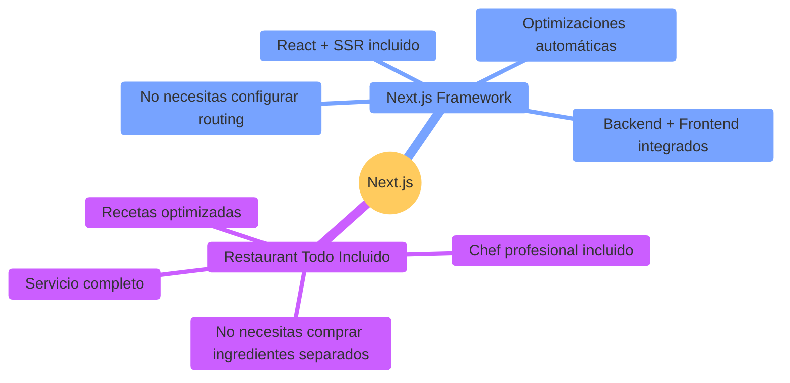
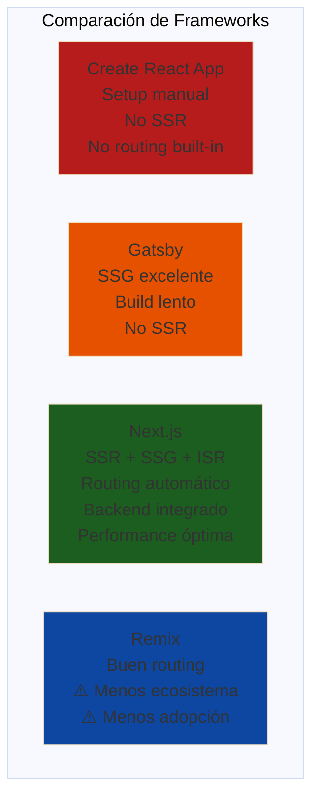
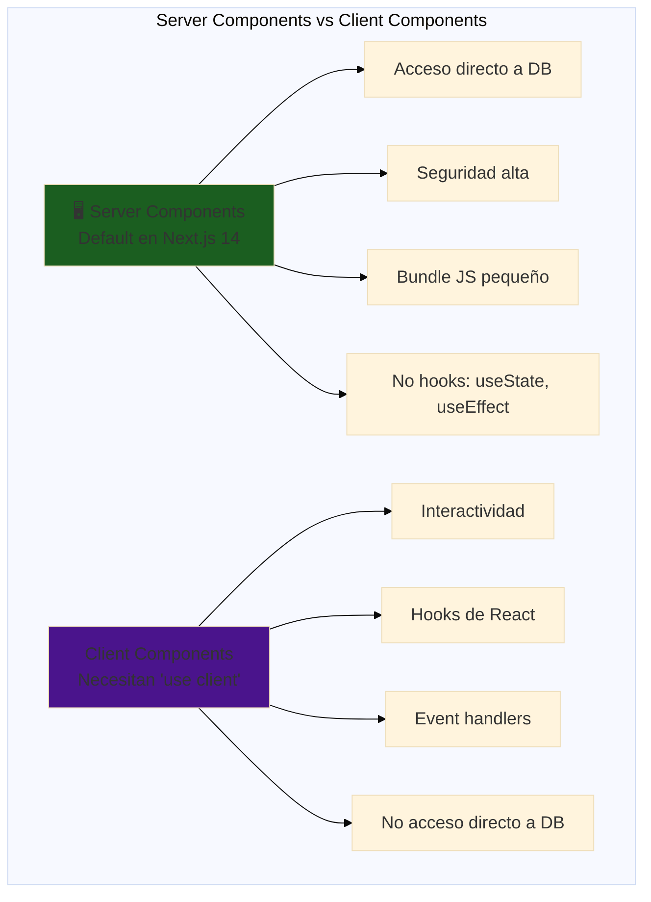
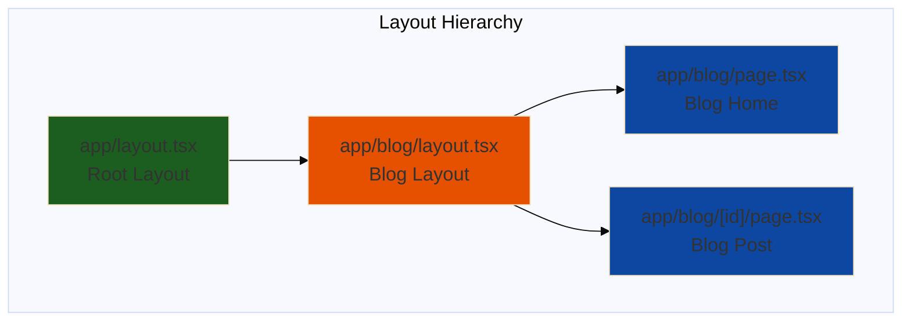
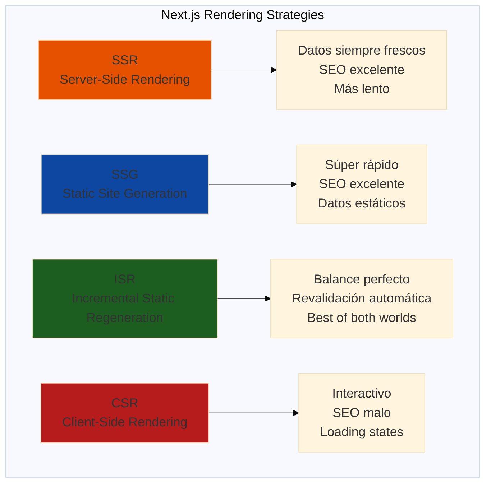

# 🚀 Módulo 01: Next.js 14 Foundations

## Construye Aplicaciones Web Modernas con React

> **Para Desarrolladores Web**: Este módulo te enseña Next.js 14 desde cero, el framework React más usado en la industria. Aprenderás App Router, Server Components, routing dinámico, data fetching moderno, y cómo OpenCode acelera el desarrollo de aplicaciones full-stack.

**⏱️ Duración**: 4 horas  
**👤 Nivel**: Principiante-Intermedio  
**🎯 Objetivo**: Dominar Next.js 14 y crear aplicaciones web profesionales

---

## 🎓 ¿Qué Vas a Lograr?

1. ✅ **Crear apps Next.js 14** - App Router y arquitectura moderna
2. ✅ **Entender componentes** - Server vs Client Components
3. ✅ **Implementar routing** - File-based routing y navegación
4. ✅ **Fetch de datos** - SSR, SSG, ISR, y streaming
5. ✅ **Optimizar SEO** - Metadata y performance
6. ✅ **Deploy en Vercel** - Producción en minutos

---

## 🤔 ¿Qué es Next.js?

### Analogía: Framework Todo-en-Uno



**Next.js** = Framework de React que incluye todo lo necesario para aplicaciones web modernas: routing, rendering, data fetching, optimizaciones, y backend.

### ¿Por Qué Next.js en Paraguay?

**Realidad del mercado local**:
- ✅ **Softtek** - Stack principal para proyectos web enterprise
- ✅ **Global Logic** - 40+ proyectos USA usando Next.js
- ✅ **Aruma** - Fintech con Next.js 14 + TypeScript
- ✅ **Roshka** - 80% de proyectos web nuevos con Next.js
- ✅ **Startups** - Stack #1 más adoptado en 2025-2026

**Salarios**:
- Junior (0-2 años): ₲7M-12M/mes
- Mid-Level (2-4 años): ₲12M-18M/mes
- Senior (4+ años): ₲20M-30M/mes

**Sin Next.js** = Pierdes 60% de oportunidades web 🚫

---

## 📋 Prerrequisitos

### Conocimientos Requeridos

✅ **JavaScript Moderno (ES6+)** (Fundamental):
- Arrow functions: `const add = (a, b) => a + b`
- Destructuring: `const { name, age } = user`
- Async/await para promesas
- Array methods: map, filter, reduce
- **Verificación**: ¿Entiendes `async/await` y promesas?

✅ **React Básico** (Fundamental):
- Components (function components)
- JSX syntax básico
- Props y estado (useState hook)
- Renderizado condicional
- **Verificación**: ¿Puedes crear un componente React básico?

✅ **HTML y CSS** (Fundamental):
- Estructura HTML semántica
- CSS básico (selectores, flexbox, grid)
- Responsive design concepts
- **Verificación**: ¿Conoces la diferencia entre `<div>` y `<section>`?

✅ **Node.js y npm** (Fundamental):
- Qué es Node.js y para qué sirve
- Instalar paquetes con npm/yarn
- Scripts en package.json
- **Verificación**: ¿Has usado `npm install` antes?

❌ **NO Se Requiere**:
- Experiencia previa con Next.js (se enseña desde cero)
- TypeScript avanzado (se explica lo necesario)
- Conocimiento de SSR/SSG (se cubre en el módulo)
- Experiencia con frameworks backend

### Software Necesario (OBLIGATORIO)

**Obligatorios** (instalar ANTES del módulo):

1. **Node.js v18+**
   - **Cómo verificar**: Abre terminal y ejecuta `node --version`
   - **Debería mostrar**: v18.x.x o superior
   - **Si no tienes**: [nodejs.org/download](https://nodejs.org/) → Descargar LTS
   - **Tiempo instalación**: 5-10 min

2. **VS Code**
   - **Editor recomendado** para desarrollo web
   - **Descargar**: [code.visualstudio.com](https://code.visualstudio.com/)
   - **Extensiones recomendadas** (instalar después):
     - ES7+ React/Redux/React-Native snippets
     - Tailwind CSS IntelliSense
     - Prettier - Code formatter
   - **Tiempo instalación**: 5-10 min

3. **Git**
   - **Para clonar repos y control de versiones**
   - **Cómo verificar**: `git --version`
   - **Si no tienes**: [git-scm.com/downloads](https://git-scm.com/downloads)
   - **Tiempo instalación**: 5 min

**Opcional pero Recomendado**:

4. **GitHub Account**
   - Para publicar proyectos
   - **Crear cuenta**: [github.com/signup](https://github.com/signup) (gratis, 2 min)

5. **Vercel Account**
   - Para deployment (lo crearemos en Módulo 05)
   - Puedes crearlo después

### Módulos Previos Necesarios

**Obligatorios**:
- ✅ **00-CORE-FOUNDATION (Semana 1)** - OpenCode y herramientas AI configuradas
- ✅ **Fundamentos de JavaScript** (si no tienes, toma curso básico primero)

**NO requiere otros módulos del track** (este ES el primer módulo técnico del track Web).

**Recomendado** (pero no obligatorio):
- Curso básico de React (si nunca has visto React)
  - Alternativa: Sección "React Crash Course" en recursos adicionales

### Auto-Evaluación

Responde estas preguntas para verificar si estás listo:

1. **¿Puedes escribir una función arrow en JavaScript?**  
   Ejemplo: `const double = (x) => x * 2`  
   SÍ / NO

2. **¿Sabes qué es JSX y cómo se diferencia de HTML?**  
   SÍ / NO

3. **¿Has usado `useState` en React antes?**  
   SÍ / NO (si NO, pero conoces conceptos básicos de React, está bien)

4. **¿Tienes Node.js v18+ instalado en tu PC?**  
   Verifica con: `node --version`  
   SÍ / NO

5. **¿Puedes dedicar 4-5 horas a este módulo (incluye práctica)?**  
   SÍ / NO

**Interpretación**:
- **4-5 SÍes**: ✅ Listo para comenzar
- **3 SÍes**: ⚠️ Verifica que al menos tengas Node.js instalado (#4) y JavaScript básico (#1)
- **< 3 SÍes**: ❌ Toma un curso básico de JavaScript/React primero (ver recursos de repaso)

**Recursos de Repaso** (si necesitas):
- [JavaScript.info](https://javascript.info/) - Guía completa de JS moderno (gratis)
- [React Official Tutorial](https://react.dev/learn) - Tutorial oficial de React (gratis)
- [FreeCodeCamp React](https://www.freecodecamp.org/learn/front-end-development-libraries/) - Curso gratuito
- [Khan Academy: Intro to JS](https://www.khanacademy.org/computing/computer-programming) - Para principiantes absolutos

### Tiempo Estimado Total

- **Instalación de software** (si no tienes): 15-20 min (ANTES del módulo)
- **Contenido teórico**: 1.5-2 horas
- **Código y práctica**: 2-3 horas
- **Proyecto del módulo**: 2-3 horas adicionales

**Total**: 4-8 horas (depende de tu experiencia previa)

### Checklist Final

Antes de comenzar, verifica:

- [ ] He completado CORE-FOUNDATION (Semana 1)
- [ ] Tengo Node.js v18+ instalado (verificado con `node --version`)
- [ ] Tengo VS Code instalado y funcionando
- [ ] Tengo Git instalado (verificado con `git --version`)
- [ ] Entiendo JavaScript moderno básico (ES6+)
- [ ] Conozco React básico (components, JSX, props)
- [ ] Tengo 4+ horas disponibles para el módulo
- [ ] (Opcional) Tengo cuenta de GitHub creada

**Si marcaste los primeros 7**: ¡Adelante! 🚀

**Si NO tienes Node.js instalado**: ⚠️ DETENTE - instala primero (10 min). El módulo asume que ya tienes Node.js funcionando.

**Si NO conoces React**: ⚠️ Considera tomar el "React Crash Course" de 1 hora en recursos adicionales, o avanza despacio y googlea conceptos que no entiendas.

---

## 📊 Next.js vs Alternativas



### ¿Por Qué Next.js Gana?

| Feature | CRA | Gatsby | Next.js | Remix |
|---------|-----|--------|---------|-------|
| **SSR (Server-Side Rendering)** | ❌ | ❌ | ✅ | ✅ |
| **SSG (Static Site Generation)** | ❌ | ✅ | ✅ | ⚠️ |
| **ISR (Incremental Static Regeneration)** | ❌ | ❌ | ✅ | ❌ |
| **API Routes (Backend)** | ❌ | ❌ | ✅ | ✅ |
| **Image Optimization** | ❌ | ✅ | ✅ | ❌ |
| **File-based Routing** | ❌ | ✅ | ✅ | ✅ |
| **App Router (Server Components)** | ❌ | ❌ | ✅ | ❌ |
| **Vercel Deployment (1-click)** | ⚠️ | ✅ | ✅ | ⚠️ |
| **Adopción Industria** | 📉 | 📊 | 📈 | 📊 |

**Resultado**: Next.js domina en versatilidad, performance, y adopción empresarial.

---

## 🏗️ Parte 1: Next.js 14 Básico (60 min)

### Concepto: App Router

**Analogía**: Sistema de carpetas = URLs automáticas.

```mermaid
%%{init: {'theme':'base', 'themeVariables': {'fontSize':'18px'}}}%%
graph LR
    subgraph "App Router - File System = URLs"
        A[📁 app/<br/>page.tsx]
        B[localhost:3000/]
        
        C[📁 app/about/<br/>page.tsx]
        D[localhost:3000/about]
        
        E[📁 app/blog/[id]/<br/>page.tsx]
        F[localhost:3000/blog/123]
        
        A --> B
        C --> D
        E --> F
    end
    
    style A fill:#0d47a1
    style C fill:#1b5e20
    style E fill:#e65100
```

**App Router** = Cada carpeta en `/app` se convierte automáticamente en una ruta URL. No más configuración manual de routing.

### Crear Tu Primera App Next.js

#### Instalación con OpenCode

```bash
# Crear proyecto Next.js con TypeScript + Tailwind
npx create-next-app@latest fpuna-blog --typescript --tailwind --app --eslint

# Navegar al proyecto
cd fpuna-blog

# Instalar dependencies (si no lo hizo automáticamente)
npm install

# Correr desarrollo
npm run dev
```

**Opciones explicadas**:
- `--typescript`: TypeScript activado
- `--tailwind`: Tailwind CSS configurado
- `--app`: Usar App Router (nuevo paradigma)
- `--eslint`: Linter para calidad de código

#### Estructura del Proyecto

```
fpuna-blog/
├── app/                    # ← App Router (rutas principales)
│   ├── layout.tsx          # Layout raíz (wrapper global)
│   ├── page.tsx            # Página principal (/)
│   └── globals.css         # Estilos globales
├── public/                 # Archivos estáticos (images, etc)
├── next.config.js          # Configuración Next.js
├── tailwind.config.ts      # Configuración Tailwind
├── tsconfig.json           # Configuración TypeScript
└── package.json            # Dependencies
```

### Server Components vs Client Components

**Concepto crítico**: Next.js 14 introduce Server Components (por defecto).



#### Ejemplo: Server Component (Default)

```typescript
// app/page.tsx (Server Component por defecto)
import { db } from '@/lib/db';

// ✅ ESTO FUNCIONA - Server Component puede usar async
export default async function HomePage() {
  // Fetch directo a base de datos (NO necesitas API route)
  const posts = await db.post.findMany({
    orderBy: { createdAt: 'desc' },
    take: 10,
  });
  
  return (
    <main className="container mx-auto px-4 py-8">
      <h1 className="text-4xl font-bold mb-8">Blog FPUNA</h1>
      
      <div className="grid gap-6">
        {posts.map((post) => (
          <article key={post.id} className="border p-6 rounded-lg">
            <h2 className="text-2xl font-semibold">{post.title}</h2>
            <p className="text-gray-600 mt-2">{post.excerpt}</p>
            <a href={`/blog/${post.id}`} className="text-blue-600 mt-4 inline-block">
              Leer más →
            </a>
          </article>
        ))}
      </div>
    </main>
  );
}
```

**¿Por qué Server Component?**
- ✅ No necesita interactividad (solo mostrar datos)
- ✅ Acceso directo a DB (más rápido)
- ✅ SEO excelente (HTML pre-renderizado)
- ✅ Menos JavaScript al cliente

#### Ejemplo: Client Component

```typescript
// components/LikeButton.tsx (Client Component)
'use client'; // ← Esta directiva convierte en Client Component

import { useState } from 'react';

export default function LikeButton({ postId }: { postId: number }) {
  // ✅ useState SOLO funciona en Client Components
  const [likes, setLikes] = useState(0);
  const [isLiked, setIsLiked] = useState(false);
  
  const handleLike = async () => {
    // Event handler - necesita Client Component
    setIsLiked(!isLiked);
    setLikes(isLiked ? likes - 1 : likes + 1);
    
    // Llamar a API route para persistir
    await fetch(`/api/posts/${postId}/like`, {
      method: 'POST',
    });
  };
  
  return (
    <button
      onClick={handleLike}
      className={`px-4 py-2 rounded ${
        isLiked ? 'bg-blue-600 text-white' : 'bg-gray-200'
      }`}
    >
      ❤️ {likes} Likes
    </button>
  );
}
```

**¿Por qué Client Component?**
- ✅ Necesita `useState` (interactividad)
- ✅ Tiene event handlers (`onClick`)
- ✅ Actualiza UI dinámicamente

#### Composición: Server + Client Components

```typescript
// app/blog/[id]/page.tsx (Server Component)
import { db } from '@/lib/db';
import LikeButton from '@/components/LikeButton'; // Client Component

export default async function BlogPost({ params }: { params: { id: string } }) {
  // Server Component - Fetch de datos
  const post = await db.post.findUnique({
    where: { id: parseInt(params.id) },
  });
  
  if (!post) return <div>Post no encontrado</div>;
  
  return (
    <article className="container mx-auto px-4 py-8">
      <h1 className="text-4xl font-bold">{post.title}</h1>
      <p className="text-gray-600 mt-2">{post.date}</p>
      
      <div className="prose mt-8">{post.content}</div>
      
      {/* Client Component embebido en Server Component */}
      <LikeButton postId={post.id} />
    </article>
  );
}
```

**Regla de oro**: Usa Server Components por defecto, solo agrega `'use client'` cuando necesites interactividad.

### Implementación con OpenCode

```bash
opencode "Crea página principal de blog FPUNA con Next.js 14:

REQUISITOS:
1. Server Component que muestre lista de posts
2. Client Component para botón 'Me gusta'
3. Estilos con Tailwind CSS
4. TypeScript estricto

ESTRUCTURA:
- app/page.tsx (Server Component con fetch de posts)
- components/LikeButton.tsx (Client Component con useState)
- app/layout.tsx (Layout global con header)

DATOS DE EJEMPLO:
- 5 posts sobre tecnología en FPUNA
- Cada post: título, excerpt, fecha, autor
- Diseño responsive (mobile-first)

OUTPUT:
- Código completo
- Comentarios explicando Server vs Client Components
- Todo en español"
```

---

**🎯 Transición**: Ahora que entiendes los fundamentos de Next.js (App Router, Server vs Client Components, arquitectura básica), es momento de dominar una de las características más poderosas del framework: **el sistema de routing**. En frameworks tradicionales, configurar rutas requiere decenas de líneas de código de configuración. En Next.js, las **carpetas son rutas**—crear un archivo `app/about/page.tsx` automáticamente crea la ruta `/about`. En esta parte, aprenderás routing estático, dinámico, layouts anidados, y navegación programática.

## 🛣️ Parte 2: Routing & Navegación (60 min)

### Concepto: File-based Routing

**Analogía**: Carpetas = URLs, sin configuración.

```mermaid
%%{init: {'theme':'base', 'themeVariables': {'fontSize':'18px'}}}%%
graph TD
    subgraph "File-based Routing Examples"
        A[app/page.tsx] --> A1[/]
        
        B[app/about/page.tsx] --> B1[/about]
        
        C[app/blog/page.tsx] --> C1[/blog]
        
        D["app/blog/[id]/page.tsx"] --> D1["/blog/:id<br/>(dynamic)"]
        
        E["app/blog/[category]/[slug]/page.tsx"] --> E1["/blog/:category/:slug<br/>(nested dynamic)"]
    end
    
    style A fill:#1b5e20
    style D fill:#e65100
    style E fill:#4a148c
```

### Rutas Dinámicas

**Concepto**: `[nombre]` = parámetro dinámico.

#### Ruta Dinámica Simple

```typescript
// app/blog/[id]/page.tsx
interface PageProps {
  params: {
    id: string; // ← Automáticamente viene de la URL
  };
}

export default async function BlogPost({ params }: PageProps) {
  const { id } = params;
  
  // Fetch post específico
  const post = await db.post.findUnique({
    where: { id: parseInt(id) },
  });
  
  return (
    <article>
      <h1>{post.title}</h1>
      <p>{post.content}</p>
    </article>
  );
}
```

**URLs que matchean**:
- `/blog/1` → `params.id = "1"`
- `/blog/123` → `params.id = "123"`
- `/blog/nextjs-tutorial` → `params.id = "nextjs-tutorial"`

#### Rutas Anidadas Dinámicas

```typescript
// app/blog/[category]/[slug]/page.tsx
interface PageProps {
  params: {
    category: string;
    slug: string;
  };
}

export default async function CategoryPost({ params }: PageProps) {
  const { category, slug } = params;
  
  const post = await db.post.findFirst({
    where: {
      category: category,
      slug: slug,
    },
  });
  
  return (
    <article>
      <div className="text-sm text-gray-600">
        Categoría: {category}
      </div>
      <h1>{post.title}</h1>
      <p>{post.content}</p>
    </article>
  );
}
```

**URLs que matchean**:
- `/blog/tecnologia/nextjs-14` → `category: "tecnologia"`, `slug: "nextjs-14"`
- `/blog/educacion/fpuna-2026` → `category: "educacion"`, `slug: "fpuna-2026"`

### Navegación: Link Component

**Concepto**: `<Link>` optimiza navegación (prefetch automático).

```typescript
// components/PostCard.tsx
import Link from 'next/link';

interface Post {
  id: number;
  title: string;
  excerpt: string;
}

export default function PostCard({ post }: { post: Post }) {
  return (
    <article className="border p-6 rounded-lg">
      <h2 className="text-2xl font-semibold">{post.title}</h2>
      <p className="text-gray-600 mt-2">{post.excerpt}</p>
      
      {/* ✅ Link optimizado - prefetch automático */}
      <Link 
        href={`/blog/${post.id}`}
        className="text-blue-600 mt-4 inline-block hover:underline"
      >
        Leer más →
      </Link>
    </article>
  );
}
```

**Ventajas de `<Link>`**:
- ✅ Prefetch automático (pre-carga páginas)
- ✅ Navegación client-side (sin full page reload)
- ✅ Scroll to top automático
- ✅ Mejor performance que `<a>`

### Navegación Programática

```typescript
// components/SearchForm.tsx
'use client';

import { useRouter } from 'next/navigation';
import { useState } from 'react';

export default function SearchForm() {
  const router = useRouter();
  const [query, setQuery] = useState('');
  
  const handleSearch = (e: React.FormEvent) => {
    e.preventDefault();
    
    // Navegación programática
    router.push(`/search?q=${query}`);
  };
  
  return (
    <form onSubmit={handleSearch}>
      <input
        type="text"
        value={query}
        onChange={(e) => setQuery(e.target.value)}
        placeholder="Buscar posts..."
        className="px-4 py-2 border rounded"
      />
      <button type="submit" className="ml-2 px-4 py-2 bg-blue-600 text-white rounded">
        Buscar
      </button>
    </form>
  );
}
```

### Layouts Anidados

**Concepto**: `layout.tsx` = wrapper compartido para rutas.



#### Root Layout (Obligatorio)

```typescript
// app/layout.tsx
import type { Metadata } from 'next';
import './globals.css';

export const metadata: Metadata = {
  title: 'Blog FPUNA',
  description: 'Blog oficial de la Facultad Politécnica',
};

export default function RootLayout({
  children,
}: {
  children: React.ReactNode;
}) {
  return (
    <html lang="es">
      <body>
        {/* Header global */}
        <header className="border-b">
          <nav className="container mx-auto px-4 py-4">
            <a href="/" className="text-2xl font-bold">FPUNA Blog</a>
          </nav>
        </header>
        
        {/* Contenido de páginas */}
        {children}
        
        {/* Footer global */}
        <footer className="border-t mt-16">
          <div className="container mx-auto px-4 py-8">
            <p>© 2026 FPUNA - Todos los derechos reservados</p>
          </div>
        </footer>
      </body>
    </html>
  );
}
```

#### Nested Layout

```typescript
// app/blog/layout.tsx
export default function BlogLayout({
  children,
}: {
  children: React.ReactNode;
}) {
  return (
    <div className="container mx-auto px-4 py-8">
      <div className="grid grid-cols-12 gap-8">
        {/* Sidebar (solo en /blog/*) */}
        <aside className="col-span-3">
          <h3 className="font-bold mb-4">Categorías</h3>
          <ul className="space-y-2">
            <li><a href="/blog/tecnologia">Tecnología</a></li>
            <li><a href="/blog/educacion">Educación</a></li>
            <li><a href="/blog/investigacion">Investigación</a></li>
          </ul>
        </aside>
        
        {/* Contenido principal */}
        <main className="col-span-9">
          {children}
        </main>
      </div>
    </div>
  );
}
```

**Resultado**: Todas las páginas bajo `/blog/*` tienen el sidebar automáticamente.

### Implementación con OpenCode

```bash
opencode "Crea estructura de routing completa para blog FPUNA:

REQUISITOS:
1. Root layout con header/footer
2. Blog layout con sidebar de categorías
3. Rutas dinámicas para posts
4. Navegación con Link optimizado
5. Breadcrumbs dinámicos

ESTRUCTURA:
app/
├── layout.tsx (root)
├── page.tsx (home)
├── blog/
│   ├── layout.tsx (blog wrapper)
│   ├── page.tsx (lista posts)
│   ├── [id]/
│   │   └── page.tsx (post individual)
│   └── [category]/
│       └── [slug]/
│           └── page.tsx (post por categoría)

FEATURES:
- TypeScript strict
- Tailwind CSS responsive
- Metadata SEO
- Comentarios en español

OUTPUT: Código completo funcional"
```

---

**🎯 Transición**: Ya sabes crear páginas y navegar entre ellas, pero las aplicaciones web reales necesitan **mostrar datos**: productos, usuarios, posts de blog. La forma en que obtienes y renderizas esos datos determina la **velocidad** y **experiencia de usuario** de tu app. Next.js ofrece múltiples estrategias de data fetching—SSR (Server-Side Rendering), SSG (Static Site Generation), ISR (Incremental Static Regeneration)—cada una optimizada para casos de uso específicos. En esta parte, dominarás cuándo y cómo usar cada estrategia para máxima performance.

## 📡 Parte 3: Data Fetching Estrategias (60 min)

### Concepto: Rendering Modes



### SSR (Server-Side Rendering) - Default

**Concepto**: Cada request renderiza en servidor (datos siempre frescos).

```typescript
// app/dashboard/page.tsx (SSR por defecto)
export default async function Dashboard() {
  // Fetch en cada request
  const stats = await fetch('https://api.fpuna.edu.py/stats', {
    cache: 'no-store', // ← Fuerza SSR (sin cache)
  }).then((res) => res.json());
  
  return (
    <div>
      <h1>Dashboard en Tiempo Real</h1>
      <p>Usuarios activos: {stats.activeUsers}</p>
      <p>Posts hoy: {stats.postsToday}</p>
      <p className="text-xs">Actualizado: {new Date().toLocaleString()}</p>
    </div>
  );
}
```

**Cuándo usar SSR**:
- ✅ Datos cambian frecuentemente
- ✅ Personalización por usuario
- ✅ SEO crítico + datos dinámicos

### SSG (Static Site Generation)

**Concepto**: Pre-renderiza en build time (HTML estático).

```typescript
// app/about/page.tsx (SSG)
export default async function About() {
  // Fetch en build time (se cachea para siempre)
  const teamMembers = await fetch('https://api.fpuna.edu.py/team', {
    cache: 'force-cache', // ← SSG (default)
  }).then((res) => res.json());
  
  return (
    <div>
      <h1>Sobre FPUNA</h1>
      <ul>
        {teamMembers.map((member: any) => (
          <li key={member.id}>{member.name} - {member.role}</li>
        ))}
      </ul>
    </div>
  );
}
```

**Cuándo usar SSG**:
- ✅ Datos no cambian frecuentemente
- ✅ Performance crítica
- ✅ Páginas estáticas (landing, about)

### ISR (Incremental Static Regeneration) - Recomendado

**Concepto**: SSG + revalidación periódica (mejor de ambos mundos).

```typescript
// app/blog/page.tsx (ISR)
export default async function BlogHome() {
  // Regenera cada 60 segundos
  const posts = await fetch('https://api.fpuna.edu.py/posts', {
    next: { revalidate: 60 }, // ← ISR (revalidar cada 60 segundos)
  }).then((res) => res.json());
  
  return (
    <div>
      <h1>Últimos Posts</h1>
      {posts.map((post: any) => (
        <article key={post.id}>
          <h2>{post.title}</h2>
          <p>{post.excerpt}</p>
        </article>
      ))}
    </div>
  );
}
```

**Ventajas ISR**:
- ✅ Velocidad de SSG (cached HTML)
- ✅ Datos actualizados (revalidación automática)
- ✅ Menos carga en servidor
- ✅ SEO excelente

**Cuándo usar ISR**:
- ✅ Blogs, noticias, e-commerce
- ✅ Datos cambian ocasionalmente
- ✅ Tráfico alto (ISR escala mejor)

### Data Fetching Directo en Server Components

```typescript
// app/products/[id]/page.tsx
import { db } from '@/lib/db'; // Prisma ORM

export default async function ProductPage({ params }: { params: { id: string } }) {
  // ✅ Acceso directo a DB (sin API route)
  const product = await db.product.findUnique({
    where: { id: parseInt(params.id) },
    include: {
      reviews: {
        orderBy: { createdAt: 'desc' },
        take: 5,
      },
    },
  });
  
  if (!product) {
    return <div>Producto no encontrado</div>;
  }
  
  return (
    <div>
      <h1>{product.name}</h1>
      <p>₲{product.price.toLocaleString()}</p>
      
      <h2 className="mt-8">Reseñas</h2>
      {product.reviews.map((review) => (
        <div key={review.id}>
          <p>⭐ {review.rating}/5</p>
          <p>{review.comment}</p>
        </div>
      ))}
    </div>
  );
}
```

**Ventajas**:
- ✅ No necesitas crear API routes
- ✅ Type-safe con Prisma
- ✅ Menos código (menos archivos)
- ✅ Performance mejor (sin HTTP overhead)

### Streaming con Suspense

**Concepto**: Mostrar partes de página mientras otras cargan.

```typescript
// app/dashboard/page.tsx
import { Suspense } from 'react';
import RecentOrders from '@/components/RecentOrders';
import Analytics from '@/components/Analytics';

export default function Dashboard() {
  return (
    <div>
      <h1>Dashboard</h1>
      
      {/* Suspense permite streaming */}
      <Suspense fallback={<div>Cargando órdenes...</div>}>
        <RecentOrders />
      </Suspense>
      
      <Suspense fallback={<div>Cargando analytics...</div>}>
        <Analytics />
      </Suspense>
    </div>
  );
}
```

```typescript
// components/RecentOrders.tsx (Server Component)
export default async function RecentOrders() {
  // Este fetch no bloquea el resto de la página
  const orders = await db.order.findMany({
    take: 10,
    orderBy: { createdAt: 'desc' },
  });
  
  return (
    <div>
      <h2>Órdenes Recientes</h2>
      <ul>
        {orders.map((order) => (
          <li key={order.id}>#{order.id} - ₲{order.total}</li>
        ))}
      </ul>
    </div>
  );
}
```

**Ventajas Streaming**:
- ✅ TTFB (Time to First Byte) más rápido
- ✅ UI progresiva (no espera todo)
- ✅ Mejor UX en conexiones lentas

### Implementación con OpenCode

```bash
opencode "Crea sistema de posts con ISR para blog FPUNA:

REQUISITOS:
1. Lista de posts con ISR (revalidar cada 60s)
2. Post individual con SSG
3. Dashboard con SSR (no-cache)
4. Streaming con Suspense para comentarios

ESTRUCTURA:
app/
├── blog/
│   ├── page.tsx (ISR - lista posts)
│   └── [id]/
│       └── page.tsx (SSG - post individual)
├── dashboard/
│   └── page.tsx (SSR - stats en tiempo real)
└── components/
    └── Comments.tsx (Server Component con streaming)

FEATURES:
- TypeScript + Prisma
- Cache strategies correctas
- Loading states con Suspense
- Comentarios en español

OUTPUT: Implementación completa con data fetching optimizado"
```

---

**🎯 Transición**: Tu aplicación Next.js funciona—tiene páginas, routing, y obtiene datos correctamente. Pero **funcionar no es suficiente** para producción. ¿Tu app aparece en Google? ¿Carga rápido en conexiones lentas? ¿Las imágenes están optimizadas? En esta parte final, aprenderás las optimizaciones que separan una aplicación de juguete de una **lista para producción**: SEO con Metadata API, optimización de imágenes automática, fonts performance, y cómo Next.js ya viene con estas optimizaciones integradas. Estos detalles son los que impresionan en entrevistas técnicas.

## ⚡ Parte 4: Optimización & Metadata (30 min)

### Metadata API (SEO)

**Concepto**: Configurar SEO desde cada página.

```typescript
// app/blog/[id]/page.tsx
import type { Metadata } from 'next';
import { db } from '@/lib/db';

// ✅ Metadata dinámica (SEO por post)
export async function generateMetadata({ params }: { params: { id: string } }): Promise<Metadata> {
  const post = await db.post.findUnique({
    where: { id: parseInt(params.id) },
  });
  
  if (!post) {
    return {
      title: 'Post no encontrado',
    };
  }
  
  return {
    title: `${post.title} | Blog FPUNA`,
    description: post.excerpt,
    openGraph: {
      title: post.title,
      description: post.excerpt,
      images: [post.coverImage],
      type: 'article',
      publishedTime: post.createdAt.toISOString(),
      authors: [post.author],
    },
    twitter: {
      card: 'summary_large_image',
      title: post.title,
      description: post.excerpt,
      images: [post.coverImage],
    },
  };
}

export default async function BlogPost({ params }: { params: { id: string } }) {
  const post = await db.post.findUnique({
    where: { id: parseInt(params.id) },
  });
  
  return (
    <article>
      <h1>{post.title}</h1>
      <p>{post.content}</p>
    </article>
  );
}
```

**Resultado**:
- ✅ SEO dinámico por página
- ✅ Open Graph (Facebook, LinkedIn)
- ✅ Twitter Cards
- ✅ Mejor ranking en Google

### Image Optimization

```typescript
// components/PostCard.tsx
import Image from 'next/image';

export default function PostCard({ post }: { post: Post }) {
  return (
    <article>
      {/* ✅ Next.js optimiza automáticamente */}
      <Image
        src={post.coverImage}
        alt={post.title}
        width={800}
        height={400}
        className="rounded-lg"
        priority={post.featured} // Precarga si es featured
      />
      
      <h2>{post.title}</h2>
      <p>{post.excerpt}</p>
    </article>
  );
}
```

**Optimizaciones automáticas**:
- ✅ Lazy loading (solo carga cuando visible)
- ✅ Formatos modernos (WebP, AVIF)
- ✅ Resize automático
- ✅ Blur placeholder

### Loading States

```typescript
// app/blog/loading.tsx
export default function Loading() {
  return (
    <div className="container mx-auto px-4 py-8">
      <div className="animate-pulse">
        <div className="h-8 bg-gray-200 rounded w-1/3 mb-4"></div>
        <div className="h-4 bg-gray-200 rounded w-full mb-2"></div>
        <div className="h-4 bg-gray-200 rounded w-full mb-2"></div>
        <div className="h-4 bg-gray-200 rounded w-2/3"></div>
      </div>
    </div>
  );
}
```

**Resultado**: UI skeleton mientras carga (mejor UX).

---

## 🎯 Ejercicio Práctico: Blog Completo FPUNA

### Objetivo

Crear blog full-stack con Next.js 14, TypeScript, Tailwind CSS, y Prisma.

### Requisitos

**Features**:
1. Homepage con lista de posts (ISR, revalidar cada 60s)
2. Post individual con SEO dinámico
3. Categorías con routing dinámico
4. Búsqueda client-side (Client Component)
5. Dashboard con stats en tiempo real (SSR)
6. Loading states y error handling

**Tech Stack**:
- Next.js 14 (App Router)
- TypeScript
- Tailwind CSS
- Prisma + PostgreSQL (o SQLite local)

### Implementación Guiada con OpenCode

```bash
opencode "Crea blog completo FPUNA con Next.js 14:

REQUISITOS FUNCIONALES:
1. Homepage:
   - Lista de posts con paginación
   - ISR con revalidación cada 60s
   - Grid responsive (1 col mobile, 3 cols desktop)
   - Mostrar: título, excerpt, cover image, fecha, autor

2. Post Individual:
   - Ruta dinámica /blog/[id]
   - SEO metadata dinámico (Open Graph + Twitter Cards)
   - Server Component con fetch a Prisma
   - Mostrar: título, cover image, contenido, fecha, autor
   - Sección de posts relacionados

3. Categorías:
   - Ruta /blog/[category]
   - Filtrar posts por categoría
   - Breadcrumbs dinámicos

4. Búsqueda:
   - Client Component con useState
   - Búsqueda en tiempo real (filter posts)
   - Mostrar resultados con highlight

5. Dashboard:
   - SSR (no-cache)
   - Stats: total posts, total views, posts hoy
   - Últimas 5 órdenes
   - Streaming con Suspense

TECH STACK:
- Next.js 14 (App Router)
- TypeScript strict
- Tailwind CSS (mobile-first)
- Prisma ORM
- PostgreSQL (o SQLite para desarrollo)

ESTRUCTURA:
app/
├── layout.tsx (root layout con header/footer)
├── page.tsx (homepage con posts)
├── blog/
│   ├── layout.tsx (sidebar categorías)
│   ├── page.tsx (lista posts)
│   ├── [id]/
│   │   ├── page.tsx (post individual)
│   │   └── loading.tsx (skeleton)
│   └── [category]/
│       └── page.tsx (posts por categoría)
├── dashboard/
│   └── page.tsx (stats SSR)
├── search/
│   └── page.tsx (búsqueda con searchParams)
components/
├── PostCard.tsx (card de post)
├── SearchBar.tsx (Client Component)
├── CategoryNav.tsx (navegación categorías)
lib/
├── db.ts (Prisma client)
prisma/
└── schema.prisma (modelo de datos)

PRISMA SCHEMA:
model Post {
  id          Int      @id @default(autoincrement())
  title       String
  slug        String   @unique
  excerpt     String
  content     String
  coverImage  String
  category    String
  author      String
  views       Int      @default(0)
  createdAt   DateTime @default(now())
  updatedAt   DateTime @updatedAt
}

DATA SEED:
- 10 posts de ejemplo sobre tecnología en FPUNA
- 3 categorías: tecnología, educación, investigación
- Datos en español

OUTPUT:
- Código completo funcional
- README con instrucciones setup
- Seed script para datos de ejemplo
- Comentarios en español explicando conceptos clave
- TypeScript strict sin any"
```

### Verificación

```bash
# Instalar dependencies
npm install

# Setup Prisma + seed data
npx prisma generate
npx prisma db push
npx prisma db seed

# Correr desarrollo
npm run dev

# Abrir http://localhost:3000
```

**Checklist**:
- [ ] Homepage carga lista de posts
- [ ] Click en post abre página individual
- [ ] SEO metadata visible en inspector
- [ ] Búsqueda filtra posts en tiempo real
- [ ] Dashboard muestra stats actualizados
- [ ] Responsive en mobile y desktop
- [ ] No errores en consola

---

## ✅ Checklist de Next.js Foundations

### Conceptos Fundamentales
- [ ] Entiendo diferencia entre App Router y Pages Router
- [ ] Sé cuándo usar Server vs Client Components
- [ ] Puedo crear rutas dinámicas con `[param]`
- [ ] Entiendo SSR, SSG, e ISR
- [ ] Sé usar `<Link>` para navegación optimizada

### Implementación
- [ ] Creé proyecto Next.js con TypeScript
- [ ] Implementé layouts anidados (root + nested)
- [ ] Usé fetch con cache strategies correctas
- [ ] Agregué metadata SEO dinámico
- [ ] Implementé loading states con Suspense

### Best Practices
- [ ] Server Components por defecto (solo `'use client'` cuando necesito)
- [ ] ISR para datos que cambian ocasionalmente
- [ ] `<Image>` para optimización automática
- [ ] TypeScript strict (no `any`)
- [ ] Mobile-first con Tailwind CSS

---

## 🎓 Mejores Prácticas

### ✅ HACER

1. **Server Components por defecto** - Solo `'use client'` cuando necesitas interactividad
2. **ISR para blogs/e-commerce** - Balance perfecto entre velocidad y freshness
3. **Metadata SEO en cada página** - `generateMetadata()` para SEO dinámico
4. **Loading states** - `loading.tsx` y Suspense para mejor UX
5. **TypeScript strict** - Catch errores antes de runtime
6. **Tailwind mobile-first** - `sm:` para desktop, default para mobile
7. **`<Link prefetch>`** - Navegación instantánea
8. **Error boundaries** - `error.tsx` para graceful degradation

### ❌ NO HACER

1. **`'use client'` everywhere** - Pierde beneficios de Server Components
2. **`cache: 'no-store'` por defecto** - SSR es más lento, usa ISR
3. **Fetch en Client Components** - Duplica requests, usa Server Components
4. **Inline styles** - Usa Tailwind (consistencia + performance)
5. **`<a>` para navegación interna** - Siempre `<Link>`
6. **Ignorar metadata** - SEO crítico para visibilidad
7. **console.log en producción** - Usa herramientas de observabilidad
8. **Any en TypeScript** - Pierde type safety

---

## 🎉 Resumen del Módulo

### Lo Que Dominaste

✅ **Next.js 14 Fundamentos** - App Router, file-based routing, layouts  
✅ **Server vs Client Components** - Cuándo usar cada uno  
✅ **Routing Dinámico** - `[params]` y rutas anidadas  
✅ **Data Fetching Moderno** - SSR, SSG, ISR, streaming  
✅ **SEO & Performance** - Metadata, Image optimization  
✅ **OpenCode Integration** - Generar componentes y páginas con IA

### Próximo Paso

**Continúa con**: [Módulo 02 - Full-Stack Development](./02-desarrollo-fullstack.md)

---

## 💭 Reflexión

1. **¿Cuándo usarías Server Components vs Client Components en tu proyecto?**
2. **¿Qué estrategia de rendering (SSR/SSG/ISR) es mejor para un e-commerce?**
3. **¿Cómo OpenCode acelera el desarrollo de páginas Next.js?**

**Comparte en Slack** (#web-dev-nextjs)

---

## 📝 Quiz de Evaluación

### Instrucciones

- **Total**: 10 preguntas
- **Tiempo estimado**: 20-25 minutos
- **Aprobación**: 7+ respuestas correctas
- **Propósito**: Verificar comprensión de Next.js 14, App Router, y React Server Components

**Nota**: Quiz conceptual con algunos fragmentos de código.

---

### Preguntas

#### 1. App Router vs Pages Router (Múltiple Opción)

¿Cuál es la PRINCIPAL diferencia entre App Router (Next.js 14) y Pages Router (Next.js 12)?

a) App Router usa carpeta `pages/`, Pages Router usa `app/`  
b) App Router soporta Server Components, Pages Router solo Client Components  
c) App Router es más lento que Pages Router  
d) No hay diferencia, son nombres diferentes para lo mismo

---

#### 2. Server Components (Verdadero/Falso)

**Afirmación**: "Los Server Components en Next.js 14 se ejecutan en el navegador del usuario y tienen acceso a `window` y `document`."

a) Verdadero  
b) Falso

---

#### 3. File-based Routing (Múltiple Opción)

En Next.js con App Router, ¿qué archivo crea una ruta `/blog/[slug]`?

a) `app/blog/[slug].tsx`  
b) `app/blog/[slug]/page.tsx`  
c) `pages/blog/[slug].tsx`  
d) `app/routes/blog/[slug]/index.tsx`

---

#### 4. Metadata API (Múltiple Opción)

¿Cuál es la forma correcta de definir metadata en Next.js 14?

a) `<Head>` component de next/head  
b) `export const metadata = { title: "..." }`  
c) `useMetadata()` hook  
d) Archivo `metadata.json` en cada carpeta

---

#### 5. Data Fetching (Múltiple Opción)

¿Cuál función usarías para fetch de datos en un Server Component de Next.js 14?

a) `useEffect()` con fetch  
b) `getServerSideProps()`  
c) `async/await` directo en el componente  
d) `useSWR()` hook

---

#### 6. Client Components (Verdadero/Falso)

**Afirmación**: "Para usar hooks de React como `useState` o `useEffect`, DEBES marcar el componente con `'use client'` en Next.js 14."

a) Verdadero  
b) Falso

---

#### 7. Código Práctico - Routing (Respuesta Corta)

Dado esta estructura de carpetas en Next.js 14:

```
app/
├── page.tsx
├── about/
│   └── page.tsx
└── blog/
    ├── page.tsx
    └── [id]/
        └── page.tsx
```

¿Qué URL renderiza el archivo `app/blog/[id]/page.tsx` si visitas `/blog/123`?

**Opciones**:
a) Solo `/blog`  
b) `/blog/123` (correcto)  
c) `/blog/[id]`  
d) Error 404

---

#### 8. Link Component (Múltiple Opción)

¿Cuál es la ventaja de usar `<Link href="/about">` de Next.js vs `<a href="/about">`?

a) No hay diferencia, son idénticos  
b) Link hace prefetch automático y navegación client-side (SPA)  
c) Link solo funciona en producción, `<a>` en desarrollo  
d) Link es más lento pero más SEO-friendly

---

#### 9. Streaming y Suspense (Múltiple Opción)

¿Para qué sirve el componente `<Suspense>` en Next.js 14?

a) Suspender la ejecución del código por X segundos  
b) Mostrar un fallback UI mientras se cargan datos asíncronos  
c) Prevenir errores de componentes  
d) Optimizar imágenes automáticamente

---

#### 10. OpenCode para Next.js (Respuesta Corta)

Menciona **2 tareas específicas** en las que OpenCode puede acelerar desarrollo con Next.js.

**Ejemplo válido**: "Generar componentes Server Component completos con TypeScript types"

**Tus respuestas**:
1. _______________________________________
2. _______________________________________

---

## 📋 Respuestas y Explicaciones

### 1. App Router vs Pages Router
**Respuesta correcta**: **b) App Router soporta Server Components, Pages Router solo Client Components**

**Explicación**:

**App Router (Next.js 13/14 - nuevo)**:
- Carpeta `app/` en la raíz
- Soporta **React Server Components** (RSC) por defecto
- Layouts anidados
- Streaming y Suspense nativo
- Mejor performance (menos JavaScript al cliente)

**Pages Router (Next.js 12 - legacy)**:
- Carpeta `pages/` en la raíz
- Solo **Client Components** (todo se hidrata en el navegador)
- `getServerSideProps`, `getStaticProps` para datos
- Más simple pero menos flexible

**Migración**: Puedes tener ambos coexistiendo, pero nuevos proyectos usan App Router.

---

### 2. Server Components
**Respuesta correcta**: **b) Falso**

**Explicación**:

**Server Components**:
- Se ejecutan **en el servidor** (Node.js)
- **NO tienen acceso** a APIs del navegador (`window`, `document`, `localStorage`)
- **SÍ tienen acceso** a: database, filesystem, environment variables
- El HTML renderizado se envía al cliente (no el código JavaScript)

**Client Components** (`'use client'`):
- Se ejecutan en el navegador
- **SÍ tienen acceso** a `window`, `document`, event listeners
- **Necesarios para**: hooks (`useState`, `useEffect`), interactividad

**Ejemplo**:
```tsx
// ❌ ERROR en Server Component
export default function ServerComp() {
  console.log(window.innerWidth); // ❌ window no existe en servidor
}

// ✅ CORRECTO en Client Component
'use client';
export default function ClientComp() {
  console.log(window.innerWidth); // ✅ funciona
}
```

---

### 3. File-based Routing
**Respuesta correcta**: **b) `app/blog/[slug]/page.tsx`**

**Explicación**:

**App Router file naming**:
- `page.tsx` → Define una **ruta accesible**
- `layout.tsx` → Define un **layout compartido**
- `loading.tsx` → Define **loading UI**
- `error.tsx` → Define **error boundary**

**Rutas dinámicas**:
- `[slug]` → Parámetro dinámico (cualquier valor)
- `[...slug]` → Catch-all (múltiples segmentos)

**Ejemplos**:
```
app/blog/[slug]/page.tsx → /blog/cualquier-valor
app/blog/[id]/page.tsx → /blog/123
app/shop/[...categories]/page.tsx → /shop/electronics/phones/samsung
```

**Acceso al parámetro**:
```tsx
export default function BlogPost({ params }: { params: { slug: string } }) {
  return <h1>Post: {params.slug}</h1>;
}
```

---

### 4. Metadata API
**Respuesta correcta**: **b) `export const metadata = { title: "..." }`**

**Explicación**:

**Next.js 14 - Metadata API**:
```tsx
// app/page.tsx
export const metadata = {
  title: 'Mi Página',
  description: 'Descripción para SEO',
};

export default function Page() {
  return <h1>Hola</h1>;
}
```

**Ventajas vs `<Head>` (viejo)**:
- Type-safe con TypeScript
- Server-rendered (mejor SEO)
- Merge automático con metadata de layouts
- No necesitas importar nada

**Metadata dinámica**:
```tsx
export async function generateMetadata({ params }) {
  const post = await fetchPost(params.id);
  return {
    title: post.title,
    description: post.excerpt,
  };
}
```

---

### 5. Data Fetching en Server Components
**Respuesta correcta**: **c) `async/await` directo en el componente**

**Explicación**:

**Server Components** permiten `async` directamente:
```tsx
// ✅ NUEVO (Next.js 14 - Server Component)
export default async function Page() {
  const data = await fetch('https://api.example.com/data');
  const json = await data.json();
  return <div>{json.title}</div>;
}
```

**Ventajas**:
- Código más simple (no necesitas `useEffect`)
- Corre en el servidor (acceso directo a DB)
- Datos disponibles antes de renderizar HTML

**Client Components usan hooks**:
```tsx
// Para Client Components
'use client';
import { useEffect, useState } from 'react';

export default function ClientPage() {
  const [data, setData] = useState(null);
  useEffect(() => {
    fetch('/api/data').then(r => r.json()).then(setData);
  }, []);
  return <div>{data?.title}</div>;
}
```

---

### 6. Client Components y Hooks
**Respuesta correcta**: **a) Verdadero**

**Explicación**:

**Server Components (por defecto)** NO pueden usar hooks:
```tsx
// ❌ ERROR
export default function ServerComp() {
  const [count, setCount] = useState(0); // ❌ hooks no disponibles
}
```

**Client Components** (`'use client'`) SÍ pueden:
```tsx
// ✅ CORRECTO
'use client';
import { useState } from 'react';

export default function ClientComp() {
  const [count, setCount] = useState(0); // ✅ funciona
  return <button onClick={() => setCount(count + 1)}>{count}</button>;
}
```

**Regla mnemotécnica**: Si necesitas interactividad (hooks, event listeners) → `'use client'`

---

### 7. Routing Práctico
**Respuesta correcta**: **b) `/blog/123` (correcto)**

**Explicación**:

**Estructura**:
```
app/blog/[id]/page.tsx
```

**Matches (coincide con)**:
- `/blog/123` ✅
- `/blog/my-post` ✅
- `/blog/cualquier-cosa` ✅

**No matches**:
- `/blog` ❌ (necesitarías `app/blog/page.tsx`)
- `/blog/123/comments` ❌ (a menos que tengas `app/blog/[id]/comments/page.tsx`)

**Acceso al parámetro**:
```tsx
export default function BlogPost({ params }: { params: { id: string } }) {
  // params.id === "123" cuando visitas /blog/123
  return <h1>Post ID: {params.id}</h1>;
}
```

---

### 8. Link Component
**Respuesta correcta**: **b) Link hace prefetch automático y navegación client-side (SPA)**

**Explicación**:

**`<Link>` de Next.js**:
- **Prefetch automático**: Cuando el Link entra en viewport, Next.js precarga la página
- **Client-side navigation**: No recarga página completa (SPA behavior)
- **Code splitting**: Solo carga JavaScript necesario

**`<a>` HTML tradicional**:
- **Recarga completa** de página (pierde estado de React)
- **Sin prefetch**
- **Más lento** (descarga todo de nuevo)

**Ejemplo**:
```tsx
import Link from 'next/link';

// ✅ RECOMENDADO
<Link href="/about">About</Link>

// ❌ NO RECOMENDADO (pierde ventajas de Next.js)
<a href="/about">About</a>
```

**Excepción**: Usa `<a>` solo para links externos (`href="https://google.com"`).

---

### 9. Streaming y Suspense
**Respuesta correcta**: **b) Mostrar un fallback UI mientras se cargan datos asíncronos**

**Explicación**:

**`<Suspense>` permite streaming** de contenido:
```tsx
import { Suspense } from 'react';

export default function Page() {
  return (
    <div>
      <h1>Mi Página</h1>
      <Suspense fallback={<p>Cargando datos...</p>}>
        <AsyncDataComponent />
      </Suspense>
    </div>
  );
}

async function AsyncDataComponent() {
  const data = await fetchData(); // puede tardar 2 segundos
  return <div>{data}</div>;
}
```

**Qué pasa**:
1. Usuario ve `<h1>` y "Cargando datos..." **inmediatamente**
2. Servidor sigue procesando `fetchData()`
3. Cuando termina, **streami** el HTML real al cliente
4. Navegador reemplaza el fallback con datos reales

**Ventaja**: Primera pintura rápida (good UX) sin bloquear renderizado.

---

### 10. OpenCode para Next.js
**Respuestas válidas** (ejemplos):

1. **"Generar componentes Server Component completos con TypeScript types"**
   - OpenCode puede crear archivos `page.tsx` con estructura completa

2. **"Automatizar creación de rutas con layouts y loading states"**
   - Crear `app/blog/page.tsx`, `layout.tsx`, `loading.tsx` de una vez

3. **"Generar código de data fetching con Prisma ORM"**
   - Queries a DB directamente en Server Components

4. **"Crear API Routes con validación Zod automáticamente"**
   - `app/api/users/route.ts` con manejo de errores

5. **"Refactorizar Client Components a Server Components cuando sea posible"**
   - Analizar código y sugerir conversiones para mejor performance

**Criterio**: Respuesta debe ser **específica** a Next.js y **técnicamente válida**.

---

## 📊 Criterios de Evaluación

### Interpretación de Resultados

| Puntaje | Calificación | Recomendación |
|---------|--------------|---------------|
| **9-10** | 🏆 Excelente | Dominio sólido de Next.js 14. Listo para Módulo 02. |
| **7-8** | ✅ Aprobado | Comprensión buena. Practica creando componentes antes de continuar. |
| **5-6** | ⚠️ Suficiente | Comprensión parcial. Repasa conceptos de Server Components. |
| **< 5** | ❌ Insuficiente | Vuelve a estudiar módulo. Consulta con instructor. |

### Desglose por Tema

| Preguntas | Tema | Peso |
|-----------|------|------|
| 1, 2, 6 | Server vs Client Components | 30% |
| 3, 7, 8 | Routing y Navigation | 30% |
| 4, 5 | Metadata y Data Fetching | 20% |
| 9 | Streaming (avanzado) | 10% |
| 10 | Aplicación de IA (OpenCode) | 10% |

**Si fallas 2+ preguntas del mismo tema**: Repasa esa sección específica del módulo.

### Próximos Pasos

**Si aprobaste (7+)**:
1. ✅ Continúa a Módulo 02 (Full-Stack Development)
2. ✅ Practica creando 2-3 páginas adicionales en Next.js
3. ✅ Explora Next.js docs oficiales (profundiza conceptos)

**Si no aprobaste (< 7)**:
1. ⏸️ **Pausa** antes de seguir
2. 📖 Repasa secciones donde fallaste
3. 💻 Crea un proyecto simple: blog con 3 páginas
4. 🤝 Consulta con instructor en office hours
5. 🔄 Reintenta quiz

---

## 📚 Recursos Adicionales

### Documentación Oficial
- [Next.js 14 Documentation](https://nextjs.org/docs)
- [App Router Guide](https://nextjs.org/docs/app)
- [Data Fetching Patterns](https://nextjs.org/docs/app/building-your-application/data-fetching)
- [Metadata API](https://nextjs.org/docs/app/api-reference/functions/generate-metadata)

### Tutoriales Recomendados
- **Next.js Learn** - Tutorial interactivo oficial
- **Vercel Templates** - Starter templates
- **Lee Robinson (Vercel VP)** - YouTube channel

### Comunidad Paraguay
- **Slack**: #next-js-py
- **Meetups**: JavaScript Paraguay (mensual)
- **GitHub**: Awesome Next.js Paraguay

### Deploy
- **Vercel** - 1-click deployment (FREE tier)
- **Netlify** - Alternativa a Vercel
- **Railway** - Deploy full-stack apps

---

*Módulo creado para FPUNA Verano 2026*  
*Actualizado: Enero 2026*  
*Track: Web Development*
