### Tutorial: Test-Driven Development (TDD)

TDD invierte el flujo de desarrollo tradicional. En lugar de escribir código y luego probarlo, **escribes el test primero**.

#### El Ciclo "Red-Green-Refactor"
El TDD se basa en un ciclo corto y repetitivo:
1.  **🔴 RED**: Escribe un test que falle. Esto es importante porque prueba que tu test es capaz de detectar un fallo. Si el test pasa desde el principio, podría ser un test inútil.
2.  **🟢 GREEN**: Escribe el **código más simple posible** para que el test pase. No te preocupes por la elegancia o la eficiencia en este punto; el objetivo es solo hacer que la barra se ponga verde.
3.  **🔵 REFACTOR**: Ahora que tienes la seguridad de un test que pasa, mejora el código. Elimina duplicación, mejora los nombres de las variables, y optimiza la lógica sin miedo a romper nada. Si rompes algo, el test te avisará inmediatamente.

Luego, repites el ciclo para la siguiente pieza de funcionalidad.

```mermaid
graph LR
    subgraph "Ciclo TDD"
        A[🔴 Escribir Test Fallido] --> B[🟢 Escribir Código Mínimo]
        B --> C[🔵 Refactorizar Código] --> A
    end
```



#### Ejemplo Práctico: Un Carrito de Compras
**Requerimiento**: "Necesito una función que calcule el total de un carrito de compras."

1.  **RED**: Escribimos el test primero.
    ```typescript
    it('debería calcular el total de los items del carrito', () => {
      const cart = new ShoppingCart();
      cart.addItem({ name: 'Laptop', price: 1500 });
      cart.addItem({ name: 'Mouse', price: 100 });
      expect(cart.getTotal()).toBe(1600);
    });
    ```
    *Al ejecutar, falla porque `ShoppingCart` y `getTotal` no existen.*

2.  **GREEN**: Escribimos el código más simple para que pase.
    ```typescript
    class ShoppingCart {
      private items: any[] = [];
      addItem(item: any) { this.items.push(item); }
      getTotal() {
        return this.items.reduce((total, item) => total + item.price, 0);
      }
    }
    ```
    *Al ejecutar, el test ahora pasa.*

3.  **REFACTOR**: El código es simple, pero podríamos mejorarlo añadiendo tipos.
    ```typescript
    interface CartItem { name: string; price: number; }
    class ShoppingCart {
      private items: CartItem[] = [];
      addItem(item: CartItem) { this.items.push(item); }
      getTotal(): number {
        return this.items.reduce((total, item) => total + item.price, 0);
      }
    }
    ```
    *Volvemos a ejecutar los tests para asegurarnos de no haber roto nada. Siguen pasando.*

Ahora estamos listos para el siguiente requerimiento, como "aplicar un cupón de descuento", y el ciclo comienza de nuevo.
