# 🖨️ Módulo 02: Diseño de PCB con IA

## Diseña Placas de Circuito Impreso Profesionales con KiCAD y OpenCode

> **Para Electrónicos/Mecatrónicos**: Este módulo te enseña a transformar esquemáticos en PCBs profesionales listos para fabricación. Aprenderás diseño de layout, routing, design rules, y optimización con OpenCode como asistente de ingeniería.

**⏱️ Duración**: 4 horas  
**👤 Nivel**: Intermedio (requiere Módulo 01 completado)  
**🎯 Objetivo**: Diseñar PCBs de calidad industrial listos para fabricación

---

## 🎓 ¿Qué Vas a Lograr?

1. ✅ **Layout profesional** - Organizar componentes siguiendo mejores prácticas
2. ✅ **Routing eficiente** - Rutear pistas con criterio técnico y estético
3. ✅ **Design rules** - Configurar y verificar reglas de fabricación
4. ✅ **Gerber files** - Generar archivos de fabricación profesionales
5. ✅ **IA para PCB** - OpenCode como asistente de diseño y optimización

---

## 🤔 ¿Qué es Diseño de PCB?

### Analogía: Plano de una Ciudad Eléctrica

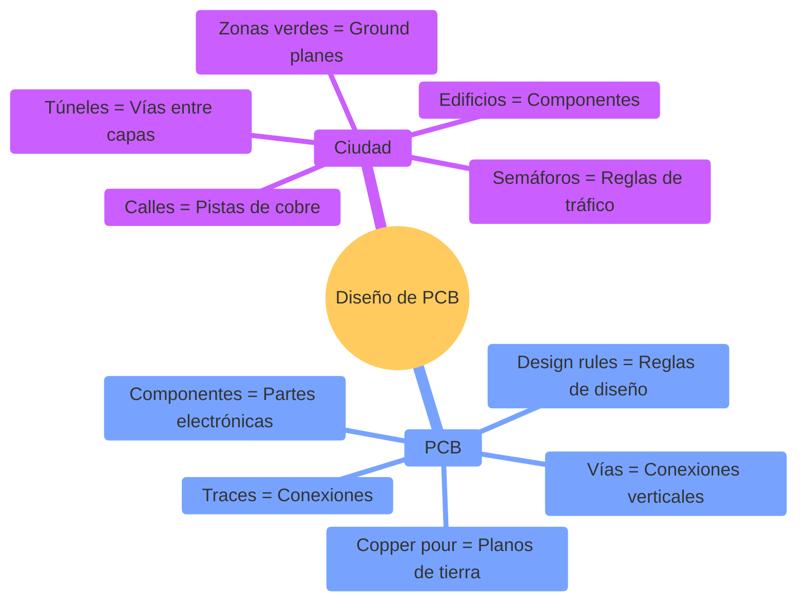

**Diseño de PCB** = El "mapa de rutas" físico que convierte conexiones lógicas del esquemático en una placa física fabricable.

### ¿Por Qué es Crítico Diseñar Bien PCBs?

**Realidad del mercado paraguayo**:
- ✅ **Fabricación local** - FPUNA tiene fresadora CNC para prototipos
- ✅ **Fabricación internacional** - JLCPCB/PCBWay envían a Paraguay (2-3 semanas)
- ✅ **Costos accesibles** - 5 PCBs desde USD 2 + envío USD 15-20
- ✅ **Proyectos comerciales** - Startups paraguayas necesitan prototipos de calidad

**PCB mal diseñado** = Dinero perdido en fabricación + tiempo perdido rehaciéndolo 🚫

---

## 📊 El Flujo de Diseño de PCB

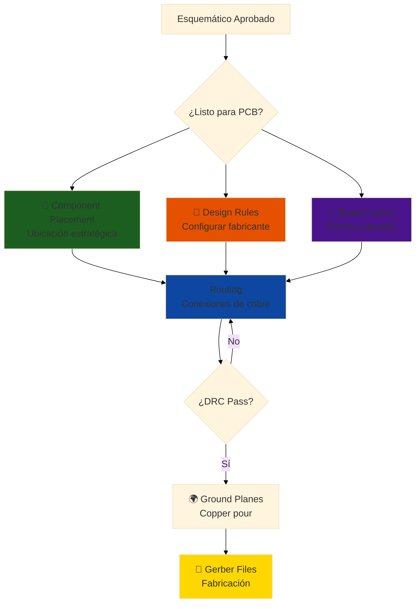

**Analogía local**: Como diseñar el plano eléctrico de una casa en Asunción - necesitas ubicar enchufes, calcular cable, y cumplir normas de ANDE antes de instalar.

---

## 🏢 Parte 1: Fundamentos de PCB (60 min)

### Concepto: Anatomía de una PCB

**Analogía**: Como un edificio de varios pisos - cada piso tiene cableado, pero también hay conexiones verticales (ascensores/escaleras).

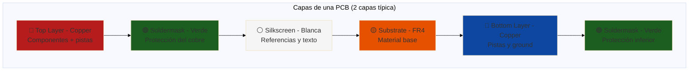

### Capas de PCB Explicadas

**1. Copper Layers (Capas de Cobre)**
```
- Top Copper (F.Cu): Pistas y pads en cara superior
- Bottom Copper (B.Cu): Pistas y pads en cara inferior
- Inner Layers (In1.Cu, In2.Cu): Solo en PCBs de 4+ capas

Espesor típico: 35µm (1 oz/ft²) o 70µm (2 oz/ft²)
```

**2. Soldermask (Máscara de Soldadura)**
```
- Protege cobre de oxidación
- Evita cortocircuitos al soldar
- Color típico: Verde (también rojo, azul, negro, blanco)

Expone solo pads donde se suelda
```

**3. Silkscreen (Serigrafía)**
```
- Referencias de componentes (R1, C1, U1...)
- Indicadores de polaridad
- Logos, versión, notas
- Color típico: Blanco (o negro en PCBs negras)
```

**4. Substrate (Sustrato)**
```
- Material base: FR4 (fibra de vidrio + resina epoxi)
- Espesor estándar: 1.6mm
- Alternativas: FR4 delgado (0.8mm), aluminio (LED boards)
```

### Tipos de PCB por Capas

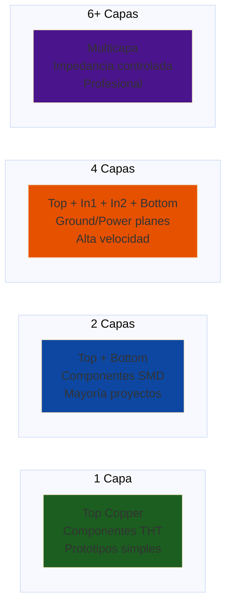

**Decisión de capas**:
| Proyecto | Capas | Costo (5 unidades) | Tiempo |
|----------|-------|-------------------|--------|
| Prototipo simple Arduino shield | 1-2 | ₲10,000-20,000 | 2-3 semanas |
| Sensor breakout SMD | 2 | ₲15,000-30,000 | 2-3 semanas |
| ESP32 con WiFi | 2-4 | ₲25,000-50,000 | 3-4 semanas |
| Sistema industrial | 4-6 | ₲100,000+ | 4-6 semanas |

### Trazas (Traces) y Vías (Vias)

**Trazas (Traces)**:
```
Ancho de traza depende de:
1. Corriente que circula (IPC-2221 standard)
2. Temperatura máxima aceptable
3. Espesor del cobre

Ejemplo:
Corriente: 1A
Cobre: 35µm (1 oz)
Temperatura rise: 10°C
Ancho mínimo: 0.3mm (12 mils)

Para 3A: 1.2mm (47 mils)
```

**Calculadora de ancho de traza**:
```
Fórmula IPC-2221:
A = (I / (k × ΔT^0.44))^(1/0.725)

Donde:
A = área de sección transversal (mils²)
I = corriente (A)
k = 0.048 (cobre externo), 0.024 (cobre interno)
ΔT = temperatura rise (°C)

Convertir área a ancho:
W = A / (1.378 × espesor_oz)
```

**Vías (Vias)**:
```
Conexiones entre capas:

- Through-hole via: Atraviesa toda la PCB
  Diámetro típico: 0.8mm drill, 1.2mm pad
  
- Blind via: De capa externa a interna (no atraviesa)
  
- Buried via: Entre capas internas solamente

Costo: Through-hole (gratis), blind/buried (costoso)

Regla: Usar through-hole vias siempre que sea posible
```

### Ground Planes y Thermal Relief

**Ground Plane (Plano de Tierra)**:
```
Área grande de cobre conectada a GND

Ventajas:
✅ Baja impedancia de retorno
✅ Blindaje electromagnético (EMI)
✅ Disipación de calor
✅ Referencia estable para señales

Implementación en KiCAD: Copper pour (zona de cobre)
```

**Thermal Relief (Alivio Térmico)**:
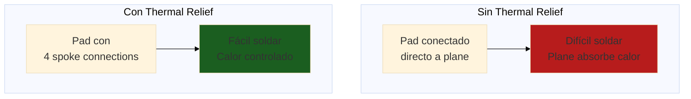

**Cuándo usar**:
- **Con thermal relief**: Pads SMD pequeños, pines THT
- **Sin thermal relief**: Pads de potencia (necesitan buena disipación)

---

## 🔬 Parte 2: KiCAD PCB Layout (90 min)

### Concepto: De Netlist a Layout

**KiCAD Workflow**:
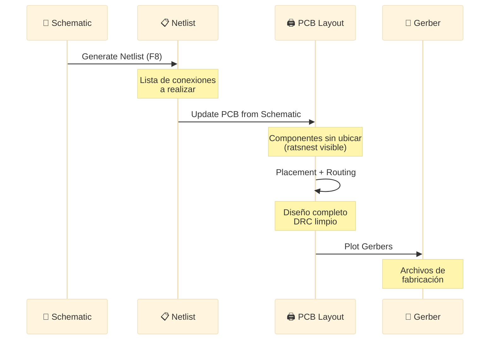

### Tutorial Paso a Paso: Arduino Nano Shield

**Objetivo**: Diseñar shield con sensor DHT22 y LED indicador.

**Especificaciones**:
- PCB de 2 capas
- Tamaño: 45mm × 18mm (estándar Nano)
- Componentes: Header pins, DHT22, resistor, LED
- Fabricación: JLCPCB con capacidades estándar

#### Paso 1: Configurar Board desde Schematic

```
En Schematic (Eeschema):
1. Asegurar que esquemático esté completo y ERC limpio
2. Tools → Update PCB from Schematic (F8)
3. Se abre PCB Editor con componentes sin ubicar

Resultado:
- Componentes en zona fuera del board
- Ratsnest (líneas amarillas) muestran conexiones
```

#### Paso 2: Configurar Design Rules

```
File → Board Setup → Design Rules

Constraints (basado en JLCPCB estándar):
- Min track width: 0.15mm (6 mils)
- Min clearance: 0.15mm (6 mils)
- Min via diameter: 0.5mm
- Min via drill: 0.3mm
- Min through-hole: 0.3mm

Net Classes:
- Default: track 0.25mm, clearance 0.2mm
- Power: track 0.5mm (para VCC/GND de 500mA)
- Signal: track 0.2mm (señales digitales)

Guardar → OK
```

**Ejemplo de configuración con OpenCode**:
```bash
opencode "Genera configuración completa de Design Rules para KiCAD 7 basada en capacidades de JLCPCB:

FABRICANTE: JLCPCB Standard PCB Service
CAPAS: 2 capas (Top + Bottom)
MATERIAL: FR4 1.6mm
COBRE: 35µm (1 oz)

ESPECIFICACIONES JLCPCB:
- Min track width: 0.15mm (0.0059")
- Min track spacing: 0.15mm
- Min via diameter: 0.5mm
- Min via drill: 0.3mm
- Min through-hole: 0.3mm
- Outer copper: 1 oz (35µm)

PROYECTO: Arduino Nano shield
CORRIENTES MÁXIMAS:
- VCC/GND: 500mA
- Señales digitales: 20mA

GENERAR:
1. Valores para Design Rules → Constraints
2. Net Classes configuradas:
   - Default (señales genéricas)
   - Power (VCC, GND)
   - Signal (I/O digitales)
3. Justificación técnica de cada valor
4. Margen de seguridad aplicado
5. Formato: Tabla markdown + pasos en KiCAD

Todo en español con contexto de fabricación desde Paraguay"
```

#### Paso 3: Definir Board Outline

```
1. Seleccionar capa: Edge.Cuts (borde de corte)
2. Herramienta: Draw Rectangle o Draw Line
3. Dibujar rectángulo: 45mm × 18mm
   - Usar Grid: 0.5mm para precisión
   - Colocar origin (0,0) en esquina inferior izquierda

Verificar dimensiones:
- Click derecho → Rectangle Properties
- Width: 45mm, Height: 18mm ✓

Opciones avanzadas:
- Esquinas redondeadas (radio 1mm): más profesional
- Mounting holes: 4 agujeros de 3mm en esquinas
```

**Board outline con formas complejas**:
```
Para formas irregulares (ej: carcasa específica):
1. Importar DXF desde CAD:
   File → Import → Import Graphics
   
2. Seleccionar capa Edge.Cuts
3. Importar archivo .dxf
4. Verificar que se cerró el contorno (no gaps)

Validación:
View → 3D Viewer → Ver que board se renderiza correctamente
```

#### Paso 4: Component Placement (Colocación)

**Principios de placement**:
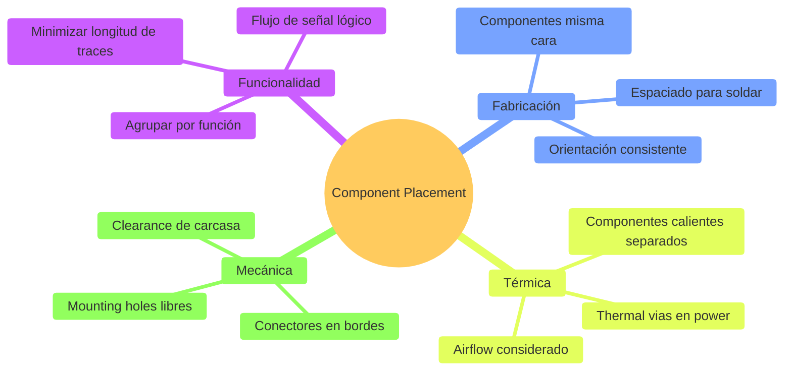

**Placement paso a paso**:
```
1. Componentes críticos primero:
   - Conectores (headers del Nano): Posición fija
   - Componentes grandes (DHT22): Centro de la board
   
2. Componentes relacionados cerca:
   - Resistor pull-up cerca del DHT22
   - Capacitor desacoplo cerca de VCC del sensor
   
3. Orientación:
   - Pin 1 de ICs: Esquina superior izquierda (consistente)
   - Polarizados (electrolíticos): + hacia VCC
   
4. Espaciado:
   - SMD 0805: 0.5mm mínimo entre componentes
   - THT: 2mm mínimo
   
Hotkeys útiles:
- 'M': Mover componente
- 'R': Rotar 90°
- 'F': Flip (cambiar de capa Top/Bottom)
- 'E': Editar propiedades
```

**Ejemplo de placement con OpenCode**:
```bash
opencode "Optimiza colocación de componentes para Arduino Nano shield con DHT22:

COMPONENTES:
1. J1, J2: Pin headers 1×15 (conexión a Nano) - FIJOS en bordes
2. U1: DHT22 sensor (4 pines)
3. R1: 4.7kΩ pull-up resistor (0805 SMD)
4. C1: 100nF capacitor (0805 SMD)
5. LED1: LED indicador (0805 SMD)
6. R2: 330Ω resistor LED (0805 SMD)

BOARD: 45mm × 18mm (2 capas)

RESTRICCIONES:
- Headers J1/J2 en posiciones estándar Arduino Nano (espaciado 15.24mm)
- DHT22 orientado con pines hacia adentro (fácil soldadura)
- Componentes SMD en Top layer
- DHT22 en Bottom layer (espacio)

CONEXIONES:
- DHT22 VCC → Nano 5V (via J1)
- DHT22 DATA → Nano D2 + pull-up R1 a VCC
- DHT22 GND → Nano GND
- LED1 → D13 via R2

CRITERIOS DE OPTIMIZACIÓN:
1. Minimizar longitud de traces (especialmente DATA)
2. Agrupar R1 y C1 cerca de DHT22
3. LED visible en borde de PCB
4. Buen acceso para soldar
5. Silkscreen legible (referencias no tapadas)

GENERAR:
1. Propuesta de ubicación (coordenadas X,Y desde origen)
2. Orientación de cada componente (ángulo)
3. Justificación técnica de decisiones
4. Warnings de posibles conflictos
5. Diagrama ASCII del layout propuesto

Formato: Tabla con coordenadas + explicación + diagrama"
```

#### Paso 5: Routing (Ruteo de Pistas)

**Routing manual en KiCAD**:
```
1. Seleccionar herramienta: Route Tracks (tecla 'X')

2. Click en pad de origen
   - Aparece traza siguiendo cursor
   - Ratsnest muestra destino
   
3. Rutear evitando obstáculos:
   - 45° ángulos (no 90° sharp turns)
   - Evitar cruces innecesarios
   - Usar vías para cambiar de capa
   
4. Terminar en pad destino:
   - Click en pad → traza se completa
   - Ratsnest desaparece ✓
   
5. Repetir para todas las conexiones

Hotkeys:
- 'X': Start routing
- 'V': Add via (cambiar capa)
- 'Ctrl+Shift+K': Delete track
- '/': Switch track corner mode (45°, arc, etc.)
```

**Orden de ruteo**:
```
Prioridad:
1. Power traces (VCC, GND): Anchas primero
2. Señales críticas (DHT_DATA): Cortas, directas
3. Señales genéricas: Resto

Técnicas:
- Traces de potencia: 0.5mm ancho
- Traces de señal: 0.25mm ancho
- Keep GND traces cortas (usar ground plane)
```

**Auto-routing con FreeRouting**:
```
Opción alternativa para proyectos complejos:

1. Exportar DSN desde KiCAD:
   File → Export → Specctra DSN
   
2. Abrir FreeRouting (Java app):
   https://github.com/freerouting/freerouting
   
3. Open Design: Cargar .dsn
4. Route → Autorouter → Start
5. Esperar (30seg - 5min)
6. File → Export Specctra Session (.ses)

7. Importar de vuelta a KiCAD:
   File → Import → Specctra Session
   
8. Revisar y ajustar manualmente

Limitaciones:
⚠️ No entiende impedancia controlada
⚠️ No optimiza estéticamente
✅ Útil para groundwork, refinar después
```

#### Paso 6: Ground Plane (Copper Pour)

```
1. Seleccionar capa: B.Cu (Bottom Copper)

2. Herramienta: Add Filled Zone (zona de cobre)

3. Click en esquina del board → definir zona

4. Propiedades de zona:
   - Net: GND
   - Clearance: 0.2mm
   - Min width: 0.2mm
   - Pad connections: Thermal reliefs
   - Fill type: Solid
   - Priority: 0

5. Cerrar zona (click en punto inicial)

6. Fill zone: 'B' key → Zone Fill

Repetir para Top layer si es necesario (común en 2 capas)

Verificar:
- GND pads conectados con thermal relief ✓
- No islands (islas aisladas)
- Clearance respetada alrededor de traces
```

**Ground plane con OpenCode**:
```bash
opencode "Explica cuándo usar ground plane en Top vs Bottom layer para PCB de 2 capas:

PROYECTO: Arduino Nano shield 45×18mm
COMPONENTES: SMD en Top, THT en Bottom

PREGUNTAS:
1. ¿Poner ground plane en ambas capas o solo Bottom?
2. ¿Cómo afecta a routing si Top tiene ground plane?
3. ¿Thermal relief en todos los pads o solo algunos?
4. ¿Qué hacer con vías que atraviesan ground plane?
5. ¿Necesito stitching vias entre Top y Bottom GND?

CONSIDERACIONES:
- Señales digitales bajas frecuencia (<10MHz)
- Corrientes bajas (<500mA)
- EMI no crítico (entorno normal)
- Fabricación estándar JLCPCB

GENERAR:
1. Recomendación específica (Top/Bottom/Both)
2. Justificación técnica con referencias
3. Configuración de zona de cobre para KiCAD
4. Best practices de stitching vias (cantidad, espaciado)
5. Comparación visual: con/sin ground plane

Todo en español con ejemplos prácticos"
```

#### Paso 7: Design Rule Check (DRC)

```
Inspect → Design Rules Checker

Click 'Run DRC'

Revisar errores:
❌ Clearance violation: Traces muy cerca
❌ Track width: Trace muy delgada
❌ Unconnected items: Pads sin conexión
❌ Drill out of range: Via muy pequeña

Revisar warnings:
⚠️ Silkscreen over pad: Texto tapa pad (estético)
⚠️ Courtyards overlap: Componentes muy cerca (tolerancia)

Objetivo: 0 errores, mínimas warnings

Solucionar:
1. Click en error → resalta ubicación
2. Corregir (mover trace, cambiar ancho, etc.)
3. Re-run DRC
4. Repetir hasta limpiar

DRC limpio = Listo para fabricación ✓
```

---

## 🌐 Parte 3: Fabricación y Consideraciones (60 min)

### Concepto: De Diseño a PCB Física

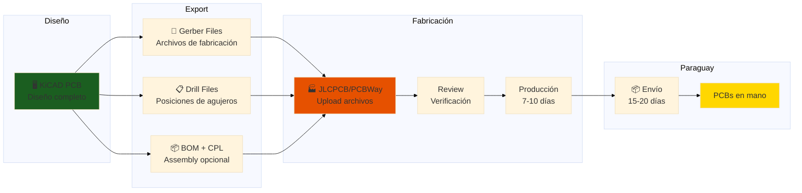

### Generación de Gerber Files

**¿Qué son Gerber files?**
```
Formato estándar de industria para fabricación PCB

Cada archivo describe una capa:
- .GTL: Top copper layer
- .GBL: Bottom copper layer
- .GTO: Top silkscreen
- .GBO: Bottom silkscreen
- .GTS: Top soldermask
- .GBS: Bottom soldermask
- .GKO: Board outline (keep-out)
- .TXT: Drill file (Excellon format)

Zip todos juntos → enviar a fabricante
```

**Generar en KiCAD**:
```
File → Plot

Configuración:
✅ Plot format: Gerber
✅ Output directory: gerber/ (crear carpeta)
✅ Layers a incluir:
   - F.Cu (top copper)
   - B.Cu (bottom copper)
   - F.SilkS (top silkscreen)
   - B.SilkS (bottom silkscreen)
   - F.Mask (top soldermask)
   - B.Mask (bottom soldermask)
   - Edge.Cuts (board outline)

Options:
✅ Plot footprint values: Yes
✅ Plot reference designators: Yes
✅ Exclude PCB edge layer from other layers: Yes
✅ Use Protel filename extensions: No (usar Gerber X2)

Click 'Plot' → Gerbers generados en carpeta

Generate Drill Files:
✅ Excellon format
✅ PTH and NPTH in single file
✅ Millimeters
Click 'Generate Drill File'

Resultado:
/gerber/
  ├── proyecto-F_Cu.gbr
  ├── proyecto-B_Cu.gbr
  ├── proyecto-F_SilkS.gbr
  ├── proyecto-B_SilkS.gbr
  ├── proyecto-F_Mask.gbr
  ├── proyecto-B_Mask.gbr
  ├── proyecto-Edge_Cuts.gbr
  └── proyecto.drl
  
Comprimir todo: proyecto-gerbers.zip
```

### Verificación de Gerbers

**Herramientas de visualización**:

**1. GerbView (incluido en KiCAD)**:
```
Abrir GerbView → File → Open Gerber Files
Cargar todos los .gbr + .drl

Verificar:
✅ Todas las capas se ven correctas
✅ Board outline cerrado
✅ Silkscreen legible
✅ Drill hits en lugares correctos
✅ No overlaps raros

View → 3D Mode → Ver stack-up completo
```

**2. Online viewers**:
```
- Tracespace.io: Arrastrar zip → visualización interactiva
- EasyEDA Gerber Viewer: Online, gratis
- PCBWay Online Viewer: Al subir orden

Ventaja: Ver exactamente como fabricante lo procesará
```

**Checklist de verificación**:
- [ ] Todas las capas presentes (8 archivos mínimo)
- [ ] Board outline cerrado (no gaps)
- [ ] Silkscreen no tapa pads
- [ ] Referencias de componentes visibles
- [ ] Drill file contiene todos los holes
- [ ] Tamaño de board correcto
- [ ] Polaridad de componentes marcada

### Fabricantes y Costos (Paraguay)

**Opciones de fabricación**:

**1. Local - FPUNA Lab**:
```
Ventajas:
✅ Rápido (1-2 días)
✅ Económico (material + tiempo máquina)
✅ Aprendizaje (ver proceso)
✅ Iteraciones rápidas

Limitaciones:
⚠️ 1 capa solo (fresado)
⚠️ Resolución limitada (0.3mm mínimo)
⚠️ Sin soldermask profesional
⚠️ Sin silkscreen
⚠️ Taladros manuales

Ideal para: Prototipos muy rápidos, aprendizaje
```

**2. JLCPCB (China → Paraguay)**:
```
Especificaciones:
- 2 capas estándar
- 5 unidades mínimo
- Hasta 100×100mm: USD 2
- Soldermask verde gratis
- Silkscreen blanca gratis
- Tiempo: 24-48h producción + 15-20 días envío

Costo total a Paraguay:
- PCB 5 unidades: USD 2
- Envío DHL: USD 18-25
- Total: ~USD 22-27 (~₲160,000-195,000)
- Por unidad: ~₲32,000-39,000

Upgrades disponibles:
- Color soldermask: +USD 8 (rojo, azul, negro, etc.)
- ENIG finish: +USD 15 (mejor soldabilidad)
- 4 capas: desde USD 5

URL: jlcpcb.com
```

**3. PCBWay (China → Paraguay)**:
```
Similar a JLCPCB:
- Calidad levemente superior
- Costo levemente mayor (USD 5 por 10 unidades)
- Mejor servicio al cliente
- Opciones de ensamblado (PCBA)

Costo total:
- PCB 10 unidades: USD 5
- Envío: USD 20-30
- Total: ~USD 25-35 (~₲180,000-250,000)

URL: pcbway.com
```

**4. OSH Park (USA → Paraguay)**:
```
Especializado en prototipos:
- 3 unidades siempre
- Calidad excelente (ENIG standard)
- Precio por área: USD 5 por inch²
- Envío gratis (USPS, 2-4 semanas)

Ejemplo:
- 50×50mm = ~0.6 inch² × 3 = USD 9
- Envío: gratis
- Total: USD 9 (~₲65,000)

URL: oshpark.com
```

**Comparativa**:
| Fabricante | Unidades | Costo Total | Costo/Unidad | Tiempo Total | Calidad |
|------------|----------|-------------|--------------|--------------|---------|
| FPUNA Lab | 1 | ₲10,000 | ₲10,000 | 1-2 días | Básica |
| JLCPCB | 5 | ₲180,000 | ₲36,000 | 20-25 días | Buena |
| PCBWay | 10 | ₲225,000 | ₲22,500 | 20-25 días | Muy buena |
| OSH Park | 3 | ₲65,000 | ₲21,600 | 25-30 días | Excelente |

**Recomendación**:
- **Prototipo 1**: FPUNA (validar rápido)
- **Prototipo 2**: JLCPCB (validar diseño final)
- **Producción**: PCBWay (mayor cantidad, mejor precio unitario)

### BOM para Ensamblado

**Bill of Materials completo**:
```
Formato CSV estándar:

Comment,Designator,Footprint,LCSC Part,Quantity
4.7k,R1,R_0805,C17673,1
100nF,C1,C_0805,C49678,1
DHT22,U1,DHT22,C7171,1
RED,LED1,LED_0805,C84256,1
330R,R2,R_0805,C17630,1

Campos obligatorios:
- Designator: R1, C1, etc.
- Quantity: Cantidad
- LCSC Part: Part number de LCSC (catálogo JLCPCB)

Generación automática desde KiCAD:
BOM → Export → CSV
Agregar columna 'LCSC Part' manualmente (buscar en lcsc.com)
```

**Assembly (PCBA)**:
```
JLCPCB ofrece ensamblado automático:

Servicios:
- SMT Assembly: Solo componentes SMD
- Económico: 8 USD setup + 3 USD por unidad (hasta 20 componentes)
- Estándar: Más componentes, ambas caras

Requiere:
1. Gerber files
2. BOM con LCSC part numbers
3. CPL file (component placement list)

CPL generación:
KiCAD → File → Fabrication Outputs → Component Placement (.pos)
Convertir a formato JLCPCB (hay scripts)

Ventaja: PCBs llegan ensamblados, solo soldar THT

Desventaja: Costo mayor, stock de componentes limitado
```

### Importación a Paraguay

**Proceso aduanero**:
```
1. Fabricante envía (DHL/FedEx/PostNL)
   - Tracking number recibido
   - Declaración de valor en paquete

2. Llegada a Paraguay (Aeropuerto Asunción)
   - Aduana retiene paquete
   - Notificación por courier

3. Despacho aduanero:
   - Valor < USD 50: Usualmente exento
   - Valor > USD 50: IVA (10%) + timbre (variable)
   - Presentar factura/invoice del fabricante

4. Entrega:
   - Courier entrega en domicilio
   - O retiro en oficina (Asunción)

Tiempos:
- Producción: 2-3 días
- Envío internacional: 10-15 días
- Aduana: 2-5 días
- Total: 15-23 días típico
```

**Recomendaciones importación**:
```
✅ Declarar valor real (evitar problemas)
✅ Guardar invoice del fabricante
✅ Usar dirección completa con teléfono
✅ Optar por envío con tracking
✅ Presupuestar 10-15% extra para aduana

⚠️ Valores > USD 100: Considerar agente aduanero
⚠️ Cantidades grandes (>50 unidades): Posible inspección

Para proyectos estudiantiles:
- Mantener valores < USD 50
- Documentar que es prototipo educativo
- FPUNA puede ayudar con trámites
```

---

## 💻 Parte 4: OpenCode para PCB Design (30 min)

### Casos de Uso de IA en Diseño PCB

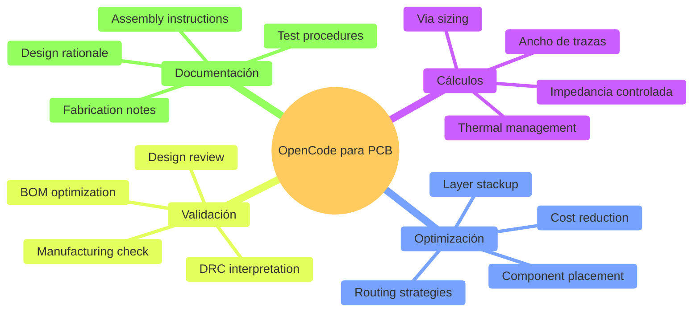

### Prompt Engineering para PCB Design

#### Cálculo de Ancho de Trazas

```bash
opencode "Calcula ancho de traza para fuente de alimentación 12V/3A en PCB:

ESPECIFICACIONES:
- Corriente: 3A continua (pico 5A por 1 segundo)
- Voltaje: 12V
- Espesor cobre: 35µm (1 oz/ft²)
- Temperatura ambiente: 35°C (Paraguay verano)
- Temperatura rise máxima aceptable: 10°C
- Longitud de traza: 50mm

PCB:
- 2 capas FR4 1.6mm
- Traza en Top layer (externa)

CALCULAR:
1. Ancho mínimo de traza usando IPC-2221
2. Mostrar fórmula y desarrollo paso a paso
3. Validar con calculadoras online (comparar)
4. Ancho recomendado con factor de seguridad 1.5×
5. Caída de voltaje en la traza (resistencia × corriente)
6. Potencia disipada en la traza

CONSIDERACIONES ADICIONALES:
- ¿Necesito traza más ancha para picos de 5A?
- ¿Alternativas: via stitching, cobre más grueso (2 oz)?
- ¿Qué pasa si la pongo en Bottom layer (interna)?

OUTPUT:
- Tabla de resultados con valores
- Comparación de opciones (1 oz vs 2 oz, external vs internal)
- Recomendación final con justificación
- Configuración en KiCAD (Net Class para esta traza)

Referencias a IPC-2221 standard incluidas"
```

#### Optimización de Component Placement

```bash
opencode "Revisa y optimiza component placement de PCB ESP32 IoT:

DISEÑO ACTUAL:
[Descripción o captura de pantalla del layout]

COMPONENTES:
- ESP32-WROOM-32: MCU con WiFi/BLE
- AMS1117-3.3V: Regulador lineal 3.3V @ 1A
- 10 capacitores desacoplo (100nF, 10µF)
- Sensor BME280 (I2C)
- Display OLED 0.96" (I2C)
- Botones táctiles (3×)
- USB-C connector

BOARD: 60×40mm (2 capas)

PROBLEMAS POTENCIALES:
- Regulador AMS1117 cerca de ESP32 (ambos calientan)
- Trazas I2C muy largas (>80mm)
- Antenna keep-out del ESP32 no respetada
- Capacitores desacoplo lejos de VCC pins

OPTIMIZAR PARA:
1. EMI reducida (WiFi/BLE funcionando)
2. Térmica: Separar componentes calientes
3. Signal integrity: I2C < 50mm
4. Manufacturing: Componentes en una cara (Top)
5. User experience: Botones accesibles, display visible

GENERAR:
1. Lista de issues encontrados (prioridad Alta/Media/Baja)
2. Propuesta de placement mejorado:
   - Coordenadas sugeridas para componentes críticos
   - Zonas funcionales (power, RF, I/O, interfaz)
3. Explicación de cada cambio (por qué es mejor)
4. Diagrama ASCII del layout propuesto
5. Checklist de validación post-cambio

REFERENCIAS:
- ESP32 Hardware Design Guidelines v3.0
- IPC-2221 spacing requirements
- I2C bus specification (capacitance limits)

Todo en español con contexto de proyecto FPUNA"
```

#### Design Rule Checking (DRC) Assistance

```bash
opencode "Interpreta y resuelve errores de DRC en KiCAD:

ERRORES DRC:
[Pegar output de KiCAD DRC]

Ejemplo:
1. Clearance violation: Track to pad clearance (0.12mm) < clearance (0.15mm)
   Location: (45.2mm, 23.8mm) Layer: F.Cu
   
2. Track width: Track width (0.10mm) < minimum (0.15mm)
   Location: (52.1mm, 18.3mm) Layer: B.Cu
   
3. Unconnected items: Pad U1-8 (GND) has no net connection
   Location: (38.5mm, 30.2mm)
   
4. Drill out of range: Via drill (0.25mm) < minimum (0.30mm)
   Location: (41.0mm, 25.5mm)

FABRICANTE: JLCPCB Standard (2 capas)

ANALIZAR:
1. Severidad de cada error (Critical, Major, Minor)
2. Root cause (por qué pasó)
3. Solución específica paso a paso en KiCAD
4. Prevención (cómo evitar en futuros diseños)

PARA CADA ERROR:
- Descripción clara del problema
- Impacto si se ignora (manufacturability, functionality)
- Paso a paso para corregir (con hotkeys de KiCAD)
- Alternativas si no es corregible directamente

OUTPUT:
Tabla con formato:
| # | Tipo | Severidad | Solución | Pasos en KiCAD |

Más explicación detallada de errores críticos

Configuración recomendada de Design Rules para prevenir"
```

#### Generación de Documentación de Fabricación

```bash
opencode "Genera documentación completa de fabricación para PCB:

PROYECTO: Arduino Nano Shield - Sensor temperatura DHT22
VERSION: v1.2
FECHA: Enero 2026

ARCHIVOS DISPONIBLES:
- Schematic PDF
- Gerber files (zip)
- BOM (CSV)
- PCB screenshots (Top, Bottom)

GENERAR DOCUMENTACIÓN:

1. FABRICATION NOTES (para enviar a JLCPCB):
   - Especificaciones de board:
     * Dimensiones, capas, espesor
     * Material, cobre thickness
     * Soldermask color, silkscreen
     * Surface finish (HASL vs ENIG)
   - Notas especiales:
     * Impedancia controlada (si aplica)
     * Vías específicas (blind, buried)
     * Tolerancias críticas
   - Cantidad de boards
   - Tiempo estimado

2. ASSEMBLY INSTRUCTIONS (para técnico soldador):
   - Lista de componentes ordenada por tamaño
   - Orden de soldadura (SMD primero, THT después)
   - Orientación de componentes polarizados
   - Temperaturas de soldadura
   - Precauciones (ESD sensitive)
   - Fotos/diagramas de referencia

3. TESTING PROCEDURE:
   - Inspección visual post-soldadura
   - Continuity tests (multímetro)
   - Power-up sequence
   - Functional tests (firmware básico)
   - Validación de especificaciones

4. BOM OPTIMIZADO:
   - Componentes con alternativas (substitutes)
   - Proveedores múltiples (LCSC, DigiKey, local)
   - Stock status
   - Lead times
   - Precios en USD y ₲ (Paraguay)

FORMATO:
- Markdown profesional
- Tablas claras
- Secciones bien definidas
- Listo para imprimir o enviar por email

INCLUIR:
- Contact info (FPUNA, estudiante)
- Revision history
- Archivos adjuntos referenciados

Todo en español técnico profesional"
```

### Integración con Workflow de PCB

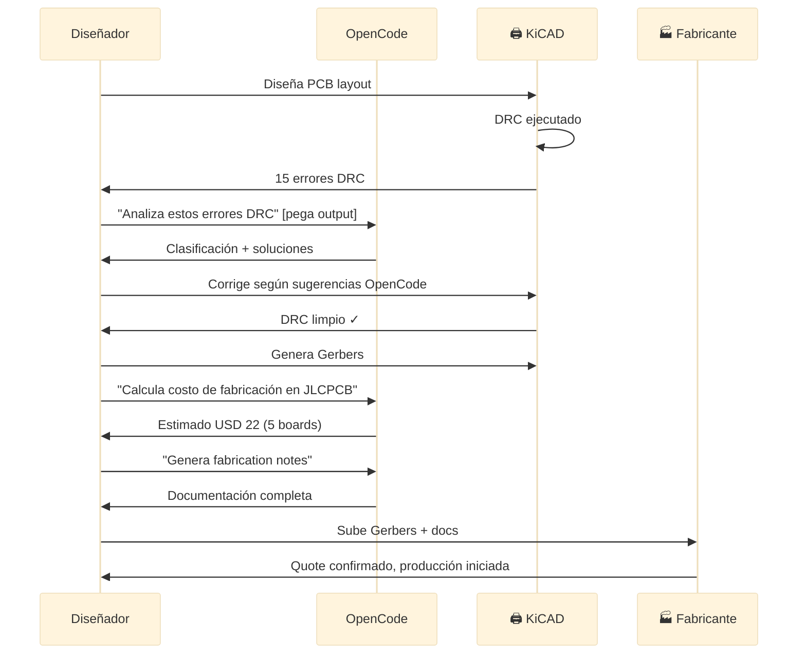

**Ventaja**: OpenCode actúa como **ingeniero senior de PCB** que revisa diseño, optimiza, y prepara documentación.

---

## 🎯 Ejercicio Práctico: ESP32 Breakout Board

### Objetivo

Diseñar PCB completa para breakout board de ESP32-WROOM-32 con regulador, USB-C, y headers.

### Especificaciones

**Funcionalidad**:
- ESP32-WROOM-32 module (WiFi + BLE)
- USB-C connector (power + programming)
- Regulador 5V → 3.3V (AMS1117-3.3)
- Auto-reset circuit (DTR/RTS)
- LED power indicator
- Boot/Reset buttons
- Headers 2.54mm: exponer todos los GPIO

**Board**:
- 2 capas
- Tamaño: 50mm × 25mm
- Fabricación: JLCPCB

**Contexto Paraguay**: Breakout económico para proyectos IoT de estudiantes FPUNA.

### Diseño Paso a Paso

#### 1. Schematic ya Existe

```
Asumimos que completaste Módulo 01 y tienes esquemático:
- ESP32-WROOM-32
- USB-C connector (4 pines: VBUS, D+, D-, GND)
- AMS1117-3.3V regulator
- CP2102 USB-to-UART (para programming)
- Botones reset/boot
- LED + resistor
- Capacitores desacoplo (10× 100nF, 2× 10µF)
- Headers 2× 19 pines (2.54mm pitch)

ERC limpio ✓
```

#### 2. Board Setup

```
KiCAD PCB Editor:

Board Setup → Design Rules:
- Min track: 0.15mm
- Min clearance: 0.15mm
- Min via: 0.5mm drill, 0.8mm diameter

Net Classes:
- Power: 0.5mm tracks (VCC, 3V3, GND)
- USB: 0.25mm tracks (D+, D-, controlled impedance idealmente)
- Default: 0.2mm

Board Stackup:
- Layer 1: F.Cu (Top)
- Core: FR4 1.6mm
- Layer 2: B.Cu (Bottom)
```

#### 3. Component Placement con OpenCode

```bash
opencode "Optimiza component placement para ESP32 breakout board:

COMPONENTES:
- U1: ESP32-WROOM-32 (18×25mm module)
- U2: CP2102 (SSOP-28)
- U3: AMS1117-3.3V (SOT-223)
- J1: USB-C connector (16-pin)
- SW1, SW2: Tact switches (reset, boot)
- LED1: Power LED (0805)
- R1: 330Ω (0805)
- C1-C10: Capacitors (0805)
- J2, J3: Pin headers 1×19 (2.54mm)

BOARD: 50×25mm

RESTRICCIONES CRÍTICAS:
- ESP32 antenna keep-out: 5mm en extremo de módulo (sin cobre, componentes)
- USB-C en borde corto (acceso fácil)
- Botones accesibles post-ensamblado
- Headers en bordes largos (compatibilidad breadboard)
- AMS1117 separado de ESP32 (térmico)
- CP2102 cerca de USB-C (traces cortas D+/D-)

CONEXIONES CRÍTICAS:
- USB D+/D- → CP2102 (differential pair, igual longitud)
- CP2102 TX/RX → ESP32 U0TXD/U0RXD
- ESP32 EN, GPIO0 → Botones con RC
- 3V3 distribution: Múltiples capacitores desacoplo

GENERAR:
1. Zonas funcionales:
   - Power (regulador + caps)
   - USB/UART (CP2102 + USB-C)
   - MCU (ESP32 + desacoplos cercanos)
   - Interfaz (botones, LED)
   - I/O (headers)

2. Placement específico (coordenadas sugeridas):
   - ESP32 orientación (antenna hacia borde libre)
   - USB-C posición exacta
   - Orden de componentes

3. Thermal considerations:
   - Vías térmicas bajo AMS1117
   - Copper pour para disipación

4. Diagrama ASCII del layout

5. Warnings potenciales

Contexto: Proyecto FPUNA, fabricación JLCPCB, estudiante intermedio"
```

#### 4. Routing Crítico

**USB Differential Pair**:
```
D+ y D- son differential signals (USB 2.0):

Requerimientos:
- Impedancia: 90Ω differential
- Longitud matching: ±5mm
- Clearance: 0.3mm entre D+ y D-
- No vías si es posible (o mínimas)

En KiCAD:
1. Route → Differential Pair
2. Seleccionar D+ net
3. KiCAD automáticamente matchea D-
4. Ancho: 0.3mm (aproximación 90Ω en FR4 1.6mm)
5. Rutear directo, minimizar curvas

Verificación:
Length tuning tool → verificar diferencia < 5mm
```

**Power traces**:
```
VCC (5V del USB):
- Ancho: 0.5mm (puede llevar 1A)
- Route: USB-C → AMS1117 input
- Capacitor 10µF cerca de AMS1117 input

3V3 (salida regulador):
- Ancho: 0.5mm
- Route: AMS1117 output → ESP32 VDD
- Capacitores desacoplo 100nF cerca de cada power pin del ESP32
- Star topology (un punto central, rayos a componentes)
```

**GND**:
```
No rutear GND manualmente:
- Usar ground plane en Bottom layer
- Vías GND cerca de cada componente
- Stitching vias cada 5mm alrededor del board

Thermal vias:
- Bajo AMS1117: 4× vías 0.5mm para disipación
- Conectan Top GND pad a Bottom ground plane
```

#### 5. Ground Plane y Copper Pour

```
Bottom layer (B.Cu):
- Copper pour completo → Net: GND
- Clearance: 0.2mm
- Thermal relief en pads

Top layer (F.Cu):
- Copper pour parcial → Net: 3V3 (evitar antenna keep-out)
- O copper pour GND también (depende de densidad de routing)

Stitching vias:
- 10-15 vías alrededor del perímetro
- Conectan Top GND a Bottom GND
- Reduce impedancia de retorno
- Mejora EMI
```

#### 6. Antenna Keep-Out

```
ESP32-WROOM-32 tiene antenna PCB integrada:

Keep-out zone (según datasheet):
- 5mm desde extremo del módulo (donde está antenna)
- Sin cobre en Top ni Bottom
- Sin componentes
- Sin vías

Implementar en KiCAD:
1. Layer: User.Eco1 (o similar)
2. Draw rectangle: 5mm desde módulo
3. Documentar en silkscreen: "ANTENNA - NO COPPER"

Verificación:
3D Viewer → Asegurar que zona está libre
```

#### 7. DRC y Validación

```
Run DRC:

Errores comunes:
❌ Silkscreen over pads → Mover texto
❌ Courtyards overlap → Separar componentes
❌ USB traces different length → Ajustar routing
✅ 0 errores → Continuar

Validación manual:
- [ ] Antenna keep-out respetada
- [ ] USB traces pareadas y cortas
- [ ] Capacitores desacoplo cerca de ICs
- [ ] Thermal vías bajo regulador
- [ ] Botones accesibles
- [ ] LED visible
- [ ] Headers en borde (compatibilidad breadboard)
```

#### 8. Generar Fabrication Files

```
File → Plot → Gerber
Generate Drill Files

Verificar en GerbView:
✅ Todas las capas
✅ Board outline cerrado
✅ Silkscreen legible

Comprimir: esp32-breakout-v1.2-gerbers.zip
```

#### 9. Fabrication con OpenCode

```bash
opencode "Genera fabrication package completo para ESP32 breakout:

ARCHIVOS:
- Gerbers: [adjuntar zip]
- Schematic: [adjuntar PDF]
- BOM: [adjuntar CSV]

GENERAR:

1. JLCPCB_ORDER_SPECS.txt:
   - Board dimensions
   - Layers: 2
   - Thickness: 1.6mm
   - Copper weight: 1 oz
   - Soldermask: Green
   - Silkscreen: White
   - Surface finish: HASL
   - Quantity: 10 pcs

2. ASSEMBLY_GUIDE.md:
   - Orden de soldadura (SMD → THT)
   - Orientación de ICs (pin 1)
   - Programación USB (driver CP2102)
   - Test procedure

3. BOM_SHOPPING_LIST.md:
   - Componentes con proveedores:
     * LCSC (para assembly)
     * DigiKey (alternativa)
     * Local Paraguay (si existe)
   - Precios en USD y ₲
   - Quantity breaks

4. README.md:
   - Descripción del board
   - Features
   - Getting started
   - Pinout diagram (ASCII)
   - Troubleshooting

5. COST_ESTIMATE.md:
   - PCB fabrication: USD X
   - Components: USD Y
   - Assembly (optional): USD Z
   - Shipping to Paraguay: USD W
   - Total: USD + ₲

Formato profesional, listo para GitHub repo"
```

---

## 🔧 Troubleshooting de PCB Design

### Problemas Comunes y Soluciones

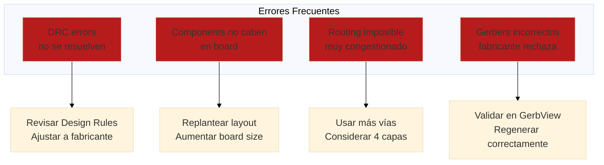

#### Caso 1: Ground Plane con Islas Aisladas

**Síntoma**: Ground plane se fragmenta, componentes GND no conectados.

```
Causa:
- Traces de señal cortan ground plane
- No hay suficientes vías de conexión

Solución:
1. Identificar islas:
   View → Highlight Net → GND
   Zonas no conectadas son islas

2. Agregar vías de conexión (stitching):
   Colocar vías entre islas y ground plane principal
   Espaciado: cada 5-10mm

3. Re-fill zone:
   Click derecho en zone → Fill Zone
   Verificar que se conecta todo

4. DRC:
   Debería reportar "no unconnected items" para GND
```

**Prevención con OpenCode**:
```bash
opencode "Explica cuántas stitching vias necesito en PCB 60×40mm de 2 capas:

DISEÑO:
- Board: 60×40mm
- Ground plane en Bottom layer (completo)
- Ground plane parcial en Top layer (entre componentes)
- Frecuencias: DC a 10MHz (señales digitales)

PREGUNTAS:
1. Cantidad de stitching vias recomendada
2. Espaciado entre vias (mm)
3. Ubicación (perímetro, distribuidas, cerca de ICs)
4. Tamaño de via (drill, pad)
5. Impacto en EMI si no pongo suficientes

REFERENCIAS:
- IPC-2221
- High-Speed Digital Design (Howard Johnson)

Respuesta técnica con justificación y diagrama"
```

#### Caso 2: Traces Demasiado Delgadas para Corriente

**Síntoma**: Fabricante advierte "trace too thin" o PCB se calienta en uso.

```
Causa:
- Trace width insuficiente para corriente
- No se calculó con IPC-2221

Diagnóstico:
1. Identificar traces de potencia:
   Inspect → Net Inspector
   Ver nets VCC, GND, motor power, etc.

2. Medir ancho actual:
   Click en trace → Properties → Width

3. Calcular requerido:
   Usar calculadora (opencode o pcbway.com/trace-calculator)

Solución:
1. Aumentar ancho de traces:
   Edit → Global Edit Tracks and Vias
   Filter by Net: VCC
   Set Track Width: 0.8mm (ejemplo)
   Apply

2. Re-route si no cabe:
   Puede requerir mover componentes

3. Alternativa: Via stitching
   Múltiples vías en paralelo = más capacidad de corriente
```

**Cálculo con OpenCode** (ver ejemplo en Parte 4).

#### Caso 3: JLCPCB Rechaza Gerbers

**Síntoma**: Upload a JLCPCB da error "Invalid Gerber files" o "No board outline".

```
Errores comunes:

1. Board outline no cerrado:
   Causa: Gap en Edge.Cuts layer
   Solución:
   - GerbView → cargar Edge.Cuts
   - Zoom 100% → buscar gaps
   - KiCAD → cerrar contorno (snap to grid)

2. Gerber format incorrecto:
   Causa: Formato antiguo (RS-274D)
   Solución:
   - File → Plot → Options
   - Usar "Gerber X2" format
   - Re-generate

3. Drill file faltante:
   Causa: No se generó .drl
   Solución:
   - File → Plot → Generate Drill Files
   - Incluir en zip

4. Layers incorrectos:
   Causa: Faltan capas obligatorias
   Solución:
   - Verificar que están: F.Cu, B.Cu, F.Mask, B.Mask, Edge.Cuts
   - Silkscreen opcional pero recomendado
```

**Validación completa**:
```
1. GerbView:
   - Cargar todos los gerbers
   - View → Layers Manager → Activar todas
   - Verificar visualmente

2. Online Viewer (Tracespace.io):
   - Arrastra zip completo
   - Ve render 3D
   - Si se ve bien → está correcto

3. JLCPCB Quote:
   - Upload
   - Si da quote → archivos válidos ✓
```

---

## ✅ Checklist de Verificación Pre-Fabricación

Antes de enviar Gerbers al fabricante:

### Diseño General
- [ ] DRC ejecutado sin errores críticos
- [ ] Todas las conexiones del schematic ruteadas (no ratsnest)
- [ ] Board outline cerrado (Edge.Cuts)
- [ ] Board size correcto (verificar dimensiones)
- [ ] Mounting holes si se requieren (3mm típico)

### Componentes
- [ ] Footprints correctos (verificados vs datasheet)
- [ ] Polaridad marcada (diodos, electrolíticos, ICs)
- [ ] Pin 1 indicado en silkscreen
- [ ] Referencias visibles (R1, C1, U1...)
- [ ] Valores visibles si es necesario
- [ ] Orientación consistente

### Traces y Routing
- [ ] Ancho de traces apropiado para corriente
- [ ] Clearance respetado (traces, pads, zones)
- [ ] Vías con tamaño adecuado (>0.5mm drill)
- [ ] Differential pairs matched (si aplica)
- [ ] Impedancia controlada (si aplica)
- [ ] No ángulos 90° agudos en traces

### Ground y Power
- [ ] Ground plane configurado y filled
- [ ] Stitching vias distribuidas
- [ ] Thermal relief en pads apropiados
- [ ] Capacitores desacoplo cerca de ICs
- [ ] Power traces anchas y cortas

### Fabricación
- [ ] Design rules según fabricante (JLCPCB/PCBWay)
- [ ] Soldermask clearance correcta
- [ ] Silkscreen no tapa pads
- [ ] Silkscreen legible (min 1mm altura texto)
- [ ] Via tenting (cubrir vías con soldermask) configurado

### Documentación
- [ ] Gerbers generados (8+ archivos)
- [ ] Drill file incluido (.drl)
- [ ] BOM actualizado
- [ ] Schematic PDF adjunto
- [ ] Assembly notes (si se requiere)

### Validación
- [ ] GerbView: Todas capas correctas
- [ ] Online viewer: Render 3D OK
- [ ] 3D Viewer KiCAD: Forma correcta
- [ ] Comparación con schematic (manual)

---

## 🎓 Mejores Prácticas de PCB Design

### ✅ HACER

1. **Planificar antes de rutear** - Sketch de placement en papel primero
2. **Separar zonas funcionales** - Power, digital, analog, RF
3. **Ground plane siempre** - Especialmente en 2 capas
4. **Traces anchas en potencia** - No escatimar cobre en VCC/GND
5. **Capacitores cerca de ICs** - Desacoplo efectivo requiere proximidad
6. **Thermal vias en potencia** - Reguladores, MOSFETs, LEDs de potencia
7. **Clearance generosa** - Si hay espacio, más separación es mejor
8. **Testpoints en señales críticas** - Facilita debugging
9. **Silkscreen útil** - Referencias, polaridad, versión, notas
10. **Revisar 3D** - Antes de enviar, ver en 3D Viewer

### ❌ NO HACER

1. **90° sharp turns** - Causan reflexiones en alta frecuencia
2. **Traces delgadas por defecto** - Calcular según corriente
3. **Vías innecesarias** - Cada vía es una discontinuidad
4. **Componentes muy juntos** - Dificulta soldadura y rework
5. **Ignorar thermal management** - Reguladores lineales necesitan cooling
6. **Antenna keep-out descuidado** - WiFi/BLE no funcionará bien
7. **Silkscreen sobre pads** - Se borra en soldadura
8. **GND traces largos** - Usar ground plane, no traces
9. **Auto-router ciego** - Revisar y optimizar resultado
10. **Enviar sin validar** - GerbView SIEMPRE antes de upload

---

## 🎉 Resumen del Módulo

### Lo Que Dominaste

✅ **Anatomía de PCB** - Capas, traces, vías, ground planes  
✅ **KiCAD PCB Editor** - Placement, routing, DRC profesional  
✅ **Design rules** - Configuración según fabricante  
✅ **Fabricación** - Gerbers, drill files, proceso completo  
✅ **Costos Paraguay** - JLCPCB, PCBWay, importación  
✅ **OpenCode para PCB** - Cálculos, optimización, documentación

### Próximo Paso

**Continúa con**: [Módulo 03 - Desarrollo de Firmware con IA](./03-desarrollo-firmware.md)

---

## 💭 Reflexión

1. **¿Cómo cambia tu workflow diseñar en KiCAD vs herramientas anteriores?**
2. **¿Cuál es el mayor desafío: placement o routing?**
3. **¿Cómo OpenCode acelera el diseño de PCBs?**

**Comparte en Slack** (#electronica-automatizacion)

---

## 📺 Recommended YouTube Resources

**Visualiza estos videos para dominar el diseño de PCBs profesional**:

### 🔗 Video 1: PCB Layout Best Practices - High-Speed Design Essentials
- **Título**: Mejores Prácticas de Layout PCB - Diseño de Alta Velocidad
- **Canal**: Altium Designer (Official)
- **Duración**: 140 minutos
- **Contenido**: Routing de señales, impedancia, planos de referencia, vías, crosstalk, y optimización térmica
- **Link**: https://www.youtube.com/watch?v=i0-N2wBNxLI
- **Por qué verlo**: Transforma tu PCB de prototipo frágil a diseño robusto - evita problemas costosos en manufactura

### 🔗 Video 2: Complete KiCAD PCB Design Workflow - Schematic to Gerbers
- **Título**: Flujo Completo KiCAD PCB - De Esquemático a Gerbers
- **Canal**: Paul McWhorter / CoreElectronics
- **Duración**: 125 minutos
- **Contenido**: Importar esquemático, asignación de footprints, routing manual, diseño de capas, generación de archivos Gerber listos para manufactura
- **Link**: https://www.youtube.com/watch?v=O5CXsQ7m2lw
- **Por qué verlo**: Ve el flujo completo del proyecto que realizarás en este módulo con ejemplos reales

### 🔗 Video 3: Manufacturing-Ready PCBs - Design Rules, Tolerances & Assembly
- **Título**: PCBs Listos para Manufactura - Reglas, Tolerancias y Montaje
- **Canal**: JLC PCB / PCB Design Channel
- **Duración**: 110 minutos
- **Contenido**: Reglas de diseño para manufactura, tolerancias, validación Gerber, selección de proveedores, y troubleshooting de manufactura
- **Link**: https://www.youtube.com/watch?v=rMnWZpMfqwU
- **Por qué verlo**: Asegura que tu PCB se fabrique correctamente sin sorpresas costosas - conocimiento esencial para profesionales

---

## 📚 Recursos Adicionales

### Documentación Oficial
- [KiCAD PCB Documentation](https://docs.kicad.org/master/en/pcbnew/pcbnew.html)
- [IPC-2221 Generic Standard](https://www.ipc.org/standards)
- [ESP32 Hardware Design Guidelines](https://www.espressif.com/sites/default/files/documentation/esp32_hardware_design_guidelines_en.pdf)
- [USB 2.0 Specification](https://www.usb.org/documents)

### Calculadoras y Herramientas
- [PCB Trace Width Calculator](https://www.pcbway.com/pcb_prototype/impedance_calculator.html)
- [Trace Width Calculator (IPC-2221)](https://www.4pcb.com/trace-width-calculator.html)
- [Via Current Calculator](https://www.smps.us/pcbtracesc.html)
- [Saturn PCB Toolkit](https://saturnpcb.com/saturn-pcb-toolkit/)

### Fabricantes (Paraguay)
- **JLCPCB** - jlcpcb.com (USD 2 por 5 PCBs, envío ~USD 20)
- **PCBWay** - pcbway.com (USD 5 por 10 PCBs)
- **OSH Park** - oshpark.com (Calidad premium, envío gratis)
- **FPUNA Lab** - Fresadora CNC (prototipos rápidos 1 capa)

### Libros y Guías
- **"PCB Design for Real-World EMI Control"** - Bruce Archambeault
- **"High-Speed Digital Design"** - Howard Johnson
- **"Printed Circuit Board Design Techniques for EMC Compliance"** - Mark Montrose
- **"Getting Started with KiCAD"** - Free ebook from KiCAD.org

### Comunidades
- **FPUNA Electrónica** - Estudiantes y docentes
- **KiCAD Forum** - forum.kicad.info (ayuda técnica)
- **EEVblog Forum** - eevblog.com/forum (PCB design)
- **r/PrintedCircuitBoard** - Reddit community

### Videos Tutoriales
- **DigiKey KiCAD Tutorial Series** - YouTube (12 videos)
- **Phil's Lab** - YouTube (PCB design avanzado)
- **Robert Feranec** - YouTube (Altium pero conceptos aplican)

### Datasheets Esenciales
Componentes comunes en proyectos:
- **ESP32-WROOM-32** - Espressif (WiFi/BLE module)
- **AMS1117-3.3** - Advanced Monolithic Systems (LDO regulator)
- **CP2102** - Silicon Labs (USB-to-UART)
- **USB Type-C** - Connector specifications
- **FR4 Material** - Propiedades dieléctricas

---

*Módulo creado para FPUNA Verano 2026*  
*Actualizado: Enero 2026*  
*Track: Electrónica y Automatización*