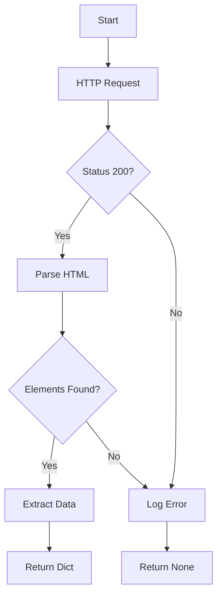

# CLASE 3: Desarrollo de Software con IA
## Productividad Académica con IA - TALLERES VERANO 2026

**Fecha**: Miércoles, Febrero 4, 2026  
**Horario**: 18:00 - 20:00 (2 horas)  
**Modalidad**: Virtual

---

## 🎯 Objetivos de Aprendizaje

Al finalizar esta clase, los estudiantes podrán:

1. ✅ Generar código funcional con OpenCode
2. ✅ Depurar código usando IA como asistente
3. ✅ Crear tests automatizados con ayuda de IA
4. ✅ Documentar código automáticamente
5. ✅ Refactorizar código existente
6. ✅ Aprender nuevas tecnologías/frameworks más rápido con IA

---

## ⏱️ PLAN DE CLASE MINUTO A MINUTO

---

### 🔷 PARTE 1: Intro + IA en Desarrollo (20 minutos)

#### **18:00 - 18:05 (5 min) - Bienvenida y Context Setting**

**QUÉ MOSTRAR**: 
- 📊 **SLIDES**: "IA en Desarrollo de Software"

**QUÉ DECIR**:
```
"Bienvenidos! Hoy es la clase más técnica del taller.

Pregunta: ¿Cuántos de ustedes escriben código regularmente?
¿Qué lenguajes usan? (Python, JavaScript, Java, C++, otro?)

[Leer respuestas del chat]

Perfecto. Sin importar el lenguaje, IA puede ayudarlos con:
- Escribir código más rápido
- Entender código complejo
- Debuggear errores frustrantes
- Aprender nuevas tecnologías

Hoy vamos a hacer código en vivo."
```

---

#### **18:05 - 18:20 (15 min) - Panorama de IA para Developers**

**QUÉ MOSTRAR**:
- 📊 **SLIDES**: "The AI-Augmented Developer"
- 📊 **SLIDES**: "Herramientas Disponibles"

**SLIDE: The AI-Augmented Developer**
```
Tradicional Developer Workflow:
1. Pensar solución
2. Buscar en Stack Overflow
3. Escribir código
4. Debuggear errores
5. Documentar

AI-Augmented Developer Workflow:
1. Pensar solución (CON ayuda de IA para explorar opciones)
2. IA genera código base (TÚ revisas y ajustas)
3. IA ayuda a debuggear (TÚ entiendes el problema)
4. IA genera tests (TÚ verificas coverage)
5. IA genera docs (TÚ validas claridad)

Resultado: 2-3x más productivo
```

**SLIDE: Herramientas**
```
1. OpenCode / Claude Code
   - Full project context
   - Can edit files directly
   - Ejecuta comandos

2. GitHub Copilot
   - Autocomplete inteligente
   - Inline suggestions

3. ChatGPT / Claude (web)
   - Quick questions
   - Code snippets
   - Learning new concepts

Hoy usamos OpenCode porque puede trabajar con archivos reales.
```

**QUÉ DECIR**:
```
"Una regla de oro:

IA NO reemplaza entender qué hace tu código.

IA acelera escribir, pero TÚ debes:
- Entender la lógica
- Validar que funciona
- Poder explicar qué hace
- Debuggear cuando falla

Si solo copias y pegas sin entender, estás perdiendo el 50% del valor 
de ser developer.

Ahora vamos a ejemplos reales."
```

---

### 🔷 PARTE 2: Code Generation con OpenCode (40 minutos)

#### **18:20 - 19:00 (40 min) - LIVE CODING**

💻 **LIVE DEMO**: OpenCode - desarrollo real

**Proyecto: Web Scraper Simple**

```
"Vamos a crear algo útil: un web scraper que extrae información de 
una página web.

Caso de uso real: extraer precios de productos de un ecommerce para 
compararlos.

Lenguaje: Python (porque es el más común para scripting)"
```

**Paso 1: Setup del Proyecto (5 min)**

💻 OpenCode:
```
[Crear carpeta nueva 'price-scraper']

[Abrir en OpenCode]

Prompt:
"Voy a crear un web scraper en Python. Ayúdame a estructurar el proyecto.

Necesito:
1. Estructura de carpetas recomendada
2. requirements.txt con dependencias necesarias
3. README.md básico explicando el proyecto

Usa:
- requests para HTTP
- BeautifulSoup4 para parsing HTML
- python-dotenv para environment variables

Crea los archivos necesarios."

[OpenCode crea estructura]

[Mostrar archivos creados]

"En 30 segundos tengo estructura profesional de proyecto."
```

**Paso 2: Escribir el Scraper (15 min)**

💻 Continuar en OpenCode:
```
Prompt:
"Ahora escribe el código del scraper.

Especificaciones:
- Función principal: scrape_product(url)
- Debe extraer: título, precio, disponibilidad
- Manejar errores (HTTP errors, parsing errors)
- Incluir user-agent header para evitar blocking
- Logging claro de lo que está haciendo

Target sitio: MercadoLibre Paraguay

Crea en archivo src/scraper.py"

[OpenCode escribe código]

[Revisar código generado]:

"Vamos a revisar juntos qué generó..."

[Scroll por código, explicando]:

```python
import requests
from bs4 import BeautifulSoup
import logging

def scrape_product(url):
    # Setup logging
    logging.basicConfig(level=logging.INFO)
    
    try:
        # Request with user-agent
        headers = {'User-Agent': 'Mozilla/5.0...'}
        response = requests.get(url, headers=headers)
        response.raise_for_status()
        
        # Parse HTML
        soup = BeautifulSoup(response.content, 'html.parser')
        
        # Extract data
        title = soup.find('h1', class_='title')
        price = soup.find('span', class_='price')
        
        return {
            'title': title.text if title else None,
            'price': price.text if price else None
        }
    
    except Exception as e:
        logging.error(f"Error scraping {url}: {e}")
        return None
```

"¿Qué hizo bien?
✅ Error handling
✅ Logging
✅ User-agent header
✅ Estructura limpia

¿Qué podría mejorar?
- Selectores CSS son genéricos (necesitamos ajustar al sitio real)

Voy a pedirle que mejore."
```

**Paso 3: Iterar y Mejorar (10 min)**

💻 Continuar conversación:
```
Prompt:
"El código está bien pero los selectores CSS no son correctos para 
MercadoLibre actual. 

Inspecciona esta HTML de ejemplo de MercadoLibre y actualiza los selectores:

[Pegar snippet de HTML real de MercadoLibre]

Actualiza las clases/ids correctos en el código."

[OpenCode actualiza]

[Mostrar código mejorado]

"Ahora voy a probarlo con una URL real..."

[Ejecutar en terminal dentro de OpenCode]:
```bash
python src/scraper.py
```

[Si funciona]: "¡Perfecto! Extrajo la data."
[Si falla]: "Tenemos un error. Vamos a debuggearlo con IA..."
```

**Paso 4: Debugging con IA (10 min)**

💻 Si hay error:
```
[Copiar error message]

Prompt en OpenCode:
"Obtuve este error al ejecutar:

[Pegar error]

Diagnóstico: ¿Qué está mal y cómo lo arreglo?"

[OpenCode explica el error y sugiere fix]

[Aplicar fix]

[Volver a ejecutar]

"¿Ven el workflow?
1. Ejecutar código
2. Ver error
3. Pedirle a IA que diagnostique
4. Aplicar fix
5. Iterar

Esto es 10x más rápido que buscar en Stack Overflow."
```

---

### 🔷 PARTE 3: Testing y Documentación (30 minutos)

#### **19:00 - 19:15 (15 min) - Tests Automatizados con IA**

💻 **LIVE DEMO**: Generar tests

```
Prompt en OpenCode:
"Genera unit tests para la función scrape_product().

Tests necesarios:
1. Test con URL válida (mock response)
2. Test con URL que retorna 404
3. Test con HTML malformed
4. Test con selectores que no encuentran elementos

Usa pytest framework.
Crea archivo tests/test_scraper.py"

[OpenCode genera tests]

[Revisar tests generados]

```python
import pytest
from unittest.mock import patch
from src.scraper import scrape_product

def test_scrape_product_success():
    # Test con mock response exitoso
    ...

def test_scrape_product_404():
    # Test con página no encontrada
    ...

def test_scrape_product_invalid_html():
    # Test con HTML inválido
    ...
```

"Tests completos en 1 minuto.

Voy a ejecutarlos:"

[Ejecutar en terminal]:
```bash
pytest tests/
```

[Mostrar resultados]

"Todos pasan! (o debuggear si no pasan)

Sin IA esto tomaría 30-60 minutos escribir."
```

---

#### **19:15 - 19:30 (15 min) - Documentación Automática**

💻 **LIVE DEMO**: Generar documentación

**Paso 1: Docstrings (5 min)**

```
Prompt:
"Agrega docstrings completas (Google style) a todas las funciones 
en src/scraper.py

Incluye:
- Descripción de la función
- Args con tipos
- Returns con tipo
- Raises (excepciones posibles)
- Ejemplos de uso"

[OpenCode actualiza código con docstrings]

[Mostrar resultado]:

```python
def scrape_product(url: str) -> dict:
    """
    Extrae información de producto de una URL de MercadoLibre.
    
    Args:
        url (str): URL completa del producto en MercadoLibre Paraguay
    
    Returns:
        dict: Diccionario con 'title', 'price', 'available'
              Retorna None si scraping falla
    
    Raises:
        requests.RequestException: Si hay error en HTTP request
        ValueError: Si URL no es válida
    
    Example:
        >>> data = scrape_product('https://mercadolibre.com.py/...')
        >>> print(data['title'])
        'Laptop HP 15.6"'
    """
    ...
```

"Documentación profesional en segundos."
```

**Paso 2: README Completo (5 min)**

```
Prompt:
"Actualiza README.md con documentación completa del proyecto:

Incluye:
- Descripción del proyecto
- Instalación (cómo instalar dependencias)
- Uso (ejemplos de código)
- Estructura del proyecto
- Testing (cómo correr tests)
- Troubleshooting común
- Licencia

Usa formato Markdown profesional con emojis moderados."

[OpenCode actualiza README]

[Mostrar README completo]

"README profesional que cualquier developer puede entender."
```

**Paso 3: Generar Diagramas (5 min)**

```
Prompt:
"Genera diagrama de flujo del proceso de scraping en formato Mermaid.

Muestra:
1. Request HTTP
2. Parsing HTML
3. Extracción de datos
4. Error handling en cada paso"

[OpenCode genera código Mermaid]



"Pueden copiar este código y renderizarlo en GitHub, Notion, etc."
```

---

### 🔷 PARTE 4: Aprender Nuevas Tecnologías con IA (20 minutos)

#### **19:30 - 19:50 (20 min) - Tutorial Personalizado Generado por IA**

**QUÉ MOSTRAR**:
- 📊 **SLIDES**: "IA como Tutor Personal"

**QUÉ DECIR**:
```
"Uno de los mejores usos de IA: aprender nuevas tecnologías.

Ejemplo: Quieren aprender React pero no saben por dónde empezar."
```

💻 **LIVE DEMO**: Aprender framework nuevo

```
Prompt en OpenCode:
"Contexto: Soy developer con experiencia en Python/Django. Nunca usé React.

Tarea: Enséñame React desde cero, adaptado a mi background.

Dame:
1. Explicación de conceptos clave comparándolos con Django cuando sea posible
2. Setup de proyecto desde cero (paso a paso)
3. Tutorial para crear simple TODO app
4. Explicación de cada concepto mientras lo usamos (components, state, props, hooks)
5. Common pitfalls para developers coming from backend

Formato: Tutorial paso a paso con código comentado.
Longitud: Suficiente para entender fundamentos y build algo funcional."

[OpenCode genera tutorial completo]

[Revisar secciones]:

"Miren esto:

Section 1: React vs Django Concepts
- Component ≈ Django Template
- State ≈ Context variables
- Props ≈ Template variables
[etc.]

Section 2: Setup
[Comandos paso a paso]

Section 3: Building TODO App
[Código con explicaciones inline]

Esto es un tutorial personalizado a MI nivel y background.

Si fuera student sin experiencia, daría explicaciones diferentes."
```

**Demo adicional (10 min)**:
```
"Otro ejemplo: debugging conceptual.

Prompt:
'Estoy confundido sobre async/await en JavaScript. 

Vengo de Python donde entiendo generators y asyncio.

Explícame:
1. Diferencia entre Promise y async/await
2. Cuándo usar uno vs otro
3. Common mistakes
4. Ejemplos side-by-side comparando Python asyncio y JavaScript async/await'

[Mostrar respuesta de IA]

[Leer partes clave]

"Esta es educación personalizada a tu nivel. Mucho mejor que tutorial genérico."
```

---

### 🔷 PARTE 5: Ejercicio + Q&A (10 minutos)

#### **19:50 - 19:57 (7 min) - Ejercicio Práctico**

**QUÉ MOSTRAR**:
- 📊 **SLIDES**: Ejercicio

**EJERCICIO**:
```
Elige uno:

Opción A - Beginner:
Pide a OpenCode que te enseñe un concepto que no entiendes de tu clase 
de programación. Comparte qué concepto elegiste y si la explicación ayudó.

Opción B - Intermediate:
Crea un script simple (calculadora, converter, etc.) con ayuda de IA. 
Comparte el código.

Opción C - Advanced:
Toma código que escribiste antes y pide a IA que lo refactorice mejorando 
legibilidad y performance. Comparte before/after.

Tiempo: 7 minutos
```

---

#### **19:57 - 20:00 (3 min) - Cierre**

**QUÉ MOSTRAR**:
- 📊 **SLIDES**: Resumen + Preview Clase 4

**RESUMEN**:
```
Lo que aprendimos:
✅ Generar código con OpenCode
✅ Debugging asistido por IA
✅ Tests automatizados
✅ Documentación automática
✅ Aprender nuevas tecnologías más rápido

Key Takeaway:
"IA te hace 3x más productivo, pero TÚ sigues siendo el developer.
Entiende tu código, no solo lo copies."
```

**PRÓXIMA CLASE**:
```
📅 Clase 4 - Jueves
Electrónica & Automatización

- Arduino/ESP32 con IA
- Diseño de circuitos
- Simulación
- IoT projects

¡Nos vemos mañana!
```

---

## 📚 RECURSOS POST-CLASE

Enviar:
- Código del proyecto scraper completo
- Link: OpenCode docs
- Cheatsheet de prompts para developers
- Lista de frameworks con tutoriales AI-generated

---

_Creado para: Talleres de Verano FP-UNA 2026_
